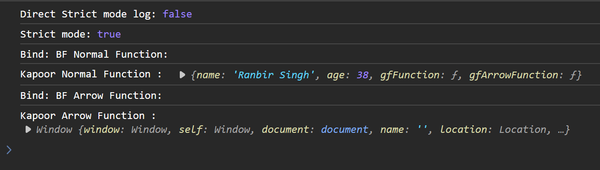
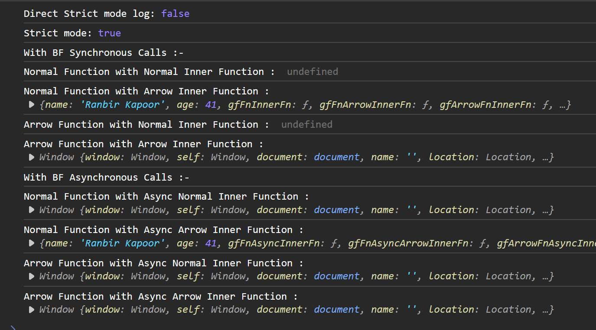

All `undefined` output in below cases in `Non-Strict` mode will return `window` object


All Below code are in `Strict` Mode

## Synchronous Scenarios


Object Definitions:-

```js
"use strict";

console.log('Direct Strict mode log:', typeof this === 'undefined')

function myFunction() {
    console.log('Strict mode:', typeof this === 'undefined'); // Logs true
}

myFunction();

let bfKapoorObject = {
    name: "Ranbir Kapoor",
    age: 41,
    gfFunction: function() {
        console.log("Kapoor Normal Function : ", this)
    },
    gfArrowFunction: () => {
        console.log("Kapoor Arrow Function : ", this)
    }
}

let bfSinghObject = {
    name: "Ranbir Singh",
    age: 38,
    gfFunction() {
        console.log("Singh Normal Function : ", this)
    },
    gfArrowFunction: () => {
        console.log("Singh Arrow Function : ", this)
    }
}
```
### Normal BF Calls

```js

//Case-1
console.log("With BF Normal Function : ");
bfKapoorObject.gfFunction()

//Case-2
console.log("With BF Arrow Function : ");
bfKapoorObject.gfArrowFunction();

//Case-3
console.log("Without BF Normal Function: ");
const withoutBfNormalGfFn = bfKapoorObject.gfFunction;
withoutBfNormalGfFn();

//Case-4
console.log("Without BF Arrow Function: ");
const withoutBfArrowGfFn = bfKapoorObject.gfArrowFunction;
withoutBfArrowGfFn();
```

Output:


### Change BF Techniques using `call()`/`apply()`

```js
//Case-1
console.log("Call: With BF Normal Function : ");
bfKapoorObject.gfFunction.call(bfSinghObject)

//Case-2
console.log("Call: With BF Arrow Function : ");
bfKapoorObject.gfArrowFunction.call(bfSinghObject);

//Case-3
console.log("Call: Without BF Normal Function: ");
const withoutBfNormallGfCallFn = bfKapoorObject.gfFunction;
withoutBfNormallGfCallFn.call(bfSinghObject);

//Case-4
console.log("Call: Without BF Arrow Function: ");
const withoutBfArrowGfCallFn = bfKapoorObject.gfArrowFunction;
withoutBfArrowGfCallFn.call(bfSinghObject);
```

Output: 


### Marry BF using `bind()`

```js
//Case-1
console.log("Bind: BF Normal Function: ");
const BfNormalGfBindFn = bfKapoorObject.gfFunction.bind(bfSinghObject);
BfNormalGfBindFn();

//Case-2
console.log("Bind: BF Arrow Function: ");
const BfArrowGfBindFn = bfKapoorObject.gfArrowFunction.bind(bfSinghObject);
BfArrowGfBindFn();
```

Output:



## Asynchronous Inner Function Scenarios

Object Definitions:-
```js
"use strict";

console.log('Direct Strict mode log:', typeof this === 'undefined')

function myFunction() {
    console.log('Strict mode:', typeof this === 'undefined'); // Logs true
}

myFunction();

let bfSyncObject = {
    name: "Ranbir Kapoor",
    age: 41,
    gfFnInnerFn: function() {
        function inner() {
            console.log("Normal Function with Normal Inner Function : ", this)
        }
        inner();
    },
    gfFnArrowInnerFn: function() {
        const inner = () => {
            console.log("Normal Function with Arrow Inner Function : ", this)
        }
        inner();
    },
    gfArrowFnInnerFn: () => {
        function inner() {
            console.log("Arrow Function with Normal Inner Function : ", this)
        }
        inner();
    },
    gfArrowFnArrowInnerFn: () => {
        const inner = () => {
            console.log("Arrow Function with Arrow Inner Function : ", this)
        }
        inner();
    }
}


let bfAsynObject = {
    name: "Ranbir Kapoor",
    age: 41,
    gfFnAsyncInnerFn: function() {
        setTimeout(function() {
            console.log("Normal Function with Async Normal Inner Function : ", this)
        }, 1000)
    },
    gfFnAsyncArrowInnerFn: function() {
        setTimeout(() => {
            console.log("Normal Function with Async Arrow Inner Function : ", this)
        }, 1000)
    },
    gfArrowFnAsyncInnerFn: () => {
        setTimeout(function() {
            console.log("Arrow Function with Async Normal Inner Function : ", this)
        }, 1000)
    },
    gfArrowFnAsyncArrowInnerFn: () => {
        setTimeout(() => {
            console.log("Arrow Function with Async Arrow Inner Function : ", this)
        }, 1000)
    }
}

```


### With BF Synchronous / Asynchronous Inner Function

```js
//With BF Synchronous Calls

console.log("With BF Synchronous Calls :-");

//Case-1

bfSyncObject.gfFnInnerFn();

//Case-2
bfSyncObject.gfFnArrowInnerFn();

//Case-3
bfSyncObject.gfArrowFnInnerFn();

//Case-4
bfSyncObject.gfArrowFnArrowInnerFn();


//With BF Asynchronous Calls

console.log("With BF Asynchronous Calls :-");

//Case-1
bfAsynObject.gfFnAsyncInnerFn();

//Case-2
bfAsynObject.gfFnAsyncArrowInnerFn();

//Case-3
bfAsynObject.gfArrowFnAsyncInnerFn();

//Case-4
bfAsynObject.gfArrowFnAsyncArrowInnerFn();
```

Output:



### Without BF Synchronous / Asynchronous Inner Function

```js
//Without BF Synchronous Calls

console.log("Without BF Synchronous Calls :-");

//Case-1

const withoutBfGfFnInnerFn = bfSyncObject.gfFnInnerFn;
withoutBfGfFnInnerFn();

//Case-2
const withoutBfGfFnArrowInnerFn = bfSyncObject.gfFnArrowInnerFn;
withoutBfGfFnArrowInnerFn();

//Case-3
const withoutBfGfArrowFnInnerFn = bfSyncObject.gfArrowFnInnerFn;
withoutBfGfArrowFnInnerFn();

//Case-4
const withoutBfGfArrowFnArrowInnerFn = bfSyncObject.gfArrowFnArrowInnerFn;
withoutBfGfArrowFnArrowInnerFn();


//Without BF Asynchronous Calls

console.log("Without BF Asynchronous Calls :-");

//Case-1
const withoutBfGfFnAsyncInnerFn = bfAsynObject.gfFnAsyncInnerFn;
withoutBfGfFnAsyncInnerFn();

//Case-2
const withoutBfGfFnAsyncArrowInnerFn = bfAsynObject.gfFnAsyncArrowInnerFn;
withoutBfGfFnAsyncArrowInnerFn();

//Case-3
const withoutBfGfArrowFnAsyncInnerFn = bfAsynObject.gfArrowFnAsyncInnerFn;
withoutBfGfArrowFnAsyncInnerFn();

//Case-4
const withoutBfGfArrowFnAsyncArrowInnerFn = bfAsynObject.gfArrowFnAsyncArrowInnerFn;
withoutBfGfArrowFnAsyncArrowInnerFn();

```

Output:


## Conclusion

1. **Normal** GF function **with BF** output **BF** object
2. GF **without BF** output **Global Scope**(`window` object or `undefined`) object
3. Change BF using `call()`/`apply()` output **changed BF** object
4. Marry BF using `bind()` output **married BF** object
5. Only Inner Arrow function(Synchronous/ Asynchronous[`setTimeout()`, ...etc]) 
**inside Normal GF Function** does child marriage when called with BF hence output **child married BF** object

All rule is followed from top to bottom meaning: 
GF function called without BF in case of "Normal Function with Async Arrow Inner Function"
So rule 2 is applied and nothing else matter. Hence will output Global scope object

Arrow function execute wrt to global scope normally and wrt to defined BF object scope 
if executed inside normal GF function

**Referred Video:** https://www.youtube.com/watch?v=hwoU8NCICSE


Some silly mistake😅


Here we are getting above error as `gfFunction()` is not return anything,
it is just logging the value


