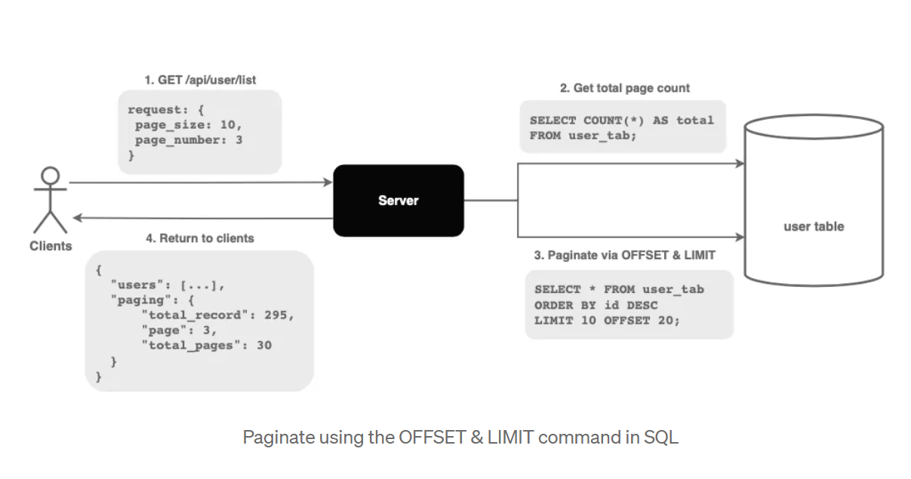
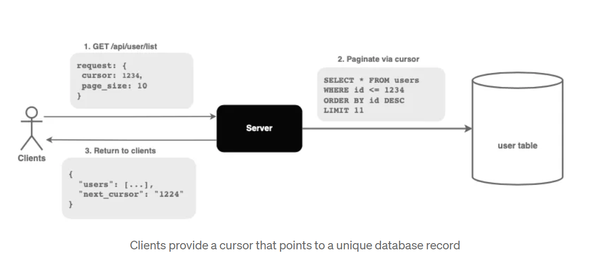

<details >
 <summary style="font-size: large; font-weight: bold">Infinite Scroll</summary>

1. Real time(Dynamic)
2. Addictive(Social Media)
3. Mobile Friendly
4. ❌ Bad for SEO
5. ❌ Searching is difficult

</details>

<details >
 <summary style="font-size: large; font-weight: bold">Pagination</summary>

1. Structural & Hierarchy is present
2. Finite Data
3. Back & forth movement is easy
4. Can have footer alike infinite scroll can't have a footer


Referred Article: https://betterprogramming.pub/understanding-the-offset-and-cursor-pagination-8ddc54d10d98

<details >
 <summary style="font-size: medium; font-weight: bold">Offset Pagination</summary>

The offset pagination leverages the OFFSET and LIMIT commands in SQL to paginate data.


API --- `/products?page=5&count=20`

- **offset** ➡️ page = 5
- **limit** ➡️ count = 20

[1,2,.....,1000] : 1000 entries
<br>
So above request will give `81-100 entries`

#### Pros
- It allows the clients to view the total number of pages.
- It allows clients to jump to a specific page by passing the page number.

#### Cons
- **Result inconsistency:**
  - If an item in a previous page is deleted, data will shift forward, causing some results to be skipped.
  - If an item in a previous page is added, data will shift backwards, causing some results to be duplicated.
- **Offset inefficiency — Doesn’t scale well with large dataset**
  - The database looks up for (offset + limit) number of records before discarding the unwanted ones and returning the remaining.
  - Hence, the query time increases drastically as the offset increases.
  - **_Time Complexity is `O(n)`_**
  - It's like iterating through `Linked List` and getting the data


</details>


<details >
 <summary style="font-size: medium; font-weight: bold">Cursor Pagination</summary>

- The cursor pagination utilizes a pointer that refers to a specific database record.
Proposed by Facebook
- If the cursor is not given, the server fetches from the first record.


- the `limit` is equal to the given `page size plus one`.
- If the number of records returned is less than the LIMIT, it implies that we are on the last page.
- The extra record is not returned to the client. The ID of the extra record is passed back to the client as the next_cursor.

#### Pros
- **Stable pagination window**
  - Since we are fetching from a stable reference point, the addition or deletion of record will not affect the pagination window.
- **Scale well with large datasets**
  - The cursor is unique and indexed.
  - The database jumps directly to the record without iterating through the unwanted data. Hence, making it more efficient.

#### Cons
- The cursor pagination doesn’t allow clients to jump to a specific page.
- The cursor must come from a unique and sequential column (E.g. timestamp). Otherwise, some data will be skipped.
- Limited sort features. If the requirement is to sort based on a non-unique column (E.g. first name), it will be challenging to implement using cursor pagination. Concatenating multiple columns to get a unique key leads to slower time complexity.
- **_Time Complexity is `O(1)`_**
- It's like using `Map` to get the data using key


<details >
 <summary style="font-size: small; font-weight: bold">Encoded Cursor</summary>

- The encoded cursor suggests returning an encoded base64 string regardless of the underlying pagination solution.
- When using offset pagination, we encode the `page_number` and `total_page` into a base64 string and return it as a cursor to the clients.
```json
"response": {
    // "page=3|offset=20|total_pages=30"
    next_cursor: "dcjadfaXMDdQTQ"
}
```
- Similarly, we can encode the cursor in the cursor pagination into a base64 string before returning it to the clients.
```json
response: {
    // "next_cursor:1234"
    next_cursor: "dcjadfaXMDdQTQ"
}
```
- The client can always pass a cursor and a page_size without knowing the underlying implementation.
```json
request: {
    cursor: "dcjadfaXMDdQTQ",
    page_size: 10
}
```

This allows the server to implement different underlying pagination solutions while providing a consistent interface to the API consumers.
</details>

</details>

</details>
