# Networking

<details >
 <summary style="font-size: x-large; font-weight: bold">How Web Works</summary>

- Think of `IP Address` as your house `PIN code`, which helps 
you get the website you are looking for on the internet
- Since remembering `IP address` is difficult  we use `Domain Name` such as www.google.com
- In Google Chrome, the default value is 6 connections per domain. This means that Chrome will only make a maximum of 6 HTTP requests to a single domain at the same time.
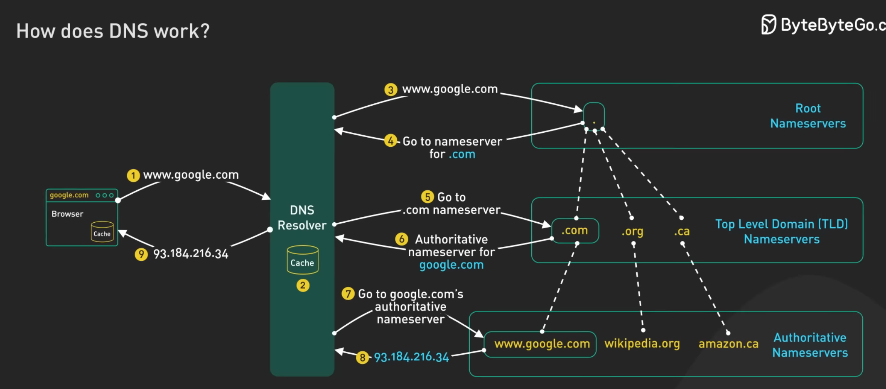
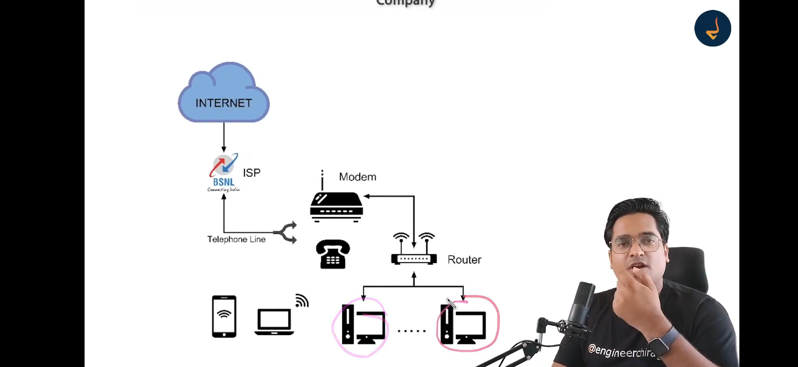

<details >
 <summary style="font-size: large; font-weight: bold">ISP(Internet Service Provider)</summary>

Example Airtel, Jio, etc.
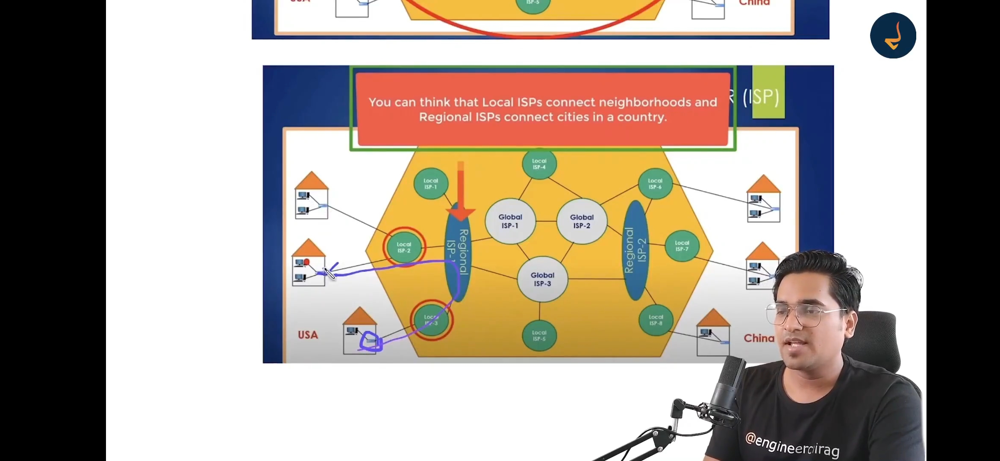
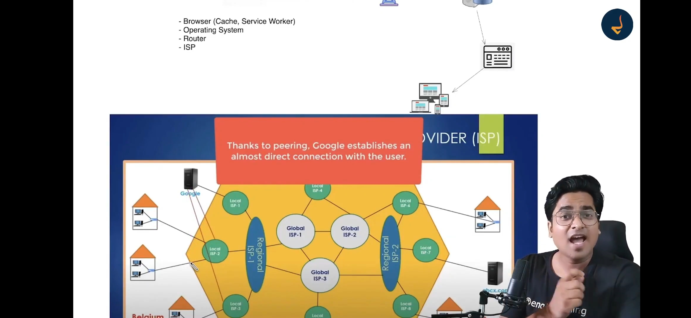

https://www.submarinecablemap.com/
</details>

<details >
 <summary style="font-size: large; font-weight: bold">DNS(Domain Name Service)</summary>

- DNS acts as an address book. It translates human-readable domain
names (google.com) to machine-readable IP addresses
(142.251.46.238).
- WHOIS Privacy Protection: Helps to prevent any domain related info in public
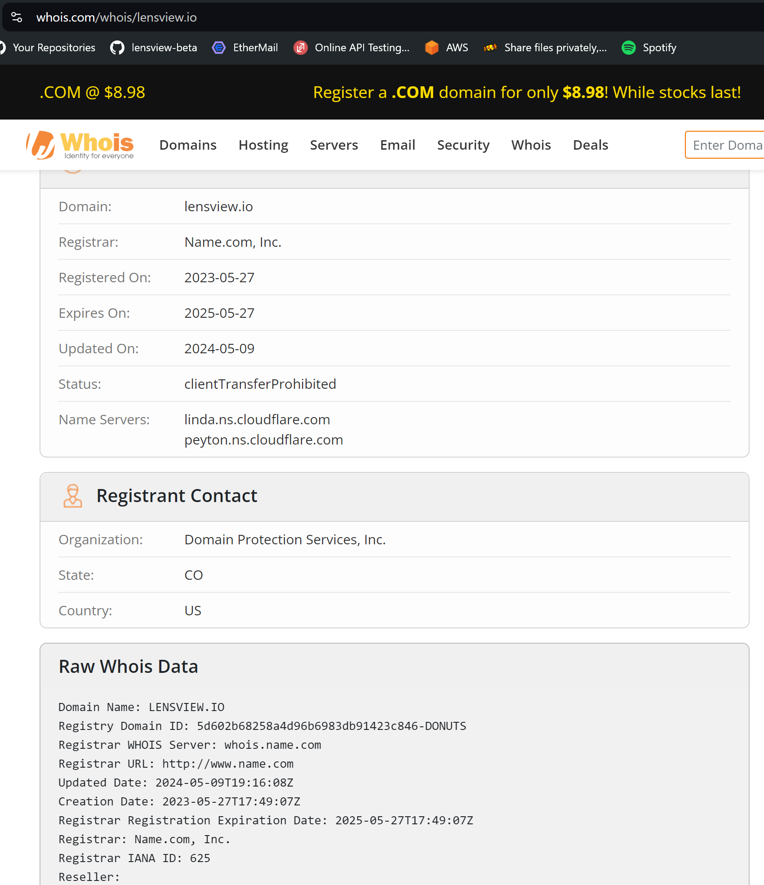
- https://www.whois.com/whois/lensview.io

To achieve better scalability, the DNS servers are organized in a
hierarchical tree structure.
There are 3 basic levels of DNS servers:
1. Root name server (.). It stores the IP addresses of Top Level
   Domain (TLD) name servers. There are 13 logical root name servers
   globally.
2. TLD name server. It stores the IP addresses of authoritative name
   servers. There are several types of TLD names. For example, generic
   TLD (.com, .org), country code TLD (.us), test TLD (.test).
3. Authoritative name server. It provides actual answers to the DNS
   query. You can register authoritative name servers with domain name
   registrar such as GoDaddy, Namecheap, etc.
   The diagram below illustrates how DNS lookup works under the hood:
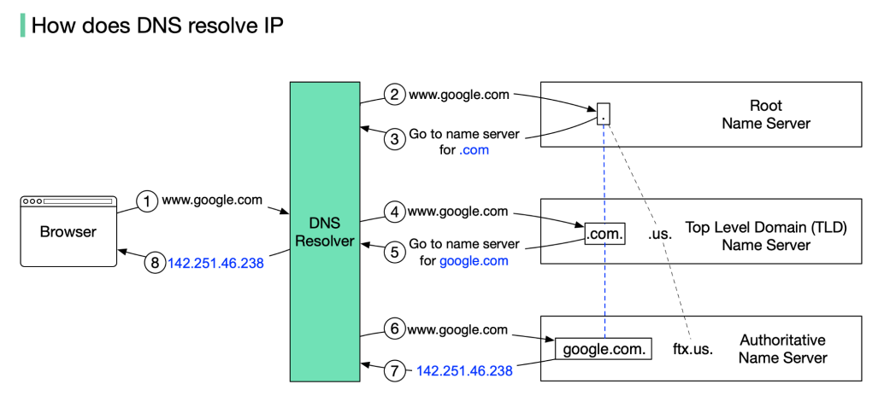

   1. google.com is typed into the browser, and the browser sends the
      domain name to the DNS resolver.
      97
   2. The resolver queries a DNS root name server.
   3. The root server responds to the resolver with the address of a TLD
      DNS server. In this case, it is .com.
   4. The resolver then makes a request to the .com TLD.
   5. The TLD server responds with the IP address of the domain’s name
      server, google.com (authoritative name server).
   6. The DNS resolver sends a query to the domain’s nameserver.
   7. The IP address for google.com is then returned to the resolver from
      the nameserver.
   8. The DNS resolver responds to the web browser with the IP address
      (142.251.46.238) of the domain requested initially.
      DNS lookups on average take between 20-120 milliseconds to
      complete (according to YSlow).
   
Referred Video: https://www.youtube.com/watch?v=27r4Bzuj5NQ
</details>

<details >
 <summary style="font-size: large; font-weight: bold">What happens when you type a URL into your browser?
</summary>

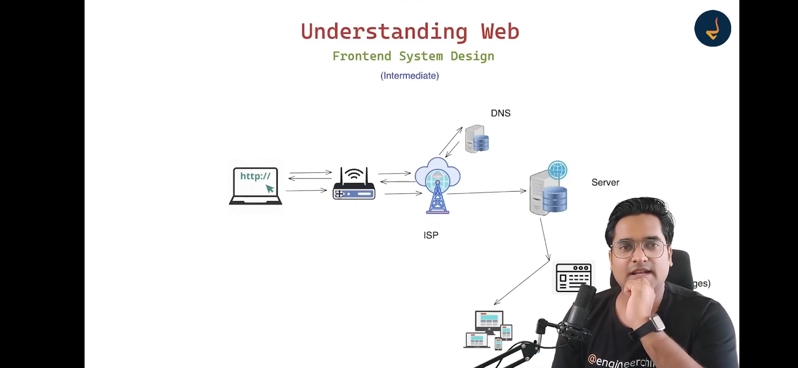
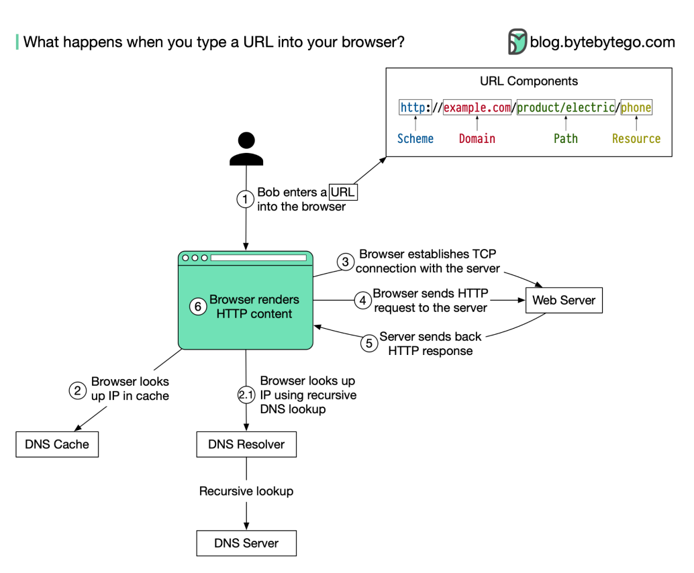
1. Bob enters a URL into the browser and hits Enter. In this example,
   the URL is composed of 4 parts:
   - scheme - ğ’‰ğ’•ğ’•ğ’‘ğ’”://. This tells the browser to send a connection to the
   server using HTTPS.
   - domain - ğ’†ğ’™ğ’‚ğ’ğ’‘ğ’ğ’†.ğ’„ğ’ğ’. This is the domain name of the site.
   - path - ğ’‘ğ’“ğ’ğ’…ğ’–ğ’„ğ’•/ğ’†ğ’ğ’†ğ’„ğ’•ğ’“ğ’Šğ’„. It is the path on the server to the requested
   resource: phone.
   - resource - ğ’‘ğ’‰ğ’ğ’ğ’†. It is the name of the resource Bob wants to visit.
2. The browser looks up the IP address for the domain with a domain
   name system (DNS) lookup. To make the lookup process fast, data is
   cached at different layers: browser cache, OS cache, local network
   cache and ISP cache.
   
   - If the IP address cannot be found at any of the caches, the browser
   goes to DNS servers to do a recursive DNS lookup until the IP address
   is found (this will be covered in another post).
3. Now that we have the IP address of the server, the browser
   establishes a TCP connection with the server.
4. The browser sends a HTTP request to the server. The request looks
   like this:
   ğ˜ğ˜Œğ˜› /ğ˜±ğ˜©ğ˜°ğ˜¯ğ˜¦ ğ˜ğ˜›ğ˜›ğ˜—/1.1
   ğ˜ğ˜°ğ˜´ğ˜µ: ğ˜¦ğ˜¹ğ˜¢ğ˜®ğ˜±ğ˜­ğ˜¦.ğ˜¤ğ˜°ğ˜®
5. The server processes the request and sends back the response. For
   a successful response (the status code is 200). The HTML response
   might look like this:
   ```html
    ğ˜ğ˜›ğ˜›ğ˜—/1.1 200 ğ˜–ğ˜’
   ğ˜‹ğ˜¢ğ˜µğ˜¦: ğ˜šğ˜¶ğ˜¯, 30 ğ˜‘ğ˜¢ğ˜¯ 2022 00:01:01 ğ˜ğ˜”ğ˜›
   ğ˜šğ˜¦ğ˜³ğ˜·ğ˜¦ğ˜³: ğ˜ˆğ˜±ğ˜¢ğ˜¤ğ˜©ğ˜¦
   ğ˜Šğ˜°ğ˜¯ğ˜µğ˜¦ğ˜¯ğ˜µ-ğ˜›ğ˜ºğ˜±ğ˜¦: ğ˜µğ˜¦ğ˜¹ğ˜µ/ğ˜©ğ˜µğ˜®ğ˜­; ğ˜¤ğ˜©ğ˜¢ğ˜³ğ˜´ğ˜¦ğ˜µ=ğ˜¶ğ˜µğ˜§-8
   <!ğ˜‹ğ˜–ğ˜Šğ˜›ğ˜ ğ˜—𘌠ğ˜©ğ˜µğ˜®ğ˜­>
   <ğ˜©ğ˜µğ˜®ğ˜­ ğ˜­ğ˜¢ğ˜¯ğ˜¨="ğ˜¦ğ˜¯">
   ğ˜ğ˜¦ğ˜­ğ˜­ğ˜° ğ˜¸ğ˜°ğ˜³ğ˜­ğ˜¥
   </ğ˜©ğ˜µğ˜®ğ˜­>
    ```
   
6. The browser renders the HTML content.

Referred Video: https://www.youtube.com/watch?v=AlkDbnbv7dk&t=236s

Try to keep first call page size small so that their something to show, to make it performant
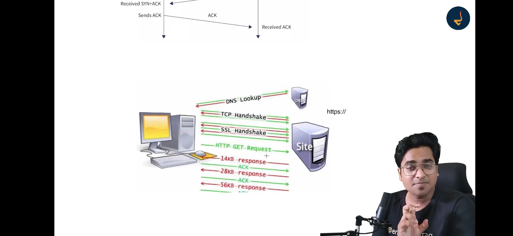
</details>


<details >
 <summary style="font-size: large; font-weight: bold">CRP(Critical Rendering Path)</summary>

The Critical Rendering Path is the sequence of steps the browser goes through to convert the HTML, CSS, and JavaScript into pixels on the screen. Optimizing the critical render path improves render performance. The critical rendering path includes the Document Object Model (DOM), CSS Object Model (CSSOM), render tree and layout.


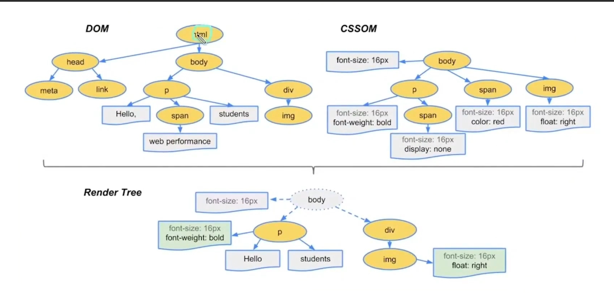

JS Execution
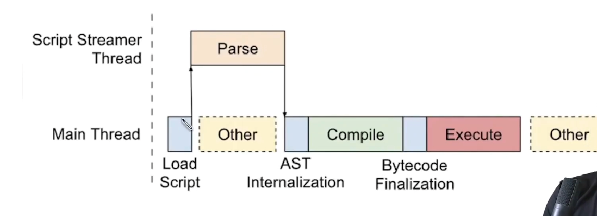

Looking code-wise the critical rendering path is as follows:
1.
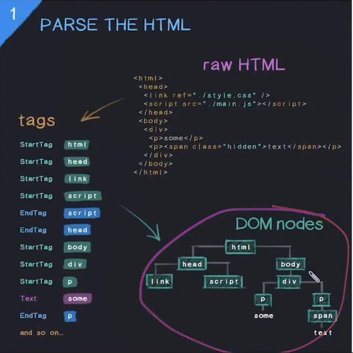
2. 
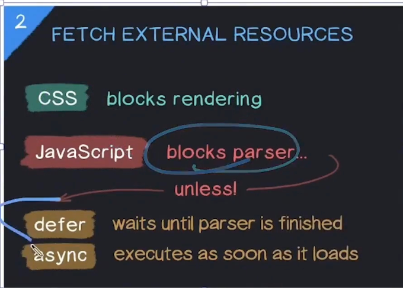

**Render-Blocking V/s Parser-Blocking**
- When a browser encounters a render-blocking resource, it will not display the page content below that render-blocking resource.

- When rendering is blocked because of a render-blocking resource, the browser will continue to parse the HTML code and construct the page contents. CSS is render-blocking by default.

- A parser-blocking resource blocks rendering as well, but in addition it prevents the browser from continuing to parse the HTML and processing other resources in the page. JavaScript is parser-blocking by default.

- A parser-blocking or render-blocking resource placed towards the end of the body is can't block rendering of remaining page content, as there's no more content to render!

- Note that when the browser's HTML parser encounters a stylesheet, the parser will not execute any scripts that come after the stylesheet until the CSS is fully loaded.

- In theory parser-blocking resources are worse than merely render-blocking ones, as images or additional scripts or stylesheet won't be discovered until the parser reaches those HTML tags.

- In practice this is rarely a problem, as the [browser's preload scanner](https://web.dev/articles/preload-scanner) can quickly identify important resources that need to be downloaded, without pausing to run any scripts.
- Referred Article: https://www.debugbear.com/blog/visualize-render-blocking-scripts.

3. 
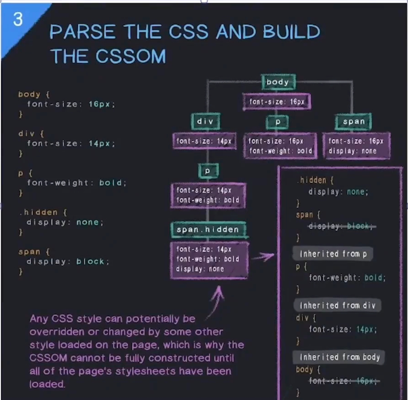

4. 
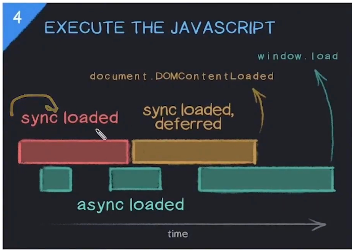

5. 
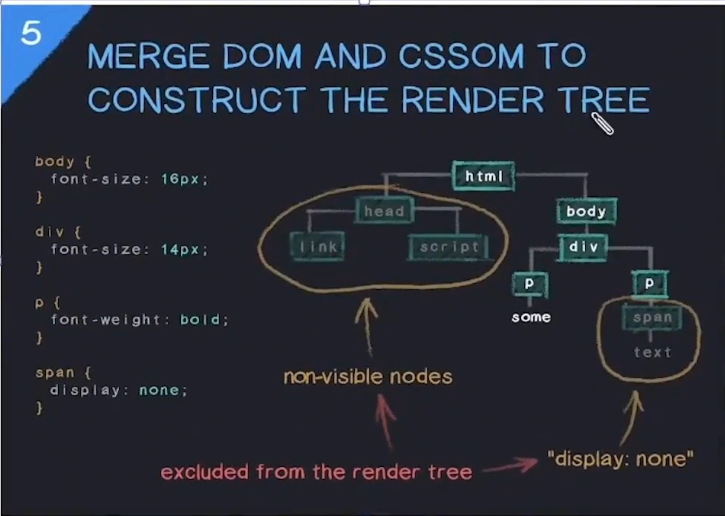

6. Layout and Painting are just like making home 
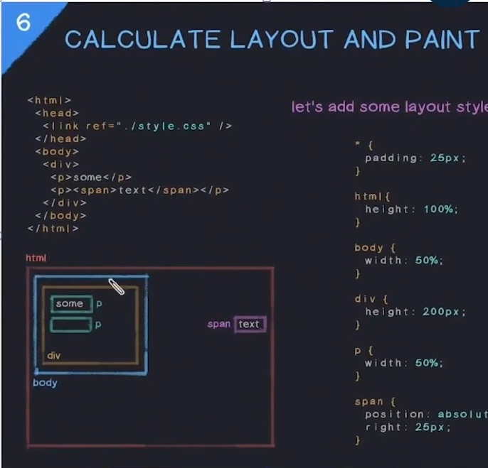

7. Lastly, in Composting phase, we put things together, and things like modal should be at top, 
and we need to hide other things below it, happen in Composting phase
</details>


</details>


<details >
 <summary style="font-size: x-large; font-weight: bold">Communication Protocols</summary>


<details >
 <summary style="font-size: large; font-weight: bold">Network Protocols</summary>

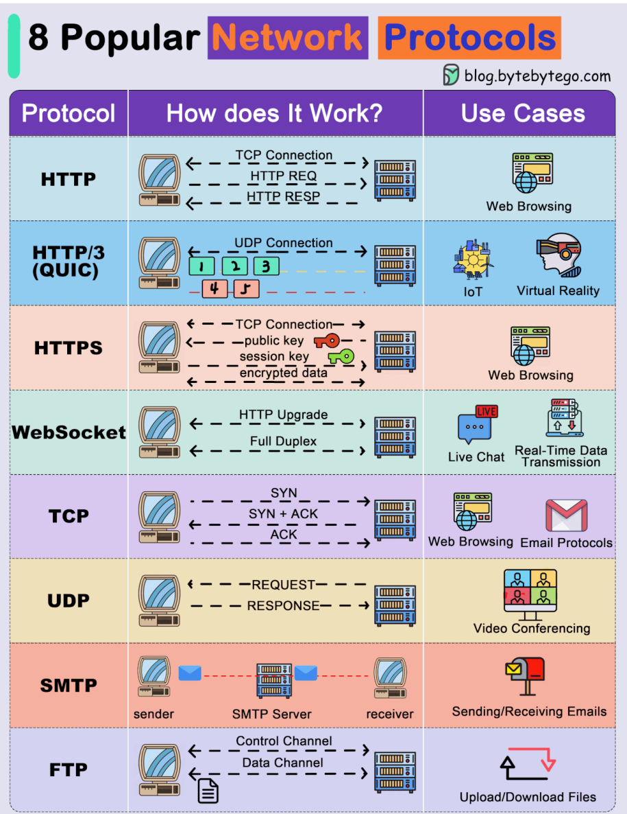

Network protocols are standard methods of transferring data between two computers in a
network.
1. HTTP (HyperText Transfer Protocol)
   HTTP is a protocol for fetching resources such as HTML documents. It is the foundation of any
   data exchange on the Web and it is a client-server protocol.
2. HTTP/3
   HTTP/3 is the next major revision of the HTTP. It runs on QUIC, a new transport protocol
   designed for mobile-heavy internet usage. 
   1. It relies on **UDP** instead of TCP, which enables faster web page responsiveness.
   2. It is faster than HTTP/2.
   3. Header Compression
   4. Improved Performance
   5. Better Network Congestion
   6. VR applications demand more bandwidth to render intricate details
      of a virtual scene and will likely benefit from migrating to HTTP/3 powered by QUIC.
3. HTTPS (HyperText Transfer Protocol Secure)
   HTTPS extends HTTP and uses encryption for secure communications.
4. WebSocket
   WebSocket is a protocol that provides full-duplex communications over TCP. Clients establish
   WebSockets to receive real-time updates from the back-end services. Unlike REST, which always
   “pulls†data, WebSocket enables data to be “pushedâ€. Applications, like online gaming, stock
   trading, and messaging apps leverage WebSocket for real-time communication.
5. TCP (Transmission Control Protocol)
   TCP is designed to send packets across the internet and ensure the successful delivery of data
   and messages over networks. Many application-layer protocols are built on top of TCP.
6. UDP (User Datagram Protocol)
   UDP sends packets directly to a target computer, without establishing a connection first. UDP is
   commonly used in time-sensitive communications where occasionally dropping packets is better
   than waiting. Voice and video traffic are often sent using this protocol.
7. SMTP (Simple Mail Transfer Protocol)
   SMTP is a standard protocol to transfer electronic mail from one user to another.
8. FTP (File Transfer Protocol)
   FTP is used to transfer computer files between client and server. It has separate connections for
   the control channel and data channel.

Referred Video: https://www.youtube.com/watch?v=P6SZLcGE4us
</details>


<details >
 <summary style="font-size: large; font-weight: bold">HTTP/1 to HTTP/2 to HTTP/3</summary>

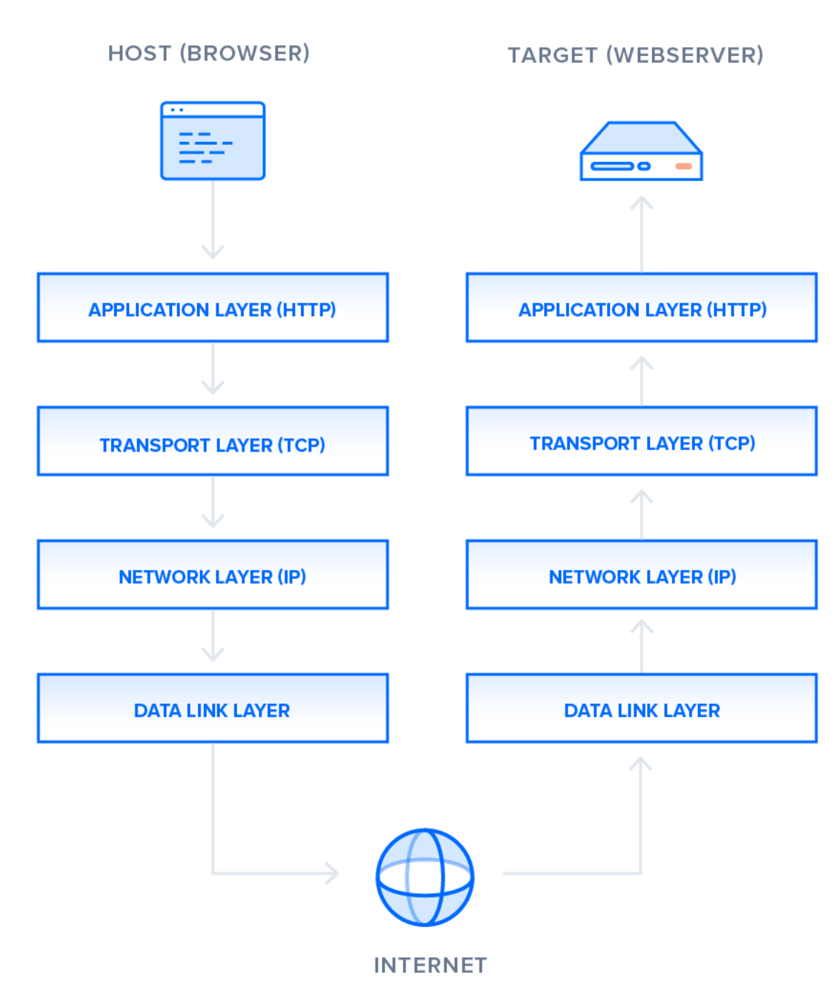
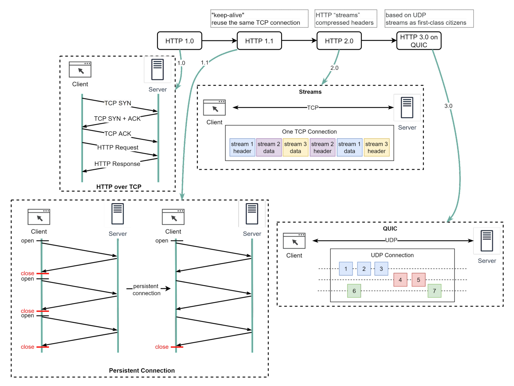

- HTTP 1.0 was finalized and fully documented in 1996. Every
request to the same server requires a separate TCP connection.

- HTTP 1.1 was published in 1997. A TCP connection can be left
open for reuse (persistent connection), but it doesn’t solve the HOL
(head-of-line) blocking issue.
  - **HOL blocking** - when the number of allowed parallel requests in the
  browser is used up, subsequent requests need to wait for the former
  ones to complete.
  53

- HTTP 2.0 was published in 2015. It addresses HOL issue through
request multiplexing, which eliminates HOL blocking at the application
layer, but HOL still exists at the transport (TCP) layer.
As you can see in the diagram, HTTP 2.0 introduced the concept of
HTTP “streamsâ€: an abstraction that allows multiplexing different HTTP
exchanges onto the same TCP connection. Each stream doesn’t need
to be sent in order.

- HTTP 3.0 first draft was published in 2020. It is the proposed
successor to HTTP 2.0. It uses QUIC instead of TCP for the underlying
transport protocol, thus removing HOL blocking in the transport layer.
QUIC is based on UDP. It introduces streams as first-class citizens at
the transport layer. QUIC streams share the same QUIC connection,
so no additional handshakes and slow starts are required to create
new ones, but QUIC streams are delivered independently such that in
most cases packet loss affecting one stream doesn't affect others.

Referred Video: https://www.youtube.com/watch?v=a-sBfyiXysI&t=2s


Two main factors dictate which HTTP version will be used for a website:

1. **Server Configuration:** The web server software that hosts the website plays a crucial role. The server administrator configures it to support specific HTTP versions (e.g., HTTP/1.1, HTTP/2). A website can only use a version that the server actively supports.

2. **Client Capabilities:** The web browser or client application used to access the website also has its part. Modern browsers typically support the latest HTTP versions (e.g., HTTP/2). However, older browsers might be limited to earlier versions (e.g., HTTP/1.1).

Here's how the negotiation happens:

* When you try to access a website, your browser initiates a connection with the server.
* The server sends a response header that includes information about the supported HTTP versions.
* The browser checks its own capabilities and negotiates the highest mutually supported version for optimal communication.

In most cases, with modern browsers and up-to-date servers, you'll automatically use the most efficient HTTP version available.

</details>

</details>


<details >
 <summary style="font-size: x-large; font-weight: bold">API Protocols</summary>

Architecture in System Design
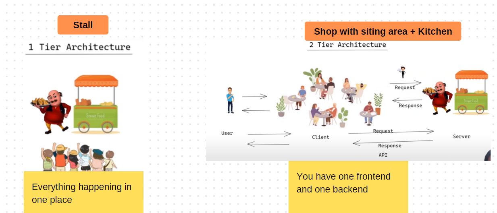
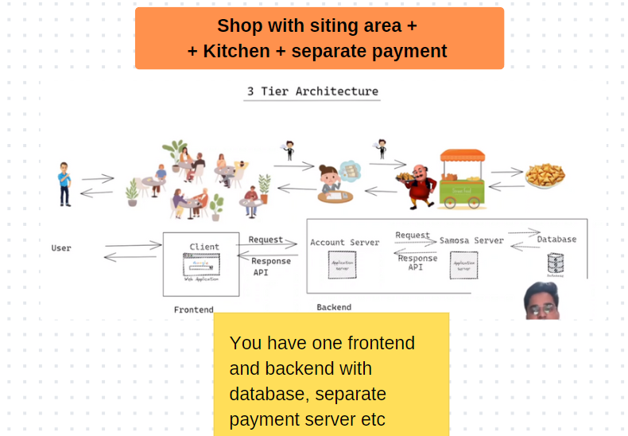

https://blog.postman.com/api-protocols-in-2023/
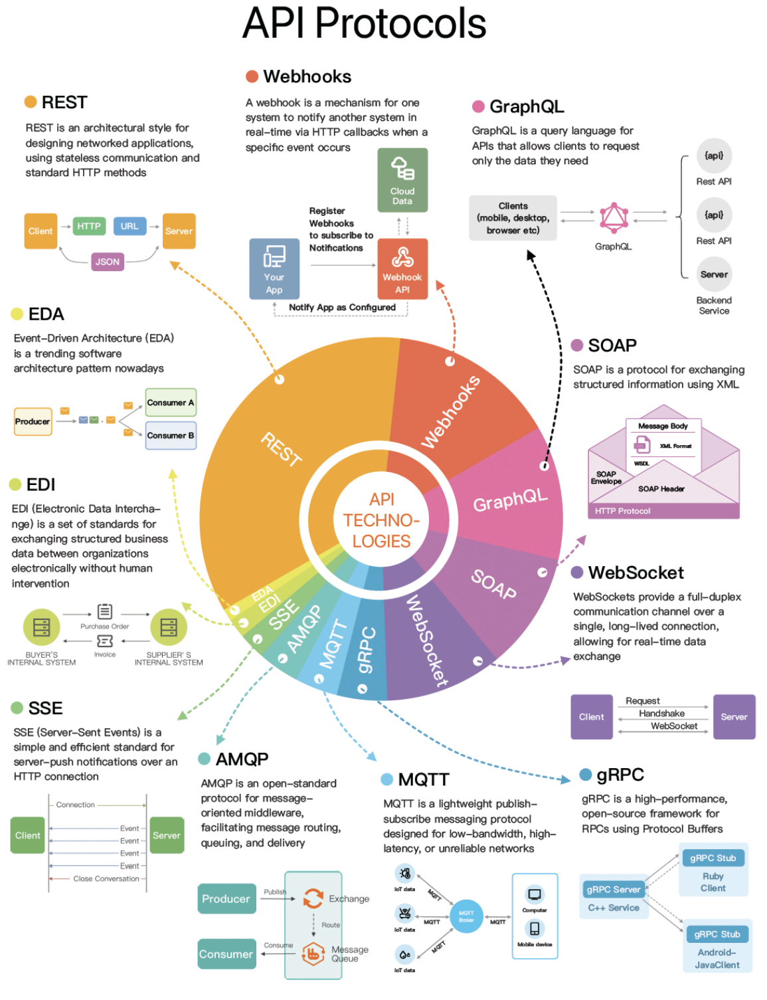


<details >
 <summary style="font-size: large; font-weight: bold">REST</summary>

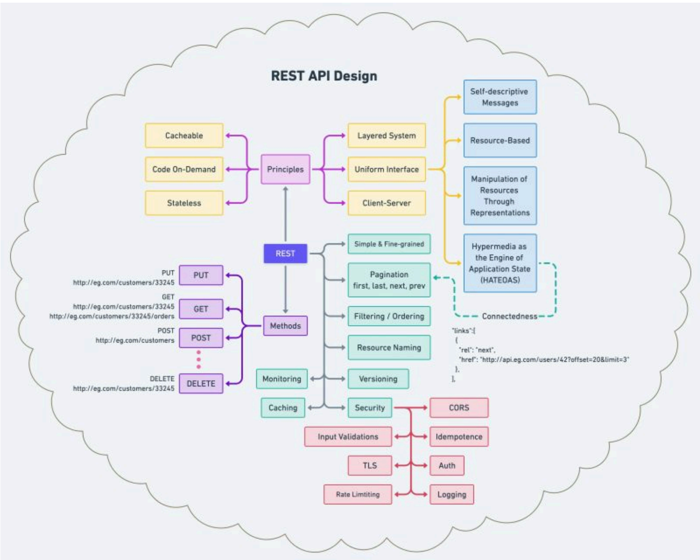


<details >
 <summary style="font-size: medium; font-weight: bold">Advantages/Disadvantages</summary>

### Advantage
1. **Ease of Use**
2. **Stateless:** The server does not need to store any state in order to process the request. Like authentication details, IP address from where request is coming etc
3. **Scability:** The server can be scaled up and down as per the demand.
4. **Flexibility with Data:** We are free to use JSON or XML to send and receive data.
5. **Uniform Interface:** It leverages the same standard followed by HTTP like domain name, path, query etc.
6. **Caching:** We can cache the data which are not changing frequently like for example API returning number of countries etc. REST out of box provided caching capability using HTTP protocols
7. **Separation of Concerns:** Backend and frontend can be built on any language like java, javascript, python etc. We need to use same language on both side to consume REST API.
8. **Interoperability:** Language agnostic 
9. Ease of testing 
10. **Security:** It leverage different header to make it more secure.


### Disadvantage
1. **Over-fetching and under-fetching:** REST runs the risk of over-fetching or under-fetching data, as clients may only need a subset of resources. This drawback can cause performance issues and waste bandwidth.
2. **Chatty interfaces:** Retrieving related data may require multiple requests, which increases latency. This waterfall of calls becomes especially problematic as applications scale.
3. **[Versioning](https://www.postman.com/api-platform/api-versioning/) challenges:** Creating new versions of a REST API can be cumbersome, especially when there are changes to the data structure or service functionality. This often leads to backward compatibility issues.
4. **Stateless overhead:** While statelessness supports scalability, it also means that all the necessary context must be provided with every request. This requirement can introduce overhead, especially when clients must send large amounts of repetitive data.
5. **Lack of real-time functionality:** REST is not optimized for real-time apps like chat or live feeds. WebSockets and Server-Sent Events often better suit such use cases.
</details>


<details >
 <summary style="font-size: medium; font-weight: bold">URL v/s URI v/s URN</summary>

- Here anything after `#` does not go from client to server
- path helps you get to the exact function that needs to be executed
  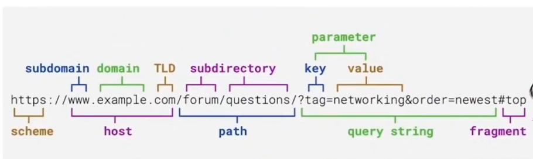

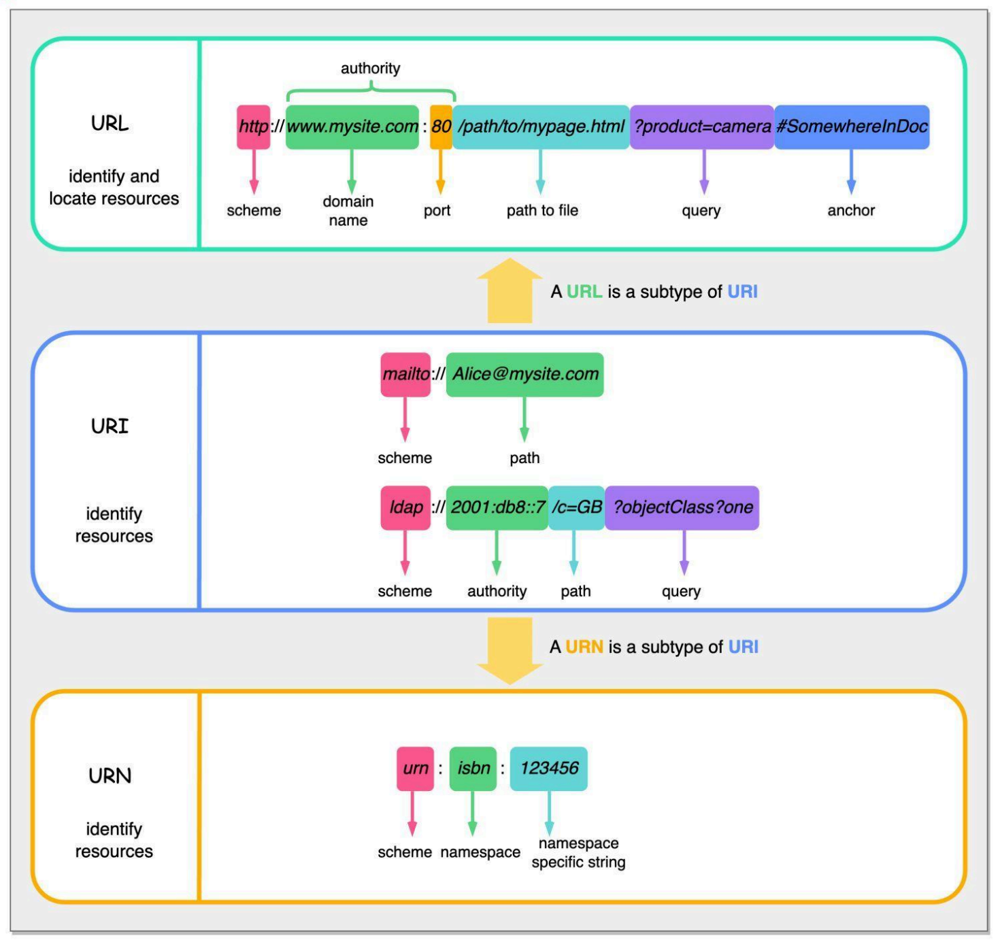

- URI
  URI stands for Uniform Resource Identifier. It identifies a logical or physical resource on
  the web. URL and URN are subtypes of URI. URL locates a resource, while URN names a
  resource.
  A URI is composed of the following parts:
  scheme:[//authority]path[?query][#fragment]
- URL
  URL stands for Uniform Resource Locator, the key concept of HTTP. It is the address of a
  unique resource on the web. It can be used with other protocols like FTP and JDBC.
- URN
  URN stands for Uniform Resource Name. It uses the urn scheme. URNs cannot be used
  to locate a resource. A simple example given in the diagram is composed of a namespace
  and a namespace-specific string.

If you would like to learn more detail on the subject, I would recommend W3C’s clarification.
</details>


<details >
 <summary style="font-size: medium; font-weight: bold">HTTP Request Methods</summary>

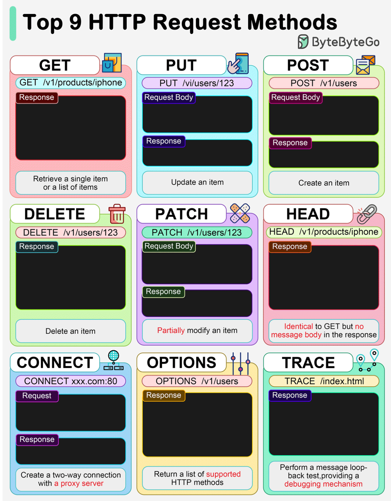

1. HEAD: Just want to check if any header got modified or not on the server
2. OPTIONS: Use for security purposes

</details>


<details >
 <summary style="font-size: medium; font-weight: bold">Express REST API</summary>

1. Complete JS SetUp: https://github.com/namastedev/namaste-frontend-system-design/tree/master/Networking/RestApi
```js
import express from 'express';
import bodyParser from 'body-parser';

const app = express();

app.use(bodyParser.json());

app.all('/', (req, res) => {
    // console.log('Request > ', req);
    // console.log('Response >', res);
    res.send(`I'm up!`);
});

const todos = [{
    id: '1',
    title: 'Task 1',
    completed: false
}, {
    id: '2',
    title: 'Task 2',
    completed: true
}];

// READ
app.get('/todos', (req, res) => {
    res.json(todos);
})

// CREATE
app.post('/todos', (req, res) => {
    const newTodo = req.body;
    todos.push(newTodo);
    res.status(201).json({
        message: 'New Todo Added!'
    });
});

// UPDATE
app.put('/todos/:id', (req, res) => {
    const newTodoData = req.body;
    const todoParamId = req.params.id;
    const todoIndex = todos.findIndex(td => td.id === todoParamId);

    if (todoIndex !== -1) {
        todos[todoIndex] = {
            id: todoParamId,
            ...newTodoData,
        }
        res.json({
            message: 'Todo updated successfully!'
        });
    } else {
        res.status(400).json({
            message: 'Todo Id does not exist!'
        });
    }
    
})

// DELETE
app.delete('/todos/:id', (req, res) => {
    const todoParamId = req.params.id;
    const todoIndex = todos.findIndex(td => td.id === todoParamId);

    if (todoIndex !== -1) {
        todos.splice(todoIndex, 1);
    }

    res.json({
        message: 'Todo deleted successfully!'
    });

})


const PORT = 5111;
app.listen(PORT, () => {
    console.log(`Server is running at port ${PORT}`);
});
```

2. Complete TS Setup: https://github.com/anjaysahoo/basic-ts-express-app
</details>


<details >
 <summary style="font-size: medium; font-weight: bold">`req.params` v/s `req.query`</summary>

### 1. `req.params`
`req.params` contains route parameters (in the path portion of the URL), which are typically used to capture dynamic segments in the URL.

```javascript
app.get('/user/:userId/books/:bookId', (req, res) => {
  res.send(req.params);
});
```
And you make a request to:
```
GET /user/123/books/456
```
`req.params` will contain:
```json
{
  "userId": "123",
  "bookId": "456"
}
```

**Other names:**
- Route parameters
- Path variables
- URL parameters

### 2. `req.query`
`req.query` contains query string parameters (in the query string portion of the URL, after the `?`), which are typically used to send additional data to the server.


```javascript
app.get('/search', (req, res) => {
  res.send(req.query);
});
```
And you make a request to:
```
GET /search?keyword=javascript&page=2
```
`req.query` will contain:
```json
{
  "keyword": "javascript",
  "page": "2"
}
```

**Other names:**
- Query string parameters
- URL query parameters
- Query variables

</details>


<details >
 <summary style="font-size: medium; font-weight: bold">HTTP Headers</summary>

HTTP requests are like asking for something from a server, and HTTP responses are the server's
replies. It's like sending a message and receiving a reply.

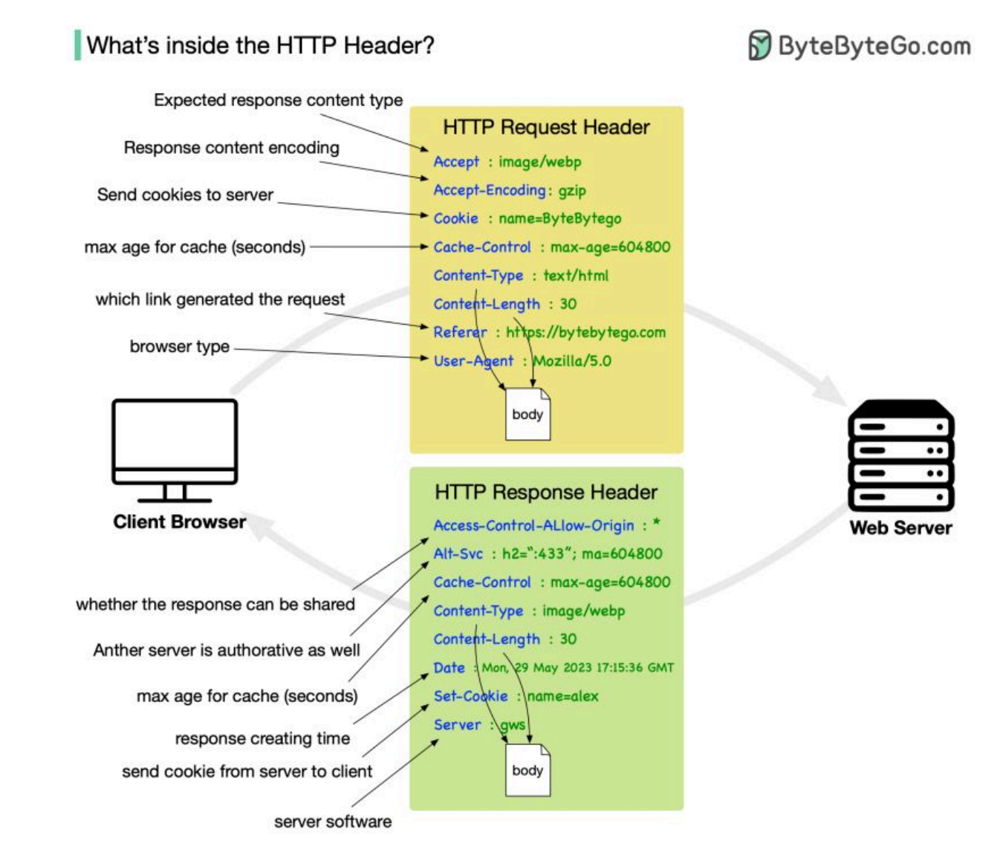

- An HTTP request header is an extra piece of information you include when making a request,
such as what kind of data you are sending or who you are. 
- In response headers, the server provides information about the response it is sending you, such as what type of data you're
receiving or if you have special instructions.
- A header serves a vital role in enabling client-server communication when building RESTful
applications. 
- In order to send the right information with their requests and interpret the
server's responses correctly, you need to understand these headers.

#### Request Headers

| Header            | Usecase                                             | Example                                                                                                         |
|:------------------|:----------------------------------------------------|:----------------------------------------------------------------------------------------------------------------|
| Host              | Target host                                         | host: www.1.cdn.example.com                                                                                     |
| Origin            | Origin Host                                         | host: www.example.com                                                                                           |
| Referer           | Indicate the previous web page making this request  | https://www.example.com/previous-page                                                                           |
| Accept            | Response content type                               | application/json                                                                                                |
| Accept-language   | Preferred response content language                 | en-US, en;q=0.9                                                                                                 |
| User Agent        | Identify the client. User agent string- OS, Browser | Mozilla/5.0 (Windows NT 10.0; Win64; x64) AppleWebKit/537.36 (KHTML, like Gecko) Chrome/126.0.0.0 Safari/537.36 |
| Accept-encoding   | Encoding algorithm                                  | gzip,deflate,br                                                                                                 |
| Connection        | Keep TCP connection open                            | keep-alive, close                                                                                               |
| Authorization     | send credentials                                    | Authorization: Bearer                                                                                           |
| Cookie            | Previous Server Token can be resend                 | key=value                                                                                                       |
| if-modified-since |                                                     |                                                                                                                 |
| Cache-control     |                                                     |                                                                                                                 |


#### Response Headers

| Header            | Usecase                                                                                       | Example                       |
|:------------------|:----------------------------------------------------------------------------------------------|:------------------------------|
| Date              | When the response was generated                                                               | Tue, 09 Jul 2024 04:53:11 GMT |
| Server            | Provides server info(This info can misused if there is known issue in library used on server) | Server: Apache/2.4.41(Unix)   |
| Content-Type      | Type of response content                                                                      | text/html, application.json   |
| Content-Length    | Original body response length(Can be used to show loader with percentage it downloaded)       | 256                           |
| Set-cookie        | Informs about cookie need to store for future response                                        | Set-cookie: user_id=123       |
| Content-encoding  | Response content encoding                                                                     | br                            |
| Cache-control     |                                                                                               |                               |
| Last-modified     |                                                                                               |                               |
| Etag              |                                                                                               |                               |
| Expires           |                                                                                               |                               |

</details>


<details >
 <summary style="font-size: medium; font-weight: bold">HTTP Status Code</summary>

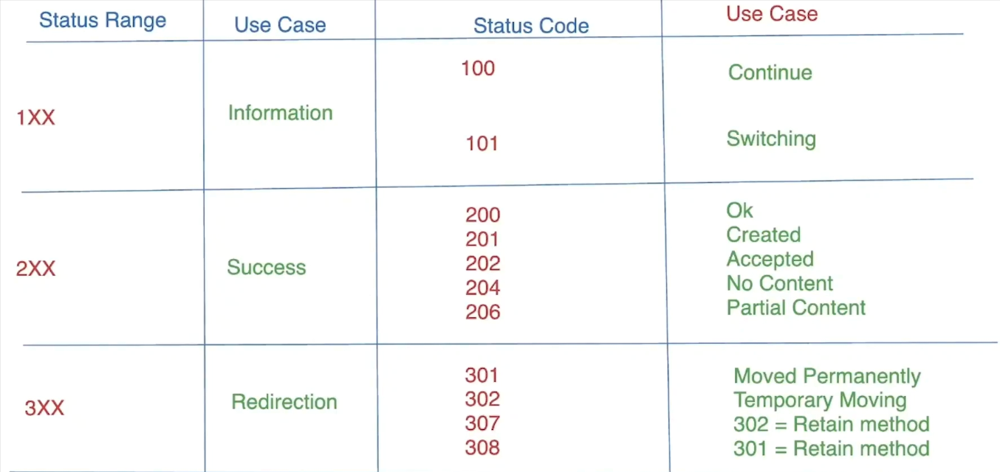
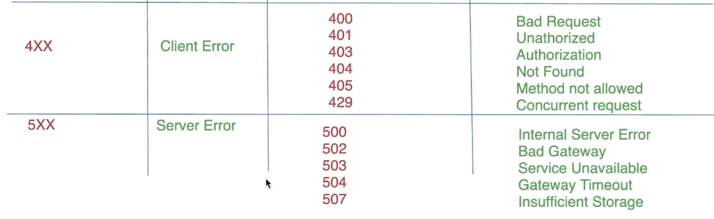

Usecase for frontend developer
1. We can retry based on status code. So retry does not make sense if we get `400 Bad requests` because user is sending wrong info, but `503 service unavailable` make sense where we should retry

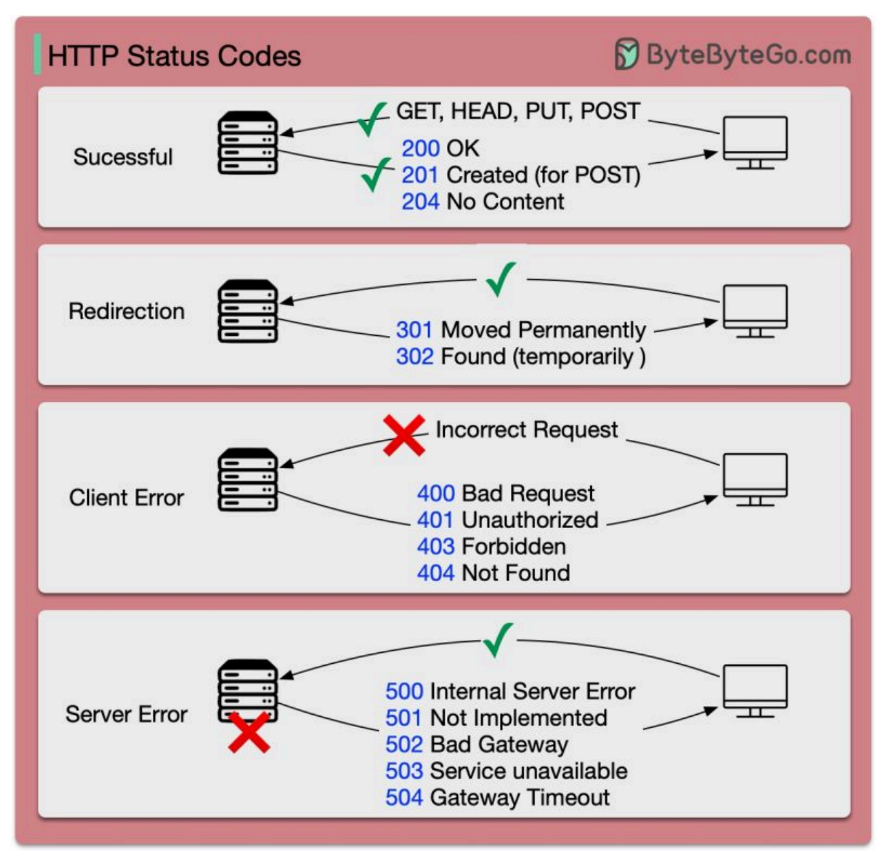
Refer Video for more details here: https://www.youtube.com/watch?v=qmpUfWN7hh4
</details>

<details >
 <summary style="font-size: medium; font-weight: bold">Design Effective & Safe API</summary>

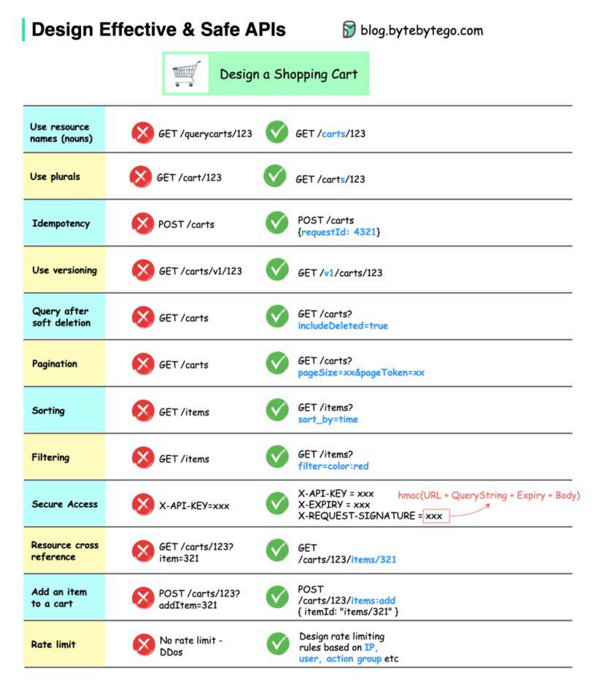

</details>

</details>

</details>


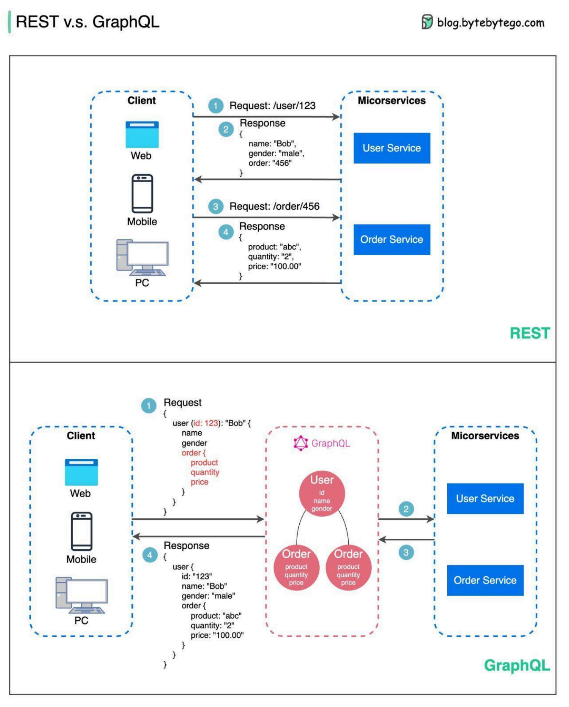
- GraphQL is a query language for APIs developed by Meta. It provides a complete
  description of the data in the API and gives clients the power to ask for exactly what they
  need.
-  GraphQL servers sit in between the client and the backend services.
- GraphQL can aggregate multiple REST requests into one query. GraphQL server organizes
  the resources in a graph.
- GraphQL supports queries, mutations (applying data modifications to resources), and
  subscriptions (receiving notifications on schema modifications).
- Over to you:
1. Is GraphQL a database technology?
2. Do you recommend GraphQL? Why/why not?


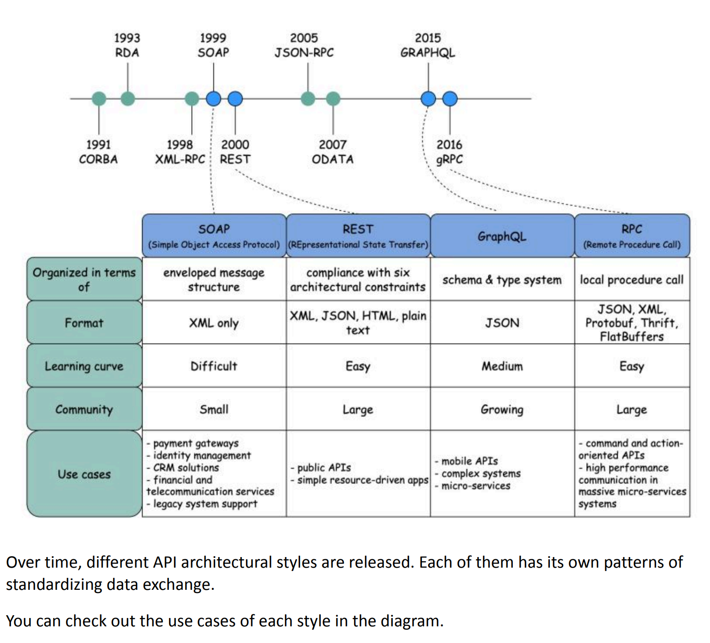


