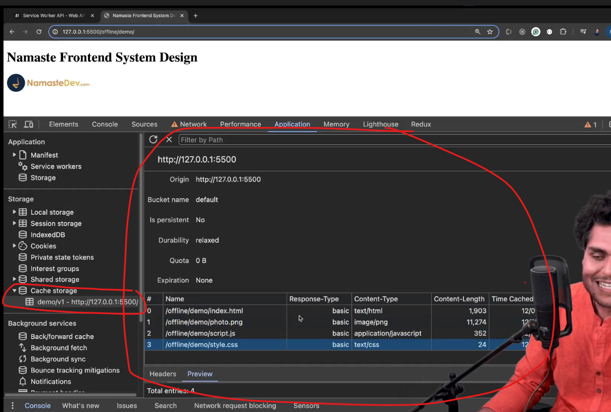

<details >
 <summary style="font-size: x-large; font-weight: bold">Service Worker</summary>

- Service workers essentially act as proxy servers that sit between web applications, the browser, and the network (when available). 
- They are intended, among other things, to enable the creation of effective offline experiences, intercept network requests, and take appropriate action based on whether the network is available, and update assets residing on the server. 
- They will also allow access to push notifications and background sync APIs.
- Browser provides **separate thread** to service worker, which does not impact website performance.
- It works only on **HTTPS**, for security reasons. In firefox we can't open this in private window also.
- It does not work all browsers, but it is supported by most of them.
- A service worker is an event-driven worker
- It **can't access DOM, local storage, session storage**
- We can have multiple service workers for a single website. We can define scope of service worker to be at root or any folder

https://developer.mozilla.org/en-US/docs/Web/API/Service_Worker_API

### Setting Up Service Worker

```html
//index.html

<!DOCTYPE html>
<html lang="en">
  <head>
    <meta charset="UTF-8" />
    <meta name="viewport" content="width=device-width, initial-scale=1.0" />
    <title>Namaste Frontend System Design</title>
    <link rel="stylesheet" href="./style.css" />
    <link rel="manifest" href="./manifest.json" />
  </head>
  <body>
    <h1>Namaste Frontend System Design</h1>
    
    <script src="./script.js"></script>
  </body>
</html>
```

1. Create a `sw.js` file. We can name it whatever we want.
2. Register the service worker.
```js
//script.js

// Check if service worker is supported by our browser
if (navigator.serviceWorker) {
  // Register the service worker

  navigator.serviceWorker
    .register("./sw.js", {
      scope: "./",
    })
    .then((res) => {
      console.log("Service worker registered successfully");
    })
    .catch((err) => {
      console.log("Error registering service worker", err);
    });
}
```

3. Service worker are Event-Driven. Below are some events that are triggered by the service worker.
```js
//sw.js

self.addEventListener("install", (e) => {

});

self.addEventListener("activate", (e) => {

});

self.addEventListener("fetch", (e) => {

});
```

4. All the data which is needed to render a page like html, css, js etc are stored by service worker in `cache storage`.

```js
//sw.js

const CACHE_NAME = "demo/v7";

const CACHE_FILES = [
  "./index.html",
  "./style.css",
  "./photo.png",
  "./script.js",
];

self.addEventListener("install", (e) => {
  e.waitUntil(
    caches.open(CACHE_NAME).then((cache) => {
      cache.addAll(CACHE_FILES);
    })
  );
});
```


5. How to use service worker?

Always first fetch data from network and if user is offline then fetch data from cache as backup
```js
//sw.js

self.addEventListener("fetch", (e) => {
    // Offline exprience
    // Whenever a file is requested,
    // 1. fetch from network, update my cache 2. cache as a fallback

    e.respondWith(
        fetch(e.request)
            .then((res) => {
                // update my cache
                const cloneData = res.clone();
                caches.open(CACHE_NAME).then((cache) => {
                    cache.put(e.request, cloneData);
                });
                console.log("returning from network");
                return res;
            })
            .catch(() => {
                console.log("returning from cache");
                return caches.match(e.request).then((file) => file);
            })
    );
});
```
With this whenever we have fetch call then it is intercepted by our service work and we try to get data from server
if fetch was successful then cache is updated and we return the response.

But if something goes wrong like server is down, network issue etc then we return from cache.


6. Clean-Up Step: Once start having multiple version of the same service work, then cleaning previous version cached data is 
important. We can do this during `activate` event

```js
self.addEventListener("activate", (e) => {
  // Clean up useless cache
  e.waitUntil(
    caches.keys().then((keyList) => {
      return Promise.all(
        keyList.map((key) => {
          if (key != CACHE_NAME) {
            return caches.delete(key);
          }
        })
      );
    })
  );
});
```

</details>


<details >
 <summary style="font-size: x-large; font-weight: bold">Progressive Web App</summary>


</details>

