# Performance

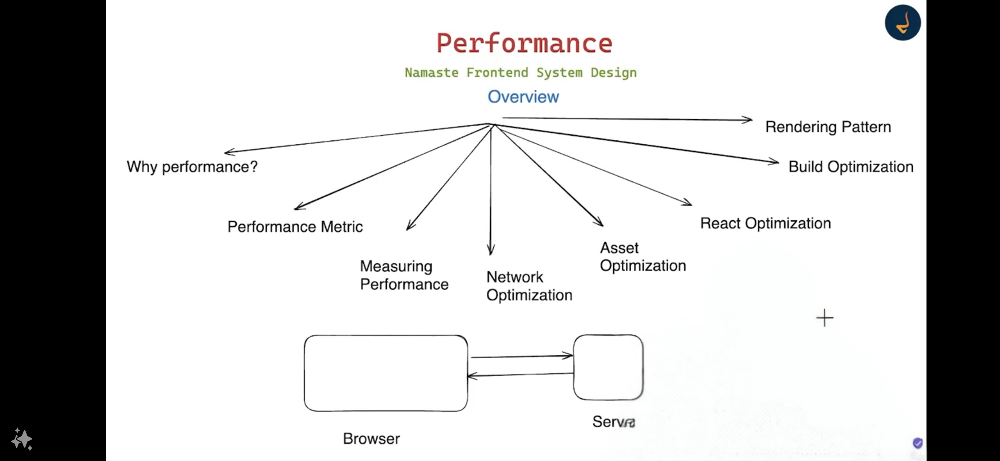


Get lot of insights for performance from Cloudflare Radar: https://radar.cloudflare.com/quality


<details >
 <summary style="font-size: x-large; font-weight: bold">Performance Monitoring(Web Vitals)</summary>

https://web.dev/articles/vitals


`Interaction to Next Paint (INP)` was initially developed as an experimental metric to address the runtime performance issues present on the web more comprehensively than `First Input Delay (FID)`.

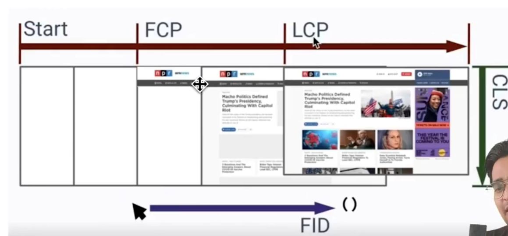
<details >
 <summary style="font-size: large; font-weight: bold">LCP(Largest Contentful Paint)</summary>

LCP reports the render time of the largest image or text block visible in the viewport, relative to when the user first navigated to the page.


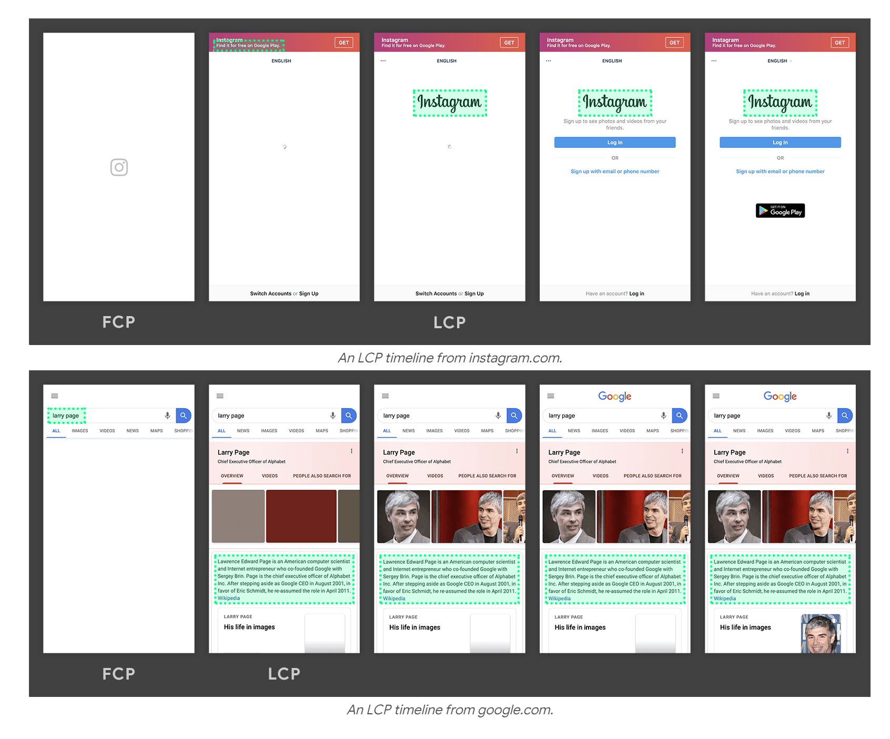

In the first example, the Instagram logo is loaded relatively early and it remains the largest element even as other content is progressively shown. In the Google Search results page example, the largest element is a paragraph of text that is displayed before any of the images or logo finish loading. Since all the individual images are smaller than this paragraph, it remains the largest element throughout the load process.
</details>


<details >
 <summary style="font-size: large; font-weight: bold">CLS(Cumulative Layout Shift)</summary>

CLS is a measure of the largest burst of layout shift scores for every unexpected layout shift that occurs during the entire lifecycle of a page.


</details>


<details >
 <summary style="font-size: large; font-weight: bold">INP(Interaction to Next Paint)</summary>

INP is a metric that assesses a page's overall responsiveness to user interactions by observing the latency of all click, tap, and keyboard interactions that occur throughout the lifespan of a user's visit to a page. The final INP value is the longest interaction observed, ignoring outliers.

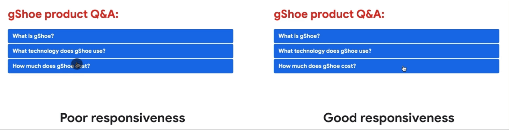

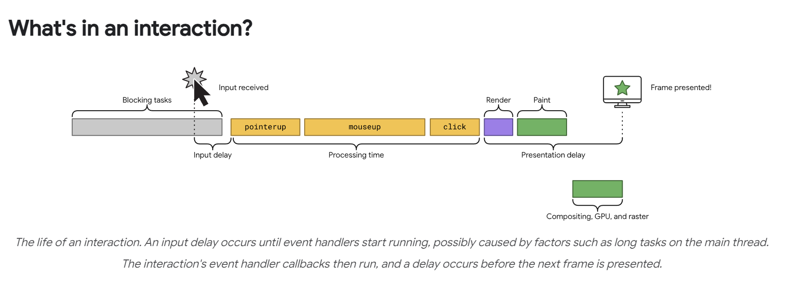

INP is the successor metric to First Input Delay (FID). While both are responsiveness metrics, FID only measured the input delay of the first interaction on a page. INP improves on FID by observing all interactions on a page, beginning from the input delay, to the time it takes to run event handlers, and finally up until the browser has painted the next frame.
</details>

Do this in browser using LightHouse
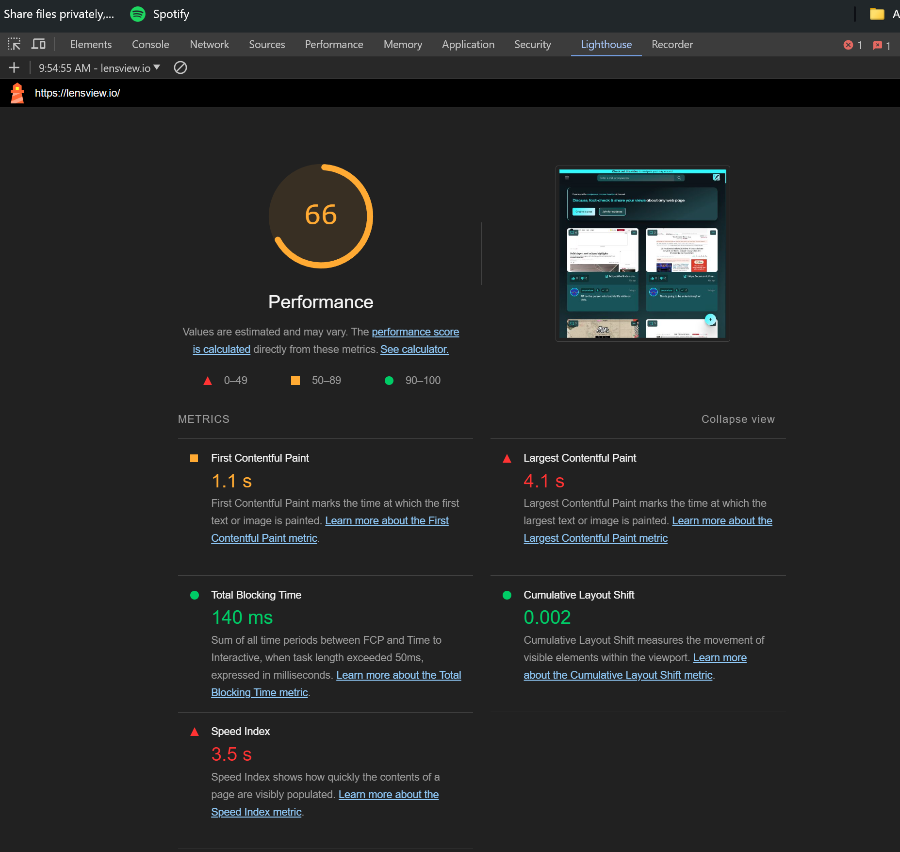

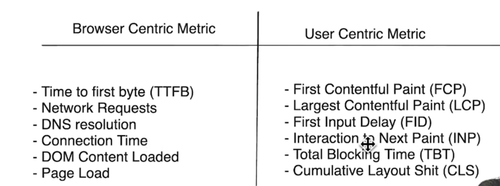
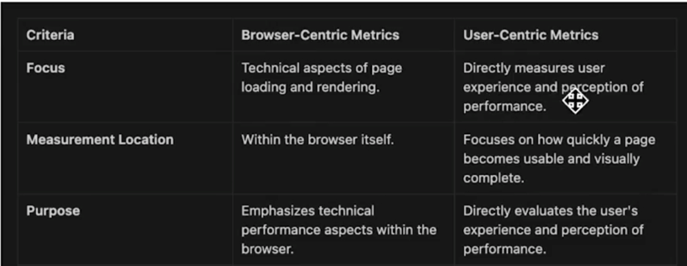
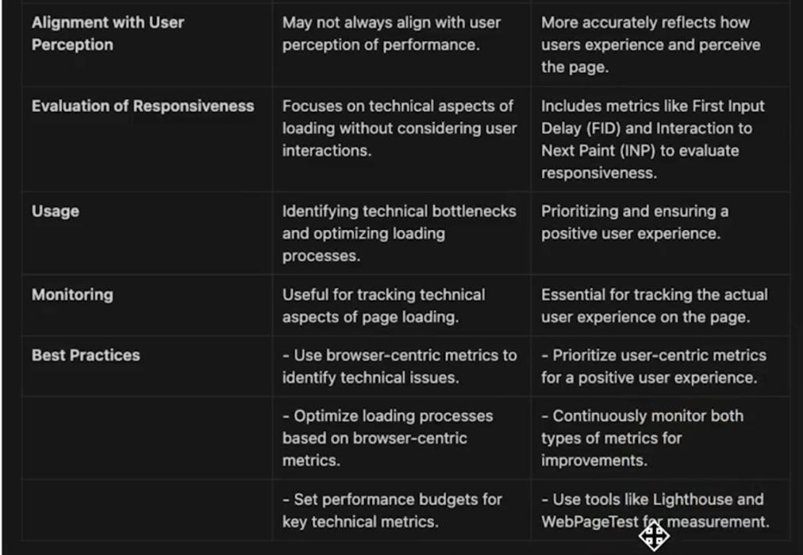
</details>


<details >
 <summary style="font-size: x-large; font-weight: bold">Performance Tools</summary>

### Real User Data Monitoring
1. [CRUX](https://developer.chrome.com/docs/crux)
2. [pagespeed.web.dev](https://pagespeed.web.dev/analysis/https-lensview-io/wn663h5be9?form_factor=mobile) (Free)
3. [requestmetrics.com](https://requestmetrics.com/)(Free)
4. [clarity.microsoft.com/](https://clarity.microsoft.com/)(Free)
4. NewRelic
5. Sentry
6. Google Analytics


### Simulated Data
1. [webpagetest.org](https://www.webpagetest.org/result/240712_BiDcDP_2W9/)
   1. 


### Developer Mode 
1. LightHouse
   - Always used in Incognito mode, an installed extension might affect the result
   - Dock the dev tool section, as putting it in bottom or right side will affect screen size
   - Choose the right device (Mobile or Desktop) then start test
2. Network Tab
3. Performance Tab


</details>


<details >
 <summary style="font-size: x-large; font-weight: bold">Network Optimization</summary>

1. Critical Rendering Path
2. Minimize the number of HTTP requests
3. Async loading of JS: async / defer
4. Avoid Redirection
5. Resource Hinting
6. Early Hints
7. HTTP upgrade methods (http1.1 vs http2 vs http3)
8. Compression: brotli / gzip 
9. HTTP caching: Cache Control 
10. Caching using Service Worker

<details >
 <summary style="font-size: large; font-weight: bold">Critical Rendering Path</summary>

Go through the details how CRP works in [Networking section(How the web work -> CRP)](../networking/readme.md#disadvantage)
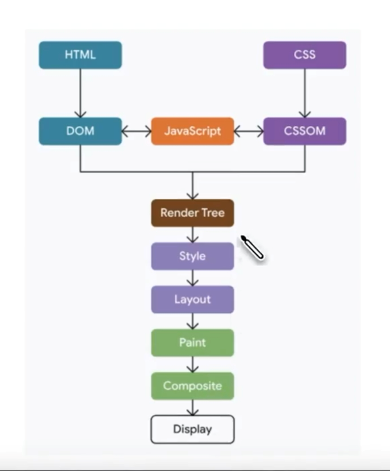

## _First packet is of 14KB_

- Above point is important as we can make our app such that all required bear minimum 
HTML, CSS & JS are bundle together whose size is below 14KB. This will allow our app
to show something to user very quickly then we can start putting other required files
in parallel.
- This might be straight forward in Vanilla JS project but framework also we have tools and plugin to achieve this
</details>


<details >
 <summary style="font-size: large; font-weight: bold">Minimize the number of HTTP requests</summary>

Challenges
- Connection Time(TCP, SSL): Each request we make has to go through the multiple connection like TCP, SSL etc which can take time and slow down our app
- Browser Limit per domain(6-10 max parallel calls can be made)

Solution
- Inline CSS
- Inline JS
- Base64 for image
- SVG for image

Here by applying above solution we trying to reduce network which can be costlier in terms of application performance

Example:

**Scenario-1:** 
- When we are loading our style is being loaded from file
- All the images are used as .png file

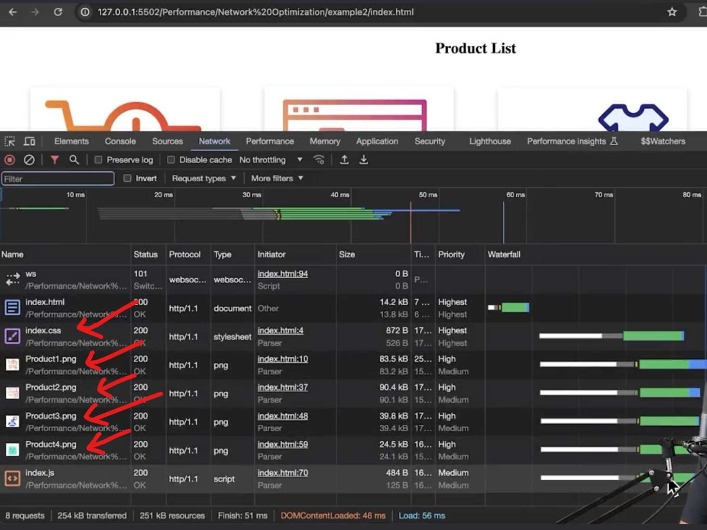
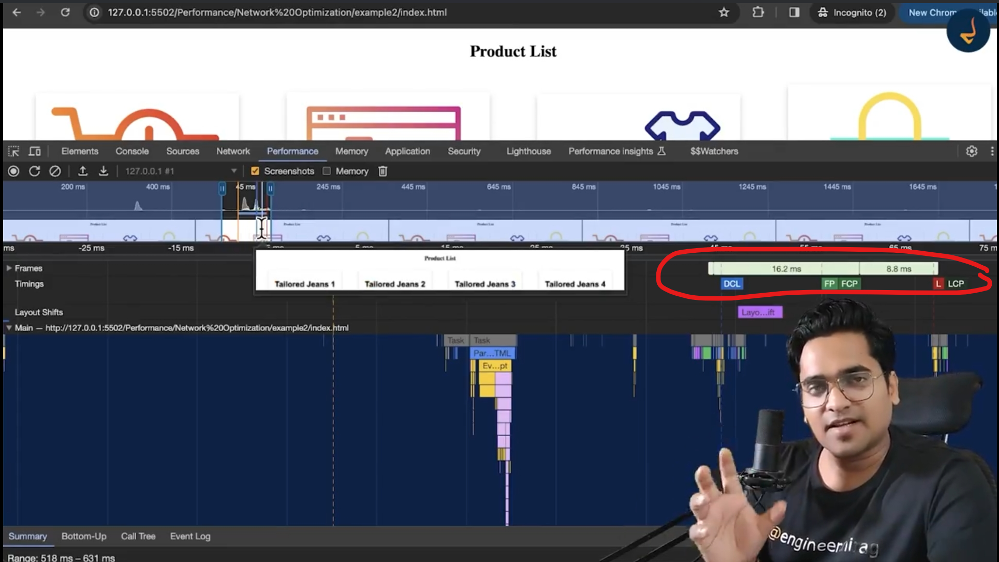

Here you can see how there are more network calls and because of this there quite gap between FCP & LCP


**Scenario-2:**
- When we insert the required CSS in head tag directly in `index.html`
- Replace all the images with SVG

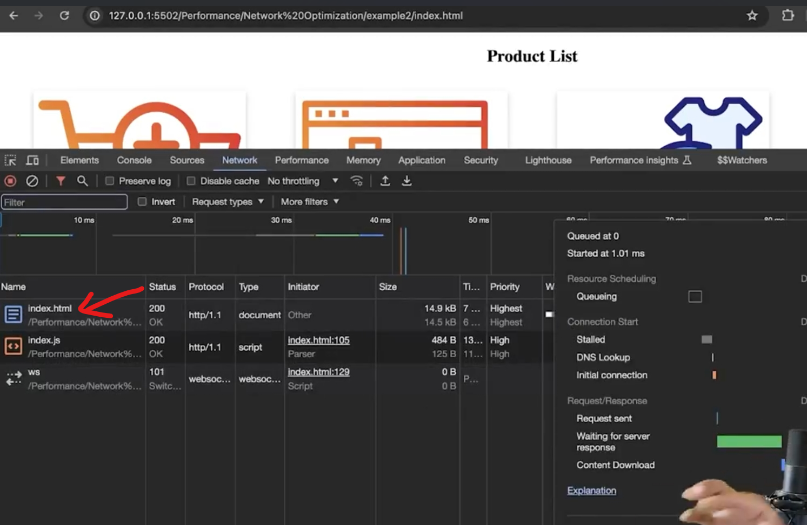


Here we have only one network call and it is very fast. There is very little gap between FCP & LCP

We only need to add the required CSS, which is needed when the user first navigated to the page, and we have very fast LCP
</details>


<details >
 <summary style="font-size: large; font-weight: bold">Async loading of JS</summary>

For more details refer [HTML section](../1-html/readme.md)
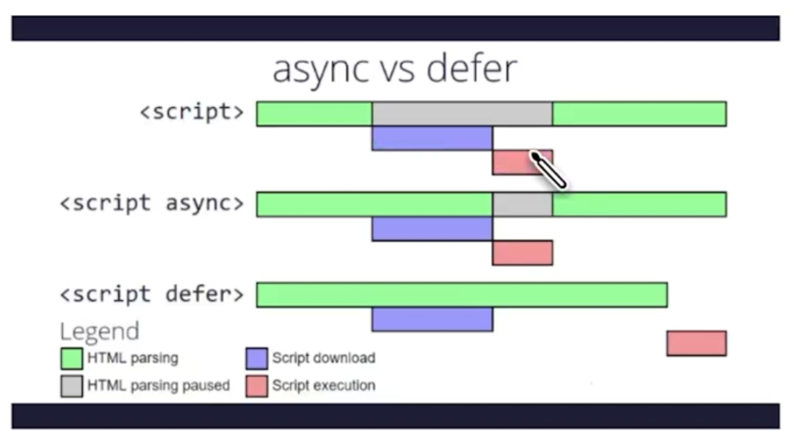


```html
<!-- index.html -->
<head>
    <script src="index.js"></script>
</head>
<body>
...
</body>
```

```js
//index.js
function addListner() {
  document.querySelectorAll(".card").forEach((card) =>
    card.addEventListener("click", function () {
      alert("Hi");
    })
  );
}

// We will not get error even though JS file has ran before HTML loads
// because below line will add lister once window is loaded
window.onload = addListner;
```

**Scenario-1:**
Script tag with no special attributes

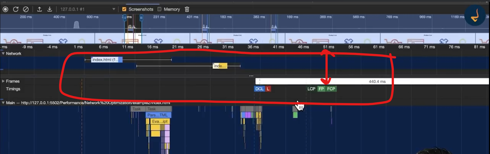


**Scenario-2:**
Script tag with `async` attribute

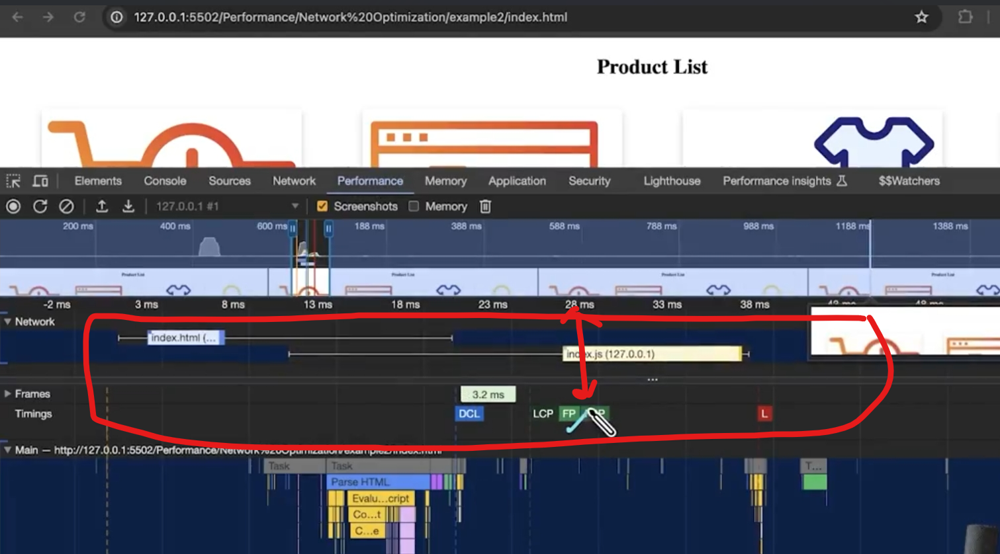


**Scenario-3:**
Script tag with `defer` attribute


</details>


<details >
 <summary style="font-size: large; font-weight: bold">Avoid Redirection</summary>

- Avoid redirection from http to https
- Use website https://hstspreload.org/ to register your domain. So that whenever we call our domain with http then this website takes care of redirection and our server never gets the https request

</details>


<details >
 <summary style="font-size: large; font-weight: bold">Resource Hinting</summary>

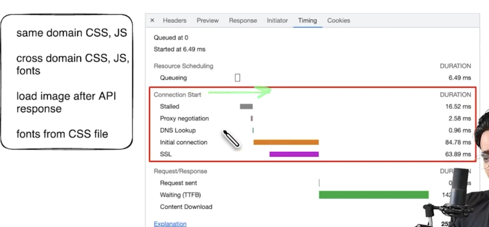
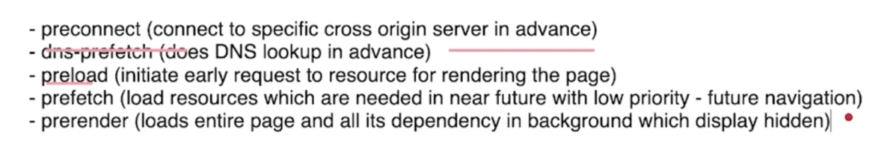
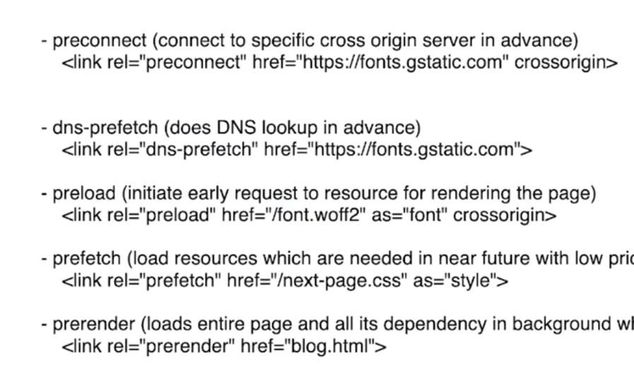


<details >
 <summary style="font-size: medium; font-weight: bold">Preconnect</summary>

The `preconnect` hint is used to establish a connection to another origin from where you are fetching critical resources. For example, you may be hosting your images or assets on a CDN or other cross-origin:

```html
<head>
   <link rel="preconnect" href="https://cdn.glitch.global" /<
</head>
```

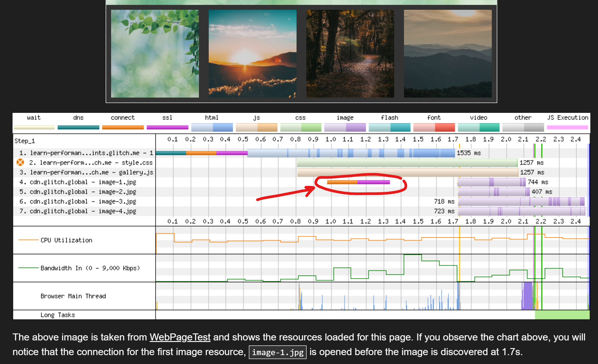
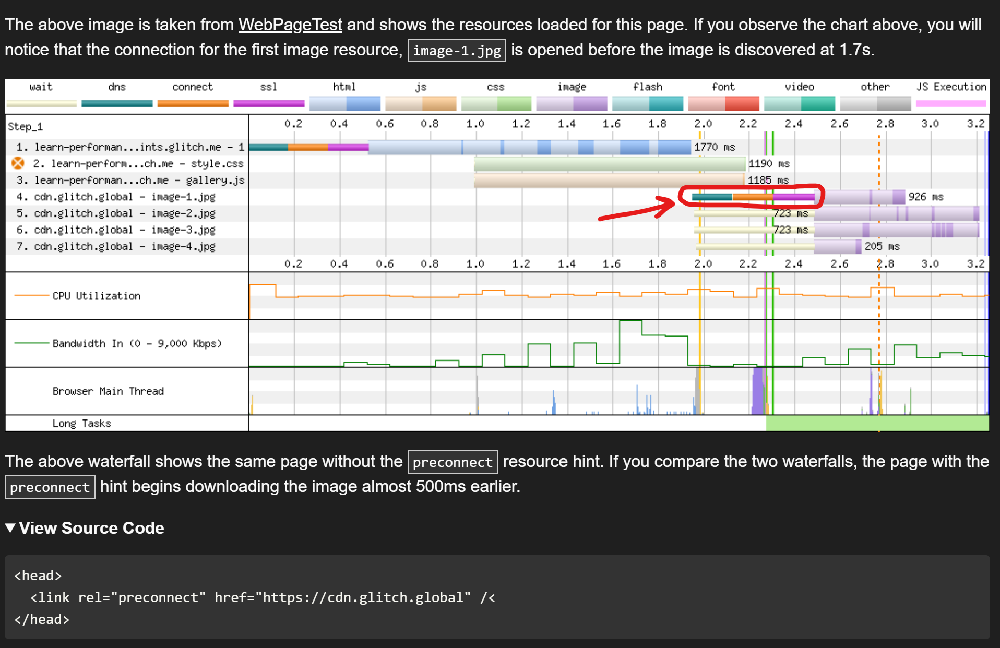
https://learn-performance-resource-hints.glitch.me/1

A common use case for preconnect is Google Fonts.

```html
<link rel="preconnect" href="https://fonts.googleapis.com">
<link rel="preconnect" href="https://fonts.gstatic.com" crossorigin>
```
The crossorigin attribute is used to indicate whether a resource must be fetched using Cross-Origin Resource Sharing (CORS). When using the preconnect hint, if the resource being downloaded from the origin uses CORS—such as font files—then you need to add the crossorigin attribute to the preconnect hint.

**Note:** If you omit the `crossorigin` attribute, the browser opens a new connection when it downloads the font files, and doesn't reuse the connection opened with the `preconnect` hints.

https://web.dev/learn/performance/resource-hints?continue=https%3A%2F%2Fweb.dev%2Flearn%2Fperformance%23article-https%3A%2F%2Fweb.dev%2Flearn%2Fperformance%2Fresource-hints#preconnect
</details>


<details >
 <summary style="font-size: medium; font-weight: bold">dns-prefetch</summary>

While opening connections to cross-origin servers early can significantly improve initial page load time, it may not be either reasonable or possible to establish connections to many cross-origin servers at once. If you're concerned that you may be overusing preconnect, a much less costly resource hint is the dns-prefetch hint.

Per its name, dns-prefetch doesn't establish a connection to a cross-origin server, but rather just performs the DNS lookup for it ahead of time. A DNS lookup occurs when a domain name is resolved to its underlying IP address. While layers of DNS caches at the device and network levels help to make this a generally fast process, it still takes some amount of time.

```html
<link rel="dns-prefetch" href="https://fonts.googleapis.com">
<link rel="dns-prefetch" href="https://fonts.gstatic.com">
```
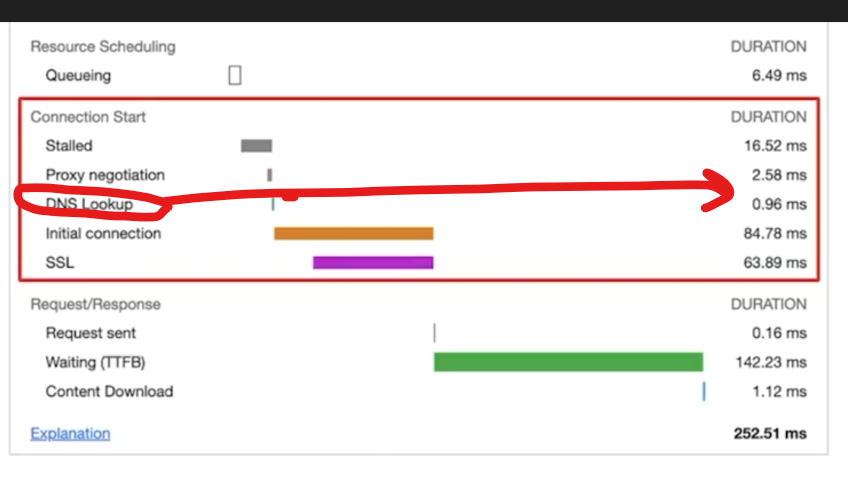
DNS lookups are fairly inexpensive, and because of their relatively small cost, they may be a more appropriate tool in some cases than a preconnect. In particular, it may be a desirable resource hint to use in cases of links that navigate to other websites that you think the user is likely to follow. dnstradamus is one such tool that does this automatically using JavaScript, and uses the Intersection Observer API to inject dns-prefetch hints into the current page's HTML when links to other websites are scrolled into the user's viewport.

https://web.dev/learn/performance/resource-hints?continue=https%3A%2F%2Fweb.dev%2Flearn%2Fperformance%23article-https%3A%2F%2Fweb.dev%2Flearn%2Fperformance%2Fresource-hints#dns-prefetch
</details>


<details >
 <summary style="font-size: medium; font-weight: bold">Preload</summary>

The `preload` resource hint instructs the browser to initiate a request for a resource. This is helpful when a critical resource is not immediately discoverable, for example a `background-image` URL.

This demo uses uses CSS `background-image` to create the image grid below, as opposed to `img` elements. To download the first image quicker, the page includes a `preload` hint for the first image resource.


```html
<link rel="preload"
      href="https://cdn.glitch.global/db01a8e4-9230-4c5c-977d-85d0e0c3e74c/image-1.jpg?v=1669198400523"
      as="image" />
```

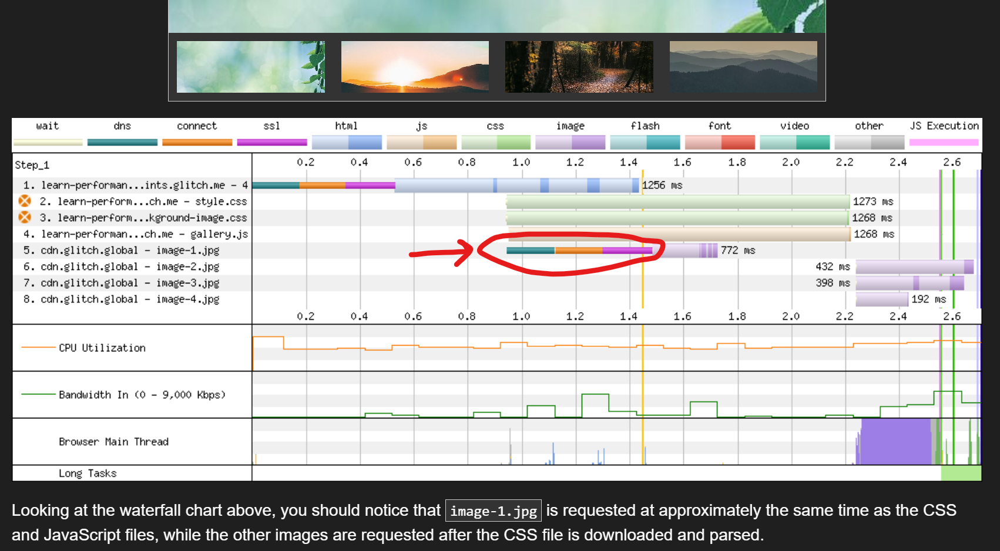
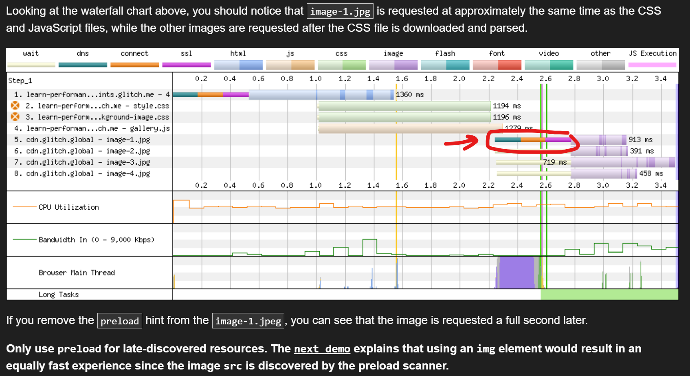
https://learn-performance-resource-hints.glitch.me/3

### Usecase👇🏻


`preload` directives should be limited to late-discovered critical resources. The most common use cases are font files, CSS files fetched through `@import` declarations, or CSS `background-image` resources that are likely to be `Largest Contentful Paint (LCP)` candidates. In such cases, these files wouldn't be discovered by the `preload scanner` as the resource is referenced in external resources.


https://web.dev/learn/performance/resource-hints?continue=https%3A%2F%2Fweb.dev%2Flearn%2Fperformance%23article-https%3A%2F%2Fweb.dev%2Flearn%2Fperformance%2Fresource-hints#preload
</details>


<details >
 <summary style="font-size: medium; font-weight: bold">Prefetch</summary>

The prefetch directive is used to initiate a low priority request for a resource likely to be used for future navigations:

```html
<link rel="prefetch" href="/next-page.css" as="style">
```
This directive largely follows the same format as the `preload` directive, only the `<link>` element's rel attribute uses a value of `prefetch` instead. Unlike the `preload` directive, however, `prefetch` is largely speculative in that you're initiating a fetch for a resource for a future navigation that may or may not happen.

There are times when `prefetch` can be beneficial—for example, if you've identified a user flow on your website that most users follow to completion, a `prefetch` for a render-critical resource for those future pages can help to reduce load times for them.

Note: Given the speculative nature of prefetch, its use comes with the potential downside that data used to fetch the resource may go unused if the user does not navigate to the page that ends up needing the prefetched resource. Rely on your analytics or other data sources for your website's usage patterns to decide for yourself if using prefetch is a good idea. Alternatively, you can use the Save-Data hint to opt out of prefetches for users who have specified a preference for reduced data usage

https://web.dev/learn/performance/resource-hints?continue=https%3A%2F%2Fweb.dev%2Flearn%2Fperformance%23article-https%3A%2F%2Fweb.dev%2Flearn%2Fperformance%2Fresource-hints#prefetch
</details>


<details >
 <summary style="font-size: medium; font-weight: bold">Fetchpriority</summary>

You can use the `Fetch Priority API` through its fetchpriority attribute to increase the priority of a resource. You can use the attribute with `<link>`, ``, and `<script>` elements.

This demo assigns a fetchpriority="high" to the first, larger image, while a fetchpriority="low" to the remaining images.

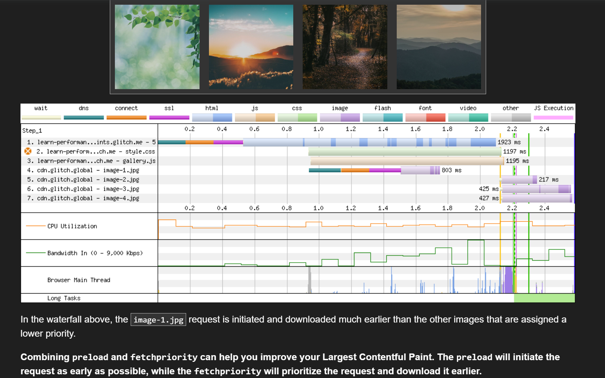
https://learn-performance-resource-hints.glitch.me/5

By default, images are fetched with a lower priority. After layout, if the image is found to be within the initial viewport, the priority is increased to **High** priority. In the preceding HTML snippet, fetchpriority immediately tells the browser to download the larger LCP image with a **High** priority, while the less important thumbnail images are downloaded with a lower priority.

Modern browsers load resources in two phases. The first phase is reserved for critical resources and ends once all blocking scripts have been downloaded and executed. During this phase, **Low** priority resources may be delayed from downloading. By using `fetchpriority="high"` you can increase the priority of a resource, enabling the browser to download it during the first phase.

https://web.dev/learn/performance/resource-hints?continue=https%3A%2F%2Fweb.dev%2Flearn%2Fperformance%23article-https%3A%2F%2Fweb.dev%2Flearn%2Fperformance%2Fresource-hints#fetch_priority_api
</details>

</details>

<details >
 <summary style="font-size: large; font-weight: bold">Early Hints</summary>

Websites have become more sophisticated over time. As such, it's not unusual that a server needs to perform non-trivial work (for example, access to databases, or CDNs accessing the origin server) to produce the HTML for the requested page. Unfortunately, this "server think-time" results in extra latency before the browser can start rendering the page. Indeed, the connection effectively goes idle for as long as it takes the server to prepare the response

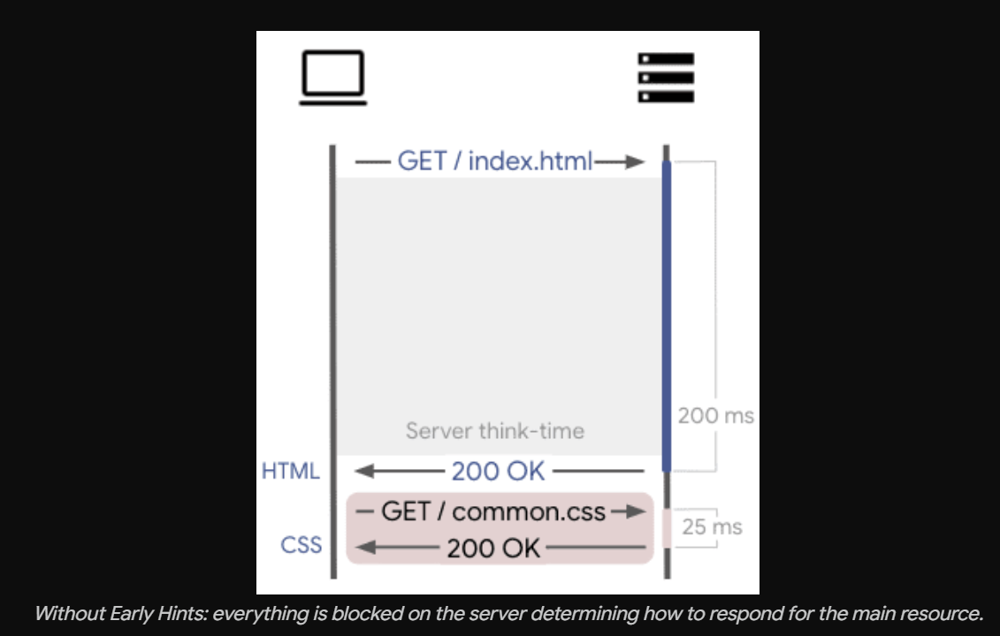

Early Hints is an HTTP status code (`103 Early Hints`) used to send a preliminary HTTP response ahead of a final response. This allows a server to send hints to the browser about critical subresources (for example, style sheets for the page, critical JavaScript) or origins that will be likely used by the page, while the server is busy generating the main resource. The browser can use those hints to warm up connections, and request subresources, while waiting for the main resource. In other words, Early Hints helps the browser take advantage of such "server think-time" by doing some work in advance, thereby speeding up page loads.

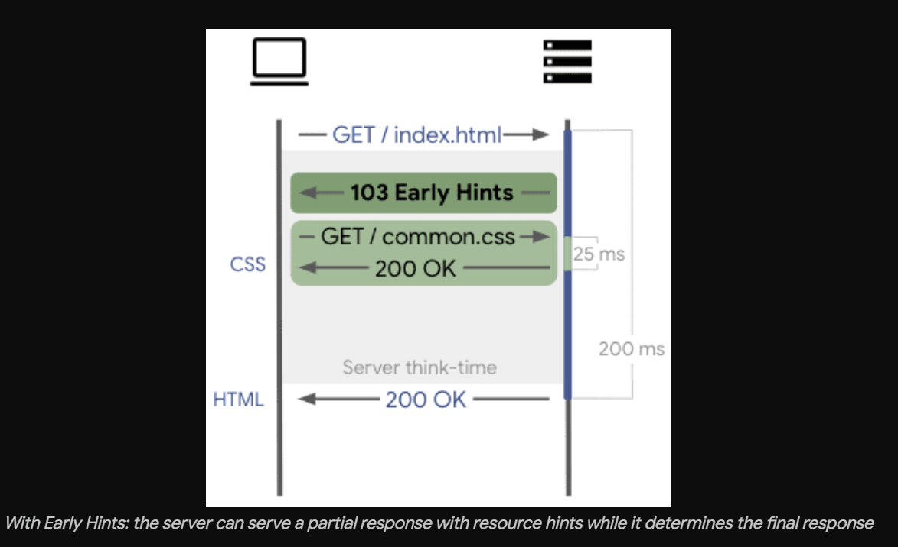

In some cases, the performance improvement to the Largest Contentful Paint can go from several hundred milliseconds, as observed by Shopify and by Cloudflare, and up to a second faster, as seen in this before and after comparison:

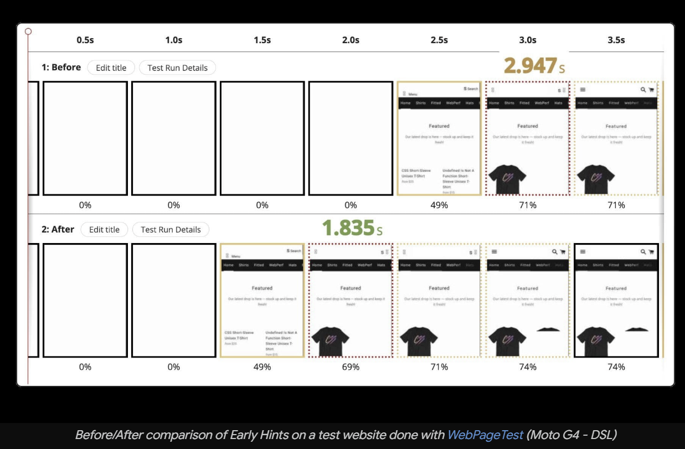

https://developer.chrome.com/docs/web-platform/early-hints#:~:text=The%20browser%20can%20use%20those,thereby%20speeding%20up%20page%20loads.
</details>

</details>


