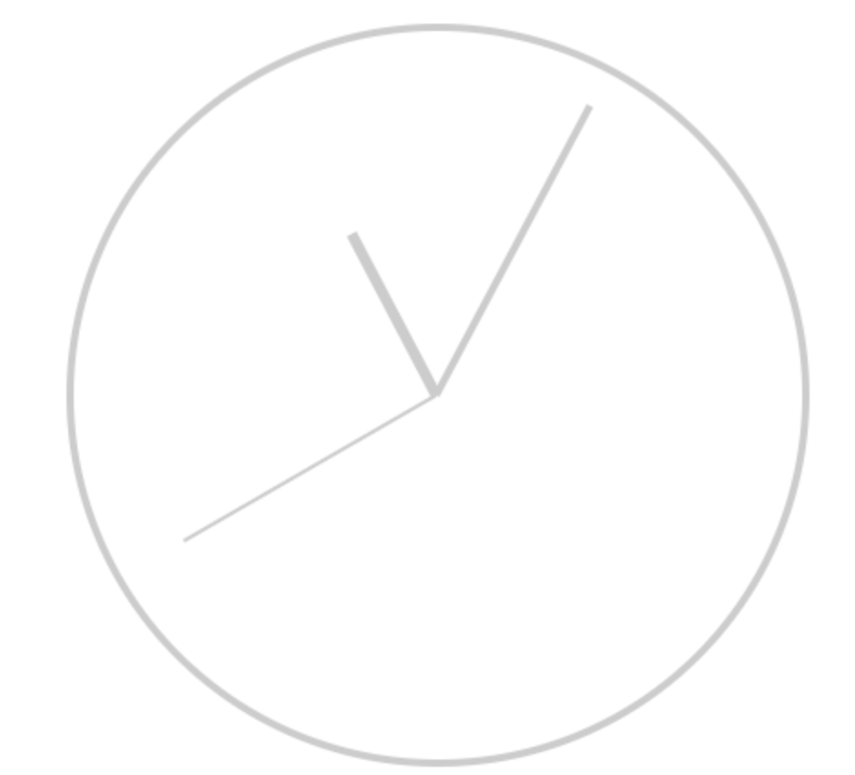

## Analog Clock

Create a widget that renders the current time within an analog clock display, where the clock hands move and update like a real clock.

Here's an example of an analog clock, but you can exercise your creativity by choosing different colors and styling it differently. It should however still function as a clock.

