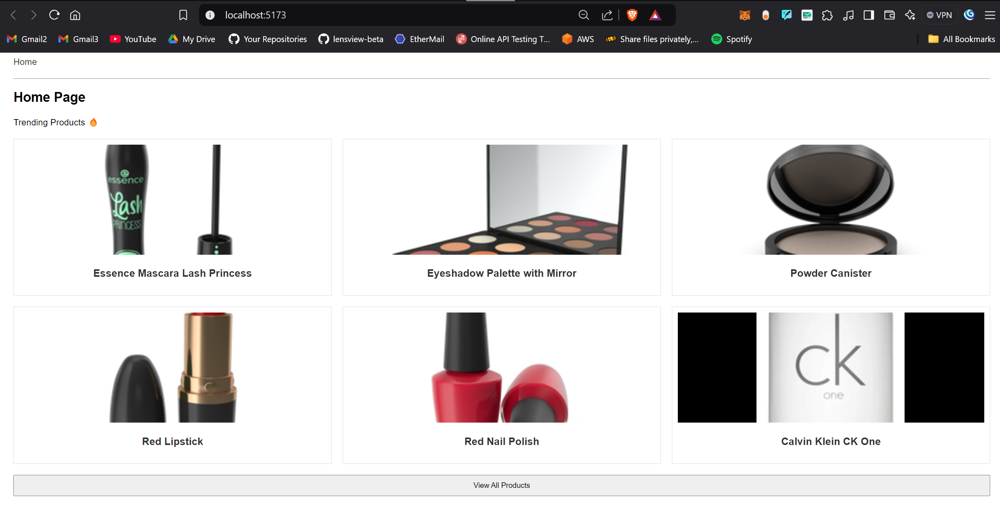
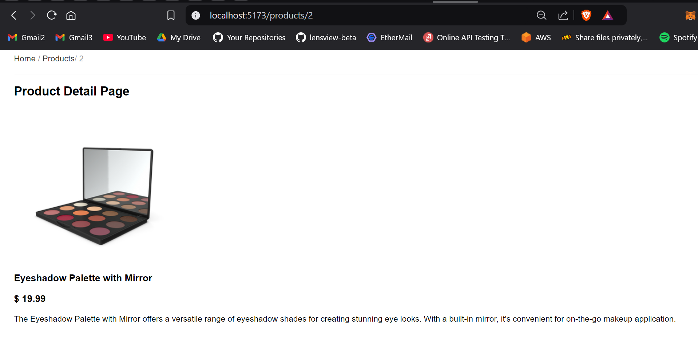
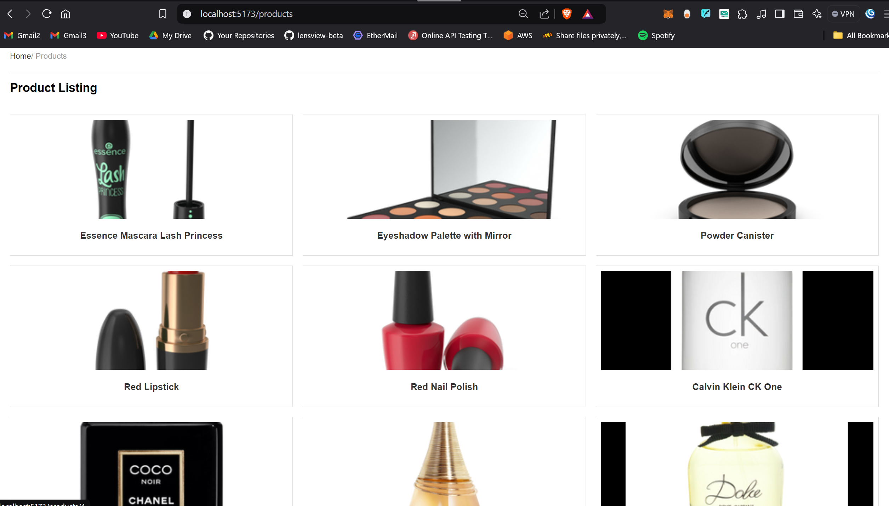

## Breadcrumbs



### Router
```jsx
import {BrowserRouter as Router, Routes, Route} from "react-router-dom";
import "./App.css";
import ProductDetail from "./pages/ProductDetail.jsx";
import ProductListing from "./pages/ProductListing.jsx";
import Breadcrumbs from "./components/Breadcrumbs.jsx";
import Home from "./pages/Home.jsx";

const App = () => {
    return (
        <Router>
            <div className="app">
                <Breadcrumbs />
                <hr />
                <Routes>
                    <Route path="/" element={<Home />} />
                    <Route path="/products" element={<ProductListing />} />
                    <Route path="/products/:id" element={<ProductDetail />} />
                </Routes>
            </div>
        </Router>
    );
};

export default App;
```

### Breadcrumb
```jsx
import {Link, useLocation} from "react-router-dom";

const Breadcrumbs = () => {
    const location = useLocation();
    const pathnames = location.pathname.split("/").filter((x) => x);
    let breadcrumbPath = "";

    // if (pathnames.length === 0) {
    //   // If the current route is the home route ('/'), do not render the breadcrumbs
    //   return null;
    // }

    return (
        <div className="breadcrumbs">
            <Link to="/">Home</Link>
            {pathnames.map((name, index) => {
                breadcrumbPath += `/${name}`;
                const isLast = index === pathnames.length - 1;
                console.log(pathnames, breadcrumbPath);

                return isLast ? (
                    <span key={breadcrumbPath}> / {name}</span>
                ) : (
                    <span key={breadcrumbPath}>
            {" "}
                        / <Link to={breadcrumbPath}>{name}</Link>
          </span>
                );
            })}
        </div>
    );
};

export default Breadcrumbs;

```

Referred Video: https://youtu.be/yeNgh2gw104?si=0X0HxoZDL35JgWs-

Github Repo: https://github.com/piyush-eon/frontend-interview-questions/tree/master/reactjs-interview-questions/breadcrumbs
