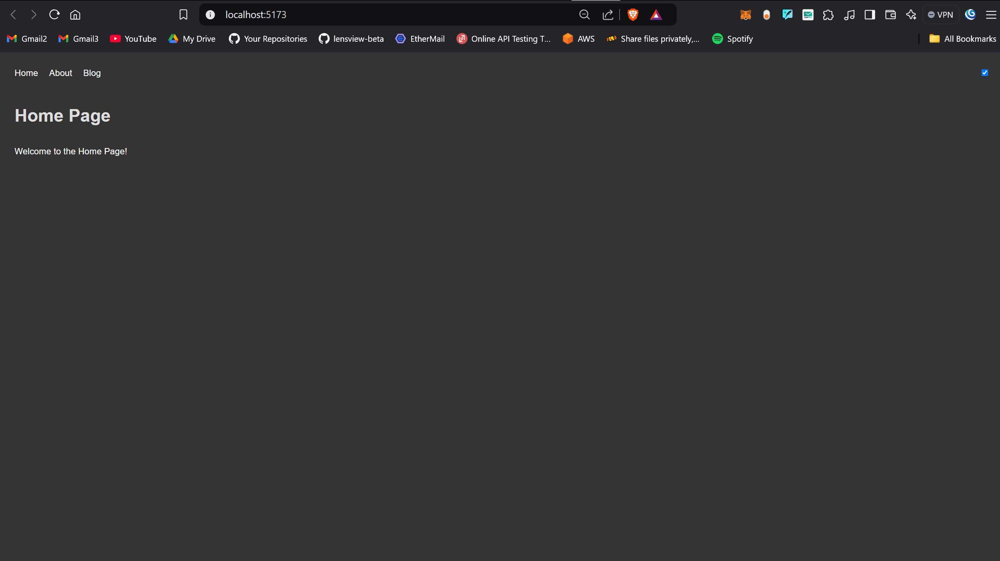
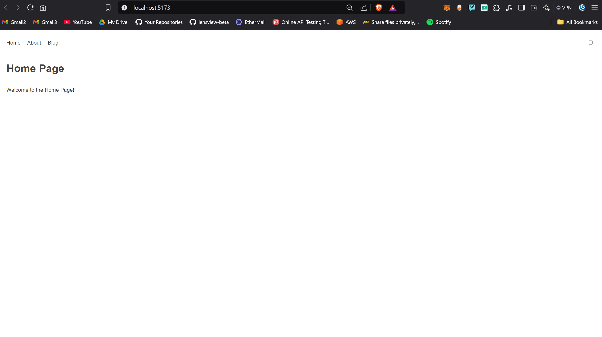

## Dark Mode




Using context API

```jsx
import React, {createContext, useState, useContext, useEffect} from "react";

const ThemeContext = createContext();

export const useTheme = () => {
    return useContext(ThemeContext);
};

export const ThemeProvider = ({children}) => {
    const [isDarkMode, setIsDarkMode] = useState(false);

    const toggleTheme = () => {
        setIsDarkMode((prevMode) => !prevMode);
    };

    const theme = isDarkMode ? "dark" : "light";

    useEffect(() => {
        document.documentElement.setAttribute("data-theme", theme);
    }, [isDarkMode]);

    return (
        <ThemeContext.Provider value={{theme, toggleTheme}}>
            {children}
        </ThemeContext.Provider>
    );
};

```

```css
/**index.css**/
body {
    font-family: Arial, sans-serif;
    margin: 0;
    padding: 0 30px;
}

[data-theme="light"] {
    --bg-color: #ffffff;
    --text-color: #333333;
    --heading-color: #444444;
}

/* Dark mode styles */
[data-theme="dark"] {
    --bg-color: #333333;
    --text-color: #ffffff;
    --heading-color: #dddddd;
}

body {
    background-color: var(--bg-color);
    color: var(--text-color);
}

h1 {
    color: var(--heading-color);
}
```

Referred Video: https://youtu.be/5XtvVH-v6kM?si=LSzn75SbamTLVb50

Github Repo: https://github.com/piyush-eon/frontend-interview-questions/tree/master/reactjs-interview-questions/dark-light-mode
