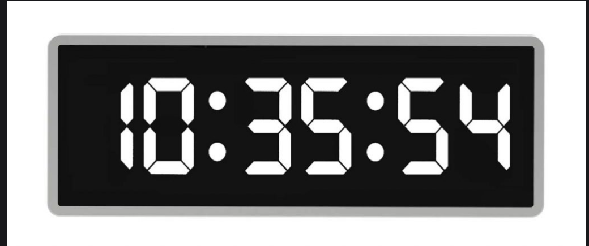

## Digital Clock

Create a widget that renders the current time in HH:MM:SS format using a 7-segment digital display. You are free to choose to use 12-hour or a 24-hour display.

Here's an example of a digital clock. Each digit needs to be rendered by individual segments, but you can exercise your creativity by choosing different colors and styling it differently. It should however still function as a clock, allowing the user to read the time.

### Solution

Important Points

- Here we need to use 1000ms in timeout because anything less
will not set timeout function again as `sixthDigit` change only after 1s, hence
UI won't update after 1s

Other solution: https://www.greatfrontend.com/questions/user-interface/digital-clock/solution
