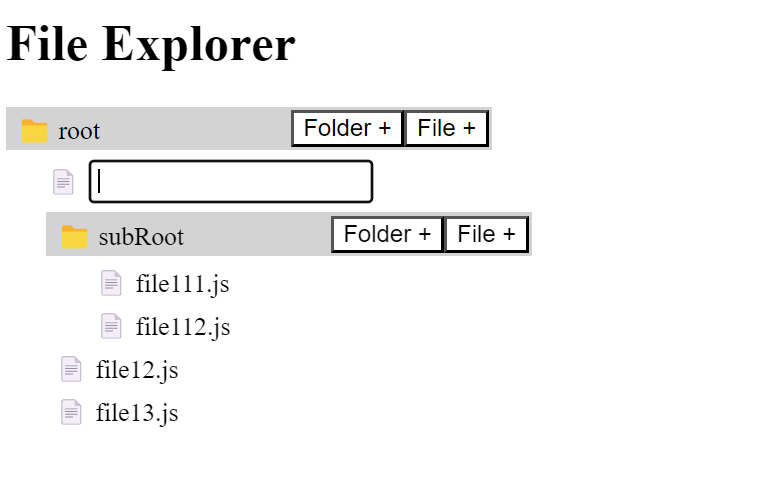

## File Explorer

1. Basic File Explorer

```json
// data/explorer.js

{
  id: 1,
  name: "root",
  isFolder: true,
  items: [
    {
      id: 11,
      name: "subRoot",
      isFolder: true,
      items: [
        {
          id: 111,
          name: "file111.js",
          isFolder: false
        },
        {
          id: 112,
          name: "file112.js",
          isFolder: false
        }
      ]
    },
    {
      id: 12,
      name: "file12.js",
      isFolder: false
    },
    {
      id: 13,
      name: "file13.js",
      isFolder: false
    }
  ]
}
```

```jsx
// components/Folder.jsx

function Folder({ explorer }) {
    const [expand, setExpand] = useState(false);

    useEffect(() => {
        console.log("explorer", explorer);
    }, []);

    if (explorer.isFolder) {
        return (
            <div style={{ marginTop: 5 }}>
                <div onClick={() => setExpand(!expand)} className="folder">
                    <span>📁 {explorer.name}</span>
                </div>

                <div style={{ display: expand ? "block" : "none", paddingLeft: 25 }}>

                    {explorer.items.map((exp) => {
                        return (
                            <Folder
                                explorer={exp}
                            />
                        );
                    })}
                </div>
            </div>
        );
    } else {
        return <span className="file">📄 {explorer.name}</span>;
    }
}
```

2. File Explorer with `create folder & file` button


```jsx
// components/Folder.jsx
function Folder({ handleInsertNode = () => {}, explorer }) {
    const [expand, setExpand] = useState(false);
    const [showInput, setShowInput] = useState({
        visible: false,
        isFolder: false
    });

    const handleNewFolder = (e, isFolder) => {
        e.stopPropagation();
        setExpand(true);
        setShowInput({
            visible: true,
            isFolder
        });
    };

    const onAddFolder = (e) => {
        if (e.keyCode === 13 && e.target.value) {
            handleInsertNode(explorer.id, e.target.value, showInput.isFolder);

            setShowInput({ ...showInput, visible: false });
        }
    };

    useEffect(() => {
        console.log("explorer", explorer);
    }, []);

    if (explorer.isFolder) {
        return (
            <div style={{ marginTop: 5 }}>
                <div onClick={() => setExpand(!expand)} className="folder">
                    <span>📁 {explorer.name}</span>
                    <div>
                        <button onClick={(e) => handleNewFolder(e, true)}>Folder +</button>
                        <button onClick={(e) => handleNewFolder(e, false)}>File +</button>
                    </div>
                </div>

                <div style={{display: expand ? "block" : "none", paddingLeft: 25}}>
                    {showInput.visible && (
                        <div className="inputContainer">
                            <span>{showInput.isFolder? "📁" : "📄"}</span>
                            <input
                                type="text"
                                className="inputContainer__input"
                                autoFocus
                                onKeyDown={onAddFolder}
                                onBlur={() => setShowInput({ ...showInput, visible: false })}
                            />
                        </div>
                    )}

                    {explorer.items.map((exp) => {
                        return (
                            <Folder
                                handleInsertNode={handleInsertNode}
                                explorer={exp}
                            />
                        );
                    })}
                </div>
            </div>
        );
    } else {
        return <span className="file">📄 {explorer.name}</span>;
    }
}

export default Folder;

```


```jsx
// hooks/use-traverse-tree.jsx

const useTraverseTree = () => {
    // Add a file or folder in tree
    // Can be optimised using Dynamic Programming
    const insertNode = function (tree, folderId, item, isFolder) {
        if (tree.id === folderId && tree.isFolder) {
            tree.items.unshift({
                id:new Date().getTime(),
                name: item,
                isFolder: isFolder,
                items: []
            });

            return tree;
        }

        let latestNode = [];
        latestNode = tree.items.map((ob) => {
            return insertNode(ob, folderId, item, isFolder);
        });

        return { ...tree, items: latestNode };
    };

    const deleteNode = () => {}; // Do it Yourself

    const renameNode = () => {}; // Do it Yourself

    return { insertNode, deleteNode, renameNode };
};

export default useTraverseTree;

```

Referred Video : https://youtu.be/20F_KzHPpvI?si=Ax0q8VgkN6XKzAPm

Github Repo : https://github.com/piyush-eon/frontend-interview-questions/tree/master/reactjs-interview-questions/file-explorer
