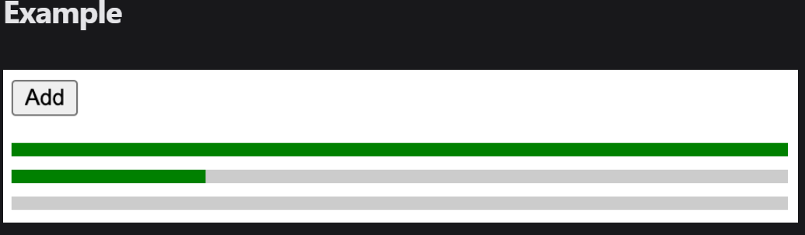
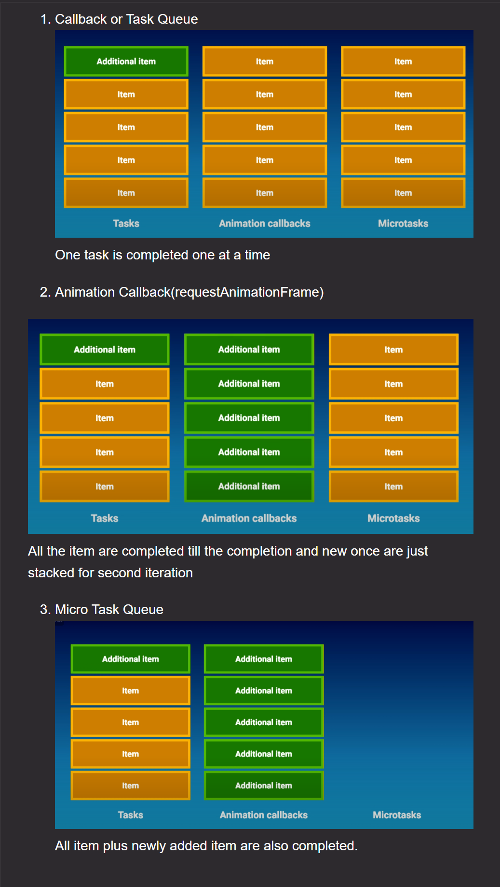

<details >
 <summary style="font-size: x-large; font-weight: bold">Animation Progress Bar 2</summary>

Build an app where clicking the "Add" button adds progress bars to the page. The progress bars fill up in series, aka the second bar only starts filling up after the first bar is completely filled.

### Requirements
1. Clicking on the "Add" button adds a progress bar to the page.
2. The progress bars fill up gradually in sequence, one at a time. i.e. the second progress bar will only starts filling up after the first progress bar is completely filled up.
3. Each bar takes approximately 2000ms to completely fill up.




### Solution

Important Points:
1. Everything is same as animation progress bar 1, only we need to introduce `currentPos` state variable
to keep track of the current position of the progress bar that is running
2. //app component
```jsx
   export default function App() {
    const [count, setCount] = useState(0);
    const [currentPos, setCurrentPos] = useState(0);

    return (
        <div>
            <button onClick={() => {setCount(count + 1)}}>Add</button>
            <div className="list">
                {
                    Array(count).fill(null).map((_, index) => (
                        <ProgressBar
                            key={index}
                            index={index}
                            currentPos={currentPos}
                            updateCurrentPos = {() => {
                                setCurrentPos(currentPos + 1);
                            }} />
                    ))

                }
            </div>
            <div>
                {currentPos}
            </div>
        </div>
    );
}

```
3. //progress bar component
```jsx
function ProgressBar({index, currentPos, updateCurrentPos}){
    // console.log("index : " + index);

    const [startTransition, setStartTransition] = useState(false);

    /**
     1. We need to use `currentPos` in `useEffect` since
     `currentPos` is updated in `updateCurrentPos` function
     which help us check if `index` is greater than `currentPos`
     whenever `currentPos` is updated
     **/
    useEffect(() => {
        /**Using `startTransition` here is imp since without it
         we will keep increasing `currentPos` infinitely
         **/
        if(index > currentPos || startTransition){
            return
        }
        setStartTransition(true);

        setTimeout(() => {
            updateCurrentPos();
            // console.log("currentPos : " + currentPos)
        }, 2000)

    }, [currentPos])


    return (
        <div className="bar">
            <div
                className="fill"
                style={{transform: startTransition ? "scaleX(1)" : "scaleX(0)"}}
            >
                {index}
            </div>
        </div>
    )
}
```

**Good question to refresh React Skill**

### Referred Resources
1. https://www.greatfrontend.com/questions/user-interface/progress-bars-ii
2. https://learnweb3.io/degrees/ethereum-developer-degree/sophomore/intro-to-react-and-next-js/
3. https://www.udemy.com/course/nextjs-react-the-complete-guide/learn/lecture/41161552#questions


---
</details>


<details >
 <summary style="font-size: x-large; font-weight: bold">Animation Progress Bar 3</summary>

In Progress Bars II, we built progress bars which fill up in sequence, one at a time. In this question, we'll build progress bars where multiple of them are filling up concurrently, up to a limit of 3. The fourth progress bar only starts filling up after the third one is full.

### Requirements
1. Clicking on the "Add" button adds a progress bar to the page.
2. The progress bars fill up gradually in parallel, up to a limit of 3 concurrent bars filling up. i.e. the fourth progress bar will only start filling up after the third progress bar is completely filled up.
3. Each bar takes approximately 2000ms to completely fill up.

### Solution

1. 
```jsx
useEffect(() => {
    /** Added +2 for concurrent filling of bars **/
    if(index > currentPos + 2 || startTransition){
        return
    }
    setStartTransition(true);

    setTimeout(() => {
        updateCurrentPos();
    }, 2000)

}, [currentPos])
```
**Above solution won't work, at the start we can see bars filling parallel, but after that it will 
fill one by one.**

2. To make it work, we need to make below changes
```jsx
useEffect(() => {
    /** Added +2 for concurrent filling of bars **/
    if(index > currentPos + 2 || startTransition){
        return
    }
    setStartTransition(true);

    setTimeout(() => {
        updateCurrentPos();
    }, 2000 / 3)

}, [currentPos])
```
This can be explained once looking at the below solution which is better

3.
```jsx
function ProgressBar({index, currentPos, updateCurrentPos}){

    const [startTransition, setStartTransition] = useState(false);

    useEffect(() => {
        if(index > currentPos + 2 || startTransition){
            return
        }
        setStartTransition(true);

    }, [currentPos])


    return (
        <div className="bar">
            <div
                className="fill"
                style={{transform: startTransition ? "scaleX(1)" : "scaleX(0)"}}
                onTransitionEnd={() => {
                    updateCurrentPos();
                }}
            >
                {index}
            </div>
        </div>
    )
}
```

Using `onTransitionEnd()` instead of `setTimeout()` will make it work with 
just updating `+2` value to `if` condition.

Reason: To understand this we need to go through `js-concept/eventLoop-tasksORcallBack-animationCB-microTask`
first.
1. `onTransitionEnd()` falls under `Animation Queue` that's why when it activates it complete till
all the queued tasks are executed.
2. `setTimeout()` falls under `Task Queue` that's why it is executed one by one in order, so
at start since condition are met so all 3 bars start filling up, but after that `currentPos` increase
one by one, unlike `onTransitionEnd()`where it is increased 3 times in one go.



Referred Question: https://www.greatfrontend.com/questions/user-interface/progress-bars-iii

---
</details>
