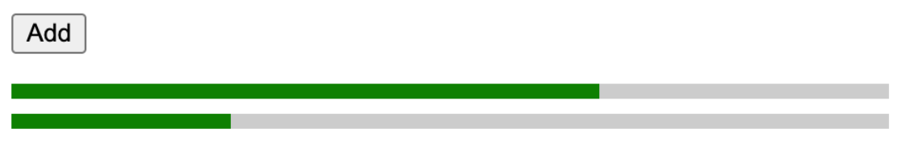

## Animation Progress Bar

Build an app where clicking the "Add" button adds progress bars to the page. The progress bars fill up gradually as soon as they are shown.

### Requirements

1. Clicking on the "Add" button adds a progress bar to the page.
2. Each progress bar start filling up smoothly as soon as they're added
3. Each bar takes approximately 2000ms to completely fill up.

### Example



### Solution

Important Points:

1. **Styling:** we'll use CSS transforms instead of changing the width as CSS transforms run on the GPU which results in better performance for animations.


2. **Animation**

* CSS transitions work very well for animating the bars from 0 to 100 and there's no need to resort to JavaScript.
* Use transform-origin: left so that the bar is "anchored" on the left and expands rightwards

```css
.fill {
  background-color: green;
  height: 100%;
  transform: scaleX(0);
  transform-origin: left;
  transition-duration: 2000ms;
  transition-property: transform;
  transition-timing-function: linear;
}

.filled {
  transform: scaleX(1);
}
```

3. State Management for Animation

```javascript
function ProgressBar() {
  const [startTransition, setStartTransition] = useState(false);

  useEffect(() => {
    if (!startTransition) {
      setStartTransition(true);
    }
  }, [startTransition]);

  return (
    <div className="progress">
      <div className={['fill', startTransition && 'filled'].filter(Boolean).join(" ")}></div>
    </div>
  );
}
```

Why we need to use `startTransition`?

* **Initial Transition:** As the component initially renders with the filled state set to false, the progress bar appears without the filled effect.

* **Effect Hook Triggered:** The useEffect hook runs after the initial render because it's configured to run once (due to the empty dependency array []). 
Inside the useEffect, filled is set to true, triggering the transition effect.

* **Component Re-rendering (Optional):** If the component re-renders due to changes in its props or state, the same sequence of events occurs, 
resulting in the transition effect being applied again.

  
### Key take away in terms of React in Nextjs

1. We need to use `import styles from "./page.module.css";` in order to keep style 
in there own component.
2. We can't access class  without doing `styles.xyz`, this could be resolved in pure React
app by https://github.com/gajus/babel-plugin-react-css-modules
3. For simple demo always use `global.css` to define your class

Referred Question: https://www.greatfrontend.com/questions/user-interface/progress-bars
