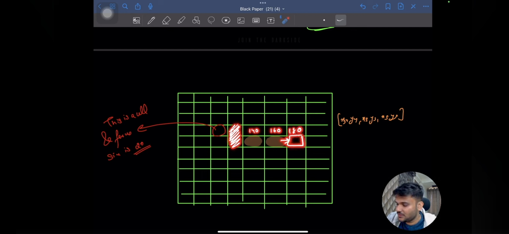

Referred Video: https://www.youtube.com/watch?v=Vz_6ATplCh8


1. Snake position & food is stored in an array with its coordinates


2. To move snake: update snake's array by removing tail and adding new head
```js
    function updateSnake() {
    console.log("Update snake called")
    // 1. Calculate new coordinate the snake head will go to
    const newHead = {x: snake[0].x + dx, y: snake[0].y + dy}
    snake.unshift(newHead); // add the new head
    if(newHead.x === food.x && newHead.y === food.y) {
        // collision
        console.log("Collided");
        score += 5;
        if(gameSpeed > 30) {
            clearInterval(intervalId);

            gameSpeed -= 10

            gameLoop();

        }
        // dont pop the tail
        moveFood();
        // move the food
    } else {
        snake.pop(); // remove the last cell
    }
}
```



3. Generate food randomly 


```js
    function moveFood() {
        let newX, newY;
        do {
            newX = Math.floor(Math.random() * ((arenaSize - cellSize)/cellSize))*cellSize;
            newY = Math.floor(Math.random() * ((arenaSize - cellSize)/cellSize))*cellSize;
        } while(snake.some(snakeCell => snakeCell.x === newX && snakeCell.y === newY));

        food = {x: newX, y: newY};
    }
```

Referred Code: https://github.com/singhsanket143/Snake_Game_Project/tree/master
