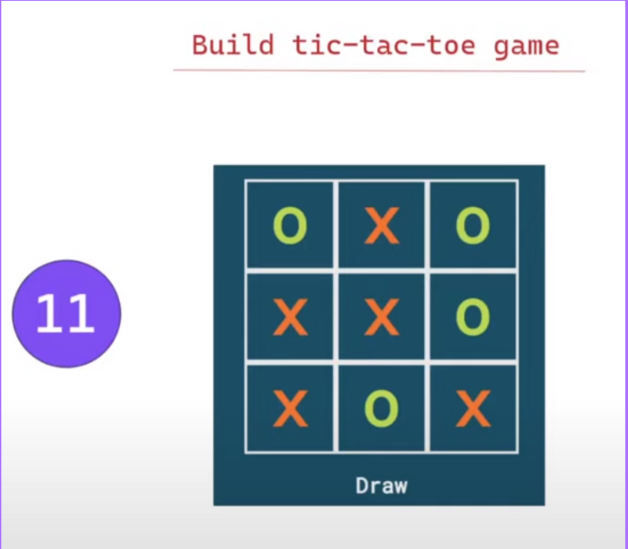

## Tic-Tac-Toe

### Tech Stack:
Vanilla Javascript, HTML & CSS

### Must Have:

1. Make n * n grid
2. Allow player to play alternatively
3. Show the winner if a player wins the game
4. Show the draw if the game is drawn

### Good To Have:

1. Make the calculation of winner in O(1) complexity
2. Avoid too many event listners
3. If possible, implement Minesweeper 
   a. "*" chance is wasted
   b. "+" player get one more chance
   c. "-" nothing happens

## Concept covered in this question

#### 1. Event Bubbling
1. Implemented in this question

### Referred Video
https://www.youtube.com/watch?v=rtKwy1k9lYY
