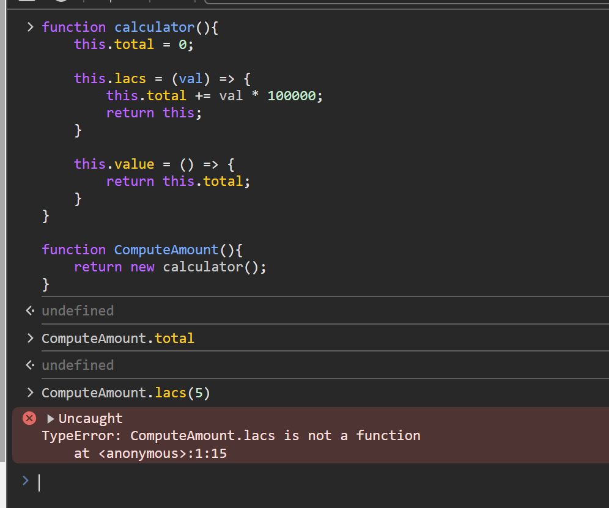

<details >
 <summary style="font-size: small; font-weight: bold">
Input->
computeAmount().Iacs(15).
crore(5).crore(2).lacs(20).thousand(45).crore(7).value()

</summary>

❌ This is `const temp = new ComputeAmount();` not allowed in question meaning you
can't create constructor function and then **create instance** of it

```js
function calculator(){
    this.total = 0;

    this.lacs = function (val) {
        this.total += val * 100000;
        return this;
    }

    this.value = function() {
        return this.total;
    }
}

function ComputeAmount(){
    return new calculator();
}
```

**Note:** here using arrow function will not yeild the same result as using normal function


**_Arrow function execute wrt to global scope normally and wrt to defined BF object scope
if executed inside normal GF function. Basically it executes to its Lexical Scope which is global all
the time, until it is defined inside any function_**

Explanation: https://chatgpt.com/share/1823004c-6306-4ae4-9e0f-3a201a841fc3

Referred Video: https://youtu.be/_tNErId8xlc?si=t8fEbbGmefLTogd-&t=126
</details>


