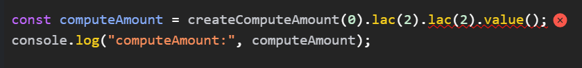
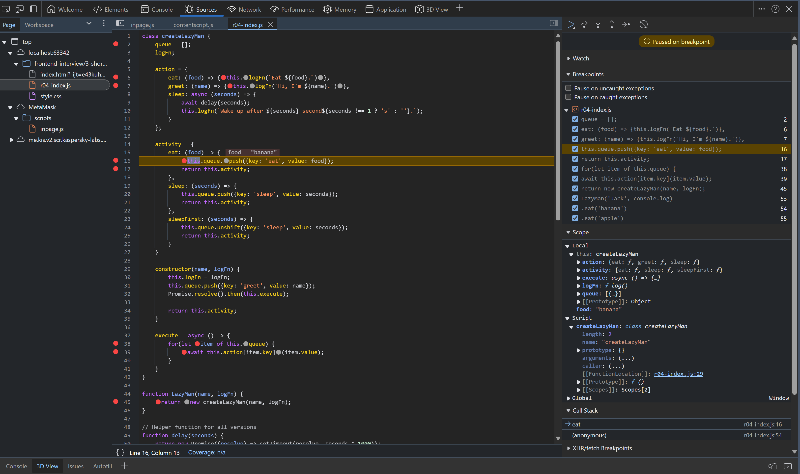

## Revision Questions:
TODO: Add below question details
1. https://www.greatfrontend.com/questions/javascript/backbone-model
2. https://bigfrontend.dev/problem/create-lazyman
<details >
 <summary style="font-size: small; font-weight: bold">01. Two-way binding [BFE]</summary>

###### r01

**Question:**

Let's do some simple two-way binding.

Please create a function `model(state, element)`, to bind `state.value` to the HTMLInputElement `element`.

```js
const input = document.createElement('input')
const state = { value: 'BFE' }
model(state, input)

console.log(input.value) // 'BFE'
state.value = 'dev'
console.log(input.value) // 'dev'
input.value = 'BFE.dev'
input.dispatchEvent(new Event('change'))
console.log(state.value) // 'BFE.dev'
```
https://bigfrontend.dev/problem/two-way-binding

**Solution:**

```js
function model(state, input){
    input.value = state.value;

    /**
     * Here whenever we set or get the value of object `state` and key `value`
     * then below function will be called which can then be used to update the `input` value
     */
    Object.defineProperty(state, 'value', {
        get(){
            console.log("get called: ");
            /**
             * Below return will send you in infinite loop because each time
             * you do state.value it will call this get method and it will
             * keep calling itself
             *
             * return state.value
             */
            return input.value;
        },
        set(new_value) {
            console.log("set called: ");
            input.value = new_value;
        }
    })

    /**
     * Below eventlistner just listen to `change` event of `input`
     * and update the value of object `state` and key `value`
     */
    input.addEventListener('change',(event) => {
        state.value = event.target.value;
    })
}
```

---
</details>


<details >
 <summary style="font-size: small; font-weight: bold">02. auto-retry Promise on rejection [BFE]</summary>

###### r02

**Question:**

For a web application, fetching API data is a common task.

But the API calls might fail because of Network problems. Usually we could show a screen for Network Error and ask users to retry.

One approach to handle this is auto retry when network error occurs.

You are asked to create a `fetchWithAutoRetry(fetcher, count)`, which automatically fetch again when error happens, until the maximum count is met.

For the problem here, there is no need to detect network error, you can just retry on all promise rejections.

https://bigfrontend.dev/problem/retry-promise-on-rejection


**Solution-1:**

```js

function fetchWithAutoRetry(fetcher, maximumRetryCount) {

    return new Promise((resolve, reject) => {
        let count = 0;

        const callFetcher = () => {
            /**
             * 1. Note that fetcher return Promise hence executing is important
             * 2. Here we could have did just `fetcher().then((data) => { ... })`
             * but we have to check whether `fetcher()` is `Promise` or not
             * Hence using `Promise.resolve(fetcher())`
             */
            return Promise.resolve(fetcher()).then((resp) => {
                    resolve(resp);
                    return;
                },
                (error) => {
                    if(count === maximumRetryCount){
                        reject(error);
                        return;
                    }
                    else
                        callFetcher();

                    console.log("Tried " + count + " times");
                    count++;
                });
        };

        callFetcher();
    });

}


const fetcher = () => {
    return new Promise((resolve, reject) => {
        const random = Math.random()
        console.log("random: " + random);

        if(random > 0.5){
            resolve(1);
        }
        else{
            reject(new Error("Error executing P2"))
        }
    })
}

(async function a() {
    try{
        await fetchWithAutoRetry(fetcher, 3)
    }
    catch (e) {
        console.log(e)
    }
})()

```

**Solution-2:**

```js
/**
 * @param {() => Promise<any>} fetcher
 * @param {number} maximumRetryCount
 * @return {Promise<any>}
 */
function fetchWithAutoRetry(fetcher, maximumRetryCount) {
  return fetcher().catch((error) => {
    if(maximumRetryCount === 0)
      throw error;
    else
      return fetchWithAutoRetry(fetcher, maximumRetryCount - 1);
  })
}
```

---
</details>


<details >
 <summary style="font-size: small; font-weight: bold">
03. Input->
computeAmount().Iacs(15).
crore(5).crore(2).lacs(20).thousand(45).crore(7).value()[Chirag Goel]
</summary>

###### r03.

### Always prefer using Normal function over Arrow function as it might get sometime tricky since it will run in Global Execution Context if not created correctly

**1. Solution-1**

**i. Using Class**

```js
class ComputeAmount {
    constructor(amount) {
        this.totalAmount = amount;
    }

    lac(multiplier) {
        this.totalAmount += multiplier * 100000;
        return this;
    }

    value() {
        return this.totalAmount;
    }
}

console.log("computeAmount : ", new ComputeAmount(0).lac(2).lac(2).value());

```

**ii. Using Constructor Function**
```js
function ComputeAmount(amount){
    this.totalAmount = amount;

    this.lac = function (multiplier){
        this.totalAmount += multiplier*100000;
        return this;
    }

    this.value = () => {
        return this.totalAmount;
    }
}

console.log("computeAmount : ", new ComputeAmount(0).lac(2).lac(2).value());
```


Here everything is stored inside local `this` which is pointing to (`Object`)instance
of `ComputeAmount` constructor function


When instance of `ComputeAmount` is created, any function inside that instance 
be it Normal or Arrow function will run inside same execution context of `ComputeAmount` instance.
Hence `this` points to `ComputeAmount` instance irrespective of type of function used.


**2. Solution-2**

```js
function computeAmount(amount){
    this.totalAmount = amount;

    this.lac = (multiplier) => {
        this.totalAmount += multiplier*100000;
        return this;
    }

    this.value = () => {
        return this.totalAmount;
    }

    return this;
}


console.log("computeAmount : ", computeAmount(0).lac(2).lac(2).value());
```

- This solution also yields the same result, which is more accurate to what question asked
- It has a same result because here we're explicitly returning `this` alike creating new instance
  from constructor function which on using `new` keyword create empty object which is assigned
  to `this` and returned
- Here `this` points to `window` object because it is not instance of anything
- Also, it does not matter whether `lac` function is normal or arrow both will return a same result


Referred Video: https://youtu.be/_tNErId8xlc?si=t8fEbbGmefLTogd-&t=126


**3. Solution-3(Using Factor Function):** 

**i. Normal Function:**
```js
function createComputeAmount(amount) {
    let totalAmount = amount;

    return {
        lac(multiplier){
            totalAmount += multiplier * 100000;
            return this;  // Return the object itself for chaining
        },
        value() {
            return totalAmount;
        }
    };
}

const computeAmount = createComputeAmount(0).lac(2).lac(2).value();
console.log("computeAmount:", computeAmount);
```

**ii. Arrow Function**

❌❌ Below Arrow function do not works
```js
function createComputeAmount(amount) {
    let totalAmount = amount;

    return {
        lac: (multiplier) => {
            totalAmount += multiplier * 100000;
            return this;  // Return the object itself for chaining
        },
        value() {
            return totalAmount;
        }
    };
}

const computeAmount = createComputeAmount(0).lac(2).lac(2).value();
console.log("computeAmount:", computeAmount);
```



This gives error because first `lac()` function return `this` which is pointing to 
`Global Execution Context` i.e window. Therefore after running first `lac()` function
whole returned object by `createComputeAmount` will be removed from Global Execution Context
and hence we get error `TypeError: createComputeAmount(...).lac(...).lac is not a function`
on accessing second `lac()` function.

✅ Below will work
```js
function createComputeAmount(amount) {
    let totalAmount = amount;

    const obj = {
        lac: (multiplier) => {
            totalAmount += multiplier * 100000;
            return obj;  // Return the object itself for chaining
        },
        value() {
            return totalAmount;
        }
    };

    return obj;
}

const computeAmount = createComputeAmount(0).lac(2).lac(2).value();
console.log("computeAmount:", computeAmount);
```

Here we are explicitly returning newly created `obj` object therefore all next call
of `lac()` function will return newly created object with value of `totalAmount` stored in
closure of `obj` object.

First Step

Final Step


---
</details>


<details >
 <summary style="font-size: small; font-weight: bold">
04. create LazyMan()
</summary>

###### r04.

#### Question:
LazyMan is very lazy, he only eats and sleeps.

LazyMan(name: string, logFn: (log: string) => void) would output a message, the passed logFn is used.
```js
LazyMan('Jack', console.log)
  .eat('banana')
  .sleep(10)
  .eat('apple')
  .sleep(1)
// Hi, I'm Jack.
// Eat banana.
// Wake up after 10 seconds.
// Eat Apple.
// Wake up after 1 second.
```

```js
LazyMan('Jack', console.log)
  .eat('banana')
  .sleepFirst(10)
  .eat('apple')
  .sleep(1)
// Wake up after 10 seconds.
// Hi, I'm Jack.
// Eat banana
// Eat apple
// Wake up after 1 second.
```

<details >
 <summary style="font-size: small; font-weight: bold">
Working / Not Working Code
</summary>

#### 1. Implicit Globals Type Code
1. ✅ Works

- When variables are declared without `const`, `let`, or `var`, they become implicit global variables
- In this case, `queue`, `eat`, `sleep`, and `sleepFirst` all become properties of the global object (window in browsers)
- This is generally considered bad practice as **_it pollutes the global namespace_**
- It works because this in the function context refers to the global object when not in strict mode
```js
function LazyMan(name, logFn) {
  queue = []; // Implicitly becomes a global variable
  queue.push({key: 'greet', value: name});
  
  const action = {
    eat: (food) => {logFn(`Eat ${food}.`)},
    greet: (name) => {logFn(`Hi, I'm ${name}.`)},
    sleep: async (seconds) => {
      await delay(seconds);
      logFn(`Wake up after ${seconds} second${seconds !== 1 ? 's' : ''}.`);
    }
  };

  async function execute() {
    for(let item of queue) {
      await action[item.key](item.value);
    }
  }

  Promise.resolve().then(execute);

  eat = (food) => { // Implicitly becomes a global variable
    queue.push({key: 'eat', value: food});
    return this;
  }

  sleep = (seconds) => { // Implicitly becomes a global variable
    queue.push({key: 'sleep', value: seconds});
    return this;
  }

  sleepFirst = (seconds) => { // Implicitly becomes a global variable
    queue.unshift({key: 'sleep', value: seconds});
    return this;
  }
  
  return this;
}

// Helper function for all versions
function delay(seconds) {
  return new Promise((resolve) => setTimeout(resolve, seconds * 1000));
}

// LazyMan('Jack', console.log)
//   .eat('banana')
//   .sleepFirst(2)
//   .eat('apple')
//   .sleep(1)

  LazyMan('Jack', console.log)
  .eat('banana')
  .eat('apple')
  .sleepFirst(1)
  .eat('egg')
  .sleepFirst(1)
```

<details >
 <summary style="font-size: medium; font-weight: bold">
⭐Chrome Dev Tools Logs (Deeply Explained) [VERY IMPORTANT]
</summary>

1. We have 3 types of Scope `Global`, `Local` & `Block`. Also there are `Closure` & `Function` scopes

At start, we first hit line 68 breakpoint, and during that time there is no `local` scope 
created and `global` scope only hold `LazyMan` function definition


2. Then we hit line 20 breakpoint, and still in `global` scope we have just `LazyMan` function definition.
But now we have created `local` scope, and it holds `this` pointing to `Window` object **_[which has `Global` scope in it]_**, `action`, `execute`, `logFn`, and `name` variables


3. Then we hit line 22 if we _step over to next function_. Now we will have `queue` in our global
scope. Likewise if we keep executing this function after `LazyMan` function in line 68 is fully
executed then we will have `eat`, `sleep`, and `sleepFirst` in our global scope as well


4. Then when we start executing `eat` function in line 69, we have `LazyMan` function `Closure` scope and 
`local` scope containing `this` pointing `Window` object and `food` variable.


5. We can keep executing rest of below line till 72 with same behavior. At this point we have `eat` function in Call Stack
from `global` scope. 


6. After everything is executed and Call Stack is empty, we look for anything there on `Micro Task Queue`.
So here we start executing `Promise` we encounter earlier and add it to Call Stack. Here we have all the required
stuff in Scope 


7. After this we start picking things one by one from `Global` scope `queue` array


---
</details>


2. ✅ Working

If we use `const queue = []` instead of `queue = []` still code will work.

Only difference here would be that instead of being stored in `global` scope it will be
stored in `LazyMan` function `Closure` scope, which can be accessed by `eat`, `sleep`, and `sleepFirst` functions.


3. ❌ Not Working

You can't just add `const` to `eat`, `sleep`, and `sleepFirst`, by doing this you will make these
function available just in `LazyMan` function `Closure` scope. Since after executing `LazyMan` function 
we are returning `this` which is pointing to `Window` object and inside this `Window` object we just
have `LazyMan` function definition.

4. ✅ Working

But we can write `this.eat = () => {...}` and this will work because now returned `this` `Window` object also
contain `eat` function.

5. ❌ Not Working

From above code if remove `const` from `action` object then it will not work. 


The one testcase that is failing will yield right result if you just run that testcase. But when all are
executed together then because all the testcase didn't get separate copy of `action` alike we where getting
earlier through `Lazyman` function `Closure` scope. Now all testcase shared same `action` object.


#### 2. Factory Function Type Code

1. ✅ Works

```js
function LazyMan(name, logFn) {
  const queue = [];
  queue.push({key: 'greet', value: name});
  
  const action = {
    eat: (food) => {logFn(`Eat ${food}.`)},
    greet: (name) => {logFn(`Hi, I'm ${name}.`)},
    sleep: async (seconds) => {
      await delay(seconds);
      logFn(`Wake up after ${seconds} second${seconds !== 1 ? 's' : ''}.`);
    }
  };

  async function execute() {
    for(let item of queue) {
      await action[item.key](item.value);
    }
  }

  Promise.resolve().then(execute);

  const obj = {
    eat: (food) => { 
      queue.push({key: 'eat', value: food});
      return obj;
    },
    sleep: (seconds) => { 
      queue.push({key: 'sleep', value: seconds});
      return obj;
    },
    sleepFirst: (seconds) => { 
      queue.unshift({key: 'sleep', value: seconds});
      return obj;
    }
  }

  return obj;
}

// Helper function for all versions
function delay(seconds) {
  return new Promise((resolve) => setTimeout(resolve, seconds * 1000));
}


  LazyMan('Jack', console.log)
  .eat('banana')
  .eat('apple')
  .sleepFirst(1)
  .eat('egg')
  .sleepFirst(1)
```

2. ❌ Not Working

```js
return {
    eat: (food) => { 
      queue.push({key: 'eat', value: food});
      return this;
    },
    sleep: (seconds) => { 
      queue.push({key: 'sleep', value: seconds});
      return this;
    },
    sleepFirst: (seconds) => { 
      queue.unshift({key: 'sleep', value: seconds});
      return this;
    }
  }
```

Because `eat`, `sleep`, and `sleepFirst` function are returning `this` which is pointing to `Window` object 
and `Window` object do not have `eat`, `sleep`, and `sleepFirst` function, hence when called in chained 
fashion it will not work.


#### 3. Constructor Function Type Code

```js
function createLazyMan(name, logFn) {
  const queue = [];
  queue.push({key: 'greet', value: name});
  
  const action = {
    eat: (food) => {logFn(`Eat ${food}.`)},
    greet: (name) => {logFn(`Hi, I'm ${name}.`)},
    sleep: async (seconds) => {
      await delay(seconds);
      logFn(`Wake up after ${seconds} second${seconds !== 1 ? 's' : ''}.`);
    }
  };

  async function execute() {
    for(let item of queue) {
      await action[item.key](item.value);
    }
  }

  Promise.resolve().then(execute);


  this.eat = (food) => { 
    queue.push({key: 'eat', value: food});
    return this;
  };

  this.sleep = (seconds) => { 
    queue.push({key: 'sleep', value: seconds});
    return this;
  };

  this.sleepFirst = (seconds) => { 
    queue.unshift({key: 'sleep', value: seconds});
    return this;
  }
}

function LazyMan(name, logFn) {
  return new createLazyMan(name, logFn);
}

// Helper function for all versions
function delay(seconds) {
  return new Promise((resolve) => setTimeout(resolve, seconds * 1000));
}

 LazyMan('Jack', console.log)
  .eat('banana')
  .eat('apple')
  .sleepFirst(1)
  .eat('egg')
  .sleepFirst(1)
```


#### 4. Class Type Code

1. ✅ Works
```js
class createLazyMan {
    queue = [];
    logFn;

    action = {
        eat: (food) => {this.logFn(`Eat ${food}.`)},
        greet: (name) => {this.logFn(`Hi, I'm ${name}.`)},
        sleep: async (seconds) => {
            await delay(seconds);
            this.logFn(`Wake up after ${seconds} second${seconds !== 1 ? 's' : ''}.`);
        }
    };

    activity = {
        eat: (food) => {
            this.queue.push({key: 'eat', value: food});
            return this.activity;
        },
        sleep: (seconds) => {
            this.queue.push({key: 'sleep', value: seconds});
            return this.activity;
        },
        sleepFirst: (seconds) => {
            this.queue.unshift({key: 'sleep', value: seconds});
            return this.activity;
        }
    }

    constructor(name, logFn) {
        this.logFn = logFn;
        this.queue.push({key: 'greet', value: name});
        Promise.resolve().then(this.execute);

        return this.activity;
    }

    execute = async () => {
        for(let item of this.queue) {
            await this.action[item.key](item.value);
        }
    }
}

function LazyMan(name, logFn) {
    return new createLazyMan(name, logFn);
}

// Helper function for all versions
function delay(seconds) {
    return new Promise((resolve) => setTimeout(resolve, seconds * 1000));
}

LazyMan('Jack', console.log)
    .eat('banana')
    .eat('apple')
    .sleepFirst(1)
    .eat('egg')
    .sleepFirst(1)


```

Here anything inside constructor will be executed on creation of instance of `createLazyMan` class.





---
</details>


---
</details>


## Questions:

<details >
 <summary style="font-size: small; font-weight: bold">02. find all the prime numbers up to n?</summary>

###### 02

```js
function isPrime(num) { 
    for (let i = 2; i <= Math.sqrt(num); i++) { 
        if (num % i === 0) { 
            return false; 
        } 
    } 
    return num > 1; 
} 
  
function printPrimeNumbers(n) { 
    for (let i = 2; i <= n; i++) { 
        if (isPrime(i)) { 
            console.log(i); 
        } 
    } 
} 
  
printPrimeNumbers(100);
```

---
</details>


<details >
 <summary style="font-size: small; font-weight: bold">03. Parent Child Relationship Tree Formation [Amazon FE 2020]</summary>

###### 03

1. https://leetcode.com/discuss/interview-question/847073/amazon-phone-front-end-engineer
2. Similar like above: https://leetcode.com/discuss/interview-experience/508233/amazon-sde1-front-end-feb-2020-rejected
<details >
 <summary style="font-size: small; font-weight: bold">Question</summary>

Given a series of child-parent relations like
```js
['dog', 'mammal'],
["shark, fish"],
["cat", "mammal"],
["mammal", "animal"],
['fish', 'animal']
```


capture the relationship of these entities so you can print the
relationships in a nested format at any point.

Notes:

Siblings may be returned in any order.
Your add function will be called multiple times to add relationships
Example Outputs (any are valid):

```js
Option 1:
animal
  fish
    shark
  mammal
    dog
    cat

Option 2:
{
  "value": "animal",
  "children": [
    {
      "value": "fish",
      "children": [
        {
          "value": "shark",
          "children": []
        }
      ]
    },
    {
      "value": "mammal",
      "children": [
        {
          "value": "dog",
          "children": []
        },
        {
          "value": "cat",
          "children": []
        }
      ]
    }
  ]
}

Option 3:
{
  "animal": {
    "fish": {
      "shark": {}
    },
    "mammal": {
      "cat": {},
      "dog": {}
    }
  }
}
```

---
</details>


<details >
 <summary style="font-size: small; font-weight: bold">Solution</summary>

```js
class TreeNode{
    constructor(val) {
        this.value = val;
        this.children = [];
    }

    addChild(child){
        this.children.push(child);
    }

    print(prefix = ' '){
        console.log(prefix + this.value);
        this.children.forEach((child) => child.print(prefix + ' '));
    }
}


class Hierarchy{
    constructor() {
        this.node = {};
        this.root = null;
    }

    addRelationship(child, parent){
        if(!this.node[child]){
            this.node[child] = new TreeNode(child);
        }

        if(!this.node[parent]){
            this.node[parent] = new TreeNode(parent);
        }

        this.node[parent].addChild(this.node[child]);

        /* Here we are trying to get the root of the tree,
        if there is no root then we assign the current parent, or
         if the current root is equal to the child, then we need to update
        our root with its parent
        */
        if(!this.root || this.root === this.node[child]){
            this.root = this.node[parent];
        }
    }


    printHierarchy(){
        if(this.root){
            this.root.print();
        }
        else{
            console.log("No tree possible");
        }
    }
}


// Example Usage
const hierarchy = new Hierarchy();
hierarchy.addRelationship('dog', 'mammal');
hierarchy.addRelationship('cat', 'mammal');
hierarchy.addRelationship('mammal', 'animal');
hierarchy.addRelationship('whitesheep', 'sheep');
hierarchy.addRelationship('shark', 'fish');
hierarchy.addRelationship('fish', 'animal');
hierarchy.addRelationship('sheep', 'mammal');
hierarchy.addRelationship('sparrow', 'bird');
hierarchy.addRelationship('blacksheep', 'sheep');

hierarchy.printHierarchy();

```

Output:


---
</details>


---
</details>


<details >
 <summary style="font-size: small; font-weight: bold">04. Data Transformation [Chirag Goel]</summary>

###### 04
https://youtu.be/uhtmTe26rqo?si=wAEuFy8zBopNpB8E&t=284
<details >
 <summary style="font-size: small; font-weight: bold">Question</summary>

Write a function given input, give below output

```js
const input = [
    {
        key: 'sample1',
        data: 'data1',
    },
    {
        key: 'sample1',
        data: 'data2'
    },
    {
        key: 'sample1',
        data: 'data3'
    },
    {
        key: 'sample2',
        data: 'data2',
    },
    {
        key: 'sample3',
        data: 'data3',
    },
]

const output =
    {
        'sample1': [
            {
                key: 'sample1',
                data: 'data1',
            },
            {
                key: 'sample1',
                data: 'data2'
            },
            {
                key: 'sample1',
                data: 'data3'
            }
        ],
        'sample2': [
            {
                key: 'sample2',
                data: 'data2',
            }
        ],
        'sample3': [
            {
                key: 'sample3',
                data: 'data3',
            }
        ]
    }


```

---
</details>

<details >
 <summary style="font-size: small; font-weight: bold">Solution</summary>

```js
function transform(input){
    let output = {};

    for(let item of input){
        if(output[item.key]){
            output[item.key].push(item);
        }
        else{
            output[item.key] = [item];
        }
    }

    console.log("Output : ", output);
}

transform(input);

```

---
</details>

---
</details>


<details >
 <summary style="font-size: small; font-weight: bold">05. Map Async [Uber, Lyft, Google]</summary>

###### 05

Question:
https://www.greatfrontend.com/questions/javascript/map-async


My Solution:

```js
export default function mapAsync(iterable, callbackFn) {
  let res = [];

  return new Promise((resolve, reject) => {
    let yetToResolve = iterable.length;

    if(yetToResolve === 0)
      resolve(res);

    for(let i = 0; i < iterable.length; i++){
      const value = iterable[i];
      Promise.resolve(callbackFn(value)).then((response) => {
        yetToResolve--;
        res[i] = response;

        if(yetToResolve === 0)
          resolve(res);
      }, (error) => {
        reject(error);
      })
    }
  })
}
```

Refer Concept [04-js-concept/polyfills/readme.md -> Promise.all() [GreatFrontend Edge Cases]](../../1-important-concept/04-js-concept/polyfills/readme.md)


Small Clean Solution:

```ts
export default function mapAsync<T, U>(
  iterable: Array<T>,
  callbackFn: (value: T) => Promise<U>,
): Promise<Array<U>> {
  return Promise.all(iterable.map(callbackFn));
}
```

---
</details>


<details >
 <summary style="font-size: small; font-weight: bold">06. Map Async Limit [Uber, Lyft, Google]</summary>

###### 06
https://www.greatfrontend.com/questions/javascript/map-async-limit


- **Sequential:** A sequential (one at a time) approach will certainly stay within the concurrency limit, but is extremely slow and not utilizing the fact that we can have concurrent async tasks.
- **Chunks:** The chunks approach improves the concurrency but it waits for all items in the current chunk to be completed before moving on to the next. If there's a task that is much slower than the rest, there will be idle cycles and the available limit is not fully-utilized.
- **Chunkless:** The most efficient approach is to immediately start processing the next item when an item is completed. This ensures that there are always size ongoing async tasks (when there are unprocessed items) and the available limit is fully-utilized.

❌Solution(Sequential):

```ts
export default function mapAsyncLimit<T, U>(
  iterable: Array<T>,
  callbackFn: (value: T) => Promise<U>,
  size: number = Infinity,
): Promise<Array<U>> {
  return new Promise((resolve, reject) => {
    const results: Array<U> = [];

    function processItem(index: number) {
      if (index === iterable.length) {
        resolve(results);
      }

      return callbackFn(iterable[index])
        .then((result) => {
          results.push(result);
          processItem(index + 1);
        })
        .catch(reject);
    }

    return processItem(0);
  });
}

```

✅Solution(Chunks):
```js
export default async function mapAsyncLimit(iterable, callbackFn, size = Infinity) {
  const res = [];
  const len = iterable.length;

  if(len === 0)
    return res;

  /*Using for loop like below will not work for size = Infinity because
  0*Infinity is NaN */
  // for(let i = 0; i <= Math.floor(len / size); i++)
  for(let i = 0; i < len; i += size){
    const response = await Promise.all(iterable.slice(i, i + size).map(callbackFn));

    res.push(...response);
  }

  return res;
}
```

✅Solution(Chunkless):

Don't need to go through this while revising the code
```js
export default function mapAsyncLimit<T, U>(
  iterable: Array<T>,
  callbackFn: (value: T) => Promise<U>,
  size: number = Infinity,
): Promise<Array<U>> {
  return new Promise((resolve, reject) => {
    const results: Array<U> = [];
    let nextIndex = 0;
    let resolved = 0;

    if (iterable.length === 0) {
      resolve(results);
      return;
    }

    async function processItem(index: number) {
      nextIndex++;
      try {
        const result = await callbackFn(iterable[index]);
        results[index] = result;
        resolved++;

        if (resolved === iterable.length) {
          resolve(results);
          return;
        }

        if (nextIndex < iterable.length) {
          processItem(nextIndex);
        }
      } catch (err) {
        reject(err);
      }
    }

    for (let i = 0; i < Math.min(iterable.length, size); i++) {
      processItem(i);
    }
  });
}
```

For other solution using `then` instead of `await` check GreatFrontend solutions

---
</details>


<details >
 <summary style="font-size: small; font-weight: bold">07. Object With Values of `text` inputs[Amazon FE 2020 ]</summary>

###### 07

https://leetcode.com/discuss/interview-question/573751/Amazon-FEE-Phone-Screen


**Solution:** 

```js
function getValues(id) {
  let element = document.querySelector(`#${id}`);
  let inputs = element.querySelectorAll('input[type="text"]');
  let obj = {};

  for(let input of inputs) {
  	let inputValue = input.value;
  	let names = input.name.split('.');
    let tmpObject = obj;
    
    for (let i = 0; i < names.length; i++) {
       tmpObject[names[i]] = {...tmpObject[names[i]]};
         
       if (i === names.length - 1) {
         tmpObject[names[i]] = inputValue;
       } else {
         tmpObject = tmpObject[names[i]];
       }
     }
  }

  return obj;
}

getValues('parent');
```

---
</details>


1. https://www.greatfrontend.com/questions/quiz/whats-a-typical-use-case-for-anonymous-functions
2. https://www.greatfrontend.com/questions/quiz/what-are-the-pros-and-cons-of-using-promises-instead-of-callbacks
3. https://www.greatfrontend.com/questions/quiz/what-are-the-differences-between-map-set-and-weakmap-weakset
4. https://www.greatfrontend.com/questions/quiz/what-are-workers-in-javascript-used-for
5. https://www.greatfrontend.com/questions/quiz/can-you-offer-a-use-case-for-the-new-arrow-function-syntax-how-does-this-new-syntax-differ-from-other-functions
6. https://www.greatfrontend.com/questions/quiz/whats-the-difference-between-feature-detection-feature-inference-and-using-the-ua-string
7. 


https://imgur.com/k3o10X1
