<details >
 <summary style="font-size: small; font-weight: bold">01. Flatten [Apple, Amazon, Lyft, Salesforce]</summary>

###### 01

Question:
```js
// Single-level arrays are unaffected.
flatten([1, 2, 3]); // [1, 2, 3]

// Inner arrays are flattened into a single level.
flatten([1, [2, 3]]); // [1, 2, 3]
flatten([
  [1, 2],
  [3, 4],
]); // [1, 2, 3, 4]

// Flattens recursively.
flatten([1, [2, [3, [4, [5]]]]]); // [1, 2, 3, 4, 5]
```


<details >
 <summary style="font-size: medium; font-weight: bold">Solution</summary>

https://www.greatfrontend.com/questions/javascript/flatten

https://www.figma.com/board/whorUkUBWml2oad0gAJSy5/DSA-Summary?node-id=511-596&t=oq234ThQe08ssNUv-4
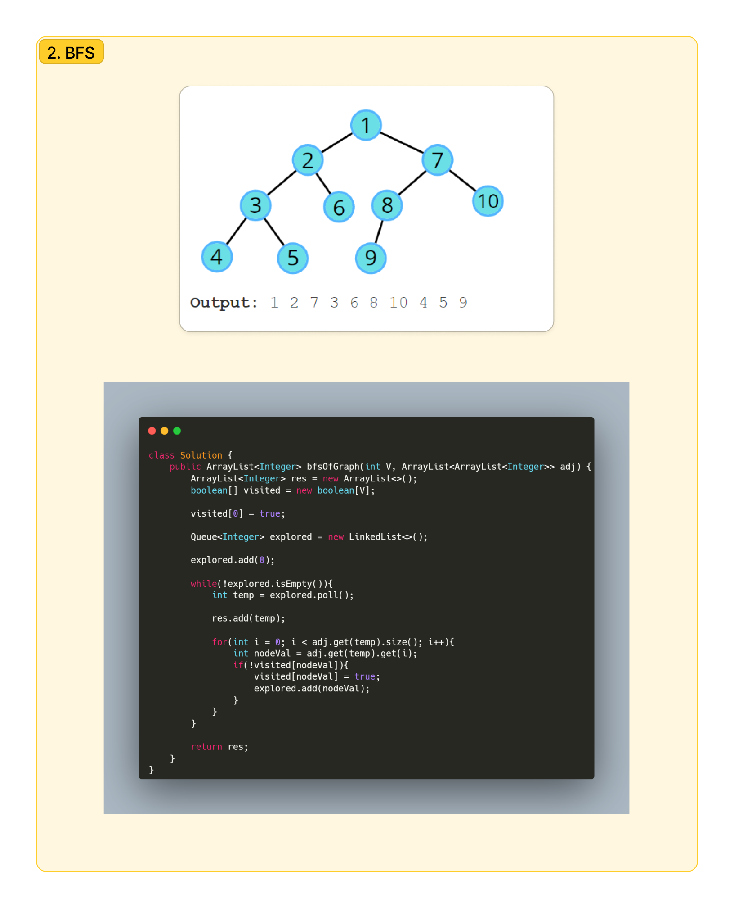
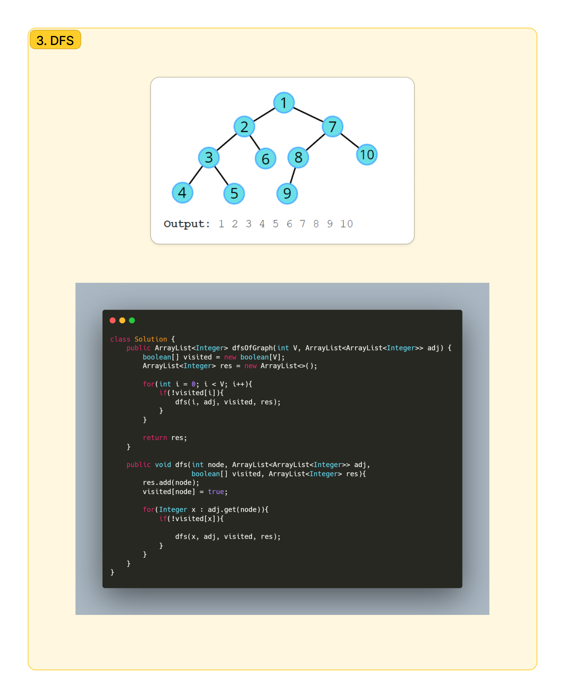
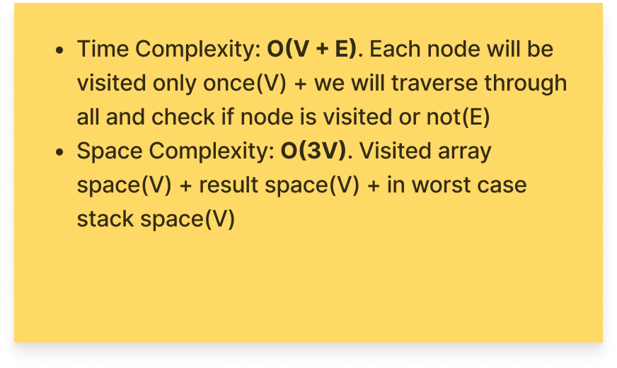


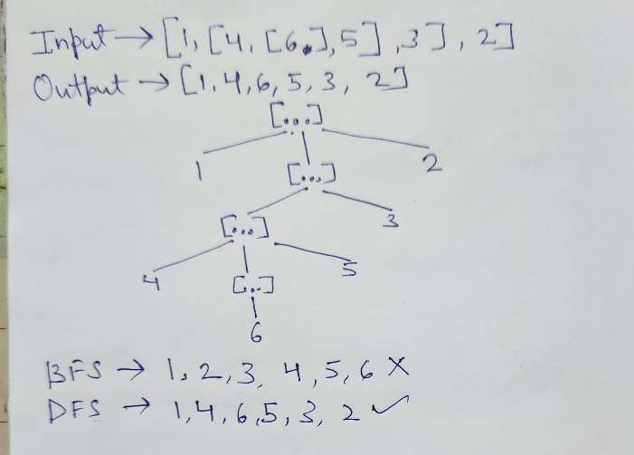

Since here we have Tree not graph that too not with any adjacency list, 
we need to use the above exact approach but take an idea from the same
<details >
 <summary style="font-size: small; font-weight: bold">Recursive(DFS)</summary>


My Solution - 1:

Using DFS
```js
export default function flatten(value) {
  let res = [];


  const flattenedChild = (arr) => {
    if(!arr)
      return;

    for(let a of arr){
      if(Array.isArray(a)){
        flattenedChild(a);
      }
      else{
        res.push(a);
      }
    }
  }

  flattenedChild(value);

  console.log("res : ", res);

  return res;
}
```

My Solution-2:

```js
export default function flatten(value) {
  let res = [];

  for(let val of value){
    if(Array.isArray(val))
      res = [...res, ...flatten(val)];
    else
      res.push(val);
  }

  return res;
}
```


Solution-3:
```js
/**
 * @param {Array<*|Array>} value
 * @return {Array}
 */
export default function flatten(value) {
  return value.reduce(
    (acc, curr) => acc.concat(Array.isArray(curr) ? flatten(curr) : curr),
    [],
  );
}

```


---
</details>


<details >
 <summary style="font-size: small; font-weight: bold">Iterative</summary>

❌My BFS Solution:
<br>
This will yield wrong result 
```js
export default function flatten(value) {
  let queue = [...value];

  let res = [];

  while(queue.length > 0){
    let element = queue.shift();


    if(Array.isArray(element)){
        /**Using here spread operator is very important
         * as we might end-up in infinite loop
         */
      queue.push(...element);
      // queue = [...queue, ...element]
    }
    else{
      res.push(element);
    }

    console.log("queue : ", queue.length);
    console.log("element : ", element);
  }

  return res;
}
```
❌ `queue.push(element);`
<br>
The code will be running into an infinite loop because when an element is identified as an array, you are pushing the entire array (element) back onto the queue without flattening it. This causes the same array to be repeatedly processed, leading to an infinite loop.
<br>
✅ `queue.push(...element);`
<br>
Using here spread operator is very important as we might end-up in infinite loop


✅My Modified Solution:
```js
export default function flatten(value) {
  let queue = [...value];

  let res = [];

  while(queue.length > 0){
    let element = queue.shift();

    if(Array.isArray(element)){
        /**Here we are adding element at start of queue
         * instead of pushing it at the end
         */
      queue.unshift(...element);
    }
    else{
      res.push(element);
    }

    console.log("queue : ", queue.length);
    console.log("element : ", element);
  }

  return res;
}
```

---
</details>


---
</details>


---
</details>


<details >
 <summary style="font-size: small; font-weight: bold">02. Deep Equal</summary>

###### 02

<details >
 <summary style="font-size: small; font-weight: bold">Question</summary>

Implement a function `deepEqual` that performs a deep comparison between two values. It returns `true` if two input values are deemed equal, and returns `false` if not.

- You can assume there are only JSON-serializable values (numbers, strings, boolean, `null`, objects, arrays).
- There wouldn't be cyclic objects, i.e. objects with circular references.
```js
deepEqual('foo', 'foo'); // true
deepEqual({ id: 1 }, { id: 1 }); // true
deepEqual([1, 2, 3], [1, 2, 3]); // true
deepEqual([{ id: '1' }], [{ id: '2' }]); // false
```

---
</details>

<details >
 <summary style="font-size: small; font-weight: bold">Solution</summary>

<details >
 <summary style="font-size: small; font-weight: bold">`typeof()`</summary>


```javascript
typeof([])
// "object"

//Check if an object is an array
Array.isArray([])
```

Referred Article: https://developer.mozilla.org/en-US/docs/Web/JavaScript/Data_structures#bigint_type


---
</details>

My Solution:

**Note:** Read all comments very carefully, this problem looks simple, but because
so many edge case it might become tricky to understand.
```js
export default function deepEqual(valueA, valueB) {

  /**
   * This will cover all value comparison of below data type
   * 1. Undefined
   * 2. Boolean
   * 3. String
   * 4. Number
   * 
   * Also, this is the only condition that can return "true",
   * rest everything is trying to see for "false" case
   */
  if(valueA === valueB) 
      return true;

  if(typeof valueA !== typeof valueB)
    return false;

  /** 
   * In Object type check for below things because all of them
   * return "object" as their type 
   * 1. null
   * 2. Array
   * 3. Object
   */
  if(typeof valueA === 'object' && typeof valueB === 'object'){

    /**
     * One super important thing to note is that, since every
     * if statement is returning some value in every situation
     * hence we don't need else statement
     */

    if(valueA === null || valueB === null)
      return false;

    if(Array.isArray(valueA) && Array.isArray(valueB)){
      const lenA = valueA.length;
      const lenB = valueB.length

      if(lenA !== lenB)
        return false;

      for(let i = 0; i < lenA; i++){
        if(!deepEqual(valueA[i], valueB[i]))
          return false;
      }

      return true;
    }

    if(Array.isArray(valueA) || Array.isArray(valueB)){
      return false
    }

    const keysArrA = Object.keys(valueA);
    const keysArrB = Object.keys(valueB);

    const lenA = keysArrA.length;
    const lenB = keysArrB.length;

    if(lenA !== lenB)
      return false;

    for(let i = 0; i < lenA; i++){
      if(keysArrA[i] !== keysArrB[i])
        return false;

      if(!deepEqual(valueA[keysArrA[i]], valueB[keysArrB[i]]))
        return false;
    }

    return true;   
  }
}
```

For more solution and explaination on edge case refer:
https://www.greatfrontend.com/questions/javascript/deep-equal?list=one-week

---
</details>

---
</details>


<details >
 <summary style="font-size: small; font-weight: bold">03. List Format</summary>

###### 03

https://www.greatfrontend.com/questions/javascript/list-format?list=one-week
<details >
 <summary style="font-size: small; font-weight: bold">Question</summary>

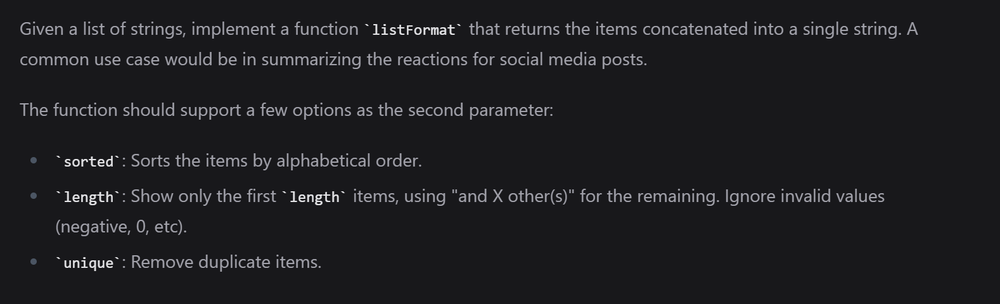

```js
listFormat([]); // ''

listFormat(['Bob']); // 'Bob'
listFormat(['Bob', 'Alice']); // 'Bob and Alice'

listFormat(['Bob', 'Ben', 'Tim', 'Jane', 'John']);
// 'Bob, Ben, Tim, Jane and John'

listFormat(['Bob', 'Ben', 'Tim', 'Jane', 'John'], {
  length: 3,
}); // 'Bob, Ben, Tim and 2 others'

listFormat(['Bob', 'Ben', 'Tim', 'Jane', 'John'], {
  length: 4,
}); // 'Bob, Ben, Tim, Jane and 1 other'

listFormat(['Bob', 'Ben', 'Tim', 'Jane', 'John'], {
  length: 3,
  sorted: true,
}); // 'Ben, Bob, Jane and 2 others'

listFormat(['Bob', 'Ben', 'Tim', 'Jane', 'John', 'Bob'], {
  length: 3,
  unique: true,
}); // 'Bob, Ben, Tim and 2 others'

listFormat(['Bob', 'Ben', 'Tim', 'Jane', 'John'], {
  length: 3,
  unique: true,
}); // 'Bob, Ben, Tim and 2 others'

listFormat(['Bob', 'Ben', '', '', 'John']); // 'Bob, Ben and John'

```

---
</details>

<details >
 <summary style="font-size: small; font-weight: bold">Solution</summary>

```js
export default function listFormat(items, options) {
  let res = " and ";
  let remainCount = 0;

  // for(let i = 0; i < modifiedItems.length; i++){
  //   if(modifiedItems[i].length === 0){
  //     modifiedItems.splice(i,1);
  //     i--;
  //   }
  // }

  /* Remove falsey value such as '' */
  let modifiedItems = items.filter((item) => item);


  if(options?.unique){
    modifiedItems = Array.from(new Set(modifiedItems));
  }

  if(modifiedItems.length === 0)
    return '';

  if(modifiedItems.length === 1)
    return modifiedItems[0];

  if(options?.sorted){
    modifiedItems = [...modifiedItems.sort()];
  }

  

  if(options?.length && options?.length > 0  && modifiedItems.length > options?.length){
    remainCount = modifiedItems.length - options?.length;
  
    modifiedItems = [...modifiedItems.slice(0, options?.length)]
  }

  

  if(remainCount > 0){
    res += remainCount;
    res += remainCount > 1 ? " others" : " other"

    let initialPortion = "";
    const len = modifiedItems.length;
    for(let i = 0; i < len; i++){
      initialPortion += modifiedItems[i];
      initialPortion += i < len - 1 ? ', ' : '';
    }

    return initialPortion + res;
  }
  else{
    const lastItem = modifiedItems.pop();

    let initialPortion = "";
    const len = modifiedItems.length;
    for(let i = 0; i < len; i++){
      initialPortion += modifiedItems[i];
      initialPortion += i < len - 1 ? ', ' : '';
    }

    return initialPortion + res + lastItem;
  }
}
```

---
</details>

---
</details>


<details >
 <summary style="font-size: small; font-weight: bold">04. Promise.all [Amazon, ByteDance, Lyft]</summary>

###### 04

[1-important-concept -> 04-js-concept -> polyfills -> promise.all](../../1-important-concept/04-js-concept/polyfills/readme.md)

---
</details>


<details >
 <summary style="font-size: small; font-weight: bold">05. Classnames</summary>

###### 05

https://www.greatfrontend.com/questions/javascript/classnames?list=one-week
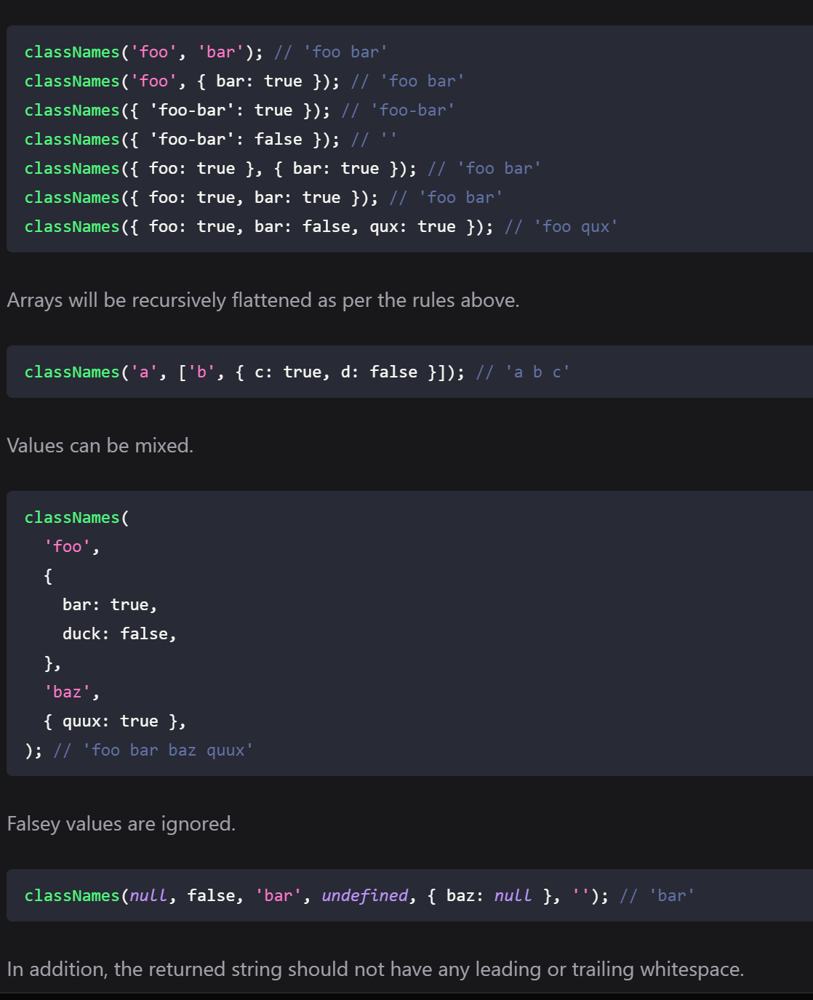


Solution: 1(Using forEach)
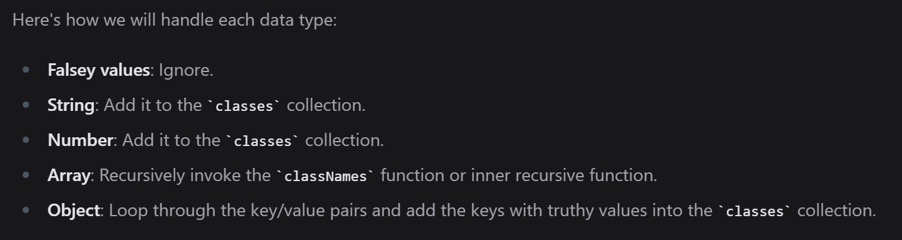
```js
/**
 * @param {...(any|Object|Array<any|Object|Array>)} args
 * @return {string}
 */
export default function classNames(...args) {
  let res = '';

  args.forEach((arg) => {
    if(!arg)
      return;

    if(Array.isArray(arg)){
      arg.forEach((element) => {
        res += res.length > 0 ? ` ${classNames(element)}`: classNames(element);
      })

      return;
    }

    if(typeof arg === 'object'){
      const arr = Object.entries(arg);

      for(let [key, value] of arr){
        if(value && key)
          res += res.length > 0 ? ` ${classNames(key)}`: classNames(key);
      }
      
      return;
    }

    res += res.length > 0 ? ` ${arg}`: arg;
  })

  return res;
}
```

Solution-2: (Using For of)
```js
/**
 * @param {...(any|Object|Array<any|Object|Array>)} args
 * @return {string}
 */
export default function classNames(...args) {
  let res = '';

  for(let arg of args){
    // It will cover all falsey value: null, undefined, 0, "", false
    if(!arg)
      continue;

    if(Array.isArray(arg)){
      arg.forEach((element) => {
        res += res.length > 0 ? ` ${classNames(element)}`: classNames(element);
      })

      continue;
    }

    if(typeof arg === 'object'){
      const arr = Object.entries(arg);

      for(let [key, value] of arr){
        if(value && key)
          res += res.length > 0 ? ` ${classNames(key)}`: classNames(key);
      }

      continue;
    }

    res += res.length > 0 ? ` ${arg}`: arg;
  }


  return res;
}
```

Here we can use an array to store our result and return by using `return res.join(' ');`

---
</details>


<details >
 <summary style="font-size: small; font-weight: bold">06. getElementsByTagName</summary>

###### 06

Question:
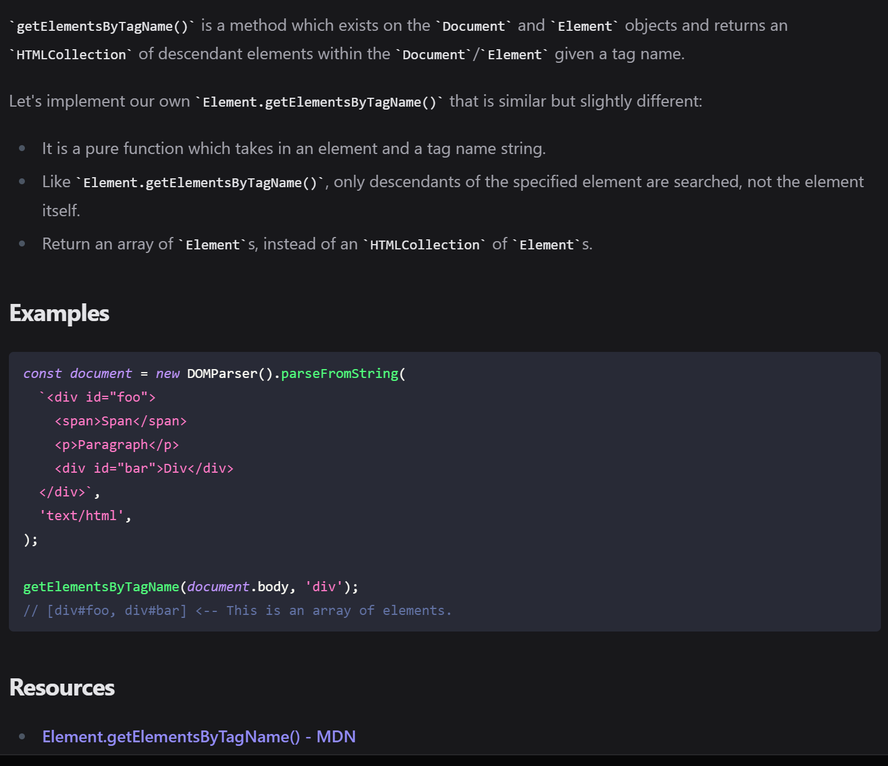
https://www.greatfrontend.com/questions/javascript/get-elements-by-tag-name?list=one-week

Solution:
```js
/**
 * @param {Element} el
 * @param {string} tagName
 * @return {Array<Element>}
 */
export default function getElementsByTagName(el, tagNameParam) {
  const elements = [];
  const tagName = tagNameParam.toUpperCase();

  const fillElement = (element) => {

    if(element.tagName === tagName)
      elements.push(element);
    
    for(let child of element.children)
      fillElement(child);
  }

  for(let child of el.children){
    fillElement(child);
  }

  return elements;
}
```

---
</details>


<details >
 <summary style="font-size: small; font-weight: bold">07. jQuery.css</summary>

###### 07

**Question:**
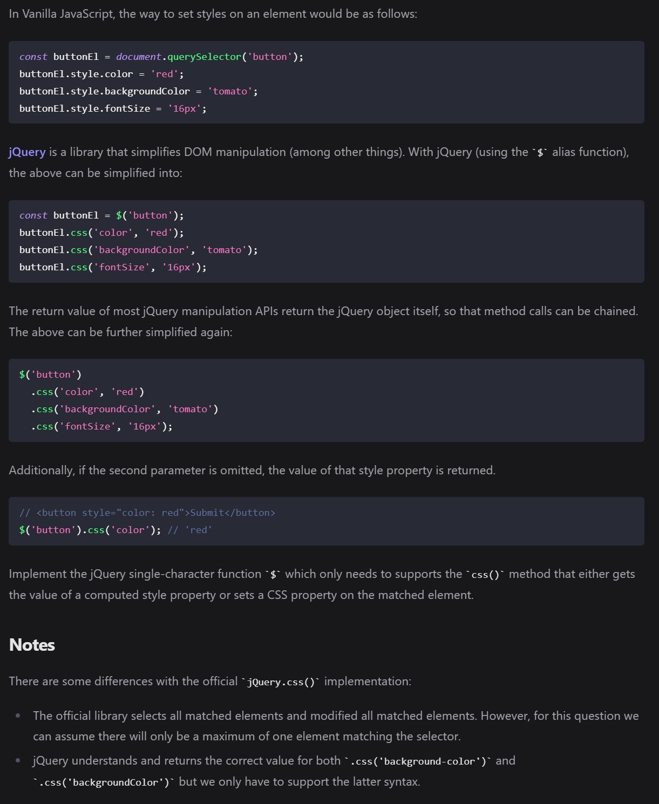
https://www.greatfrontend.com/questions/javascript/jquery-css?list=one-week

Solution:

❌❌❌**Below Solution don't work**

```js
/**
 * @param {string} selector
 * @return {{css: Function}}
 */
export default function $(selector) {

const element = document.querySelector(selector);

  return {
    css: function (property, value) {

    if(!element)
          return undefined;

    if(!value){
      if(property === undefined)
        return undefined;

      const val = element.style[property];
      return val === '' ? undefined : val;
    }

    if(property)
      element.style[property] = value;
    
      return this;
    }
  } 
}
```
This solution might look like working for most testcase but it throw error:
```html
Error name:    "TypeError"
Error message: "Cannot read properties of undefined (reading 'css')"
```
Test Case:
```js
import $ from './jquery-css';

describe('jQuery.css', () => {
  beforeEach(() => {
    document.body.innerHTML = '<button style="color: blue">Click me</button>';
  });

 test('no elements match the selector', () => {
      expect(() => {
        // @ts-ignore
        $('no-such-thing').css('color', 'red').css('fontSize', '12px');
      }).not.toThrow();
    });
});
```

**IMPORTANT:** Since here there is no element with `no-such-thing` selector in given html, so above code
will return `undefined` which will cause error because next chained function will 
try to call `css` function on `undefined` element. Therefore it is important to always 
return this in **`CHAINED Function`** calls


✅Below is correct solution
```js
/**
 * @param {string} selector
 * @return {{css: Function}}
 */
export default function $(selector) {

const element = document.querySelector(selector);

  return {
    css: function (property, value) {
    
    if(!value){
      if(property === undefined)
        return undefined;

      if(!element)
          return undefined;

      const val = element.style[property];
      return val === '' ? undefined : val;
    }

    if(element && property)
      element.style[property] = value;
    
      return this;
    }
  } 
}
```

Only when things are defined we are getting inside and doing operation
of returning property value or setting value of property

---
</details>


<details >
 <summary style="font-size: small; font-weight: bold">08. Identical DOM Trees</summary>

###### 08

**Question:**
https://www.greatfrontend.com/questions/javascript/identical-dom-trees
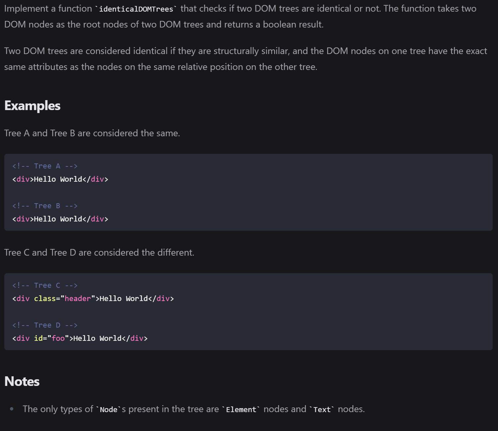


**1. My Solution:**

**Below are solution pass all testcases but there are scenarios where it might fail.
So check for second solution from GreatFrontend**

```js
export default function identicalDOMTrees(nodeAParam, nodeBParam) {

  const isIdentical = (nodeA, nodeB) => {
    
    if(nodeA.tagName !== nodeB.tagName)
      return false;
    
    if(nodeA.classList.value !== nodeB.classList.value)
      return false;
    
    if(nodeA.children.length !== nodeB.children.length)
      return false;
    
    /**
     * `innerText` also clear all testcase but
     * scenario where display is none, innerText will skip
     * that part and might yield wrong result if anything
     * different is there in both node
     */
    if(nodeA.textContent !== nodeB.textContent)
      return false;
    
    if(JSON.stringify(nodeA.style) !== JSON.stringify(nodeB.style))
      return false;
      
    if(JSON.stringify(nodeA.dataset) !== JSON.stringify(nodeB.dataset))
       return false;
     

    for(let i = 0; i < nodeA.children.length; i++){
      if(!isIdentical(nodeA.children[i], nodeB.children[i]))
        return false;
    }

    return true;
  }

  return isIdentical(nodeAParam, nodeBParam)
}
```

**2. GreatFrontend Solution:**

```js
/**
 * @param {Node} nodeA
 * @param {Node} nodeB
 * @return {boolean}
 */
export default function identicalDOMTrees(nodeA, nodeB) {
  if (nodeA.nodeType !== nodeB.nodeType) {
    return false;
  }

  if (nodeA.nodeType === Node.TEXT_NODE) {
    return nodeA.textContent === nodeB.textContent;
  }

  // We can assume it's an element node from here on.
  if (nodeA.tagName !== nodeB.tagName) {
    return false;
  }

  if (nodeA.childNodes.length !== nodeB.childNodes.length) {
    return false;
  }

  if (nodeA.attributes.length !== nodeB.attributes.length) {
    return false;
  }

  const hasSameAttributes = nodeA
    .getAttributeNames()
    .every(
      (attrName) =>
        nodeA.getAttribute(attrName) === nodeB.getAttribute(attrName),
    );

  if (!hasSameAttributes) {
    return false;
  }

  return Array.prototype.every.call(nodeA.childNodes, (childA, index) =>
    identicalDOMTrees(childA, nodeB.childNodes[index]),
  );
}
```

There are quite a bit of DOM-specific APIs you will have to use to implement such a function. And it is ok if you are not familiar with them. In practice, you usually do not need to write low-level DOM manipulation code anymore.

Here are the DOM APIs we have covered in this solution:

1. We use `nodeType` when checking the types of nodes. There is a similar API called `tagName` that only works for HTML elements, not for text nodes and comment nodes. Check out this tutorial if you want to learn more about their differences.
2. We use the `childNodes` property - as opposed to the `children` property - to get the list of children nodes. The reason is, again, `children` only returns elements while `childNodes` returns all nodes, including text nodes and comment nodes. Check out this MDN page if you want to learn more about their differences.
3. We "borrowed" the `every` method from `Array.prototype` via `Array.prototype.every.call(treeA.childNodes)` as opposed to just calling every on `childNodes`. This is because what `childNodes` returns is not a JavaScript array, rather an array-like data structure called `NodeList`, which doesn't come with all the array methods right out of box. Calling array methods such as every on it would throw an error. The other way to use array methods on a `NodeList` is to convert it to an array first via `Array.from.` i.e. `Array.from(treeA.childNodes).every(...)`.


**3. One-liner Solution**

```js
function identicalDOMTrees(treeA, treeB) {
  return treeA.isEqualNode(treeB);
}
```

---
</details>


<details >
 <summary style="font-size: small; font-weight: bold">09. Squash Object</summary>

###### 09

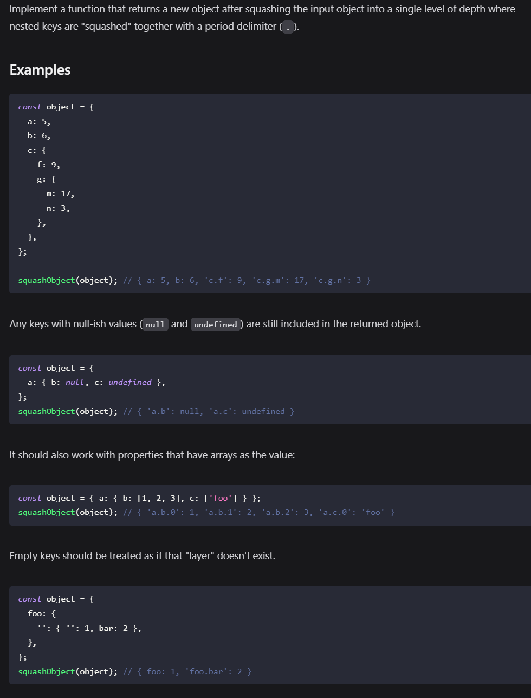
Question: https://www.greatfrontend.com/questions/javascript/squash-object

**1. My Solution** 
```js
/**
 * @param {Object} obj
 * @return {Object}
 */
export default function squashObject(obj) {
    const res = {};

    solve(null, obj, res);

    return res;
}

function solve(parent, obj, res){

    const arr = Object.entries(obj);

    for(let [key, val] of arr){
        const newKey = parent ? (parent + (key ? '.' + key : '')) : key;

        if(typeof val === 'object'){
            if(val === null){
                res[newKey] = val;
            }
            /**
             * Below 'else if' not required because `Object.entries`
             * for Object.entries([1,2,3]) will return
             * [['0', 1], ['1', 2], ['2', 3]]
             */
            // else if(Array.isArray(val)){ 
            //   solve(newKey, {...val}, res)
            // }
            else{
                solve(newKey, val, res);
            }
        }
        else{
            res[newKey] = val;
        }
    }

    return res;
}
```

**2. Clean Solution Syntactically:**

```js
/**
 * @param {Object} obj
 * @return {Object}
 */
export default function squashObject(obj) {
  function squashImpl(obj_, path, output) {
    for (const [key, value] of Object.entries(obj_)) {
      if (typeof value !== 'object' || value === null) {
        output[path.concat(key).filter(Boolean).join('.')] = value;
      } else {
        squashImpl(value, path.concat(key), output);
      }
    }
  }

  const out = {};
  squashImpl(obj, [], out);
  return out;
}
```

---
</details>


<details >
 <summary style="font-size: small; font-weight: bold">10. Camel Case Keys</summary>

###### 10

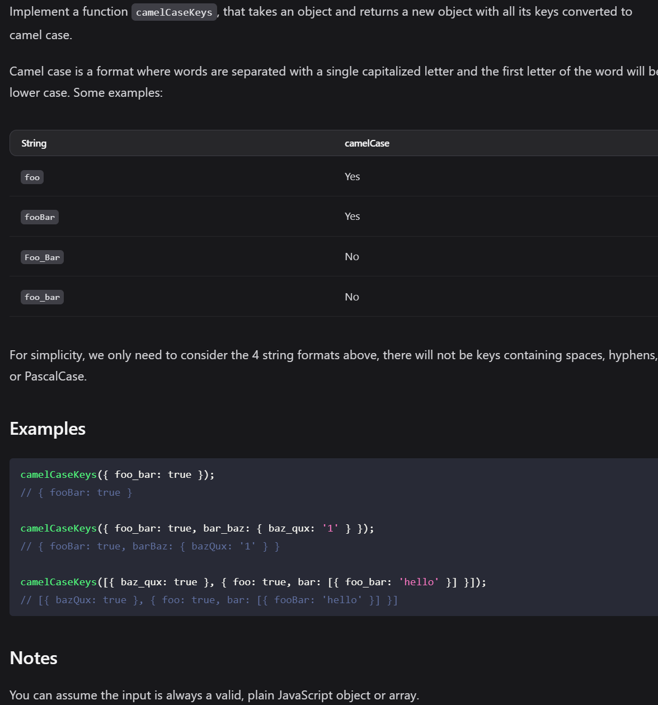

Question: https://www.greatfrontend.com/questions/javascript/camel-case-keys?list=three-months


**1. My Solution:**
```js
/**
 * @param Object
 * @return Object
 */
export default function camelCaseKeys(object) {
  /**
   * If its not object then it will be plain value,
   * therefore just return 
  */
  if(typeof object !== 'object' || object === null)
    return object;

  if(Array.isArray(object)){
    const newArr = [];

    for(let el of object){
      newArr.push(camelCaseKeys(el));
    }

    return newArr;
  }

  
  const res = {};
  const arr = Object.entries(object);

  for(let [key, val] of arr){
    const newKey = convertKeyToCamelCase(key);
    const newValue = camelCaseKeys(val);
    res[newKey] = newValue;
  }

  return res;
}

function convertKeyToCamelCase(key){
  const arr = key.split('_');

  let res = arr[0].slice(0,1).toLowerCase() + arr[0].slice(1);

  for(let i = 1; i < arr.length; i++){
    let temp = arr[i].slice(0,1).toUpperCase() + arr[i].slice(1);
    res += temp;
  }

  return res;
}
```

**2. Clean Solution Syntactically:**
```js
/**
 * @param {string} str
 * @return {string}
 */
function camelCase(str) {
  return str
    .toLowerCase()
    .replace(/([_])([a-z])/g, (_match, _p1, p2) => p2.toUpperCase());
}

/**
 * @param Object
 * @return Object
 */
export default function camelCaseKeys(object) {
  if (Array.isArray(object)) {
    return object.map((item) => camelCaseKeys(item));
  }

  if (typeof object !== 'object' || object === null) {
    return object;
  }

  return Object.fromEntries(
    Object.entries(object).map(([key, value]) => [
      camelCase(key),
      camelCaseKeys(value),
    ]),
  );
}

```

---
</details>


<details >
 <summary style="font-size: small; font-weight: bold">11. Camel Case Keys</summary>

###### 11

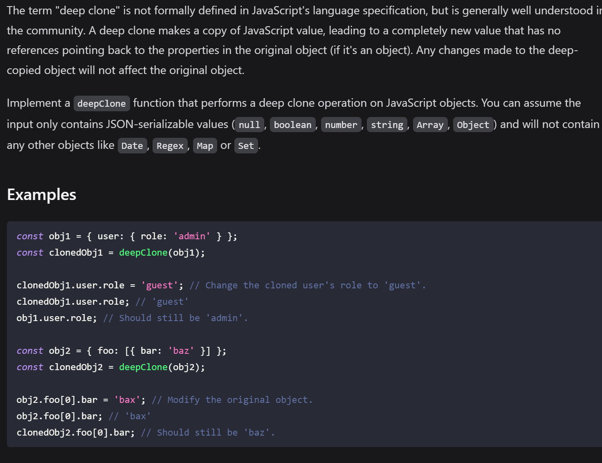
Question: https://www.greatfrontend.com/questions/javascript/deep-clone?list=three-months


**1. My Solution:**
```js
/**
 * @template T
 * @param {T} value
 * @return {T}
 */
export default function deepClone(value) {
  if(typeof value !== 'object' || value === null)
    return value;

  if(Array.isArray(value)){
    const newArr = [];

    for(let val of value){
      newArr.push(deepClone(val));
    }

    return newArr;
  }

  const clonedObj = {};

  const arr = Object.entries(value);

  for(let [key, val] of arr){
    clonedObj[key] = deepClone(val);
  }

  return clonedObj;
}
```
Here are I am just trying to focus on value which are not a `Primitive type`,
any other value will have `reference` which we need to remove like `Object`, `Array` etc


**2. Clean Solution Syntactically:**
```js
/**
 * @template T
 * @param {T} value
 * @return {T}
 */
export default function deepClone(value) {
  if (typeof value !== 'object' || value === null) {
    return value;
  }

  if (Array.isArray(value)) {
    return value.map((item) => deepClone(item));
  }

  return Object.fromEntries(
    Object.entries(value).map(([key, value]) => [key, deepClone(value)]),
  );
}

```

**3. Not Allowed Solution:**

The easiest (but flawed) way to deep copy an object in JavaScript is to first serialize it and then deserialize it back via `JSON.stringify` and `JSON.parse`.

```js
export default function deepClone(value) {
  return JSON.parse(JSON.stringify(value));
}
```

Although this approach is acceptable given the input object only contains `null`, `boolean`, `number`, `string`, you should be aware of the downsides of this approach:

1. We can only copy non-symbol-keyed properties whose values are supported by JSON. Unsupported data types are simply ignored.
2. `JSON.stringify` also has other a few surprising behaviors such as converting Date objects to ISO timestamp strings, NaN and Infinity becoming null etc.


**4. One-Liner Solution:**

```js
const clonedObj = structuredClone(obj);
```
all major browsers have native support for performing deep clone via the `structuredClone` API.
https://web.dev/articles/structured-clone

---
</details>


<details >
 <summary style="font-size: small; font-weight: bold">12. Text Search 1 & 2</summary>

###### 12

### Text Search 1
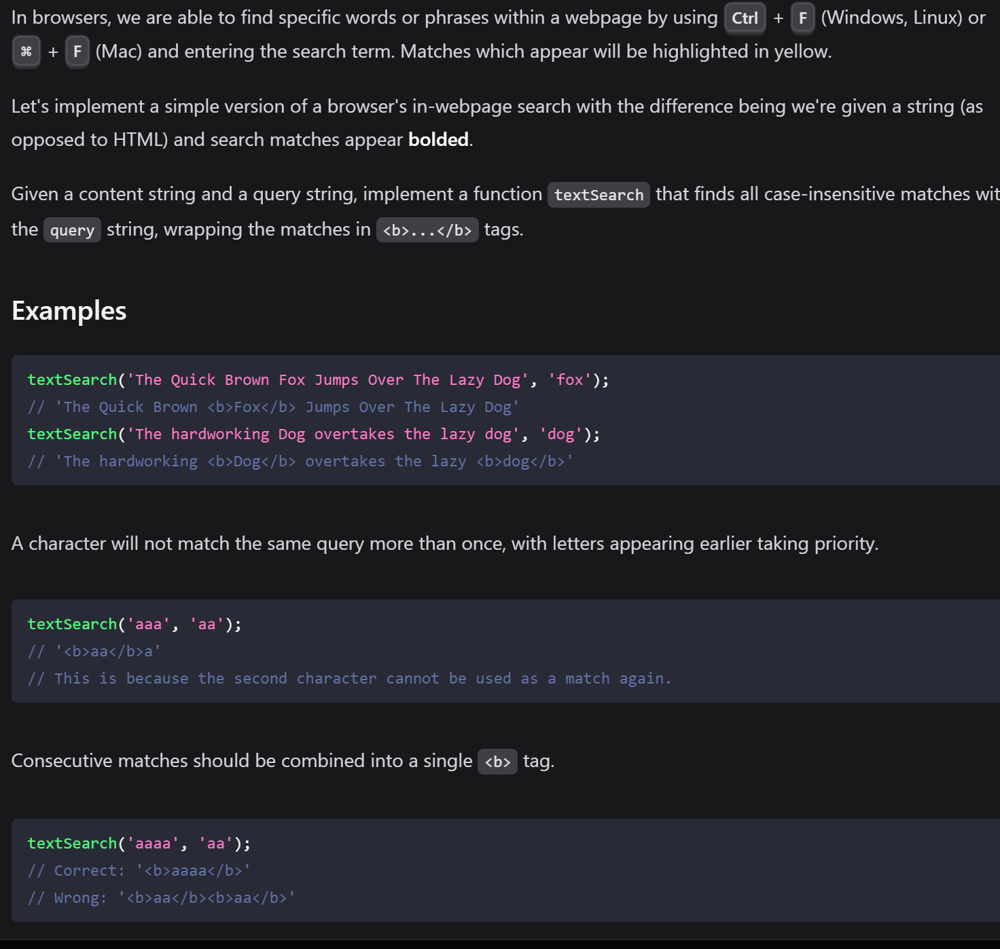
Question: https://www.greatfrontend.com/questions/javascript/text-search?list=three-months

**1. My Solution:**

```js
/**
 * @param {string} text
 * @param {string} query
 * @return {string}
 */
export default function textSearch(text, query) {
  const len = query.length;
  if(len === 0)
    return text;

  let res = "";
  let start = 0;
  const queryLow = query.toLowerCase();

  for(let i = len; i < text.length; i++){
    const word = text.substring(i - len, i);
    if(word.toLowerCase() === queryLow){
      res += text.substring(start, i - len) + `<b>${word}</b>`;
      start = i;
      i = i + len - 1;
    }
    console.log("res : ", res);
  }
  res += text.substring(start, text.length);
  
  return res.replaceAll('</b><b>', '');
}
```


### Text Search 2
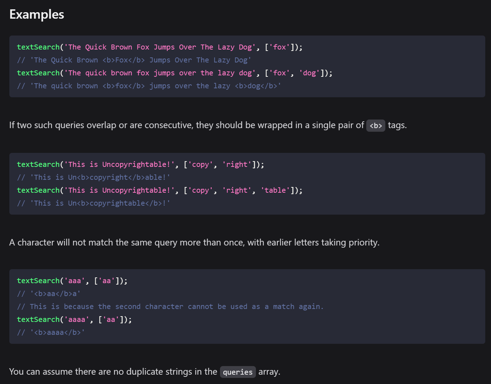
https://www.greatfrontend.com/questions/javascript/text-search-ii?list=three-months

**Solution:**

Above solution won't work here since we have overlapping and multiple queries

```js
// #1: Basic case.
// text: "aaabcaa", queries: ['abc']
// boldChars: [false, false, true, true, true, false, false]
// result: "aa<b>abc</b>aa"

// #2: Non-overlapping case.
// text: "aaabcaabc", queries: ['abc']
// boldChars: [false, false, true, true, true, false, true, true, true]
// result: "aa<b>abc</b>a<b>abc</b>"

// #3: Overlapping case.
// text: "baabcaa", queries: ['abc', 'aa']
// boldChars: [false, true, true, true, true, true true]
// result: "a<b>aabcaa</b>"

```

```js
/**
 * @param {string} text
 * @param {Array<string>} queries
 * @return {string}
 */
export default function textSearch(text, queries) {
  if (text.trim() === '') {
    return text;
  }

  const boldChars = Array.from({ length: text.length }, () => 0);

  for (const query of queries) {
    if (query.trim() === '') continue;
    for (let i = 0; i < text.length; ) {
      const substr = text.slice(i, i + query.length);
      if (substr.toLowerCase() === query.toLowerCase()) {
        boldChars.fill(1, i, i + query.length);
        // Start from next character if there's a match since one
        // character cannot match the same query more than once.
        i = i + query.length;
      } else {
        i++;
      }
    }
  }

  let highlightedString = '';
  for (let i = 0; i < text.length; i++) {
    // When the current character should be bolded
    // and the previous character should not be bolded,
    // append an opening tag to the final string.
    const shouldAddOpeningTag = boldChars[i] === 1 && boldChars[i - 1] !== 1;
    // When the current character should be bolded
    // and the next character should not be bolded,
    // append a closing tag to the final string.
    const shouldAddClosingTag = boldChars[i] === 1 && boldChars[i + 1] !== 1;
    let char = text[i];

    if (shouldAddOpeningTag) {
      char = '<b>' + char;
    }

    if (shouldAddClosingTag) {
      char = char + '</b>';
    }
    highlightedString += char;
  }

  return highlightedString;
}

```

---
</details>
