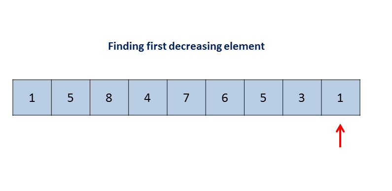
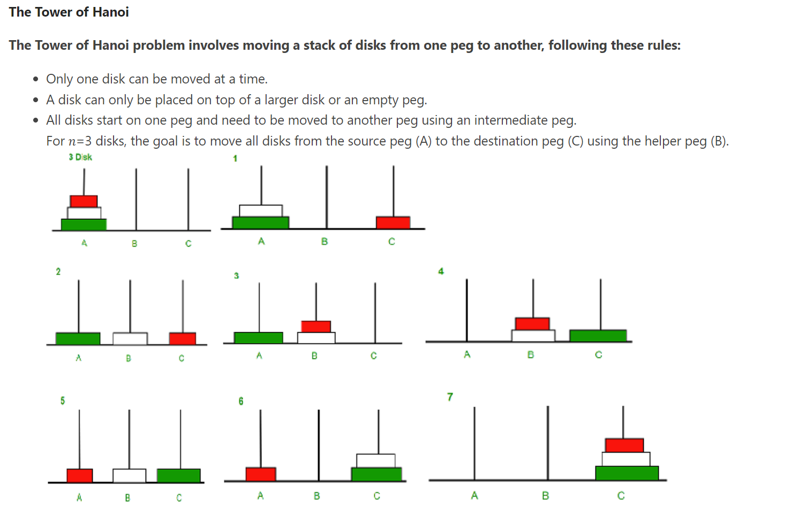
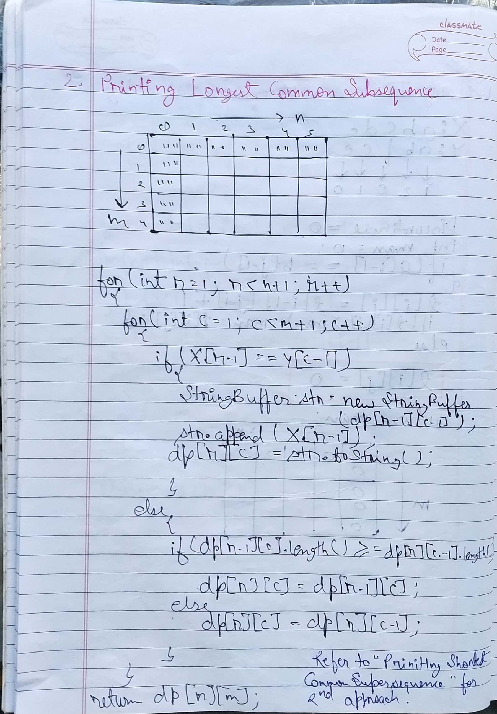
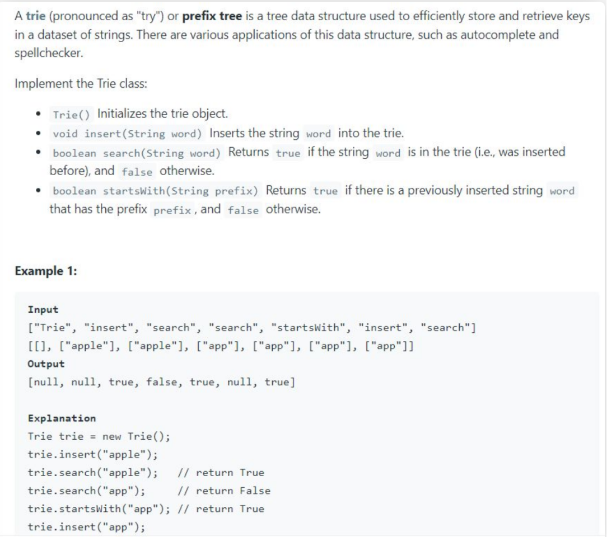

<details >
 <summary style="font-size: x-large; font-weight: bold">General Important Concepts</summary>


</details>


<details >
 <summary style="font-size: x-large; font-weight: bold">Array</summary>

<details >
 <summary style="font-size: large; font-weight: bold">Concept</summary>
</details>


<details >
 <summary style="font-size: large; font-weight: bold">Important Examples</summary>

<details >
 <summary style="font-size: medium; font-weight: bold">1. Next Permutation</summary>

Question:https://leetcode.com/problems/next-permutation/description/


### 1. My Solution
- Time Complexity-`O(n*log n)`
- Space Complexity-`O(1)`

_Do It in JS_
```js
class Solution {
    public void nextPermutation(int[] nums) {
        int l=nums.length;
        if(l==0 || l==1)
            return;
        boolean flag=false;
        for(int i=1;i<l;i++){
            if(nums[i-1]<nums[i])
                flag=true;
        }
        if(!flag){
            Arrays.sort(nums);
            return ;
        }
        int index=0;
        for(int i=l-1;i>0;i--){
            if(nums[i]>nums[i-1]){
                index=i-1;
                break;
            }
        }
        int min=Integer.MAX_VALUE;
        int hold=index;
        for(int i=index+1;i<l;i++){
            if(nums[i]>nums[index] && nums[index]<min){
                min=nums[i];
                hold=i;
            }
        }
        int temp=nums[index];
        nums[index]=nums[hold];
        nums[hold]=temp;
        Arrays.sort(nums,index+1,l);
}
}
```

### 2. Leetcode solution



- Time Complexity: `O(n)`
- Space Complexity: `O(1)`


```js
public class Solution {
    public void nextPermutation(int[] nums) {
        int i = nums.length - 2;
        while (i >= 0 && nums[i + 1] <= nums[i]) {
            i--;
        }
        if (i >= 0) {
            int j = nums.length - 1;
            while (j >= 0 && nums[j] <= nums[i]) {
                j--;
            }
            swap(nums, i, j);
        }
        reverse(nums, i + 1);
    }

    private void reverse(int[] nums, int start) {
        int i = start, j = nums.length - 1;
        while (i < j) {
            swap(nums, i, j);
            i++;
            j--;
        }
    }

    private void swap(int[] nums, int i, int j) {
        int temp = nums[i];
        nums[i] = nums[j];
        nums[j] = temp;
    }
}
```
</details>
</details>

</details>


<details >
 <summary style="font-size: x-large; font-weight: bold">Binary Search</summary>

<details >
 <summary style="font-size: large; font-weight: bold">Concept</summary>


- **Identification :** Always look in question whether **things are sorted or not**. If sorted then think thoroughly using below approach whether we can solve given question using Binary Search.
- **Approach :**
  1. Look out for target, if it is **directly not given** then think in **terms of range where target may lie**.
  2. It may also happen that sometime we may need to use binary search **without any target**, but depending on some different criteria like in "Median of Two Sorted Arrays" where cut should be made in smaller array etc.  For getting idea about different criteria think naively what we need to break this problem.
  3. Then think about the criteria upon which you will **eliminate left or right half**.
  4. **In indirect target start recalibrating your target using** 2nd point found criteria.
</details>


<details >
 <summary style="font-size: large; font-weight: bold">Important Examples</summary>

<details >
 <summary style="font-size: medium; font-weight: bold">1. First & Last Occurrence of a Element / Count of an Element</summary>

Question: https://www.geeksforgeeks.org/problems/number-of-occurrence2259/1


```js
class Solution {
    
    count(arr,n,x){
        const firstOccurencePos = this.firstOccurence(arr, n, x);
        const lastOccurencePos = this.lastOccurence(arr, n, x);
        
        if(firstOccurencePos === -1)
            return 0;
        
        return lastOccurencePos - firstOccurencePos + 1;
    }
    
    firstOccurence(arr, n, x){
        let start = 0;
        let end = n - 1;
        let res = -1;
        
        while(start <= end){
            const mid = start + Math.floor((end - start) / 2);
 
            if(arr[mid] === x){
                end = mid - 1;
                res = mid;
            }
            else if(arr[mid] > x){
                end = mid - 1;
            }
            else{
                start = mid + 1;
            }
        }
        
        return res;
    }
    
    lastOccurence(arr, n, x){
        let start = 0;
        let end = n - 1;
        let res = -1;
        
        while(start <= end){
            const mid = start + Math.floor((end - start) / 2);
            
            if(arr[mid] === x){
                start = mid + 1;
                res = mid;
            }
            else if(arr[mid] > x){
                end = mid - 1;
            }
            else{
                start = mid + 1;
            }
        }
        
        return res;
    }
}
```
</details>


<details >
 <summary style="font-size: medium; font-weight: bold">2. Number of times a Sorted Array is Rotated</summary>


</details>


<details >
 <summary style="font-size: medium; font-weight: bold">3. Find element in Rotated Sorted Array</summary>


</details>


<details >
 <summary style="font-size: medium; font-weight: bold">4. Searching in a Nearly Sorted Array</summary>


</details>


<details >
 <summary style="font-size: medium; font-weight: bold">5. Find position of an element in a Infinite Sorted Array</summary>


</details>


<details >
 <summary style="font-size: medium; font-weight: bold">6. Index of First 1 in a Binary Sorted Infinite Array</summary>


</details>


<details >
 <summary style="font-size: medium; font-weight: bold">8. Peak Element</summary>


</details>


<details >
 <summary style="font-size: medium; font-weight: bold">9. Find Maximum element in Bitonic Array</summary>


</details>


<details >
 <summary style="font-size: medium; font-weight: bold">10. Search an element in Bitonic Array</summary>


</details>

<details >
 <summary style="font-size: medium; font-weight: bold">11. Search in Row-wise & Column-wise Sorted Array</summary>


</details>

</details>

</details>


<details >
 <summary style="font-size: x-large; font-weight: bold">Sliding Window</summary>

<details >
 <summary style="font-size: large; font-weight: bold">Concept</summary>


### Fixed Size Window Template


### Variable Size Window Template


</details>


<details >
 <summary style="font-size: large; font-weight: bold">Important Examples</summary>

<details >
 <summary style="font-size: medium; font-weight: bold">1. Maximum Sum Subarray of Size K</summary>

Question: https://www.geeksforgeeks.org/problems/max-sum-subarray-of-size-k5313/1


```js
/**
 * @param {number} K
 * @param {number[]} Arr
 * @param {number} N
 * @return {number}
 */
class Solution {
  maximumSumSubarray(k, arr, n) {
    let i = 0;
    let j = 0;
    let sum = 0;
    let res = 0;
    
    while(j < n){
        sum += arr[j];
        
        res = Math.max(res, sum);
        
        if(j - i + 1 < k){
            j++;
        }
        else{
            sum -= arr[i];
            i++;
            j++;
        }
    }
    
    return res;
  }
}

```
</details>


<details >
 <summary style="font-size: medium; font-weight: bold">2. First -ve number in every window of size K</summary>

Question: https://www.geeksforgeeks.org/problems/first-negative-integer-in-every-window-of-size-k3345/1


```js
class Solution {
/**
* @param number n
* @param number k
* @param number[] arr

* @returns number[]
*/
    printFirstNegativeInteger(n, k, arr) {
        let i = 0;
        let j = 0;
        const queue = [];
        const res = Array(n - k + 1).fill(0);
        
        while(j < n){
            if(arr[j] < 0)
                queue.push(arr[j]);
            
            if(j - i + 1 < k){
                j++;
            }
            else{
                if(queue.length !== 0){
                    res[i] = queue[0];
                    
                    if(arr[i] === queue[0])
                        queue.shift();
                }
                    
                i++;
                j++;
            }
        }
        
        return res;
    }
}
```
</details>


<details >
 <summary style="font-size: medium; font-weight: bold">3. Minimum Window Substring</summary>

- Using variable sliding window
- Time - O(|s|)
- Space - O(|t|)
- Very good question

**Identification :**
1. Involves string & substring
2. Condition given
3. Minimize window size K


</details>

</details>

</details>


<details >
 <summary style="font-size: x-large; font-weight: bold">Stack</summary>

<details >
 <summary style="font-size: large; font-weight: bold">Concept</summary>


**Identification:**
1. There is high probability that stack questions are on `ARRAY`.
2. Reducing time complexity from `O(n ^ 2) to O(n)`
3. Two FOR loop where `j is dependent on i`.
</details>


<details >
 <summary style="font-size: large; font-weight: bold">Important Examples</summary>

<details >
 <summary style="font-size: medium; font-weight: bold">1. Nearest Greater to Right / Next Largest Element / Nearest Smaller Element</summary>


Question: https://www.interviewbit.com/problems/nearest-smaller-element/


```js
function(A){
    const res = [];
    const stack = [];
    
    for(let a of A){
        while(stack.length !== 0 && stack[stack.length - 1] >= a){
            stack.pop();
        }
        
        if(stack.length === 0)
            res.push(-1);
        else
            res.push(stack[stack.length - 1]);
            
        stack.push(a);
    }
    
    return res;
}
```
</details>


<details >
 <summary style="font-size: medium; font-weight: bold">3. Stock Span Problem</summary>


</details>


<details >
 <summary style="font-size: medium; font-weight: bold">4. Maximum Area Histogram</summary>


</details>


<details >
 <summary style="font-size: medium; font-weight: bold">5. Max Area Rectangle in Binary Matrix</summary>


</details>


<details >
 <summary style="font-size: medium; font-weight: bold">6. Rain Water Trapping</summary>


</details>


<details >
 <summary style="font-size: medium; font-weight: bold">7. Minimum Element in Stack</summary>


</details>

</details>
</details>


<details >
 <summary style="font-size: x-large; font-weight: bold">Recursion</summary>

<details >
 <summary style="font-size: large; font-weight: bold">Concept</summary>


**Input-Output Method**


**IBH(Induction - Base Condition - Hypothesis)**


Referred Video: https://youtube.com/playlist?list=PL_z_8CaSLPWeT1ffjiImo0sYTcnLzo-wY&si=0Xck63pHJ1y7DBp4
</details>

<details >
 <summary style="font-size: large; font-weight: bold">Important Examples</summary>

<details >
 <summary style="font-size: medium; font-weight: bold">1. Height of Binary Tree</summary>


```js
/**
 * Definition for a binary tree node.
 * function TreeNode(val, left, right) {
 *     this.val = (val===undefined ? 0 : val)
 *     this.left = (left===undefined ? null : left)
 *     this.right = (right===undefined ? null : right)
 * }
 */
/**
 * @param {TreeNode} root
 * @return {number}
 */

 let res = 0;
var maxDepth = function(root) {
    if(!root)
        return 0;

    solve(root);

    const ans = res;
    res = 0;


    return ans;
};

function solve(root) {
    //Base Condition
    if(!root)
        return 0;

    //Hypothesis
    const lh = solve(root.left);
    const rh = solve(root.right);

    //Induction
    const temp = Math.max(lh, rh) + 1;
    res = Math.max(temp, res);

    return temp;
}
```

Leetcode: https://leetcode.com/problems/maximum-depth-of-binary-tree/
Referred Video: https://www.youtube.com/watch?v=aqLTbtWh40E&list=PL_z_8CaSLPWeT1ffjiImo0sYTcnLzo-wY&index=5
</details>

<details >
 <summary style="font-size: medium; font-weight: bold">2. Sort An Array </summary>


#### Recursion
```js
/**
 * @param {number[]} nums
 * @return {number[]}
 */
var sortArray = function(nums) {
    //Base Condition
    if(nums.length === 1)
        return nums;
    
    //Hypothesis(reducing input & calling again)
    const temp = nums.pop();
    sortArray(nums);

    //Induction
    insert(nums, temp);
    
    return nums;
};

function insert(arr, val) {
    //Base Condition
    const len = arr.length;
    if(len === 0 || val >= arr[len - 1]){
        arr.push(val);
        return;
    }

    //Hypothesis(reducing input & calling again)
    const temp = arr.pop();
    insert(arr, val);

    //Induction
    arr.push(temp);
}
```

#### Merge Sort

````js
/**
 * @param {number[]} nums
 * @return {number[]}
 */
function sortArray(nums) {
    const len = nums.length;
    mergeSort(0, len - 1, nums);
    
    return nums;
};

function mergeSort(p, r, nums) {
    if(p < r){
        const q = Math.floor((p + r) / 2);
        mergeSort(p, q, nums);
        mergeSort(q + 1, r, nums);
        merge(p, q, r, nums);
    }
}

function merge(p, q, r, nums) {
    const len1 = (q - p) + 2;
    const len2 = (r - q) + 1;

    const arr1 = new Array(len1);
    const arr2 = new Array(len2);

    for(let i = 0; i < len1 - 1; i++){
        arr1[i] = nums[p + i];
    }
    arr1[len1 - 1] = Infinity;


    for(let i = 0; i < len2 - 1; i++){
        arr2[i] = nums[q + i + 1];
    }
    arr2[len2 - 1] = Infinity;

    let i = 0;
    let j = 0;
    let k = p;

    while(k <= r){
        if(arr1[i] <= arr2[j]){
            nums[k] = arr1[i];
            i++;
        }
        else{
            nums[k] = arr2[j];
            j++;
        }
        k++;
    }
}
````
Leetcode: https://leetcode.com/problems/sort-an-array/
<br>
Referred Video: https://www.youtube.com/watch?v=AZ4jEY_JAVc&list=PL_z_8CaSLPWeT1ffjiImo0sYTcnLzo-wY&index=6
</details>


<details >
 <summary style="font-size: medium; font-weight: bold">3. Sort a Stack </summary>


</details>


<details >
 <summary style="font-size: medium; font-weight: bold">4. Delete Middle Element of a Stack</summary>


- Using recursion
- Time -` O(n / 2)`
- Space - `O(n / 2)`

1. **Identification :** Deleting without extra space possible only through recursion.
2. **Approach :** Able to reduce the input size to solve the problem, so **IBH**
</details>


<details >
 <summary style="font-size: medium; font-weight: bold">5. Reverse a Stack</summary>

Question: https://www.geeksforgeeks.org/problems/reverse-a-stack/1


- Time - `O(n)`
- Space - `O(1)` or Auxiliary space - `O(n)`

1. **Identification :** Reversing without extra space only possible with stack.
2. **Approach :** Able to reduce input sixe to solve the problem, so **IBH**.

```js
class Solution {
    //Function to reverse a string.
    reverse(s) {
        //Base Condition
        if(s.length === 0)
            return;
            
        //Hypothesis
        const temp = s.pop();
        this.reverse(s);
        
        //Induction
        this.insert(s, temp);
    }
    
    insert(s, val) {
        //Base Condition
        if(s.length === 0){
            s.push(val);
            return;
        }
        
        //Hypothesis
        const temp = s.pop();
        this.insert(s, val);

        //Induction
        s.push(temp);
    }
}
```


My Java solution(Different from above notes because of question return type, but same time & space complexity)
```js
class Solution
{ 
    
    static ArrayList<Integer> reverse(Stack<Integer> s)
    {
        ArrayList<Integer> res = new ArrayList<>();
        
        return reverseStack(s, res);
    }
    
    static ArrayList<Integer> reverseStack(Stack<Integer> s,
    ArrayList<Integer> res){
        /** Base Condition **/
        if(s.isEmpty())
            return new ArrayList<>();
            
        /** Induction **/
        int temp = s.pop();
        res.add(temp);
            
        /** Hypothesis **/  
        reverseStack(s, res);
        
        return res;
    }
}
```
</details>


<details >
 <summary style="font-size: medium; font-weight: bold">6. Kth Symbol in Grammar</summary>

Question: https://leetcode.com/problems/k-th-symbol-in-grammar/


1. My TLE Solution:
```js
/**
 * @param {number} n
 * @param {number} k
 * @return {number}
 */
 let s = '0';
var kthGrammar = function(n, k) {
    getFullString(1, n);

    const res = Number(s[k - 1]);
    s = '0';

    return res;
};

function getFullString(input, n){
    if(input === n)
        return;

    getFullString(input + 1, n);

    const arr = s.split('');

    s = '';
    for(let a of arr){
        if(a === '0')
            s += '01';
        else
            s += '10';
    }

    return;
}
```

2.


- Recursion
- Time - `O(n / 2)`
- Space - Auxiliary space `O( n / 2)`
1. **Identification :** Problem itself is defined **recursively**.
2. **Approach :** Reducing input size we are able to solve the problem, so **IBH**
```js
/**
 * @param {number} n
 * @param {number} k
 * @return {number}
 */
var kthGrammar = function(n, k) {
    //Base Condition
    if(n === 1 && k === 1)
        return 0;

    const mid = Math.floor(Math.pow(2, n - 1) / 2);

    //Induction (Here If else statement is induction)
    if(k <= mid){
        //Hypothesis 
        return kthGrammar(n - 1, k);
    } 
    else{
        //Hypothesis
        /*In case k bigger than mid we need to return Complementary value*/
        return kthGrammar(n - 1, k - mid) === 0 ? 1 : 0;
    }
};
```
</details>


<details >
 <summary style="font-size: medium; font-weight: bold">7. Tower of Hanoi</summary>

Question: https://www.geeksforgeeks.org/problems/help-the-old-man3848/1




```js
function towerOfHanoi(N){
    solve(1, 2, 3, N);
}

function solve(s, h, d, N){
    //Base Condition
    if(N === 1){
        console.log("Move plate from " + s + " to " + d);
        return;
    }
    
    //Hypothesis
    /* Here we are first moving N - 1 plate from source
    to helper box*/
    solve(s, d, h, N - 1);
    
    //Induction
    console.log("Move plate from " + s + " to " + d);
    /* After we move last plate to right place we will move remaining 
    N - 1 plate from helper to destination*/
    solve(h, s, d, N - 1);
    
    return;
}
```

Input:
```js
console.log("Number of plate = 1");
towerOfHanoi(1);

console.log("");

console.log("Number of plate = 2");
towerOfHanoi(2);

console.log("");

console.log("Number of plate = 3");
towerOfHanoi(3);
```

Output:
```bash
Number of plate = 1
Move plate from 1 to 3

Number of plate = 2
Move plate from 1 to 2
Move plate from 1 to 3
Move plate from 2 to 3

Number of plate = 3
Move plate from 1 to 3
Move plate from 1 to 2
Move plate from 3 to 2
Move plate from 1 to 3
Move plate from 2 to 1
Move plate from 2 to 3
Move plate from 1 to 3
```

Visual: https://www.mathsisfun.com/games/towerofhanoi.html
</details>


<details >
 <summary style="font-size: medium; font-weight: bold">8. Print Subsets / Print Powersets</summary>

Question: https://leetcode.com/problems/subsets/description/


**Recursive Solution:**


- Time - `O(2 ^ N)`
- Space - Auxiliary Space `O(2 ^ N)`
1. Identification - It involves choice & decision whether to add a value to result list or not, so **recursion**.
2. Approach - It involves decision in each step, so **Input-Output** method.
```js
/**
 * @param {number[]} nums
 * @return {number[][]}
 */
var subsets = function(nums) {
    let res = [];

    solve(nums, [], res);

    return Array.from(res);
};

function solve(input, output, res){
    if(input.length === 0){
        res.push(output);
        return;
    }
        
    const temp = input.shift();
    
    /* using spread operator is important because if same input is
    * passed then second `solve` function won't even run because 
    * input will be empty by the it reaches second `solve`*/
    solve([...input], [...output], res);
    solve([...input], [...output, temp], res);
}
```

**Iterative Solution:**
```js
/**
 * @param {number[]} nums
 * @return {number[][]}
 */
var subsets = function(nums) {
    const res = [];

    res.push([]);

    for(let num of nums){
        const len = res.length;

        for(let i = 0; i < len; i++){
            const subset = [...res[i]];
            subset.push(num);
            res.push(subset);
        }
    }

    return res;
};
```
</details>


<details >
 <summary style="font-size: medium; font-weight: bold">9. Print Unique Subsets & Variations</summary>

Question: https://leetcode.com/problems/subsets-ii/description/


**Recursive Solution:**


- Time - `O(2 ^ N)`
- Space - Auxiliary space `O(2N * X)`, X = Length of each subset.
1. Identification : In here each step we need to make choice & decision, so recursion
2. Approach : Since in each step we are making decision, so **Input-Output** method

```js
/**
 * @param {number[]} nums
 * @return {number[][]}
 */
var subsetsWithDup = function(nums) {
    const set = new Set();

    solve(nums, [], set);

    const res = [];
    for(let [s] of set.entries())
        res.push(JSON.parse(s));

    return res;
};


function solve(input, output, set){
    if(input.length === 0){
        /* Here two thing to note:-
        1. Since Array are not primitive type hence using Stringifying
        is important to remove duplicate ones.
        2. Also `sorting` is important to get same value when numbers in
        array are shuffled */
        set.add(JSON.stringify(output.sort()));
        return;
    }

    const temp = input.shift();

    solve([...input], [...output], set);
    solve([...input], [...output, temp], set);
}
```

**Iterative Solution:**
```js
/**
 * @param {number[]} nums
 * @return {number[][]}
 */
var subsetsWithDup = function(nums) {
    const set = new Set();
    set.add(JSON.stringify([]))

    for(let num of nums){
        const newSet = new Set(set)

        for(let s of newSet){
            const subset = [...JSON.parse(s)];
            subset.push(num);
            set.add(JSON.stringify(subset.sort()));
        }
    }

    const res = [];

    for(let s of set.keys()){
        res.push(JSON.parse(s));
    }

    return res;
};
```
</details>


<details >
 <summary style="font-size: medium; font-weight: bold">10. Permutation with Spaces</summary>

Question: https://www.geeksforgeeks.org/problems/permutation-with-spaces3627/1


- Time - `O(2 ^ N)`
- Space -
1. Identification : In each step we need to make choice & decision, so recursion
2. Approach : Since each step involves decision, **Input-Output** method

```js
/**
 * @param {string} s
 * @return {string[]}
 */
class Solution {
  permutation(s) {
    const result = [];
    
    this.solve(s.slice(1), s[0], result);
    
    return result;
  }
  
  solve(input, output, result){
      if(input.length === 0){
          result.push(output);
          return;
      }
       
      const c = input[0];
      
      this.solve(input.slice(1), `${output} ${c}`, result);
      this.solve(input.slice(1), `${output}${c}`, result);
  }
}
```
</details>


<details >
 <summary style="font-size: medium; font-weight: bold">11. Permutation with Case Change</summary>


</details>


<details >
 <summary style="font-size: medium; font-weight: bold">12. Letter Case Permutation</summary>

Question: https://leetcode.com/problems/letter-case-permutation/description/


- Time - `O(2 ^ N)`
- Space -
1. Identification : In each step we need to make choices & decision, so **recursion**.
2. Approach : Since evry step involves descision making, so **Input-Output** method.

```js
/**
 * @param {string} s
 * @return {string[]}
 */
var letterCasePermutation = function(s) {
    const set = new Set();

    solve(s, '', set);

    return Array.from(set);
};

function solve(input, output, res){
    if(input.length === 0){
        res.add(output);
        return;
    }

    const c = input[0];

    if(c.charAt(0) >= '0' && c.charAt(0) <= '1'){
        solve(input.slice(1), `${output}${c}`, res);
    }
    else{
        solve(input.slice(1), `${output}${c.toLowerCase()}`, res);
        solve(input.slice(1), `${output}${c.toUpperCase()}`, res);
    }
}
```
</details>


<details >
 <summary style="font-size: medium; font-weight: bold">13. Generate All Balanced Parenthesis</summary>

Question: https://leetcode.com/problems/generate-parentheses/description/


- Time -
- Space -
1. Identification : In each step we need to make choice & decision, so recusrion.
2. Approach : Since each step involves decsion making, so **Input-Output** method.
```js
/**
 * @param {number} n
 * @return {string[]}
 */
var generateParenthesis = function(n) {
    const res = [];

    solve(n, n, '', res);

    return res;
};

function solve(open, close, output, res){
    if(open === 0 && close === 0){
        res.push(output);
        return;
    }

    if(open > 0)
        solve(open - 1, close, `${output}(`, res);
    
    if(close > 0 && close > open)
        solve(open, close - 1, `${output})`, res);
}
```
</details>


<details >
 <summary style="font-size: medium; font-weight: bold">14. Print N-bit Binary Numbers having more 1's than 0's for any Prefix</summary>


Question: https://www.geeksforgeeks.org/problems/print-n-bit-binary-numbers-having-more-1s-than-0s0252/1


- Time - `O(2 ^ N)`
- Space - `O(2 ^ N)`
1. Identification : In this we need to make **choices & decision** to whether add 1 or 0 in result string.
2. Approach : Through decision we able to make recusrion tree, so **Input-Output** Method

```js
/**
 * @param {number} N
 * @return {string[]}
*/

class Solution {
    NBitBinary(n){
       let res = [];
       
       this.solve(n, n, n, '', res);
       
       return res;
    }
    
    solve(oneCount, zeroCount, n, output, res){
        if(output.length === n){
            res.push(output);
            return;
        }
        
        this.solve(oneCount - 1, zeroCount, n, `${output}1`, res);
        
        if(zeroCount > oneCount)
            this.solve(oneCount, zeroCount - 1, n, `${output}0`, res);
    }
}
```
</details>

<details >
 <summary style="font-size: medium; font-weight: bold">15. Josephus Problem</summary>


Question: https://www.geeksforgeeks.org/problems/game-of-death-in-a-circle1840/1


1. Identification : Problem defined recursively, so recursion.
2. Approach : **Recursively defined problem** are mostly solved through **IBH**, also reducing input in each step solves the problem
3. **Note** : Simply reducing input here won't work we need to **modify input** in order apply IBH.

```js
class Solution {
    safePos(n, k) {
        const arr = [];
        
        for(let i = 1; i <= n; i++)
            arr.push(i);
            
        return this.solve(arr, k - 1, 0);
    }
    
    solve(arr, k, start) {
        //Base Condition
        if(arr.length === 1){
            return arr[0];
        }
        
        //Hypothesis
        const pos = (start + k) % arr.length;
        arr.splice(pos, 1);
        
        return this.solve(arr, k, pos);
    }
}
```
</details>

</details>
</details>


<details >
 <summary style="font-size: x-large; font-weight: bold">Tree</summary>

<details >
 <summary style="font-size: large; font-weight: bold">Concept</summary>
</details>


<details >
 <summary style="font-size: large; font-weight: bold">Important Examples</summary>


<details >
 <summary style="font-size: medium; font-weight: bold">01. Vertical Order Traversal & Top/Bottom View Of Binary Tree</summary>


<details >
 <summary style="font-size: small; font-weight: bold">1. Vertical Order Traversal</summary>

Question: https://leetcode.com/problems/vertical-order-traversal-of-a-binary-tree/description/


```js
/**
 * Definition for a binary tree node.
 * function TreeNode(val, left, right) {
 *     this.val = (val===undefined ? 0 : val)
 *     this.left = (left===undefined ? null : left)
 *     this.right = (right===undefined ? null : right)
 * }
 */
/**
 * @param {TreeNode} root
 * @return {number[][]}
 */
var verticalTraversal = function(root) {
    const res = [];
    const map = new Map();
    
    populate(root, 0, 0, map);

    /* 1. Since Map retain the sequence it added value, therefore sorting required
       2. We need to write arrow func in sort func because it will sort in alphabetical order*/
    const sortedByOrderMap = new Map([...map.entries()].sort((a, b) => a[0] - b[0]));

    for(let [key, val] of Array.from(sortedByOrderMap.entries())){
        const valLevelArr = val;

        /******* First sorting array value-wise, then in second step level-wise
            (Very important it should be done in this way only) ********/
        /*Below logic will take care same value at same level*/
        valLevelArr.sort((a, b) => a[0] - b[0]);
        valLevelArr.sort((a, b) => a[1] - b[1]);

        const temp = [];
        for(let valLevel of valLevelArr){
            temp.push(valLevel[0]);
        }

        res.push(temp);
    }
    
    return res;
};

function populate(root, order, level, map){
    if(!root)
        return;

    if(!map.has(order))
        map.set(order, []);
    
    map.get(order).push([root.val, level]);

    populate(root.left, order - 1, level + 1, map);
    populate(root.right, order + 1, level + 1, map);
}
```
</details>

<details >
 <summary style="font-size: small; font-weight: bold">2. Bottom View of Binary Tree</summary>

Question: https://www.geeksforgeeks.org/problems/bottom-view-of-binary-tree/1


```js
class Solution
{
    //Function to return a list containing the bottom view of the given tree.
    bottomView(root)
    {
        const res = [];
        const map = new Map();
        
        this.populate(root, 0, 0, map);
        
        const mapSortedByOrder = new Map([...map.entries()].sort((a, b) => a[0] - b[0]));
        
        for(let [key, val] of Array.from(mapSortedByOrder.entries())){
            const valLevelArr = val;
            
            // valLevelArr.sort((a, b) => a[0] - b[0]);
            valLevelArr.sort((a, b) => a[1] - b[1]);
            
            res.push(valLevelArr[valLevelArr.length - 1][0]);
        }
        
        return res;
    }
    
    populate(root, order, level, map){
        if(!root)
            return;
            
        if(!map.has(order))
            map.set(order, []);
        
        map.get(order).push([root.data, level]);
        
        this.populate(root.left, order - 1, level + 1, map);
        this.populate(root.right, order + 1, level + 1, map);
    }
}
```
</details>


<details >
 <summary style="font-size: small; font-weight: bold">3. Top View of Binary Tree</summary>

Question: https://www.geeksforgeeks.org/problems/top-view-of-binary-tree/1


```js
class Solution
{
    topView(root)
    {
        const res = [];
        const map = new Map();
        
        this.populate(root, 0, 0, map);
        
        const mapSortedByOrder = new Map([...map.entries()].sort((a, b) => a[0] - b[0]));
        
        for(let [key, val] of Array.from(mapSortedByOrder.entries())){
            const valLevelArr = val;
            
            // valLevelArr.sort((a, b) => a[0] - b[0]);
            valLevelArr.sort((a, b) => a[1] - b[1]);
            
            res.push(valLevelArr[0][0]);
        }
        
        return res;
    }
    
    populate(root, order, level, map){
        if(!root)
            return;
            
        if(!map.has(order))
            map.set(order, []);
        
        map.get(order).push([root.data, level]);
        
        this.populate(root.left, order - 1, level + 1, map);
        this.populate(root.right, order + 1, level + 1, map);
    }
}
```
</details>

</details>

<details >
 <summary style="font-size: medium; font-weight: bold">02. Lowest Common Ancestor of a Binary Tree / Binary Search Tree</summary>

### 1. Binary Tree
Question: https://leetcode.com/problems/lowest-common-ancestor-of-a-binary-tree/description/


```js
/**
 * Definition for a binary tree node.
 * function TreeNode(val) {
 *     this.val = val;
 *     this.left = this.right = null;
 * }
 */
/**
 * @param {TreeNode} root
 * @param {TreeNode} p
 * @param {TreeNode} q
 * @return {TreeNode}
 */
var lowestCommonAncestor = function(root, p, q) {
    /**Why we are return node as soon as we found because
    if next node is its child then current node itself will be
    returned. If it is not in child node but sibling then node
    parent will be LCA
     */
    if(!root || root === p || root === q)
        return root;

    const left = lowestCommonAncestor(root.left, p, q);
    const right = lowestCommonAncestor(root.right, p, q);

    if(left && right)
        return root;
    
    if(left || right)
        return left ? left : right;

    return null;
};
```


### 2. Binary Search Tree

Question: https://leetcode.com/problems/lowest-common-ancestor-of-a-binary-search-tree/description/


**Above Binary solution will also work on BST**
```js
/**
 * Definition for a binary tree node.
 * function TreeNode(val) {
 *     this.val = val;
 *     this.left = this.right = null;
 * }
 */

/**
 * @param {TreeNode} root
 * @param {TreeNode} p
 * @param {TreeNode} q
 * @return {TreeNode}
 */
var lowestCommonAncestor = function(root, p, q) {
    if(!root)
        return root;
    
    const val = root.val

    if(p.val > val && q.val > val)
        return lowestCommonAncestor(root.right, p, q);

    if(p.val < val && q.val < val)
        return lowestCommonAncestor(root.left, p, q);

    return root;
};
```
</details>


<details >
 <summary style="font-size: medium; font-weight: bold">03. Burning Tree</summary>

Question: 


Referred Video: https://www.youtube.com/watch?v=2r5wLmQfD6g
```js
/*
class Node
{
    constructor(x){
        this.key=x;
        this.left=null;
        this.right=null;
    }
}
*/
/**
 * @param {Node} root
 * @param {number} target
 * @return {number}
*/
class Solution {
  	minTime(root,target){
  	    let res = 0;
  		const parentMap = new Map();
  		this.fillParentMap(root, parentMap);
  		
  		// console.log("parentMap ", parentMap)
  		
  		const queue = [];
  		const visited = new Map();
  		
  		const targetNode = this.getTargetNode(root, target);
  		// console.log("targetNode : ", targetNode)
  		
  		queue.push([targetNode, 0]);
  	
  		
  		while(queue.length !== 0){
  		    const currTime = queue[0][1];
  		    res = currTime;
  		    
  		    while(queue.length !== 0 && queue[0][1] === currTime){
  		        const [node, time] = queue.shift();
  		        // console.log("node : ", node)
  		        visited.set(node, true);
  		        
  		        if(node.left && !visited.has(node.left))
  		            queue.push([node.left, currTime + 1])
  		            
  		        if(node.right && !visited.has(node.right))
  		            queue.push([node.right, currTime + 1])
  		            
  		        // console.log("parentMap.get(node) : ", parentMap.get(node))
  		        if(parentMap.get(node) && !visited.has(parentMap.get(node)))
  		            queue.push([parentMap.get(node), currTime + 1])
  		    }
  		}
  		
  		return res;
  		
  	}
  	
  	getTargetNode(root, target) {
  	    if(!root)
  	        return null;
  	        
  	    if(root.key === target)
  	        return root
  	        
  	    const l = this.getTargetNode(root.left, target);
  	    const r = this.getTargetNode(root.right, target);
  	    
  	    return l || r;
  	}
  	
  	fillParentMap(root, map) {
  	    if(!root)
  	        return;
  	        
  	    if(root.left)
  	        map.set(root.left, root);
  	        
  	    if(root.right)
  	        map.set(root.right, root);
  	      
  	    this.fillParentMap(root.left, map);
  	    this.fillParentMap(root.right, map);
  	}
}
```
</details>


<details >
 <summary style="font-size: medium; font-weight: bold">04. Construction of Binary Tree & Binary Search Tree</summary>


<details >
 <summary style="font-size: small; font-weight: bold">1. Using Preorder & Inorder Traversal</summary>

Question: https://leetcode.com/problems/construct-binary-tree-from-preorder-and-inorder-traversal/description/


```js
/**
 * Definition for a binary tree node.
 * function TreeNode(val, left, right) {
 *     this.val = (val===undefined ? 0 : val)
 *     this.left = (left===undefined ? null : left)
 *     this.right = (right===undefined ? null : right)
 * }
 */
/**
 * @param {number[]} preorder
 * @param {number[]} inorder
 * @return {TreeNode}
 */
var buildTree = function(preorder, inorder) {
    const len = preorder.length;
    const inOrderMap = new Map();

    for(let i = 0; i < len; i++)
        inOrderMap.set(inorder[i], i);

    return solve(0, preorder, 0, len - 1, inorder, inOrderMap);
};

function solve(preStart, preorder, inStart, inEnd, inorder, inOrderMap){
    if(inStart > inEnd || preStart >= preorder.length)
        return null;

    const root = new TreeNode(preorder[preStart]);
    const mid = inOrderMap.get(preorder[preStart]);
    
    root.left = solve(preStart + 1, preorder, inStart, mid - 1, inorder, inOrderMap);
    root.right = solve(preStart + (mid - inStart + 1), preorder, mid + 1, inEnd, inorder, inOrderMap);

    return root;
}
```

**The basic idea is here:**
- Say we have 2 arrays, PRE and IN.
- Preorder traversing implies that PRE[0] is the root node.
- Then we can find this PRE[0] in IN, say it's IN[5].
- Now we know that IN[5] is root, so we know that IN[0] - IN[4] is on the left side, IN[6] to the end is on the right side.
- Recursively doing this on subarrays, we can build a tree out of it :)
</details>

<details >
 <summary style="font-size: small; font-weight: bold">2. Using Preorder & Postorder Traversal</summary>

Question: https://leetcode.com/problems/construct-binary-tree-from-preorder-and-postorder-traversal/description/


```js
/**
 * Definition for a binary tree node.
 * function TreeNode(val, left, right) {
 *     this.val = (val===undefined ? 0 : val)
 *     this.left = (left===undefined ? null : left)
 *     this.right = (right===undefined ? null : right)
 * }
 */
/**
 * @param {number[]} preorder
 * @param {number[]} postorder
 * @return {TreeNode}
 */
var constructFromPrePost = function(preorder, postorder) {
    const len = preorder.length;
    const postOrderMap = new Map();

    for(let i = 0; i < len; i++)
        postOrderMap.set(postorder[i], i);

    return solve(0, len - 1, preorder, 0, len - 1, postorder, postOrderMap);
};

function solve(preStart, preEnd, preorder, postStart, postEnd, postorder, postOrderMap) {
    if(preStart > preEnd)
        return null;

    const root = new TreeNode(preorder[preStart]);

    if(preStart === preEnd)
        return root;
    
    const postIndex = postOrderMap.get(preorder[preStart + 1]);

    const leftLen = postIndex - postStart + 1;
    root.left = solve(preStart + 1, preStart + leftLen, preorder, postStart, postIndex, postorder, postOrderMap);
    root.right = solve(preStart + leftLen + 1, preEnd, preorder, postIndex + 1, postEnd - 1, postorder, postOrderMap);

    return root;
} 
```
</details>


<details >
 <summary style="font-size: small; font-weight: bold">3. Using Inorder & Postorder Traversal</summary>

Question: https://leetcode.com/problems/construct-binary-tree-from-inorder-and-postorder-traversal/description/


```js
/**
 * Definition for a binary tree node.
 * function TreeNode(val, left, right) {
 *     this.val = (val===undefined ? 0 : val)
 *     this.left = (left===undefined ? null : left)
 *     this.right = (right===undefined ? null : right)
 * }
 */
/**
 * @param {number[]} inorder
 * @param {number[]} postorder
 * @return {TreeNode}
 */
var buildTree = function(inorder, postorder) {
    const len = inorder.length;
    const inorderMap = new Map();

    for(let i = 0; i < len; i++)
        inorderMap.set(inorder[i], i);

    return solve(len - 1, postorder, 0, len - 1, inorder, inorderMap);
};

function solve(postEnd, postorder, inStart, inEnd, inorder, inorderMap) {
    if(postEnd < 0 || inEnd < inStart)
        return null;

    const val = postorder[postEnd];
    const root = new TreeNode(val);

    const inIndex = inorderMap.get(val);

    root.left = solve(postEnd - (inEnd - inIndex + 1), postorder, inStart, inIndex - 1, inorder, inorderMap);
    root.right = solve(postEnd - 1, postorder, inIndex + 1, inEnd, inorder, inorderMap);

    return root;
}
```
</details>


<details >
 <summary style="font-size: small; font-weight: bold">4. Binary Search Tree from Preorder Traversal</summary>

Question: https://leetcode.com/problems/construct-binary-search-tree-from-preorder-traversal/description/


#### Solution-1:
Convert the question into PreOrder and InOrder Traversal.
**As sorted array in BST is equal to InOrder**

```js
/**
 * Definition for a binary tree node.
 * function TreeNode(val, left, right) {
 *     this.val = (val===undefined ? 0 : val)
 *     this.left = (left===undefined ? null : left)
 *     this.right = (right===undefined ? null : right)
 * }
 */
/**
 * @param {number[]} preorder
 * @return {TreeNode}
 */
var bstFromPreorder = function(preorder) {
    const len = preorder.length;
    const inorder = [...preorder].sort((a, b) => a - b);
    const inorderMap = new Map();

    for(let i = 0; i < len; i++)
        inorderMap.set(inorder[i], i);

    return solve(0, preorder, 0, len - 1, inorder, inorderMap);
};

function solve(preStart, preorder, inStart, inEnd, inorder, inorderMap) {
    if(preStart >= preorder.length || inStart > inEnd)
        return null;

    const val = preorder[preStart];
    const root = new TreeNode(val);

    const inIndex = inorderMap.get(val);

    root.left = solve(preStart + 1, preorder, inStart, inIndex - 1, inorder, inorderMap);
    root.right = solve(preStart + inIndex - inStart + 1, preorder, inIndex + 1, inEnd, inorder, inorderMap);

    return root;
}
```


#### Solution-2:

```js
/**
 * Definition for a binary tree node.
 * function TreeNode(val, left, right) {
 *     this.val = (val===undefined ? 0 : val)
 *     this.left = (left===undefined ? null : left)
 *     this.right = (right===undefined ? null : right)
 * }
 */
/**
 * @param {number[]} preorder
 * @return {TreeNode}
 */
var bstFromPreorder = function(preorder) {
    const len = preorder.length;

    return solve(0, len - 1, preorder);
};

function solve(preStart, preEnd, preorder){
    if(preStart > preEnd)
        return null;

    const val = preorder[preStart];
    const root = new TreeNode(val);

    let preIndex;

    for(preIndex = preStart; preIndex <= preEnd; preIndex++)
        if(preorder[preIndex] > val)
            break;

    root.left = solve(preStart + 1, preIndex - 1, preorder);
    root.right = solve(preIndex, preEnd, preorder);

    return root;
}
```
</details>


<details >
 <summary style="font-size: small; font-weight: bold">5. Convert Sorted Array to Binary Search Tree</summary>

Question: https://leetcode.com/problems/convert-sorted-array-to-binary-search-tree/description/


```js
/**
 * Definition for a binary tree node.
 * function TreeNode(val, left, right) {
 *     this.val = (val===undefined ? 0 : val)
 *     this.left = (left===undefined ? null : left)
 *     this.right = (right===undefined ? null : right)
 * }
 */
/**
 * @param {number[]} nums
 * @return {TreeNode}
 */
var sortedArrayToBST = function(nums) {
    const len = nums.length;

    return solve(0, len - 1, nums);
};

function solve(inStart, inEnd, inorder) {
    if(inStart > inEnd)
        return null;

    const inIndex = inStart + Math.floor((inEnd - inStart) / 2);
    const val = inorder[inIndex];
    const root = new TreeNode(val);

    root.left = solve(inStart, inIndex - 1, inorder);
    root.right = solve(inIndex + 1, inEnd, inorder);

    return root;
}
```
</details>
</details>


<details >
 <summary style="font-size: medium; font-weight: bold">05. Convert Sorted Array to Binary Search Tree</summary>

</details>


<details >
 <summary style="font-size: medium; font-weight: bold">06. Delete Node in a BST</summary>

Question: https://leetcode.com/problems/delete-node-in-a-bst/description/


#### My Solution:
Below solution tries to get possible 1 & 2 answer
```js
/**
 * Definition for a binary tree node.
 * function TreeNode(val, left, right) {
 *     this.val = (val===undefined ? 0 : val)
 *     this.left = (left===undefined ? null : left)
 *     this.right = (right===undefined ? null : right)
 * }
 */
/**
 * @param {TreeNode} root
 * @param {number} key
 * @return {TreeNode}
 */
var deleteNode = function(root, key) {

    if(!root)
        return null;

    let [node, parent] = findNodeParent(root, key, null);

    if(!node)
        return root;
    
    if(!node.left && !node.right){
        if(!parent)
            return null;

        if(parent.left === node)
            parent.left = null;
        else
            parent.right = null;
    }
    else if(node.left){
        let tempLeft = node.left;

        while(tempLeft.right)
            tempLeft = tempLeft.right;

        tempLeft.right = node.right;

        if(!parent)
            return node.left;

        if(parent.left === node)
            parent.left = node.left;
        else
            parent.right = node.left;
    }
    else{
        let tempRight = node.right;

        while(tempRight.left)
            tempRight = tempRight.left;

        tempRight.left = node.left;

        if(!parent)
            return node.right;

        if(parent.left === node)
            parent.left = node.right;
        else
            parent.right = node.right;
    }

    return root;
};

function findNodeParent(root, key, parent) {
    if(!root)
        return [null, null];

    if(root.val === key){
        return [root, parent];
    }

    const [left, leftParent] = findNodeParent(root.left, key, root);
    const [right, rightParent] = findNodeParent(root.right, key, root);

    if(!left && !right)
        return [null, null];

    return left ? [left, leftParent] : [right, rightParent];
}


```


#### Leetcode Solution:

Below solution tries to get possible 3 answer
```js
/**
 * Definition for a binary tree node.
 * function TreeNode(val, left, right) {
 *     this.val = (val===undefined ? 0 : val)
 *     this.left = (left===undefined ? null : left)
 *     this.right = (right===undefined ? null : right)
 * }
 */
/**
 * @param {TreeNode} root
 * @param {number} key
 * @return {TreeNode}
 */
var deleteNode = function(root, key) {
      if(root == null)
            return null;
        
        if(key < root.val){
            root.left = deleteNode(root.left, key);
        }
        else if(key > root.val){
            root.right = deleteNode(root.right, key);
        }
        else{
            if(root.right == null){
                root = root.left;
            }
            else if(root.left == null){
                root = root.right;
            }
            else{
                let rightSmallest = root.right;;
                while(rightSmallest.left != null)
                    rightSmallest = rightSmallest.left;
                
                root.val = rightSmallest.val;
                
                root.right = deleteNode(root.right, rightSmallest.val);
            }
        }
        
        return root;
};
```

**Steps:**
1. Recursively find the node that has the same value as the key, while setting the left/right nodes equal to the returned subtree
2. Once the node is found, have to handle the below 4 cases

- node doesn't have left or right - return null
- node only has left subtree- return the left subtree
- node only has right subtree- return the right subtree
- node has both left and right - find the minimum value in the right subtree, set that value to the currently found node, then recursively delete the minimum value in the right subtree

https://leetcode.com/problems/delete-node-in-a-bst/solutions/93296/Recursive-Easy-to-Understand-Java-Solution/
</details>


<details >
 <summary style="font-size: medium; font-weight: bold">07. Binary InOrder / PreOrder Traversal</summary>

### Inorder (Left -> Root -> Right)

Question: https://leetcode.com/problems/binary-tree-inorder-traversal/description/


1. Recursive Solution
```js
/**
 * Definition for a binary tree node.
 * function TreeNode(val, left, right) {
 *     this.val = (val===undefined ? 0 : val)
 *     this.left = (left===undefined ? null : left)
 *     this.right = (right===undefined ? null : right)
 * }
 */
/**
 * @param {TreeNode} root
 * @return {number[]}
 */
var inorderTraversal = function(root) {
    const res = [];

    solve(root, res);

    return res;
};

function solve(root, res){
    if(!root)
        return;

    solve(root.left, res);
    res.push(root.val);
    solve(root.right, res);
}
```

2. Iterative Solution

```js
/**
 * Definition for a binary tree node.
 * function TreeNode(val, left, right) {
 *     this.val = (val===undefined ? 0 : val)
 *     this.left = (left===undefined ? null : left)
 *     this.right = (right===undefined ? null : right)
 * }
 */
/**
 * @param {TreeNode} root
 * @return {number[]}
 */
var inorderTraversal = function(root) {
    const res = [];
    const stack = [];

    while(root){
        stack.push(root);
        root = root.left;
    }

    while(stack.length !== 0){
        let node = stack.pop();

        res.push(node.val);

        node = node.right;
        if(node){
            while(node){
                stack.push(node);
                node = node.left;
            }
        }
    }

    return res;
};
```

3. Morris Traversal (Space Complexity O(1))

```js
/**
 * Definition for a binary tree node.
 * function TreeNode(val, left, right) {
 *     this.val = (val===undefined ? 0 : val)
 *     this.left = (left===undefined ? null : left)
 *     this.right = (right===undefined ? null : right)
 * }
 */
/**
 * @param {TreeNode} root
 * @return {number[]}
 */
var inorderTraversal = function(root) {
    const res = [];
    let curr = root;

    while(curr){
        if(curr.left === null){
            res.push(curr.val);
            curr = curr.right;
        }
        else{
            let prev = curr.left;

            while(prev.right !== null && prev.right !== curr)
                prev = prev.right;

            if(prev.right === null){
                prev.right = curr;
                curr = curr.left;
            }
            else{
                res.push(curr.val);
                curr = curr.right;
                prev.right = null;
            }
        }
    }

    return res;
};
```

Morris-traversal is similar to recursive/iterative traversal, but we need to modify the tree structure during the
traversal. before we visiting the left tree of a root, we will build a back-edge between rightmost node in left tree and the root. So we can go back to the root node after we are done with the left tree. Then we locate the rightmost node in left subtree again, cut the back-edge, recover the tree structure and start visit right subtree.


### Preorder (Left -> Root -> Right)

Question: https://leetcode.com/problems/binary-tree-preorder-traversal/description/

1. Morris Traversal (Space Complexity O(1))

```js
/**
 * Definition for a binary tree node.
 * function TreeNode(val, left, right) {
 *     this.val = (val===undefined ? 0 : val)
 *     this.left = (left===undefined ? null : left)
 *     this.right = (right===undefined ? null : right)
 * }
 */
/**
 * @param {TreeNode} root
 * @return {number[]}
 */
var preorderTraversal = function(root) {
    let curr = root;
    const res = [];

    while(curr){
        if(curr.left === null){
            res.push(curr.val);
            curr = curr.right;
        }
        else{
            let prev = curr.left;

            while(prev.right !== null && prev.right !== curr)
                prev = prev.right;

            if(prev.right === null){
                res.push(curr.val); // Only change from Inorder
                prev.right = curr;
                curr = curr.left;
            }
            else{
                prev.right = null;
                curr = curr.right;
            }
        }
    }

    return res;
};
```
</details>


<details >
 <summary style="font-size: medium; font-weight: bold">08.  Binary Search Tree Iterator</summary>

Question: https://leetcode.com/problems/binary-search-tree-iterator/description/


```js
/**
 * Definition for a binary tree node.
 * function TreeNode(val, left, right) {
 *     this.val = (val===undefined ? 0 : val)
 *     this.left = (left===undefined ? null : left)
 *     this.right = (right===undefined ? null : right)
 * }
 */
/**
 * @param {TreeNode} root
 */

 const stack = [];
var BSTIterator = function(root) {
    while(root){
        stack.push(root);
        root = root.left;
    }
};

/**
 * @return {number}
 */
BSTIterator.prototype.next = function() {
    let node = stack.pop();
    const res = node.val;

    node = node.right;

    while(node){
        stack.push(node);
        node = node.left;
    }

    return res;
};

/**
 * @return {boolean}
 */
BSTIterator.prototype.hasNext = function() {
    return stack.length !== 0;
};

/** 
 * Your BSTIterator object will be instantiated and called as such:
 * var obj = new BSTIterator(root)
 * var param_1 = obj.next()
 * var param_2 = obj.hasNext()
 */
```
</details>


<details >
 <summary style="font-size: medium; font-weight: bold">09. Two Sum In BST | Check if there exists a pair with Sum K</summary>

Question: https://leetcode.com/problems/two-sum-iv-input-is-a-bst/description/


1. **T: O(n) & S: O(n)**

```js
/**
 * Definition for a binary tree node.
 * function TreeNode(val, left, right) {
 *     this.val = (val===undefined ? 0 : val)
 *     this.left = (left===undefined ? null : left)
 *     this.right = (right===undefined ? null : right)
 * }
 */
/**
 * @param {TreeNode} root
 * @param {number} k
 * @return {boolean}
 */
var findTarget = function(root, k) {
    const map = new Map();
    return solve(root, map, k);
};

function solve(root, map, k){
    if(!root)
        return false;

    const diff = k - root.val;
    if(map.has(diff))
        return true;
    
    map.set(root.val, root);

    return solve(root.left, map, k) || solve(root.right, map, k); 
}
```

2. **T: O(n) & S: O(2*h) using BST Iterator**

    1. https://leetcode.com/problems/binary-search-tree-iterator/submissions/1468868455/
    2. https://www.youtube.com/watch?v=ssL3sHwPeb4&list=PLgUwDviBIf0q8Hkd7bK2Bpryj2xVJk8Vk&index=54

```js
/**
 * Definition for a binary tree node.
 * function TreeNode(val, left, right) {
 *     this.val = (val===undefined ? 0 : val)
 *     this.left = (left===undefined ? null : left)
 *     this.right = (right===undefined ? null : right)
 * }
 */
/**
 * @param {TreeNode} root
 * @param {number} k
 * @return {boolean}
 */

const stackNext = [];
const stackPrev = [];

var findTarget = function(root, k) {
    pushAllLeft(root);
    pushAllRight(root);

    let forwardVal = next();
    let backwardVal = prev();

    while(hasNext() && hasPrev() && forwardVal !== backwardVal){
        const total = forwardVal + backwardVal;

        if(total === k){
            return true;
        }
        else if(total < k){
            forwardVal = next();
        }
        else{
            backwardVal = prev();
        }
    }

    return false;
};

function pushAllLeft(node) {
    while(node){
        stackNext.push(node);
        node = node.left;
    }
}

function next() {
    let node = stackNext.pop();
    pushAllLeft(node.right)

    return node.val;
}

function hasNext() {
    return stackNext.length !== 0;
}

function pushAllRight(node) {
   while(node){
        stackPrev.push(node);
        node = node.right;
    }
}

function prev() {
    let node = stackPrev.pop();
    pushAllRight(node.left);
    
    return node.val;
}

function hasPrev() {
    return stackPrev.length !== 0;
}
```
</details>


<details >
 <summary style="font-size: medium; font-weight: bold">10. Largest BST</summary>

Question: https://www.geeksforgeeks.org/problems/largest-bst/1


```js
/*
class Node
{
    constructor(x){
        this.key=x;
        this.left=null;
        this.right=null;
    }
}
*/

/**
 * @param {Node} root
 * @return {number}
 */
 
class NodeValue {
    minNode;
    maxNode;
    maxSize;
    
    constructor(minNode, maxNode, maxSize) {
        this.minNode = minNode;
        this.maxNode = maxNode;
        this.maxSize = maxSize;
    }
}


class Solution {
    largestBst(root) {
        return this.largestBstHelper(root).maxSize;
    }
    
    largestBstHelper(root) {
        if(!root){
            return new NodeValue(Infinity, -Infinity, 0);
        };
        
        const leftNodeVal = this.largestBstHelper(root.left);
        const rightNodeVal = this.largestBstHelper(root.right);
        
        if(root.key > leftNodeVal.maxNode && root.key < rightNodeVal.minNode){
            return new NodeValue(Math.min(root.key, leftNodeVal.minNode), 
                                 Math.max(root.key, rightNodeVal.maxNode),
                                 leftNodeVal.maxSize + rightNodeVal.maxSize + 1)
        }
        
        return new NodeValue(-Infinity, Infinity, Math.max(leftNodeVal.maxSize, rightNodeVal.maxSize));
    }
}
```
https://www.youtube.com/watch?v=X0oXMdtUDwo&list=PLgUwDviBIf0q8Hkd7bK2Bpryj2xVJk8Vk&index=57
</details>

</details>

</details>


<details >
 <summary style="font-size: x-large; font-weight: bold">DP: Tree</summary>

<details >
 <summary style="font-size: large; font-weight: bold">Concept</summary>

The **diameter of a binary tree** is the length of the longest path between any two nodes in a tree. This path may or may not pass through the root.


**Identification:** To solve this question we need to traverse through each node and on each node we need to check its
left and right tree height to find the longest path. Hence, we need to apply DP on tree here

**General Syntax:**


Points to understand:
1. **Hypothesis**: We don't have to care how we are getting answer from these steps, we just know that 
we will get answer for `left` and `right` **subtree,** and we will use them in an induction step
2. **Induction:** Here we need to check whether the `final result` passes through the `current node` or not
   1. We will first calculate `temp` result 
   2. Then we will compare whether it is better than the result we can get from the `current node` if the `final result` pass through it
   3. Then we will compare with the `final result` and update it accordingly

Referred Video: https://youtube.com/playlist?list=PL_z_8CaSLPWfxJPz2-YKqL9gXWdgrhvdn&si=qpaVRPrWeRK9IA2I
</details>

<details >
 <summary style="font-size: large; font-weight: bold">Important Examples</summary>


<details >
 <summary style="font-size: medium; font-weight: bold">01. Diameter of a Binary Tree</summary>


```js
/**
 * Definition for a binary tree node.
 * function TreeNode(val, left, right) {
 *     this.val = (val===undefined ? 0 : val)
 *     this.left = (left===undefined ? null : left)
 *     this.right = (right===undefined ? null : right)
 * }
 */
/**
 * @param {TreeNode} root
 * @return {number}
 */
 let res = 0;
var diameterOfBinaryTree = function(root) {
    if(!root)
        return 0;

    solve(root);

    /**
    Since each node return height as 1 so we 
    need to reduce 1 from final result
    **/
    const ans = res - 1;

    /**
    Since we are using same variable 
    hence resetting is required
    **/
    res = 0;

    return ans;
};

function solve(root) {
    // BASE CONDITION
    if(!root)
        return 0;

     // HYPOTHESIS
    const lh = solve(root.left);
    const rh = solve(root.right);

      // INDUCTION
    const temp = Math.max(lh, rh) + 1;
    const max = Math.max(temp, lh + rh + 1);
    res = Math.max(res, max);

    return temp;
}
```

Points to understand:
1. **Hypothesis**: We don't have to care how we are getting answer from these steps, we just know that
   we will get answer for `left` and `right` **subtree,** and we will use them in an induction step
2. **Induction:** Here we need to check whether the `final result` passes through the `current node` or not
   1. We will first calculate `temp` result
   2. Then we will compare whether it is better than the result we can get from the `current node` if the `final result` pass through it
   3. Then we will compare with the `final result` and update it accordingly

Leetcode: https://leetcode.com/problems/diameter-of-binary-tree/
</details>


<details >
 <summary style="font-size: medium; font-weight: bold">02. Maximum Path Sum</summary>

### 1. From any node to any node

```js
/**
 * Definition for a binary tree node.
 * function TreeNode(val, left, right) {
 *     this.val = (val===undefined ? 0 : val)
 *     this.left = (left===undefined ? null : left)
 *     this.right = (right===undefined ? null : right)
 * }
 */
/**
 * @param {TreeNode} root
 * @return {number}
 */
 let res = -Infinity;
var maxPathSum = function(root) {
    if(!root)
        return 0;

    solve(root);

    const finalResult = res;
    res = -Infinity;

    return finalResult;
};


function solve(root){
    //Base Condition
    if(!root)
        return 0;

    //Hypothesis
    const l = solve(root.left);
    const r = solve(root.right);

    //Induction
    const temp = Math.max(l, r) + root.val;
    const ans = Math.max(temp, l + r + root.val);
    res = Math.max(res, ans);

    /*Since we need maximum path sum from any node to any node, therefore
    child node can skip sending its value to parent if it is negative*/
    return temp < 0 ? 0 : temp;
}
```

Points to understand:
1. **Hypothesis**: We don't have to care how we are getting answer from these steps, we just know that
   we will get answer for `left` and `right` **subtree,** and we will use them in an induction step
2. **Induction:** Here we need to check whether the `final result` passes through the `current node` or not
   1. We will first calculate `temp` result
   2. Then we will compare whether it is better than the result we can get from the `current node` if the `final result` pass through it
   3. Then we will compare with the `final result` and update it accordingly

Leetcode: https://leetcode.com/problems/binary-tree-maximum-path-sum/description/
<br>
Referred Video: https://www.youtube.com/watch?v=Osz-Vwer6rw&list=PL_z_8CaSLPWfxJPz2-YKqL9gXWdgrhvdn&index=4

### 2. From leaf node to leaf node

```js
/**
 * Definition for a binary tree node.
 * function TreeNode(val, left, right) {
 *     this.val = (val===undefined ? 0 : val)
 *     this.left = (left===undefined ? null : left)
 *     this.right = (right===undefined ? null : right)
 * }
 */
/**
 * @param {TreeNode} root
 * @return {number}
 */
let res = -Infinity;
var maxPathSum = function(root) {
   if(!root)
      return 0;

   solve(root);

   const finalResult = res;
   res = -Infinity;

   return finalResult;
};


function solve(root){
   //Base Condition
   if(!root)
      return 0;

   //Hypothesis
   const l = solve(root.left);
   const r = solve(root.right);

   //Induction
   const temp = Math.max(l, r) + root.val;
   const ans = Math.max(temp, l + r + root.val);
   res = Math.max(res, ans);

   /*Since we need maximum path sum from leaf node to leaf node, therefore
   child node can't skip sending its value to parent if it is negative*/
   return temp;
}
```
**Since we need maximum path sum from leaf node to leaf node, therefore
child node can't skip sending its value to parent if it is negative**

Referred Video: https://www.youtube.com/watch?v=ArNyupe-XH0&list=PL_z_8CaSLPWfxJPz2-YKqL9gXWdgrhvdn&index=5
</details>
</details>

</details>


<details >
 <summary style="font-size: x-large; font-weight: bold">DP: Knapsack</summary>

<details >
 <summary style="font-size: large; font-weight: bold">Concept</summary>

<details >
 <summary style="font-size: medium; font-weight: bold">Hand Written Notes</summary>


</details>

### Dynamic Programming Introduction


### Knapsack Introduction


**BASE CONDITION :**
1. Base condition will be near valid/invalid input.
2. Base condition will always be formed in conjuction with both changing variable in problem like
-  ```js
   if(n == 0 || w == 0){ ........ }
   ```

-  ```js
   if(n - 1 == - 1){
        if(sum == 0){ ....... } else { ...... }
   }
   ```


**Note : We may need to maintain separate table to know whether DP is filled or not.**


</details>


<details >
 <summary style="font-size: large; font-weight: bold">Important Examples</summary>

### 1. 0 / 1 Knapsack
<details >
 <summary style="font-size: medium; font-weight: bold">1. Subset Sum</summary>

Question: https://www.geeksforgeeks.org/problems/subset-sum-problem-1611555638/1


[//]: # (### Note on Base Case: )

[//]: # (1. Okay Base Case)

[//]: # ()
[//]: # (Below Base case works well in this question, but if at `n = 0` & `sum = 0` )

[//]: # (we would expect different result then below base case will yield wrong result.)

[//]: # (Here expectation is `true` only at this time also hence it works)

[//]: # ()
[//]: # (```js)

[//]: # (/*If Sum is 0 then definetly there will be empty subset*/)

[//]: # ( if&#40;sum === 0&#41;)

[//]: # (  return true;)

[//]: # (  )
[//]: # ( /*If n is 0 and still sum is not 0 then subset does not exist*/)

[//]: # ( if&#40;n === 0 && sum > 0&#41; )

[//]: # (  return false;)

[//]: # (```)

[//]: # ()
[//]: # (2. Much Better Base Case would be)

[//]: # (```js)

[//]: # (/*We check for result only when n is 0, which means)

[//]: # (* we used all array element and then check for sum*/)

[//]: # (if&#40;n === 0&#41;{)

[//]: # (   if&#40;sum === 0&#41;)

[//]: # (      return true;)

[//]: # (   else)

[//]: # (      return false)

[//]: # (})

[//]: # (```)


### 1. Recursion

**Identification:** Since each time we are making choices whether to add a number to sum or not, also we have W which is sum here.

- Time - `O(2 ^ N) [TLE]`
- Space - `O(2 ^ N) [Auxiliary]`

```js
/**
 * @param {number[]} arr
 * @param {number} n
 * @param {number} sum
 * @return {boolean}
 */

class Solution {
    isSubsetSum(arr,n,sum){
        /*We check for result only when n is 0, which means
        * we used all array element and then check for sum*/
       if(n === 0){
          if(sum === 0)
             return true;
          else
             return false
       }
        
       if(arr[n - 1] <= sum){
           return this.isSubsetSum(arr, n - 1, sum - arr[n - 1]) ||
           this.isSubsetSum(arr, n - 1, sum);
       }
       else{
           return this.isSubsetSum(arr, n - 1, sum);
       }
    }
}
```
### 2. Memoization

- Time - `O(N * sum)`
- Space - `O(N * sum)`

```js
/**
 * @param {number[]} arr
 * @param {number} n
 * @param {number} sum
 * @return {boolean}
 */

class Solution {
    
    /*Initializing with -1 is important because it will act as
    visited or not*/
    dp = Array(101).fill(null).map(() => Array(10001).fill(-1));
    
    isSubsetSum(arr,n,sum){
       /*We check for result only when n is 0, which means
       * we used all array element and then check for sum*/
       if(n === 0){
          if(sum === 0)
             return true;
          else
             return false
       }
        
       if(this.dp[n][sum] !== -1) 
        return this.dp[n][sum]
        
       if(arr[n - 1] <= sum){
           return this.dp[n][sum] = this.isSubsetSum(arr, n - 1, sum - arr[n - 1]) ||
           this.isSubsetSum(arr, n - 1, sum);
       }
       else{
           return this.dp[n][sum] = this.isSubsetSum(arr, n - 1, sum);
       }
    }
}
```


### 3. Tabulation

- Time - `O(N * sum)`
- Space - `O(N * sum)`
```js
/**
 * @param {number[]} arr
 * @param {number} n
 * @param {number} sum
 * @return {boolean}
 */

class Solution {
    isSubsetSum(arr,N,sum){
        let dp = Array(N + 1).fill(null).map(() => Array(sum + 1).fill(false));

       /** Intialization:
        * Don't have to intialize all the position
        * with sum = 0 because it will be filled
        * automatically in for loop.
        **/
        dp[0][0] = true;
        
        for (let i = 1; i <= N; i++) {
            for (let j = 0; j <= sum; j++) {
                if (arr[i - 1] <= j) {
                    dp[i][j] = dp[i - 1][j - arr[i - 1]] || dp[i - 1][j];
                } else {
                    dp[i][j] = dp[i - 1][j];
                }
            }
        }
        
        return dp[N][sum];
    }
}
```
</details>


<details >
 <summary style="font-size: medium; font-weight: bold">2. Equal Sum Partition</summary>

Question: https://www.geeksforgeeks.org/problems/subset-sum-problem2014/1


**Identification :** Since each time we are making choices whether to add a number to sum or not, also we have W which is sum here.
- Using Tabulation DP
- Time -` O(Sum / 2 * n)`
- Space - `O(Sum / 2 * n)`

```js
/**
 * @param {number[]} arr
 * @param {number} n
 * @returns {boolean}
*/

class Solution {
    equalPartition(arr, n)
    {
        let sum = 0;
        
        for(let a of arr)
            sum += a;
            
        if(sum % 2 !== 0)
            return false;
        
        return this.isSubsetSum(arr, n, sum / 2);
    }
    
    isSubsetSum(arr,N,sum){
        let dp = Array(N + 1).fill(null).map(() => Array(sum + 1).fill(false));

       /** Intialization:
        * Don't have to intialize all the position
        * with sum = 0 because it will be filled
        * automatically in for loop.
        **/
        dp[0][0] = true;
        
        for (let i = 1; i <= N; i++) {
            for (let j = 0; j <= sum; j++) {
                if (arr[i - 1] <= j) {
                    dp[i][j] = dp[i - 1][j - arr[i - 1]] || dp[i - 1][j];
                } else {
                    dp[i][j] = dp[i - 1][j];
                }
            }
        }
        
        return dp[N][sum];
    }
}
```
</details>


<details >
 <summary style="font-size: medium; font-weight: bold">3. Count of Subsets Sum with a given Sum / Perfect Sum Problem</summary>

Question: https://www.geeksforgeeks.org/problems/perfect-sum-problem5633/1


[//]: # (**Below Base Case will not work in this question**)

[//]: # ()
[//]: # (Since at `n = 0` & `sum = 0` we are expecting `0` not `1`)

[//]: # (```js)

[//]: # (/*If Sum is 0 then definetly there will be empty subset*/)

[//]: # ( if&#40;sum === 0&#41;)

[//]: # (  return 1;)

[//]: # (  )
[//]: # ( /*If n is 0 and still sum is not 0 then subset does not exist*/)

[//]: # ( if&#40;n === 0 && sum > 0&#41; )

[//]: # (  return 0;)

[//]: # (```)

### 1. Recursion:
**Identification :** Since each time we are making choices whether to add a number to sum or not, also we have W which is sum here.

- Time - `O(2 ^ N) [TLE]`
- Space - `O(2 ^ N) [Auxiliary]`

```js
/**
 * @param {number[]} arr
 * @param {number} n
 * @param {number} sum
 * @return {number}
*/

class Solution {

    perfectSum(arr,n,sum){
        /*We check for result only when n is 0, which means
        * we used all array element and then check for sum*/
       if(n === 0){
          if(sum === 0)
             return 1;
          else
             return 0;
       }
        
        if(arr[n - 1] <= sum){
            return this.perfectSum(arr, n - 1, sum - arr[n - 1]) + 
            this.perfectSum(arr, n - 1, sum);
        }
        else{
            return this.perfectSum(arr, n - 1, sum);
        }
    }
}
```

### 2. Memoization
- Time - `O(N * sum)`
- Space - `O(N * sum)`

```js
/**
 * @param {number[]} arr
 * @param {number} n
 * @param {number} sum
 * @return {number}
 */

class Solution {
   perfectSum(arr, n, sum) {
      let dp = new Array(n + 1).fill().map(() => new Array(sum + 1).fill(-1));

      return this.knapsack(arr, n, sum, dp);
   }

   knapsack(arr, n, sum, dp) {
      if (n === 0) {
         return sum === 0 ? 1 : 0;
      }

      if (dp[n][sum] !== -1) {
         return dp[n][sum];
      }

      if (arr[n - 1] <= sum) {
         dp[n][sum] = (this.knapsack(arr, n - 1, sum - arr[n - 1], dp) + 
                 this.knapsack(arr, n - 1, sum, dp)) % 1000000007;
      } else {
         dp[n][sum] = this.knapsack(arr, n - 1, sum, dp);
      }

      return dp[n][sum];
   }
}
```

### 3. Tabulation

- Time - `O(N * Sum)`
- Space - `O(N * Sum)`

```js
/**
 * @param {number[]} arr
 * @param {number} n
 * @param {number} sum
 * @return {number}
*/

class Solution {
    
    perfectSum(arr,n,sum) {
      const dp = Array(n + 1).fill(null).map(() => Array(sum + 1).fill(0));
      dp[0][0] = 1;
        
        
      for(let i = 1; i <= n; i++){
          for(let j = 0; j <= sum; j++){
              if(arr[i - 1] <= j)
                dp[i][j] = (dp[i - 1][j - arr[i - 1]] + dp[i - 1][j]) % 1000000007;
              else
                dp[i][j] = dp[i - 1][j];
          }
      }
      
      return dp[n][sum];
    }
}
```
</details>


<details >
 <summary style="font-size: medium; font-weight: bold">4. Minimum Subset Sum Difference</summary>


</details>


<details >
 <summary style="font-size: medium; font-weight: bold">5. Target Sum</summary>


</details>


### 2. Unbounded Knapsack
<details >
 <summary style="font-size: medium; font-weight: bold">1. Rod Cutting Problem</summary>

Question: https://www.geeksforgeeks.org/problems/rod-cutting0840/1


### 1. Recursion
- Time - `[TLE]`
- Space -

```js
/**
 * @param {number[]} price
 * @param {number} n
 * @returns {number}
*/

class Solution
{
    //Function to find the maximum possible value of the function.
    cutRod(price, n)
    {
        return this.solve(price, n, price.length);
    }
    
    solve(price, sum, n){
        if(n === 0 || sum === 0){
            return 0;
        }
        
        if(n <= sum){
            return Math.max(price[n - 1] + this.solve(price, sum - n, n), this.solve(price, sum, n - 1))
        }
        else{
            return this.solve(price, sum, n - 1);
        }
    }
}
```

### 2. Memoization

```js
/**
 * @param {number[]} price
 * @param {number} n
 * @returns {number}
*/

class Solution
{
    //Function to find the maximum possible value of the function.
    cutRod(price, sum)
    {
        const n = price.length;
        const dp = Array(n + 1).fill().map(() => Array(sum + 1).fill(-1))
        return this.solve(price, sum, n, dp);
    }
    
    solve(price, sum, n, dp){
        if(n === 0 || sum === 0){
            return 0;
        }
        
        if(dp[n][sum] !== -1)
            return dp[n][sum];
        
        if(n <= sum){
            return dp[n][sum] = Math.max(
                    price[n - 1] + this.solve(price, sum - n, n, dp), 
                    this.solve(price, sum, n - 1, dp))
        }
        else{
            return dp[n][sum] = this.solve(price, sum, n - 1, dp);
        }
    }
}
```

### 3. Tabulation

```js
/**
 * @param {number[]} price
 * @param {number} n
 * @returns {number}
*/

class Solution
{
    cutRod(price, sum)
    {
        const n = price.length;
        const dp = Array(n + 1).fill().map(() => Array(sum + 1).fill(0));
        
        for(let i = 1; i <= n; i++){
            for(let j = 1; j <= sum; j++){
                if(i <= j){
                    dp[i][j] = Math.max(price[i - 1] + dp[i][j - i], dp[i - 1][j])
                }
                else{
                    dp[i][j] = dp[i - 1][j];
                }
            }
        }
        
        return dp[n][sum];
    }
}
```
</details>


<details >
 <summary style="font-size: medium; font-weight: bold">2. Coin Change Maximum Number of Ways</summary>


</details>


<details >
 <summary style="font-size: medium; font-weight: bold">3. Coin Change Minimum Number of Ways</summary>


</details>

</details>
</details>


<details >
 <summary style="font-size: x-large; font-weight: bold">DP: Longest Common Subsequence</summary>

<details >
 <summary style="font-size: large; font-weight: bold">Concept</summary>

**Identification:**
- Two string given
- Optimal stuff shortest is asked


Question: https://leetcode.com/problems/longest-common-subsequence/description/


### 1. Recursion

```js
/**
 * @param {string} text1
 * @param {string} text2
 * @return {number}
 */
var longestCommonSubsequence = function(text1, text2) {
    const n = text1.length;
    const m = text2.length;

    return solve(text1, text2, n, m);
};

function solve(s1, s2, n, m){
    if(n === 0 || m === 0)
        return 0;

    if(s1.charAt(n - 1) === s2.charAt(m - 1)){
        return 1 + solve(s1, s2, n - 1, m - 1);
    }
    else{
        return Math.max(solve(s1, s2, n - 1, m), solve(s1, s2, n, m - 1))
    }
}
```

### 2. Memoization

```js
/**
 * @param {string} text1
 * @param {string} text2
 * @return {number}
 */
var longestCommonSubsequence = function(text1, text2) {
    const n = text1.length;
    const m = text2.length;

    const dp = Array(n + 1).fill().map(() => Array(m + 1).fill(-1));

    for(let i = 0; i <= n; i++)
        dp[i][0] = 0;

    for(let j = 0; j <= n; j++)
        dp[0][j] = 0;

    return solve(text1, text2, n, m, dp);
};

function solve(s1, s2, n, m, dp){
    if(n === 0 || m === 0)
        return 0;

    if(dp[n][m] !== -1)
        return dp[n][m];

    if(s1.charAt(n - 1) === s2.charAt(m - 1)){
        return dp[n][m] = 1 + solve(s1, s2, n - 1, m - 1, dp);
    }
    else{
        return dp[n][m] = Math.max(solve(s1, s2, n - 1, m, dp), solve(s1, s2, n, m - 1, dp))
    }
}
```

### 3. Tabulation
```js
/**
 * @param {string} text1
 * @param {string} text2
 * @return {number}
 */
var longestCommonSubsequence = function(s1, s2) {
    const n = s1.length;
    const m = s2.length;

    const dp = Array(n + 1).fill().map(() => Array(m + 1).fill(0));

    for(let i = 1; i <= n; i++){
        for(let j = 1; j <= m; j++){
            if(s1.charAt(i - 1) === s2.charAt(j - 1)){
                dp[i][j] = 1 + dp[i - 1][j - 1];
            }
            else{
                dp[i][j] = Math.max(dp[i - 1][j], dp[i][j - 1]);
            }
        }
    }

    return dp[n][m];
};
```
</details>


<details >
 <summary style="font-size: large; font-weight: bold">Important Examples</summary>

<details >
 <summary style="font-size: medium; font-weight: bold">1. Longest Common Substring</summary>

Question: https://www.geeksforgeeks.org/problems/longest-common-substring1452/1


### 3. Tabulation
- Time - `O(n * m)`
- Space - `O(n * m)`

```js
/**
 * @param {string} s1
 * @param {string} s2
 * @return {number}
 */

class Solution {
    longestCommonSubstr(s1, s2) {
        let res = 0;
        const n = s1.length;
        const m = s2.length;
        
        const dp = Array(n + 1).fill().map(() => Array(m + 1).fill(0));
        
        for(let i = 1; i <= n; i++){
            for(let j = 1; j <= m; j++){
                if(s1.charAt(i - 1) === s2.charAt(j - 1)){
                    dp[i][j] = 1 + dp[i - 1][j - 1];
                    res = Math.max(res, dp[i][j]);
                }
                else{
                    /*Since we are looking for substring hence when character don't
                    match means we need to restart again*/
                    dp[i][j] = 0;
                }
            }
        }
        
        return res;
    }
}
```
</details>

<details >
 <summary style="font-size: medium; font-weight: bold">2. Printing Longest Common Subsequence</summary>

Use Question Longest Common Subsequence to solve this: https://leetcode.com/problems/longest-common-subsequence/submissions/1418673841


### 3. Tabulation

```js
/**
 * @param {string} text1
 * @param {string} text2
 * @return {number}
 */
var longestCommonSubsequence = function(s1, s2) {
    const n = s1.length;
    const m = s2.length;

    const dp = Array(n + 1).fill().map(() => Array(m + 1).fill(''));

    for(let i = 1; i <= n; i++){
        for(let j = 1; j <= m; j++){
            if(s1.charAt(i - 1) === s2.charAt(j - 1)){

                dp[i][j] = dp[i - 1][j - 1] + s1.charAt(i - 1);
            }
            else{
                dp[i][j] = dp[i - 1][j].length > dp[i][j - 1].length ? dp[i - 1][j] : dp[i][j - 1];
            }
        }
    }

    console.log("Printing longest Common Subsequence: ", dp[n][m]);

    return dp[n][m].length;
};
```
</details>

<details >
 <summary style="font-size: medium; font-weight: bold">3. Shortest Common Super Sequence</summary>

Question: https://leetcode.com/problems/shortest-common-supersequence/description/


- Using LCS technique
- Time - `O(n * m)`
- Space - `O(n * m)`

**Identification:**
- Two string given
- Optimal stuff shortest is asked

```js
/**
 * @param {string} str1
 * @param {string} str2
 * @return {string}
 */
var shortestCommonSupersequence = function(s1, s2) {
    const lcs = longestCommonSubsequence(s1, s2);

    return formShortestCommonSupersequence(s1, s2, lcs)
};

function longestCommonSubsequence(s1 , s2) {
    const n = s1.length;
    const m = s2.length;
    let res = '';

    const dp = Array(n + 1).fill().map(() => Array(m + 1).fill(''));

    for(let i = 1; i <= n; i++){
        for(let j = 1; j <= m; j++){
            if(s1.charAt(i - 1) === s2.charAt(j - 1)){
                dp[i][j] = dp[i - 1][j - 1] + s1.charAt(i - 1);
            }
            else{
                dp[i][j] = dp[i][j - 1].length > dp[i - 1][j].length ? dp[i][j - 1] : dp[i - 1][j];
            }
        }
    }

    return dp[n][m];
}

function formShortestCommonSupersequence(s1, s2, lcs) {
    const len1 = s1.length;
    const len2 = s2.length;
    const len3 = lcs.length;
    let res = '';

    let i = 0;
    let j = 0;
    let k = 0;

    while(i < len1 && j < len2){

        while(i < len1 && s1.charAt(i) !== lcs.charAt(k)){
            res += s1.charAt(i);
            i++;
        }

        while(j < len2 && s2.charAt(j) !== lcs.charAt(k)){
            res += s2.charAt(j);
            j++;
        }

        res += lcs.charAt(k);
        i++;
        j++;
        k++;
    }

    while(i < len1){
        res += s1.charAt(i);
        i++;
    }

    while(j < len2){
        res += s2.charAt(j);
        j++;
    }

    return res;
}
```
</details>

<details >
 <summary style="font-size: medium; font-weight: bold">4. Long Palindromic Subsequence</summary>


</details>


<details >
 <summary style="font-size: medium; font-weight: bold">5. Print Shortest Common Super Sequence</summary>


</details>


<details >
 <summary style="font-size: medium; font-weight: bold">7. Longest Repeating Subsequence</summary>


</details>


<details >
 <summary style="font-size: medium; font-weight: bold">8. Sequence Pattern Matching</summary>


</details>

<details >
 <summary style="font-size: medium; font-weight: bold">9. Minimum Number of Insertion in a String to make it a Palindrome</summary>


</details>

</details>

</details>


<details >
 <summary style="font-size: x-large; font-weight: bold">Graph: BFS & DFS</summary>

<details >
 <summary style="font-size: large; font-weight: bold">Concept</summary>


### Number of Provinces
Question : https://www.geeksforgeeks.org/problems/number-of-provinces/1


- Time Complexity: `O(V + E)`. Each node will be visited only once(V) + we will traverse through all and check if node is visited or not(E)
- Space Complexity: `O(3V)`. Visited array space(V) + result space(V) + in worst case stack space(V)

### DFS
```js
/**
 * @param {number} V
 * @param {number[][]} adj
 * @return {number}
*/

class Solution {
  numProvinces(V,adj){
    const adjList = {};
    const visited = Array(V).fill(false);
    let res = 0;
    
    for(let i = 0; i < V; i++)
        adjList[i] = [];
    
    for(let i = 0; i < V; i++){
        for(let j = 0; j < V; j++){
            if(adj[i][j] === 1){
                adjList[i].push(j);
                // We don't need this,using also will not 
                // affect the result
                // adjList[j].push(i);
            }
        }
    }
    
    
    for(let i = 0; i < V; i++){
        if(!visited[i]){
            res++;
            this.dfs(i, adjList, visited);
        }
    }
    
    return res;
  }
  
  dfs(start, adjList, visited){
      visited[start] = true;
      
      for(let child of adjList[start]){
          if(!visited[child])
            this.dfs(child, adjList, visited);
      }
  }
}
```


### BFS
```js
/**
 * @param {number} V
 * @param {number[][]} adj
 * @return {number}
*/

class Solution {
   numProvinces(V,adj){
       const adjList = {};
       const visited = Array(V).fill(false);
       let res = 0;

       for(let i = 0; i < V; i++)
           adjList[i] = [];

       for(let i = 0; i < V; i++){
           for(let j = 0; j < V; j++){
               if(adj[i][j] === 1){
                   adjList[i].push(j);
                   // We don't need this here. 
                   // If we use this then we will get TLE
                   // adjList[j].push(i); 
               }
           }
       }
 
     // Traverse each node
     for (let node = 0; node < V; node++) {
         if (!visited[node]) {
             res++;
             this.bfs(node, visited, adjList);
         }
     }
 
     return res;
   }
   
   bfs(node, visited, adjList) {
     let explored = [];
     
     explored.push(node);
 
     while (explored.length > 0) {
         let temp = explored.shift();
         visited[temp] = true;
 
         for (let child of adjList[temp]) {
             if (!visited[child]) {
                 explored.push(child);
             }
         }
     }
   }
}
```
</details>


<details >
 <summary style="font-size: large; font-weight: bold">Important Examples</summary>

<details >
 <summary style="font-size: medium; font-weight: bold">1. </summary>
</details>

</details>
</details>


<details >
 <summary style="font-size: x-large; font-weight: bold">Graph: Topological Sort</summary>

<details >
 <summary style="font-size: large; font-weight: bold">Concept</summary>


Question : https://www.geeksforgeeks.org/problems/topological-sort/1

- Time Complexity: `O(V + E)`. Each node will be visited only once(V) + we will traverse through all and check if node is visited or not(E)
- Space Complexity: `O(3V)`. Visited array space(V) + result space(V) + in worst case stack space(V)

### DFS
```js
/**
 * @param {number} V
 * @param {number[][]} adj
 * @returns {number[]}
 */
class Solution {
   topoSort(V, adj) {
      let resStack = [];
      let visited = new Array(V).fill(false);

      for (let i = 0; i < V; i++) {
         if (!visited[i]) {
            this.dfsTopoSort(i, visited, adj, resStack);
         }
      }

      /*Reverse the result stack is important*/
      return resStack.reverse();
   }

   dfsTopoSort(node, visited, adj, resStack) {
      visited[node] = true;

      for (let child of adj[node]) {
         if (!visited[child]) {
            this.dfsTopoSort(child, visited, adj, resStack);
         }
      }

      /*This is very important step:
      Add the node to the stack after visiting its children*/
      resStack.push(node);
   }
}
```


### BFS(Kahns Algorithm)


```js
/**
 * @param {number} V
 * @param {number[][]} adj
 * @returns {number[]}
 */
class Solution {
   topoSort(V, adjList) {
      const indegree = Array(V).fill(0);
      const queue = [];
      const res = [];

      for(let i = 0; i < V; i++){
         for(let child of adjList[i]){
            indegree[child]++;
         }
      }

      for(let n = 0; n < V; n++){
         if(indegree[n] === 0)
            queue.push(n);
      }


      while(queue.length !== 0){
         const node = queue.shift();
         res.push(node);

         for(let child of adjList[node]){
            indegree[child]--;

            if(indegree[child] === 0)
               queue.push(child);
         }
      }

      return res;
   }
}
```
</details>


<details >
 <summary style="font-size: large; font-weight: bold">Important Examples</summary>

<details >
 <summary style="font-size: medium; font-weight: bold">1. Course Schedule</summary>

Question: https://leetcode.com/problems/course-schedule/description/


- **Using BFS(Kahns Algorithm)**
```js
/**
 * @param {number} numCourses
 * @param {number[][]} prerequisites
 * @return {boolean}
 */
var canFinish = function(numCourses, prerequisites) {
    const adjList = {};
    const indegree = Array(numCourses).fill(0);
    const queue = [];
    let res = true;

    for(let i = 0; i < numCourses; i++)
        adjList[i] = [];

    for(let [target, source] of prerequisites){
        adjList[source].push(target);
        indegree[target]++;
    }

    for(let i = 0; i < numCourses; i++){
        if(indegree[i] === 0)
            queue.push(i);
    }

    while(queue.length !== 0){
        const node = queue.shift();

        for(let child of adjList[node]){
            indegree[child]--;

            if(indegree[child] === 0)
                queue.push(child);
        }
    }

    /*If Indegree of any index is non zero then course can't be completed */
    for(let i = 0; i < numCourses; i++)
        if(indegree[i] !== 0){
            res = false;
            break;
        }

    return res;
};
```
</details>

</details>
</details>


<details >
 <summary style="font-size: x-large; font-weight: bold">Graph: Shortest Path</summary>

<details >
 <summary style="font-size: large; font-weight: bold">Concept</summary>


<details >
 <summary style="font-size: medium; font-weight: bold">DFS</summary>

- Time Complexity: `O(V + E)`. Each node will be visited only once(V) + we will traverse through all and check if node is visited or not(E)
- Space Complexity: `O(3V)`. Visited array space(V) + result space(V) + in worst case stack space(V)

**Important Notes:**

1. Works on if it is
   - Directed or Undirected
   - Acyclic
   - Edges negative or postive
2. Does not work on
   - Cycle: Goes into infinite recursion

#### 1. Undirected Graph

Question: https://www.geeksforgeeks.org/problems/shortest-path-in-undirected-graph-having-unit-distance/1


```js
class Solution {
    /**
    * @param number n
    * @param number m
    * @param number src
    * @param number[][] edges

    * @returns number[]
    */
    shortestPath(edges, n, m, src) {
        const res = Array(n).fill(Infinity);
        const pathVisited = Array(n).fill(false);
        const adjList = {};
        
        
        for(let i = 0; i < n; i++)
            adjList[i] = [];
            
            
        for(let [src, dst] of edges){
            adjList[src].push(dst);
            adjList[dst].push(src);
        }
        
        res[src] = 0;
        
        this.dfs(src, 0, adjList, pathVisited, res);
        
        for(let i = 0; i < n; i++){
            if(res[i] === Infinity)
                res[i] = -1;
                
        }
        
        return res;
    }
    
    
    dfs(start, len, adjList, pathVisited, res){
        pathVisited[start] = true;
        
        for(let child of adjList[start]){
            if(!pathVisited[child]){
                res[child] = Math.min(res[child], len + 1);
                this.dfs(child, len + 1, adjList, pathVisited, res);
            }
        }
        
        pathVisited[start] = false;
    }
}
```

#### 2. Directed Graph
Question: https://www.geeksforgeeks.org/problems/shortest-path-in-undirected-graph/1


```js
class Solution {

    public int[] shortestPath(int N,int M, int[][] edges) {
        int[] res = new int[N];
        
        List<List<int[]>> adj = new ArrayList<>();
        
        for(int i = 0; i < N; i++){
            res[i] = Integer.MAX_VALUE;
            adj.add(new ArrayList<int[]>());
        }
        
        for(int i = 0; i < M; i++){
            int src = edges[i][0];
            int dst = edges[i][1];
            int dis = edges[i][2];
            adj.get(src).add(new int[]{dst, dis});
        }
        
        res[0] = 0;
            
        boolean[] pathVisited = new boolean[N];
        
        dfs(0, 0, pathVisited, adj, res);
        
        for(int i = 1; i < N; i++){
            if(res[i] == Integer.MAX_VALUE)
                res[i] = -1;
        }
        
        return res;
    }
    
    public void dfs(int start, int len, boolean[] pathVisited, List<List<int[]>> adj, int[] res){
        pathVisited[start] = true;
        
        for(int[] child: adj.get(start)){
            int dst = child[0];
            
            if(!pathVisited[dst]){
                int dis = child[1];
                
                res[dst] = Math.min(res[dst], len + dis);
                
                dfs(dst, len + dis, pathVisited, adj, res);
            }
        }
        
        pathVisited[start] = false;
        
        return;
    }
}
```
</details>


<details >
 <summary style="font-size: medium; font-weight: bold">BFS(Dijkstra Algorithm)</summary>


Explanation: https://www.youtube.com/watch?v=V6H1qAeB-l4

**Important Notes:**
1. Works on if it is
   - Directed or Undirected
2. Does not work on
   - Negative Edge: See above example
3. Cant detect cycles


Question: https://www.geeksforgeeks.org/problems/implementing-dijkstra-set-1-adjacency-matrix/1


```js
/**
 * @param {number} V
 * @param {number[][][]} Adj
 * @param {number} S
 * @return {number[]}
 */
class Solution
{
    //Function to find the shortest distance of all the vertices
    //from the source vertex S.
    dijkstra(V,adj,S)
    {
        const res = Array(V).fill(Infinity);
        const minHeap = [];
        
        minHeap.push([0, S]);
        res[S] = 0;
        
        while(minHeap.length !== 0){
            /*Sorting done in each loop to make it behave like Min Heap
            Since JS don't have any Priority Queue DS by default*/
            minHeap.sort((a, b) => a[0] - b[0]);
            
            const [dis, parent] = minHeap.shift();
            
            for(let [node, wt] of adj[parent]){
                const totalDis = dis + wt;
                
                if(totalDis < res[node]){
                    res[node] = totalDis;
                    minHeap.push([totalDis, node]);
                }
            }
        }
        
        return res;
    }
    
}
```

 **Below DFS code will give TLE**
```js
// User function Template for javascript
/**
 * @param {number[][][]} adj
 * @param {number} src
 * @return {number[]}
 */
class Solution {
    // Function to find the shortest distance of all the vertices
    // from the source vertex src.
    dijkstra(adj, src) {
        const V = adj.length;
        const res = Array(V).fill(Infinity);
        const pathVisited = Array(V).fill(false);
        
        res[src] = 0;
        
        this.dfs(pathVisited, adj, src, 0, res);
        
        for(let i = 0; i < V; i++)
            if(res[i] === Infinity)
                res[i] = -1;
        
        return res;
    }
    
    dfs(pathVisited, adj, src, len, res){
        pathVisited[src] = true;
        
        for(let [child, dis] of adj[src]){
            if(!pathVisited[child]){
                res[child] = Math.min(res[child], len + dis);
                this.dfs(pathVisited, adj, child, len + dis, res);
            }
        }
        
        pathVisited[src] = false;
    }
}
```

Let me analyze both implementations for time complexity and determine which one might lead to Time Limit Exceeded (TLE).

### First Implementation (Dijkstra's Algorithm with Min Heap sorting)

**Time Complexity Analysis:**
- The main loop runs until the min heap is empty, potentially V times (where V is number of vertices)
- Inside the loop, there's a `sort()` operation which takes O(n log n) time, where n is the size of the min heap (could be up to E, where E is number of edges)
- For each vertex, we process all its adjacent edges
- In the worst case, we process each edge once, giving us E operations
- However, the sorting operation dominates, giving us O(E log E) per iteration
- Overall complexity: O(V * E log E)

### Second Implementation (DFS with backtracking)

**Time Complexity Analysis:**
- This is using DFS with backtracking to explore all possible paths
- For an undirected or directed graph with cycles, this can lead to exponential time complexity
- In the worst case, this could be O(V!) or O(V^V)
- Even with the `pathVisited` array preventing immediate revisits, the algorithm still explores many redundant paths

### Which will give TLE and why?

**The second implementation (DFS) will most likely give TLE for the following reasons:**

1. **Exponential complexity**: The DFS approach explores all possible paths from source to destination, which can be exponentially many in a graph with cycles.

2. **Non-optimal approach**: DFS is not suitable for finding shortest paths in weighted graphs. It might work for unweighted graphs (BFS would be better), but for weighted graphs, Dijkstra's algorithm is the correct approach.

3. **Redundant work**: Even though the implementation uses `pathVisited` to avoid cycles, it still explores many paths that are clearly not optimal. For example, if it finds a path of length 10 to a node, it will still explore other paths to that node, even if they're already longer than 10.

The first implementation, while not optimal (due to sorting the array each time instead of using a proper priority queue), is still a correct implementation of Dijkstra's algorithm with O(V * E log E) complexity. A proper implementation with a binary heap would be O(E log V), which is more efficient.

In graphs with many vertices and edges, the DFS approach will likely time out due to exploring an exponential number of paths, while Dijkstra's algorithm will complete in polynomial time.
</details>


<details >
 <summary style="font-size: medium; font-weight: bold">Bellman-Ford Algorithm(For Negative/Positive Edges)</summary>

- Iterate through (V - 1) times through all given Edges to get shortest
distance for all vertices from source


Explanation: https://youtu.be/0vVofAhAYjc?si=t-4MBowgXL5-ze3r

- Time : `O(V*E)`, where V = no. of vertices and E = no. of Edges.
- Space: `O(V)` for the distance array which stores the minimized distances.


1. Works on if it is
   - Directed
   - Acyclic or Cyclic(Only detect negative cycle)
   - Edges postive or negative
2. Detect Negative Cycle


1. Why we need to iterate (V - 1) times?
   - In worst case we will get shortest distance for each node in each iteration and which will be used to get shortest distance for another node
2. How to know negative cycle?
   - After V - 1 times we will get shortest distance for all node, so if on Vth iteration value are further reduced means there is negative cycle


Question: https://www.geeksforgeeks.org/problems/distance-from-the-source-bellman-ford-algorithm/1

```js
class Solution {
    /**
     * @param {number} V
     * @param {number[][]} edges
     * @param {number} S
     * @returns {number[]}
     */
    bellman_ford(V, edges, S) {
        const res = Array(V).fill(Infinity);
        res[S] = 0;
        
        /* Loop through V times and during last loop
        * check if we still able to reduce the wt
        * if yes then negative cycle is present*/
        for(let i = 0; i < V; i++){
            for(let [src, dst, wt] of edges){
                if(res[src] + wt < res[dst]){
                    
                    if(i === V - 1)
                        return [-1];
                    res[dst] = res[src] + wt;
                }
            }
        }
        
        for(let i = 0; i < V; i++){
            if(res[i] === Infinity)
                res[i] = 100000000;
        }
            
        return res;
    }
}
```
</details>


<details >
 <summary style="font-size: medium; font-weight: bold">Floyd Warshall(Multi-source shortest path algorithm )</summary>


Explanation: https://youtu.be/YbY8cVwWAvw?si=O_zfpT9AJXigWVgO

- Time: `O(V^3)`, as we have three nested loops each running for V times, where V = no. of vertices.
- Space: `O(V^2)`, where V = no. of vertices. This space complexity is due to storing the adjacency matrix of the given graph.


1. Works on if it is
   - Directed
   - Acyclic or Cyclic(Only detect negative cycle)
   - Edges postive or negative

- 
</details>

</details>


<details >
 <summary style="font-size: large; font-weight: bold">Important Examples</summary>

<details >
 <summary style="font-size: medium; font-weight: bold">1. </summary>
</details>
</details>

</details>


<details >
 <summary style="font-size: x-large; font-weight: bold">Graph: Minimum Spanning Tree(MST)</summary>

<details >
 <summary style="font-size: large; font-weight: bold">Concept</summary>


Question: https://www.geeksforgeeks.org/problems/minimum-spanning-tree/1


#### Prim's Algorithm(BFS)


Explanation: https://www.youtube.com/watch?v=mJcZjjKzeqk

```js
/**
 * @param {number[][]} adj
 * @param {number} V
 * @returns {number}
 */
class Solution {
    spanningTree(V, adj) {
        const minHeap = [];
        const visited = new Array(V).fill(false);
        let sum = 0;
        const minWt = [];
        const mst = [];
        
        minHeap.push([0, 0, -1]); // [weight, node, parent]
        minWt[0] = 0;
        
        while (minHeap.length !== 0) {
            /*Sorting done in each loop to make it behave like Min Heap
            Since JS don't have any Priority Queue DS by default*/
          minHeap.sort((a, b) => a[0] - b[0]);
          const [wt, node, parent] = minHeap.shift();
          
         /*We might think this is not required since we always put those
         node which are not visited. But all node are visited at different time
         hence some node might have inserted them in minHeap while they where not visited
         */
          if (visited[node]) continue;
          
          // Add the weight to the sum (as part of the minimum spanning tree)
          sum += wt;
          visited[node] = true;
          minWt[node] = wt;
          
          if(parent !== -1)
            mst.push([parent, node]);
          
          for (const [child, childWt] of adj[node]) {
            if (!visited[child]) {
              minHeap.push([childWt, child, node]);
            }
          }
        }
        
        return sum;
    }
}
```
</details>


<details >
 <summary style="font-size: large; font-weight: bold">Important Examples</summary>

<details >
 <summary style="font-size: medium; font-weight: bold">1. </summary>
</details>
</details>
</details>


<details >
 <summary style="font-size: x-large; font-weight: bold">KMP Algorithm/ Longest Prefix Suffix</summary>

<details >
 <summary style="font-size: large; font-weight: bold">Concept</summary>

Question: https://www.geeksforgeeks.org/problems/longest-prefix-suffix2527/1


- Time Complexity: **O(n)**
- Space Complexity: **O(n)**
- KMP Algo Explaination : https://www.youtube.com/watch?v=V5-7GzOfADQ&t=622s
- How to make LPS table: https://www.youtube.com/watch?v=GTJr8OvyEVQ


```js
/**
 * @param {string} s
 * @returns {number}
 */

class Solution {
    longestPrefixSuffix (s) {
        let len = s.length;
        let j = 0;
        let lpsTable = new Array(len).fill(0);
        
        for (let i = 1; i < len; i++) {
            if (s[i] === s[j]) {
                lpsTable[i] = j + 1;
                j++;
            } else {
                while (j - 1 >= 0) {
                    j = lpsTable[j - 1];
                    
                    if (s[i] === s[j]) {
                        lpsTable[i] = j + 1;
                        j++;
                        break;
                    }
                }
            }
        }
        
        return lpsTable[len - 1];
    }
}
```
</details>


<details >
 <summary style="font-size: large; font-weight: bold">Important Examples</summary>

<details >
 <summary style="font-size: medium; font-weight: bold">1. </summary>
</details>
</details>
</details>


<details >
 <summary style="font-size: x-large; font-weight: bold">Trie Data Structure</summary>

<details >
 <summary style="font-size: large; font-weight: bold">Concept</summary>

### Implement Trie 1 (Prefix Tree)
Question: https://leetcode.com/problems/implement-trie-prefix-tree/description/



- Time Complexity: O(n)
- Space Complexity: n * 26

https://www.youtube.com/watch?v=dBGUmUQhjaM&t=121s


```js
class Node {
    constructor() {
        this.links = new Array(26).fill(null);
        this.flag = false;
    }

    containsKey(ch) {
        return this.links[ch.charCodeAt(0) - 'a'.charCodeAt(0)] !== null;
    }

    put(ch, node) {
        this.links[ch.charCodeAt(0) - 'a'.charCodeAt(0)] = node;
    }

    get(ch) {
        return this.links[ch.charCodeAt(0) - 'a'.charCodeAt(0)];
    }

    setEnd() {
        this.flag = true;
    }

    isEnd() {
        return this.flag;
    }
}

var Trie = function() {
    this.root = new Node();
};

/** 
 * @param {string} word
 * @return {void}
 */
Trie.prototype.insert = function(word) {
    let node = this.root;
    for (let i = 0; i < word.length; i++) {
        let ch = word[i];
        if (!node.containsKey(ch)) {
            node.put(ch, new Node());
        }
        node = node.get(ch);
    }
    node.setEnd();
};

/** 
 * @param {string} word
 * @return {boolean}
 */
Trie.prototype.search = function(word) {
    let node = this.root;
    for (let i = 0; i < word.length; i++) {
        let ch = word[i];
        if (!node.containsKey(ch)) {
            return false;
        }
        node = node.get(ch);
    }
    return node.isEnd();
};

/** 
 * @param {string} prefix
 * @return {boolean}
 */
Trie.prototype.startsWith = function(prefix) {
    let node = this.root;
    for (let i = 0; i < prefix.length; i++) {
        let ch = prefix[i];
        if (!node.containsKey(ch)) {
            return false;
        }
        node = node.get(ch);
    }
    return true;
};

/** 
 * Your Trie object will be instantiated and called as such:
 * var obj = new Trie()
 * obj.insert(word)
 * var param_2 = obj.search(word)
 * var param_3 = obj.startsWith(prefix)
 */
```


### Implement Trie - 2 (Prefix Tree)
Question: https://www.naukri.com/code360/problems/implement-trie_1387095?leftPanelTab=0


- Time Complexity: O(n)
- Space Complexity: n * 26

```js
class Node{
    Node[] link = new Node[26];
    int countPrefix = 0;
    int countEnd = 0;
    
    Node(){
        
    }
    
    boolean containsKey(char ch){
        return link[ch - 'a'] != null;
    }
    
    void put(char ch, Node node){
        link[ch - 'a'] = node;
        return;
    }
    
    Node get(char ch){
        return link[ch - 'a'];
    }
    
    void increasePrefix(){
        countPrefix++;
    }
    
    void decreasePrefix(){
        countPrefix--;
    }
    
    void increaseEnd(){
        countEnd++;
    }
    
    void decreaseEnd(){
        countEnd--;
    }
    
    int getPrefixCount(){
        return countPrefix;
    }
    
    int getEndCount(){
        return countEnd;
    }
}

public class Trie {
    Node root;
    public Trie() {
        root = new Node();
    }

    public void insert(String word) {
        Node node = root;
        
        for(int i = 0; i < word.length(); i++){
            char ch = word.charAt(i);
            if(!node.containsKey(ch)){
                node.put(ch, new Node());
            }
            node = node.get(ch);
            node.increasePrefix();
        }
        
        node.increaseEnd();
    }

    public int countWordsEqualTo(String word) {
        Node node = root;
        
        for(int i = 0; i < word.length(); i++){
            char ch = word.charAt(i);
            if(!node.containsKey(ch)){
                return 0;
            }
            node = node.get(ch);
        }
       
        return node.getEndCount();
    }

    public int countWordsStartingWith(String word) {
        Node node = root;
    
        for(int i = 0; i < word.length(); i++){
            char ch = word.charAt(i);
            if(!node.containsKey(ch)){
                return 0;
            }
            node = node.get(ch);
        }

        return node.getPrefixCount();
    }

    public void erase(String word) {
        Node node = root;
        
        for(int i = 0; i < word.length(); i++){
            char ch = word.charAt(i);
            node = node.get(ch);
            node.decreasePrefix();
        }
        
        node.decreaseEnd();
    }

}
```
</details>


<details >
 <summary style="font-size: large; font-weight: bold">Important Examples</summary>

<details >
 <summary style="font-size: medium; font-weight: bold">1. Maximum XOR of Two Numbers in an Array</summary>

Question: https://leetcode.com/problems/maximum-xor-of-two-numbers-in-an-array/description/


### 1. TLE
```js
/**
 * @param {number[]} nums
 * @return {number}
 */
var findMaximumXOR = function(nums) {
     const len = nums.length;
     let res = 0;
        
    for(let i = 0; i < len - 1; i++){
        for(let j = i + 1; j < len; j++){
            res = Math.max(res, nums[i] ^ nums[j]);
        }
    }
    
    return res;
};
```

### 2. Optimal Solution
```js
class Node {
    constructor() {
        this.link = new Array(2).fill(null);
    }
    
    containsKey(bit) {
        return this.link[bit] !== null;
    }
    
    set(bit, node) {
        this.link[bit] = node;
    }
    
    get(bit) {
        return this.link[bit];
    }
}

var findMaximumXOR = function(nums) {
    let root = new Node();
    
    function insert(num) {
        let node = root;
        for (let i = 31; i >= 0; i--) {
            let bit = (num >> i) & 1;
            if (!node.containsKey(bit)) {
                node.set(bit, new Node());
            }
            node = node.get(bit);
        }
    }
    
    function bestXorPossible(num) {
        let node = root;
        let res = 0;
        for (let i = 31; i >= 0; i--) {
            let bit = (num >> i) & 1;
            if (node.containsKey(1 - bit)) {
                res |= (1 << i);
                node = node.get(1 - bit);
            } else {
                node = node.get(bit);
            }
        }
        return res;
    }
    
    for (let num of nums) {
        insert(num);
    }
    
    let res = 0;
    for (let num of nums) {
        res = Math.max(res, bestXorPossible(num));
    }
    
    return res;
};
```
</details>
</details>
</details>

