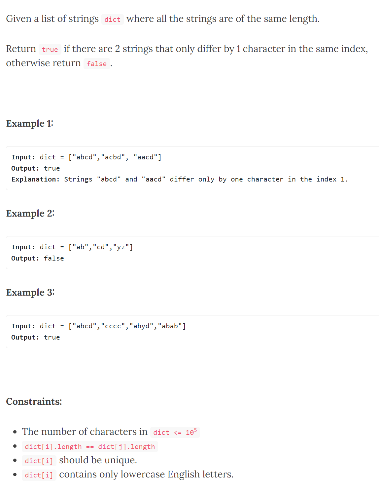
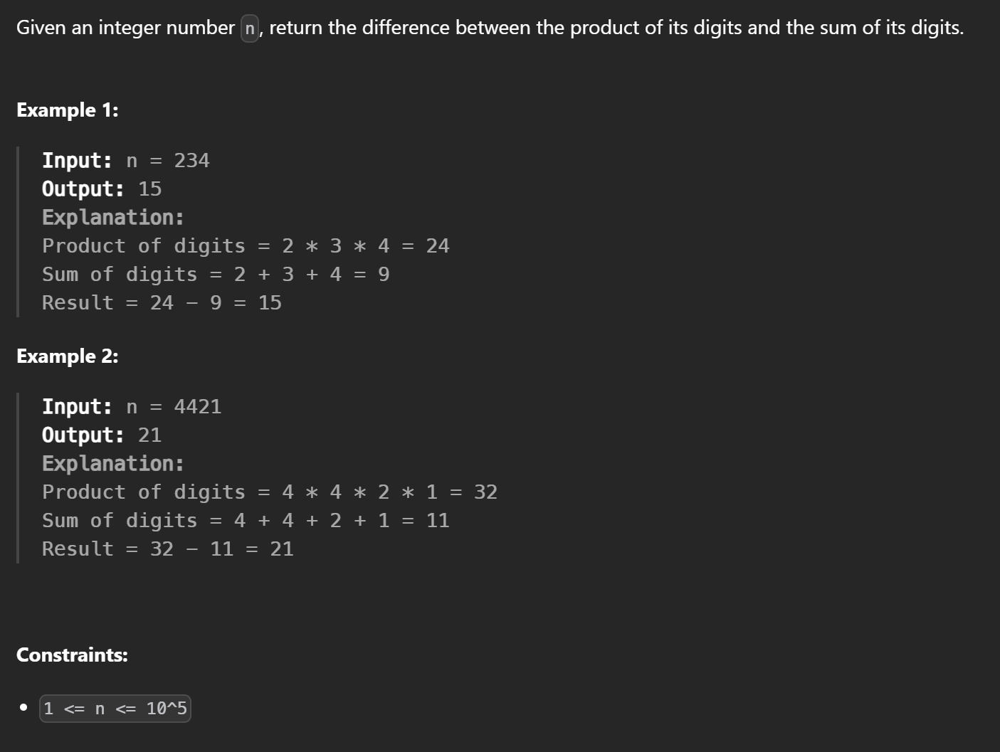
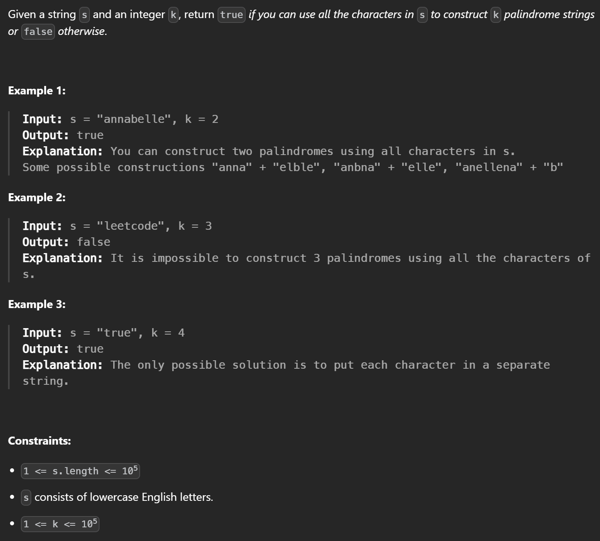
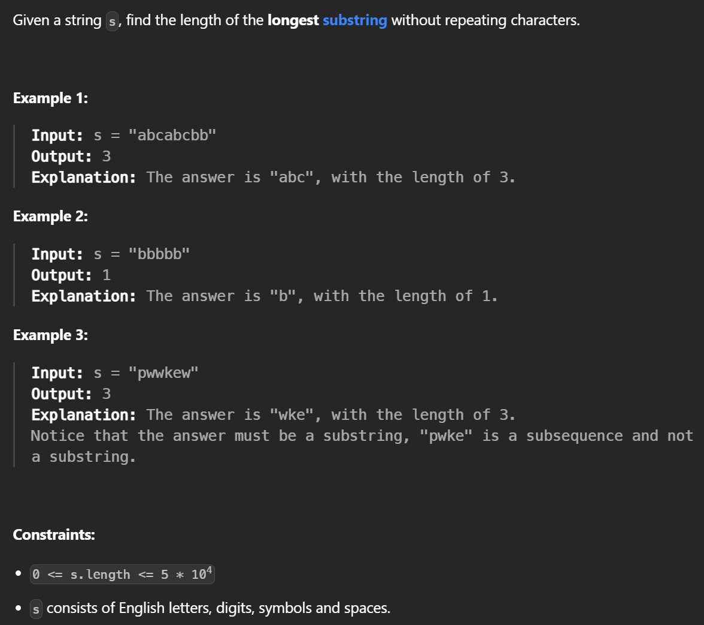
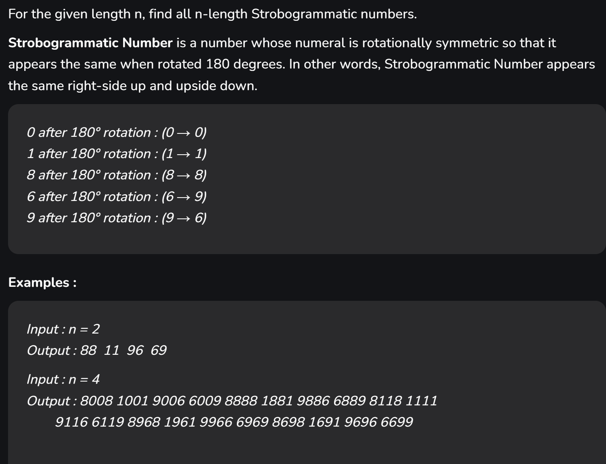

<details >
 <summary style="font-size: small; font-weight: bold">01. Strings Differ by One Character (Okta SWE 2024)</summary>

###### 01



1. Time Complexity: O(n * n * m)

```js
function solution(arr){
    const len = arr.length;
    
    for(let i = 0; i < len - 1; i++){
        for(let j = i + 1; j < len; j++){
            if(isStringDiffer(arr[i], arr[j]))
                return true;
        }
    }
    
    return false;
}

function isStringDiffer(str1, str2){
    if(str1.length !== str2.length)
        return false;
    
    let isDifferFound = false;
    for(let i = 0; i < str1.length; i++){
        if(str1.charCodeAt(i) !== str2.charCodeAt(i)){
            if(isDifferFound)
                return false;
            isDifferFound = true;
        }
    }
    
    return isDifferFound;
}
```

2. Time Complexity: O(n * m)
```js
function solution(arr){
    const s = new Set();
    
    for(let str of arr){
        for(let i = 0; i < str.length; i++){
            const modifiedStr = str.substring(0, i) + '*' + str.substring(i+1);
            
            if(s.has(modifiedStr))
                return true;
                
            s.add(modifiedStr);
        }
    }
    
    return false;
}


console.log(solution(["abcd","acbd", "aacd"]));
console.log(solution(["ab","cd","yz"]));
console.log(solution(["abcd","cccc","abyd","abab"]));
```
https://leetcode.ca/2020-03-02-1554-Strings-Differ-by-One-Character/

---
</details>


<details >
 <summary style="font-size: small; font-weight: bold">02. Subtract the Product and Sum of Digits of an Integer (Uber SDE 2 FE 2022)</summary>

###### 02

https://leetcode.com/problems/subtract-the-product-and-sum-of-digits-of-an-integer/description/
https://leetcode.com/discuss/interview-question/1834439/Uber-India-online-Assignment-for-SDE-II-(frontend)

Question:


Solution:

```js
/**
 * @param {number} n
 * @return {number}
 */
var subtractProductAndSum = function(n) {
    let sum = 0;
    let product = 1;

    while(n > 0){
        const num = n % 10;
        sum += num;
        product *= num;

        n = Math.floor(n/10);
    }
    
    return product - sum;
};
```

---
</details>


<details >
 <summary style="font-size: small; font-weight: bold">03. Construct K Palindrome Strings (Uber SDE 2 FE 2022)</summary>

###### 03

https://leetcode.com/problems/construct-k-palindrome-strings/description/
https://leetcode.com/discuss/interview-question/1834439/Uber-India-online-Assignment-for-SDE-II-(frontend)

Question:


Solution:
```js
/**
 * @param {string} s
 * @param {number} k
 * @return {boolean}
 */
var canConstruct = function(s, k) {
    const len = s.length;
    let odd = 0;

    if(len < k)
        return false;

    const alphaCount = {};

    for(let i = 0; i < len; i++){
        if(!alphaCount[s[i]])
            alphaCount[s[i]] = 1;
        else
            alphaCount[s[i]]++;
    }

    for(let value of Object.values(alphaCount)){
        if(value % 2 !== 0)
            odd++;
    }

    if(odd > k)
        return false;

    return true;
};
```

---
</details>


<details >
 <summary style="font-size: small; font-weight: bold">04. Longest Substring Without Repeating Characters (Uber SDE 2 FE 2022)</summary>

###### 04

https://leetcode.com/problems/longest-substring-without-repeating-characters/description/
https://medium.com/@iamjaasi/uber-sde-2-frontend-interview-experience-40c1a7437cc0

Question:


Solution-1:

Time Complexity: More than O(n)
```js
/**
 * @param {string} s
 * @return {number}
 */
var lengthOfLongestSubstring = function(s) {
    let i = 0;
    let j = 0;
    let res = 0;

    const queue = [];

    while(j < s.length){
        const element = s[j];
        let pos = queue.indexOf(element);
        if(pos === -1){
            queue.push(element);
            j++;
            res = Math.max(res, j - i);
        }
        else{
            while(pos >= 0){
                i++;
                queue.shift();
                pos--;
            }
        }
    }

    return res;
};
```

Solution-2:

Time Complexity: O(n)
```js
/**
 * @param {string} s
 * @return {number}
 */
var lengthOfLongestSubstring = function(s) {
    let i = 0;
    let j = 0;
    let res = 0;

    const map = new Map();

    while(j < s.length){
        const element = s[j];
        let pos = -1;
        if(map.has(element)){
            pos = map.get(element);
        }


        if(pos === -1){
            map.set(element, j);
            j++;
            res = Math.max(res, j - i);
        }
        else{
            while(i <= pos){
                map.delete(s[i]);
                i++;
            }
        }
    }

    return res;
};
```

Java Reference Solution:
```bash
class Solution {
    public int lengthOfLongestSubstring(String s) {
        int res = 0;
        
        Map<Character, Integer> charCountMap = new HashMap<>();
        
        int i = 0, j = 0;
        
        while(j < s.length()){
            char charAtj = s.charAt(j);
            if(charCountMap.containsKey(charAtj)){
                charCountMap.put(charAtj, charCountMap.get(charAtj) + 1);
            }
            else{
                charCountMap.put(charAtj, 1);
            }
            
            int mapSize = charCountMap.size();
            if(mapSize == j - i + 1){
                res = Math.max(res, mapSize);
            }
            else{
                while(charCountMap.size() < j - i + 1 ){
                    char charAti = s.charAt(i);
                    if(charCountMap.get(charAti) == 1){
                        charCountMap.remove(new Character(charAti));
                    }
                    else{
                        charCountMap.put(charAti, charCountMap.get(charAti) - 1);
                    }
                    i++;
                }
            }
            
            j++;
        }
        
        return res;
    }
}
```

---
</details>


<details >
 <summary style="font-size: small; font-weight: bold">05. Rotate a number by 180 degrees - Strobogrammatic number (Uber FE 2024)</summary>

###### 05
https://leetcode.com/discuss/interview-question/5103489/Uber-Frontend-Screening

**Question:**
Rotate a number by 180 degrees and check if it gives the same number.

Follow up:
Give the count of all such numbers for n, where n is the number of digits.

**Solution:**


```js
// JavaScript program to print all
// Strobogrammatic number of length n
  
// strobogrammatic function 
function strobogrammatic_num(n) {
    let result = numdef(n, n);
    return result;
}

// definition function
function numdef(n, length) {      
    if (n == 0) return [""];
    if (n == 1) return ["1", "0", "8"];
      
    let middles = numdef(n - 2, length);
    let result = [];
      
    for (var middle of middles) {
        if (n != length)           
            result.push("0" + middle + "0");

        result.push("8" + middle + "8");
        result.push("1" + middle + "1");
        result.push("9" + middle + "6");
        result.push("6" + middle + "9");
    }
    
    return result;
}

// Driver Code
// Print all Strobogrammatic 
// numbers for n = 2
console.log(strobogrammatic_num(2));

// Output: 88 11 96 69
```

---
</details>


<details >
 <summary style="font-size: small; font-weight: bold">06. Convert 12 hours to 24 hours (Razorpay)</summary>

Question: 
Input: 01:24 PM
Output: 13:24


**Solution:**
```js
function convert12to24Hour(time12h) {
    const [time, modifier] = time12h.split(' ');
    let [hour, min] = time.split(':');

    if(modifier === 'PM')
        hour = 12 + Number(hour);

    return `${hour}:${min}`;
}

console.log("24 Hour time : ", convert12to24Hour('12:00 AM'));
console.log("24 Hour time : ", convert12to24Hour('12:53 AM'));
console.log("24 Hour time : ", convert12to24Hour('01:00 AM'));
console.log("24 Hour time : ", convert12to24Hour('01:05 AM'));
console.log("24 Hour time : ", convert12to24Hour('12:00 PM'));
console.log("24 Hour time : ", convert12to24Hour('12:05 PM'));
console.log("24 Hour time : ", convert12to24Hour('01:53 PM'));
```

---
</details>
