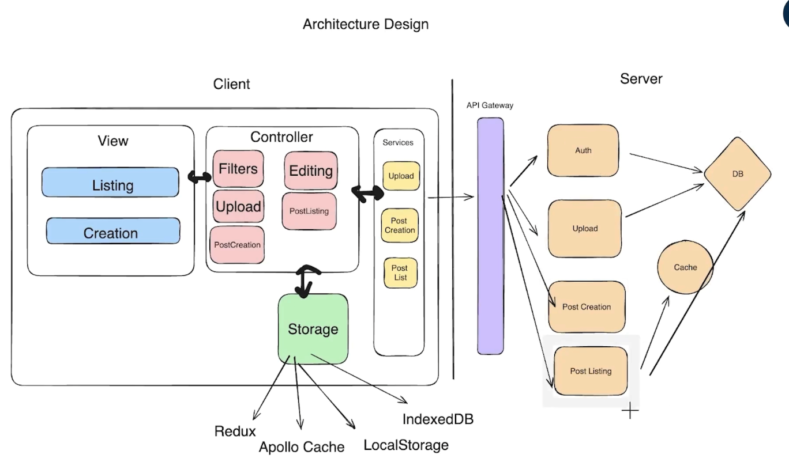

Controller: 
1. Business Logic. Lot of if else condition
2. Interact with View, service, storage

<details >
 <summary style="font-size: large; font-weight: bold">1. Photo Sharing App (Instagram)</summary>

GreatFrontend: https://www.greatfrontend.com/questions/system-design/photo-sharing-instagram

### Step-1: Requirements(Functional / Non-Functional) & Scoping


### Step-2: 
### 1. Architecture Design



### 2. Component Architecture(If Asked)


### Step-3: Data Model


### Step-4: API


### Step-5: Non-Functional Discussion

### 1. Optimization


### Step-6: Implementation


**Image Editing:**
1. Canvas API can be used to do cropping and other stuffs
2. CSS Filter Editor

https://codepen.io/stoumann/pen/MWeNmyb

**Upload File:**
1. We can different strategies to upload file like by Encoding to Base64 or File Chunking
2. Send data in multipart/form-data


<details >
 <summary style="font-size: medium; font-weight: bold">ChatGpt</summary>

Here’s a front-end system design breakdown of a **photo-sharing app like Instagram**, using the **RADIO framework**:

---

## **1. Requirements Exploration**
### **Clarifying Questions**
- What are the **core use cases**? (E.g., viewing feed, uploading photos, liking, commenting, following users)
- Should we focus on **real-time updates** (e.g., live notifications for likes/comments)?
- Do we need **offline support** (e.g., viewing cached posts, queuing uploads)?
- What are the **target platforms**? (Web, mobile web, or mobile app?)
- Are there **privacy settings** for posts (public/private/friends-only)?
- Should posts support multiple media types (images, videos, carousels)?
- What are the **performance expectations**? (Time to first interaction, smooth scrolling)
- Is **monetization** (ads, promoted posts) a part of the scope?

### **Functional Requirements**
‚úÖ User can upload photos with captions.  
‚úÖ Users can view a **personalized feed** of posts.  
‚úÖ Users can **like, comment, and share** posts.  
‚úÖ Users can **follow/unfollow** other users.  
‚úÖ Users can search for posts or other users.  
‚úÖ Users receive **notifications** (likes, comments, follows).  
‚úÖ Posts have a **timestamp, location, and tags**.

### **Non-Functional Requirements**
- **Performance**: Should load within **under 2s** for a smooth UX.
- **Scalability**: Support **millions of users** with infinite scrolling.
- **Offline support**: Cache recent posts, allow queued uploads.
- **Security**: Prevent XSS, CSRF, rate-limiting APIs to prevent abuse.

---

## **2. Architecture / High-level Design**
### **Key Components**
üìå **Feed UI**: Displays posts with infinite scrolling.  
üìå **Post Composer**: Uploads photos, adds captions, and sets visibility.  
üìå **Profile Page**: Displays a user's posts, followers, and following.  
üìå **Search & Discovery**: Enables user/post search and trending topics.  
üìå **Notification System**: Displays new likes/comments/followers.  
üìå **Client Store**: Manages cached posts, user preferences, and offline actions.

### **High-Level Component Interaction**
```plaintext
User ‚Üí Feed UI ‚Üê Client Store (cached data)
User ‚Üí Post Composer ‚Üí API ‚Üí Server (Uploads)
Feed UI ‚Üí API ‚Üí Server (Fetch latest posts)
Notification UI ‚Üí API ‚Üí Server (Fetch notifications)
```

### **Client-Side State Management**
- **Feed Data** (Cached for smooth scrolling, pre-fetched for better UX).
- **Auth State** (User login info, session token).
- **Drafts** (Locally store unsent posts for offline support).

---

## **3. Data Model**
### **Entities & Their Fields**
| Entity     | Fields |
|------------|----------------------------------------------------------------|
| **User**   | `id`, `username`, `profile_photo_url`, `bio`, `followers`, `following` |
| **Post**   | `id`, `image_url`, `caption`, `author_id`, `timestamp`, `likes`, `comments` |
| **Comment**| `id`, `post_id`, `author_id`, `text`, `timestamp` |
| **Like**   | `id`, `post_id`, `user_id`, `timestamp` |
| **Notification** | `id`, `type` (`like`, `comment`, `follow`), `sender_id`, `receiver_id`, `timestamp` |
| **Follow** | `id`, `follower_id`, `following_id`, `timestamp` |

### **Data Storage Strategy**
- **Post data** is cached in the client store for infinite scrolling.
- **User session data** is stored in local storage/session storage.
- **Optimistic UI** for likes/comments to ensure a smooth UX.

---

## **4. Interface Definition (APIs)**
### **1️⃣ Fetch User Feed**
```http
GET /api/feed
```
üìå **Params**: `{cursor: "last_post_id", limit: 10}`  
üìå **Response**:
```json
{
  "pagination": { "next_cursor": "post_456", "limit": 10 },
  "posts": [
    {
      "id": "123",
      "image_url": "https://example.com/photo.jpg",
      "caption": "Sunset vibes üåÖ",
      "author": { "id": "456", "username": "john_doe", "profile_photo_url": "https://example.com/avatar.jpg" },
      "likes": 100,
      "comments": 20,
      "timestamp": 1700000000
    }
  ]
}
```

### **2️⃣ Upload Post**
```http
POST /api/upload
```
üìå **Request Body**:
```json
{
  "image_url": "https://example.com/uploaded_image.jpg",
  "caption": "Nature walk üåø",
  "location": "Central Park, NY"
}
```
üìå **Response**:
```json
{ "post_id": "789", "status": "success" }
```

### **3️⃣ Like a Post**
```http
POST /api/post/123/like
```
üìå **Response**:
```json
{ "status": "success", "likes": 101 }
```

### **4️⃣ Comment on Post**
```http
POST /api/post/123/comment
```
üìå **Request Body**:
```json
{
  "text": "Beautiful shot! üåü"
}
```
üìå **Response**:
```json
{ "status": "success", "comment_id": "987" }
```

### **5️⃣ Fetch Notifications**
```http
GET /api/notifications
```
üìå **Response**:
```json
{
  "notifications": [
    { "id": "555", "type": "like", "sender": "alex", "timestamp": 1700000050 }
  ]
}
```

---

## **5. Optimizations & Deep Dive**
### **1️⃣ Performance Optimizations**
‚úÖ **Lazy loading images**: Load images as they come into view using `IntersectionObserver`.  
‚úÖ **Infinite scrolling**: Fetch more posts only when the user reaches the end of the feed.  
‚úÖ **Client-side caching**: Store recent posts in local storage to avoid re-fetching.  
‚úÖ **Optimistic UI for likes/comments**: Instantly update UI and rollback if the API fails.

### **2️⃣ UX Enhancements**
‚úÖ **Skeleton loaders**: Show placeholders before posts load.  
‚úÖ **Drag-and-drop upload**: Allow users to drag images to upload.  
‚úÖ **Dark mode support**: Improve user experience.

### **3️⃣ Offline Support**
‚úÖ **Service Workers**: Cache feed data for offline viewing.  
‚úÖ **Background Sync**: Queue post uploads when offline.

### **4️⃣ Security Measures**
‚úÖ **Rate limiting**: Prevent spammy API calls for likes/comments.  
‚úÖ **CSRF Protection**: Secure API endpoints.  
‚úÖ **Content moderation**: Use AI to detect inappropriate content.

---

## **Final Thoughts**
Using the **RADIO framework**, we designed a **scalable, performant, and user-friendly** front-end architecture for a **photo-sharing app like Instagram**. This approach ensures that we cover **all critical aspects**, from **requirements** to **optimizations**. üöÄ

Would you like to **deep dive** into a specific area, such as **real-time updates** or **performance tuning**? üî•

---
</details>


<details >
 <summary style="font-size: medium; font-weight: bold">Claude</summary>


I'll help you design the frontend of a photo sharing app like Instagram using the RADIO framework. Let's break this down systematically.

## Requirements Exploration

First, let's define the scope and requirements for our Instagram-like photo sharing app:

**Functional Requirements:**
- Users can browse a feed of photos from accounts they follow
- Users can post photos with captions
- Users can like and comment on photos
- Users can view user profiles with their posted photos
- Users can search for other users and content
- Users can follow/unfollow other users

**Non-functional Requirements:**
- Fast loading times for photos (performance)
- Responsive design for mobile and desktop
- Infinite scrolling for feed
- Offline capability for viewing previously loaded content
- Real-time notifications for likes and comments

**Core Features to Focus On:**
- Photo feed display and interaction
- Photo upload and posting flow
- User profile view
- Search functionality

**Platforms:**
- Primary: Mobile (iOS and Android)
- Secondary: Web

## Architecture / High-level Design

Here's the high-level architecture for our photo sharing app:

1. **Server**: Black box that provides APIs for authentication, data fetching, and content posting
2. **Client Store**: Manages application state and caches data
3. **Controller**: Handles user interactions and updates the store accordingly
4. **View Components**:
    - Feed View
    - Photo Detail View
    - Profile View
    - Search View
    - Photo Upload View
    - Navigation Component

The architecture would look like this:

```
┌─────────────────────────────────────────────────────────────────┐
│                           Client App                            │
│                                                                 │
│  ┌─────────────┐     ┌─────────────┐     ┌─────────────────┐    │
│  │             │     │             │     │                 │    │
│  │   Views     │◄───►│ Controller  │◄───►│   Client Store  │    │
│  │             │     │             │     │                 │    │
│  └─────────────┘     └─────────────┘     └─────────────────┘    │
│         │                                        │              │
│         │                                        │              │
│         ▼                                        ▼              │
│  ┌─────────────────────────────────────────────────────────┐    │
│  │                      Network Layer                      │    │
│  └─────────────────────────────────────────────────────────┘    │
│                              │                                  │
└──────────────────────────────┼──────────────────────────────────┘
                               │
                               ▼
                        ┌─────────────┐
                        │             │
                        │   Server    │
                        │             │
                        └─────────────┘
```

**Component Responsibilities:**

- **Views**: Display the UI and respond to user interactions.
    - Feed View: Displays photos from followed accounts
    - Photo Detail View: Shows a single photo with comments
    - Profile View: Shows user profile and their photos
    - Search View: Allows searching for users and content
    - Photo Upload View: Handles photo selection and posting

- **Controller**: Routes user actions to appropriate handlers, makes API calls, and updates the store.

- **Client Store**: Manages application state, caches data, and provides data to views.

- **Network Layer**: Handles communication with the server via HTTP requests and WebSockets.

## Data Model

Let's define the data models for our app:

1. **User**:
    - Source: Server
    - Belongs to: Client Store
    - Fields: id, username, display_name, profile_picture_url, follower_count, following_count, bio

2. **Photo**:
    - Source: Server
    - Belongs to: Feed View, Profile View
    - Fields: id, image_url, thumbnail_url, caption, created_at, user (a User), like_count, comment_count, is_liked_by_current_user

3. **Comment**:
    - Source: Server
    - Belongs to: Photo Detail View
    - Fields: id, text, created_at, user (a User)

4. **Feed**:
    - Source: Server
    - Belongs to: Feed View
    - Fields: photos (list of Photos), pagination_cursor

5. **NewPost**:
    - Source: Client (user input)
    - Belongs to: Photo Upload View
    - Fields: image_file, filter_applied, caption, location

6. **SearchResults**:
    - Source: Server
    - Belongs to: Search View
    - Fields: users (list of Users), tags (list of Tags), pagination_cursor

7. **UIState**:
    - Source: Client only
    - Belongs to: Client Store
    - Fields: current_view, is_loading, error_messages, upload_progress

## Interface Definition (API)

### Server-Client APIs:

1. **Get Feed**:
    - Method: GET
    - Path: /api/feed
    - Parameters: `{ "cursor": "string", "limit": number }`
    - Response: `{ "photos": [Photo], "pagination": { "next_cursor": "string" } }`

2. **Get Photo**:
    - Method: GET
    - Path: /api/photos/:id
    - Response: `{ "photo": Photo, "comments": [Comment] }`

3. **Post Photo**:
    - Method: POST
    - Path: /api/photos
    - Parameters: `{ "image": File, "caption": "string", "filter": "string", "location": "string" }`
    - Response: `{ "photo": Photo }`

4. **Like Photo**:
    - Method: POST
    - Path: /api/photos/:id/like
    - Response: `{ "success": boolean, "like_count": number }`

5. **Comment on Photo**:
    - Method: POST
    - Path: /api/photos/:id/comments
    - Parameters: `{ "text": "string" }`
    - Response: `{ "comment": Comment }`

6. **Get User Profile**:
    - Method: GET
    - Path: /api/users/:username
    - Response: `{ "user": User, "photos": [Photo], "pagination": { "next_cursor": "string" } }`

7. **Search**:
    - Method: GET
    - Path: /api/search
    - Parameters: `{ "query": "string", "type": "users|tags", "cursor": "string" }`
    - Response: `{ "users": [User], "tags": [Tag], "pagination": { "next_cursor": "string" } }`

### Client-Client APIs:

1. **Feed Component**:
   ```javascript
   // Load more photos
   function loadMorePhotos(cursor) -> Promise<{photos: Photo[], nextCursor: string}>
   
   // Refresh feed
   function refreshFeed() -> Promise<{photos: Photo[], nextCursor: string}>
   ```

2. **Photo Component**:
   ```javascript
   // Toggle like
   function toggleLike(photoId) -> Promise<{success: boolean, likeCount: number}>
   
   // Add comment
   function addComment(photoId, text) -> Promise<Comment>
   ```

3. **Profile Component**:
   ```javascript
   // Load user profile
   function loadUserProfile(username) -> Promise<{user: User, photos: Photo[], nextCursor: string}>
   
   // Toggle follow
   function toggleFollow(userId) -> Promise<{success: boolean, isFollowing: boolean}>
   ```

4. **Upload Component**:
   ```javascript
   // Select photo
   function selectPhoto() -> Promise<File>
   
   // Apply filter
   function applyFilter(image, filter) -> Promise<File>
   
   // Upload photo
   function uploadPhoto(file, caption, location) -> Promise<Photo>
   ```

## Optimizations and Deep Dive

### Performance Optimizations:

1. **Image Loading and Caching**:
    - Use progressive image loading (blurry placeholder ‚Üí full image)
    - Implement lazy loading for images not in viewport
    - Cache images in browser storage for offline viewing
    - Use WebP format for images with JPEG fallback
    - Implement HTTP/2 for parallel loading of multiple images

2. **Infinite Scrolling**:
    - Use virtualization to render only visible photos
    - Implement pagination with cursor-based approach
    - Prefetch next page of content when user reaches 75% of current page
    - Recycle DOM elements for better memory usage

3. **Optimistic Updates**:
    - Update UI instantly for likes and comments before server confirms
    - Rollback if server request fails

### Network Optimizations:

1. **Connection Handling**:
    - Implement offline-first approach
    - Queue actions when offline and sync when online
    - Use Service Workers for offline caching
    - Implement retry logic for failed requests

2. **Data Fetching**:
    - Use GraphQL for efficient data fetching
    - Implement debouncing for search queries
    - Cache data in local storage with TTL

### UX Optimizations:

1. **Loading States**:
    - Implement skeleton screens instead of spinners
    - Show progress bars for uploads
    - Add pull-to-refresh for feed

2. **Transitions and Animations**:
    - Add smooth transitions between views
    - Implement gesture-based navigation (swipe to go back)
    - Animate like button and comment count changes

3. **Error Handling**:
    - Show user-friendly error messages
    - Implement automatic retries for failed uploads
    - Allow users to retry failed actions

### Security Considerations:

1. **Authentication**:
    - Use JWT tokens for authentication
    - Implement token refresh mechanism
    - Secure local storage of tokens

2. **Content Security**:
    - Validate user inputs
    - Sanitize data before display
    - Implement CSP (Content Security Policy)

### Accessibility:

1. **Screen Reader Support**:
    - Add proper ARIA labels
    - Ensure keyboard navigation
    - Provide alt text for images

2. **Visual Accessibility**:
    - Support high contrast mode
    - Allow text resizing
    - Ensure sufficient color contrast

### Multi-device Support:

1. **Responsive Design**:
    - Use CSS Grid and Flexbox for layouts
    - Implement different layouts for different screen sizes
    - Adapt UI components for touch vs. mouse interactions

2. **Platform-specific Optimizations**:
    - Use native share APIs when available
    - Implement platform-specific gestures
    - Adapt to safe areas on different devices

### State Management:

1. **Centralized Store**:
    - Use Redux or Context API for global state
    - Implement selectors for efficient data access
    - Use normalized data structure for easier updates

2. **Caching Strategy**:
    - Implement LRU cache for photos
    - Use stale-while-revalidate pattern for data freshness
    - Implement cache invalidation for updated content

### Testing and Error Monitoring:

1. **Component Testing**:
    - Implement unit tests for UI components
    - Add integration tests for critical flows
    - Use visual regression testing

2. **Error Monitoring**:
    - Implement client-side error tracking
    - Add performance monitoring
    - Collect usage analytics

## Summary

Using the RADIO framework, we've designed a comprehensive frontend for a photo sharing app like Instagram. The design includes:

- Clear requirements and scope
- Modular architecture with separation of concerns
- Detailed data models for server and client data
- Well-defined interfaces between components
- Extensive optimizations for performance, UX, and more

This design addresses the core features of a photo sharing app while incorporating best practices for modern frontend development. The focus on performance and user experience will help create a smooth, responsive app that users will enjoy.

---
</details>

---
</details>


<details >
 <summary style="font-size: large; font-weight: bold">2. E-Commerce App (Amazon, Flipkart)</summary>

GreatFrontend: https://www.greatfrontend.com/questions/system-design/e-commerce-amazon

### Step-1: Requirements(Functional / Non-Functional) & Scoping


### Step-2:
### 1. Architecture Design

State Management: Don't call API to store whatever user added to cart, use the information from product details page only

### Step-3: Data Model


### Step-4: API

When you have lot of filter or parameter like in e-commerce then it is preferred to use POST API than GET API


### Step-5: Non-Functional Discussion

### 1. Optimization


### 2. SEO


### 3. Internationalization / Localization


---
</details>


<details >
 <summary style="font-size: large; font-weight: bold">3. News Feed (e.g. Facebook, Twitter)</summary>

GreatFrontend: https://www.greatfrontend.com/questions/system-design/news-feed-facebook

### Step-1: Requirements(Functional / Non-Functional) & Scoping


### Step-2: Architecture Design


### Step-3: Data Model


### Implementation Details


---
</details>


<details >
 <summary style="font-size: large; font-weight: bold">4. Chat App (e.g. Messenger, Whatsapp, Slack)</summary>

- GreatFrontend: https://www.greatfrontend.com/questions/system-design/chat-application-messenger
- Chirag Goel: https://www.youtube.com/watch?v=3mi-Cah2PtM

### Step-1: Requirements(Functional / Non-Functional) & Scoping


### Step-2: Architecture Design


### Step-3: Data Model


### Step-4: API

- **Send Message**:
    - Adds a new message to the Message table with a "sending" status.
    - Adds a row to the SendMessageRequest table with a "pending" status.
    - Deletes any draft messages for the current conversation.
    - Message Scheduler handles syncing the pending messages with the server.

- **Sync Outgoing Messages**:
    - Message Scheduler syncs outgoing messages, maintaining its task queue.
    - Monitors the SendMessageRequest table to process messages based on their status:
        - **pending**: Queue the message to be sent via the real-time channel, mark as "in_flight."
        - **in_flight**: If a timeout occurs, mark the message as "fail."
        - **fail**: Retry sending with exponential backoff based on fail_count.

- **Server Events**:
    - Receives real-time updates via events (e.g., message_sent, message_delivered).

    - **message_sent event**:
        - Updates the Message status to "sent."
        - Cleans up related tasks in the Message Scheduler.
        - Notifies the Conversation UI to update if the message's conversation is shown.

    - **message_delivered event**:
        - Updates the Message status to "delivered."
        - Notifies the Conversation UI to update.

    - **message_failed event**:
        - Updates the SendMessageRequest row to "fail" and increments fail_count.
        - Notifies the Conversation UI to update.

    - **incoming_message event**:
        - Adds the new message to the Message table.
        - Creates a new row in the Conversation and User tables if necessary.
        - Updates the Conversations List UI and Conversation UI.

    - **sync event**:
        - Triggered when a client connects to the server, ensuring the client is up-to-date with server data.
        - Syncs data based on the client's last update timestamp or conversation's cursor.


### Step-5: Non-Functional Discussion


---
</details>


<details >
 <summary style="font-size: large; font-weight: bold">5. Live Commentary (e.g. CricInfo, Cricbuzz)</summary>


### 1. Realtime

Avoid million request on your server
1. Inactive tab don't make any new request
2. Fallback to polling in case of websocket


### 2. Notification

In this user can decide what notification they want like which match, only six & fours etc


Things we need for setting notification on
1. Frontend
   1. Service Worker: Which handle push notification
   2. Permission to send notification
3. Backend
   1. Match Server: It will send live score 
   2. Message Queue
   3. Notification Server
   4. User DB
   5. FCM(Firebase Cloud Messaging): Firebase notification service
   6. Registration Server

#### How it will work
1. User give permission for notification to send on browser
2. They can choose for which stuff they want to receive notification
3. Once they set this up a `token` will be generated by `registration server` and it will stored in `user DB`
4. Whenever `match server` add anything to message queue notification server check in user DB if any user that we need to send notification
5. If yes then FCM will send notification to them which is received by service worker and delivered to user device.


---
</details>


<details >
 <summary style="font-size: large; font-weight: bold">6. Email Client (e.g. Outlook, Gmail)</summary>


---
</details>


<details >
 <summary style="font-size: large; font-weight: bold">7. Analytics Dashboard (e.g. Google Analytics)</summary>


**Heat Map**


**Session Recording**

There are different way to do the session recording. 
1. You can simply record whole screen, masking user credentials 

2. Store all render html with user click and event listeners, which can be inspected further like it is done by Microsoft Clarity

3. We can also stream this data using things PEER JS


GTM tag used to map what kind of thing we want to track


Refer code for different concept from here:
<br>
https://github.com/namastedev/namaste-frontend-system-design/tree/master/HLD/AnalyticsDashboard

---
</details>


<details >
 <summary style="font-size: large; font-weight: bold">8. Video Streaming (e.g. Youtube, Netflix)</summary>


1. **Streaming:** We can't download whole at a time in Youtube, hence streaming of chunks of data are send by backend
2. **Buffering:** Here we try to download some chunks of data before hand for small portion of which is about to come
3. **Bitrate:** More Bitrate means we can have higher resolution and better quality video
4. **Frame Rate(24fps, 30 fps, 60fps):** How many frames can be shown in a second. More frame rate is better quality
5. **Codec(H.264, H.265(HECV), VP9, AV1):** It is the algorithm used to encode and decode the video chunks
6. **Poster:** Thumbnail
7. **Open / Closed Caption:** Open are controlled caption and closed are embedded caption
8. **Seeking:** Accessing video different parts through clicking on video timeline
9. **Scrubbing:** Accessing video by dragging on video timeline
10. **Manifest file:** Metadata for video chunks are stored in manifest file. It will have info like resolution, chunks size etc
11. **Subtitle file(srt, TTML, SCC, WebVTT) :**


Small Video glimpses in Netflix are send from backend in binary format but `video` tag don't understand this hence we need to convert it in blob


For Pagination in Netflix, it send all the Video IDs on page loading, then as per our need to use Video ID to fetch video information when we will do horizontal scrolling


Tool for defining video player control


---
</details>


<details >
 <summary style="font-size: large; font-weight: bold">9. Diagram Tool (e.g. Miro, MS Whiteboard)</summary>


### Canvas API


In canvas we have just one element tag where things are printed.
1. Hence less accessible
2. Smaller size added to DOM
3. Resizing of drawn is not possible
https://developer.mozilla.org/en-US/docs/Web/API/Canvas_API

### SVG


In SVG we have actual DOM created for each continuous line drawn.

1. More Accessible
2. Resizing has no loss because it is using actual vector
https://developer.mozilla.org/en-US/docs/Web/SVG


Localstorage by default have tab syncing


IndexDB Syncing logic


---
</details>


<details >
 <summary style="font-size: medium; font-weight: bold">Snake & Ladder</summary>


### Step-1: Requirements(Functional / Non-Functional) & Scoping


### Step-2:
### 1. Architecture Design


### Step-3: Interface


### Components


### Step-4: APIs


### Step-5: Non-Functional Discussion


Referred Video: https://www.youtube.com/watch?v=VgtD8OF6Yuw

---
</details>


- sending delta works because we want 500ms performance
- Since we want to resolve the conflict we need to use client-server model where server resolve the conflict


- Token base: who ever is having the token can edit
- Chair Controller: We decide on who can edit. Its like picking who can dance on the floor
- Lock Model: We can put lock once we start editing. We need to decide where to put lock like paragraph, line etc
- Transaction Based Model: Git is tx based model. Doing it real time is difficult
- Version Detection Model: Person needs to be on latest version first to send their data to server. So they always need to pull fresh data first then push


API Payload

We maintain a `node_id` info which is used to do exact changes as whole data is in tree structure


Canvas: Is challenging to use here
SVG: comes with accessibility, easy node control.

#### WYSIWYG editor
What ever you write and see while doing will be visible once you post it. Like in below wordpress website


