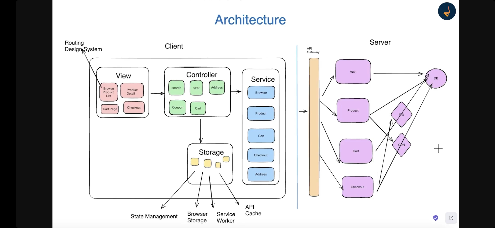
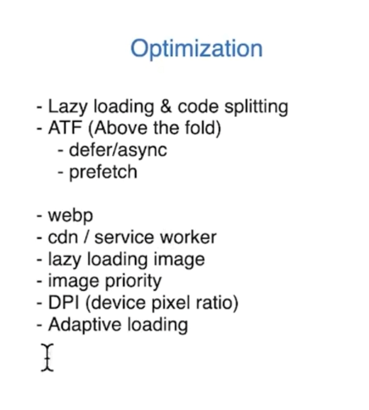

Controller: 
1. Business Logic. Lot of if else condition
2. Interact with View, service, storage

 
1. Photo Sharing App (Instagram)

GreatFrontend: https://www.greatfrontend.com/questions/system-design/photo-sharing-instagram

### Step-1: Requirements(Functional / Non-Functional) & Scoping

### Step-2: 
### 1. Architecture Design

### 2. Component Architecture(If Asked)

### Step-3: Data Model

### Step-4: API

### Step-5: Non-Functional Discussion

### 1. Optimization

### Step-6: Implementation

**Image Editing:**
1. Canvas API can be used to do cropping and other stuffs
2. CSS Filter Editor

https://codepen.io/stoumann/pen/MWeNmyb

**Upload File:**
1. We can different strategies to upload file like by Encoding to Base64 or File Chunking
2. Send data in multipart/form-data

 
2. E-Commerce App (Amazon, Flipkart)

GreatFrontend: https://www.greatfrontend.com/questions/system-design/e-commerce-amazon

### Step-1: Requirements(Functional / Non-Functional) & Scoping

### Step-2:
### 1. Architecture Design

State Management: Don't call API to store whatever user added to cart, use the information from product details page only

### Step-3: Data Model

### Step-4: API

When you have lot of filter or parameter like in e-commerce then it is preferred to use POST API than GET API

### Step-5: Non-Functional Discussion

### 1. Optimization

### 2. SEO

### 3. Internationalization / Localization

 
3. News Feed (e.g. Facebook, Twitter)

GreatFrontend: https://www.greatfrontend.com/questions/system-design/news-feed-facebook

### Step-1: Requirements(Functional / Non-Functional) & Scoping

### Step-2: Architecture Design

### Step-3: Data Model

### Implementation Details

 
4. Chat App (e.g. Messenger, Whatsapp, Slack)

- GreatFrontend: https://www.greatfrontend.com/questions/system-design/chat-application-messenger
- Chirag Goel: https://www.youtube.com/watch?v=3mi-Cah2PtM

### Step-1: Requirements(Functional / Non-Functional) & Scoping

### Step-2: Architecture Design

### Step-3: Data Model

### Step-4: API

- **Send Message**:
    - Adds a new message to the Message table with a "sending" status.
    - Adds a row to the SendMessageRequest table with a "pending" status.
    - Deletes any draft messages for the current conversation.
    - Message Scheduler handles syncing the pending messages with the server.

- **Sync Outgoing Messages**:
    - Message Scheduler syncs outgoing messages, maintaining its task queue.
    - Monitors the SendMessageRequest table to process messages based on their status:
        - **pending**: Queue the message to be sent via the real-time channel, mark as "in_flight."
        - **in_flight**: If a timeout occurs, mark the message as "fail."
        - **fail**: Retry sending with exponential backoff based on fail_count.

- **Server Events**:
    - Receives real-time updates via events (e.g., message_sent, message_delivered).

    - **message_sent event**:
        - Updates the Message status to "sent."
        - Cleans up related tasks in the Message Scheduler.
        - Notifies the Conversation UI to update if the message's conversation is shown.

    - **message_delivered event**:
        - Updates the Message status to "delivered."
        - Notifies the Conversation UI to update.

    - **message_failed event**:
        - Updates the SendMessageRequest row to "fail" and increments fail_count.
        - Notifies the Conversation UI to update.

    - **incoming_message event**:
        - Adds the new message to the Message table.
        - Creates a new row in the Conversation and User tables if necessary.
        - Updates the Conversations List UI and Conversation UI.

    - **sync event**:
        - Triggered when a client connects to the server, ensuring the client is up-to-date with server data.
        - Syncs data based on the client's last update timestamp or conversation's cursor.

### Step-5: Non-Functional Discussion

