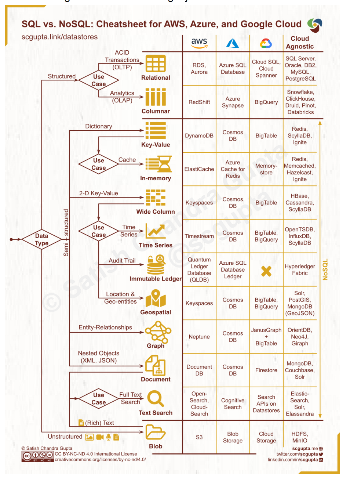
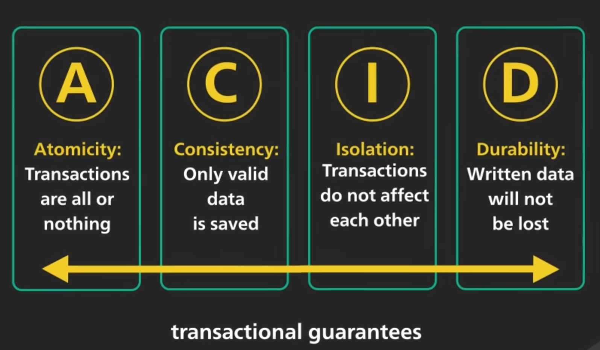
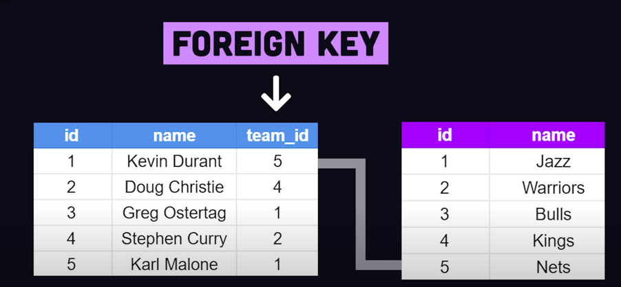
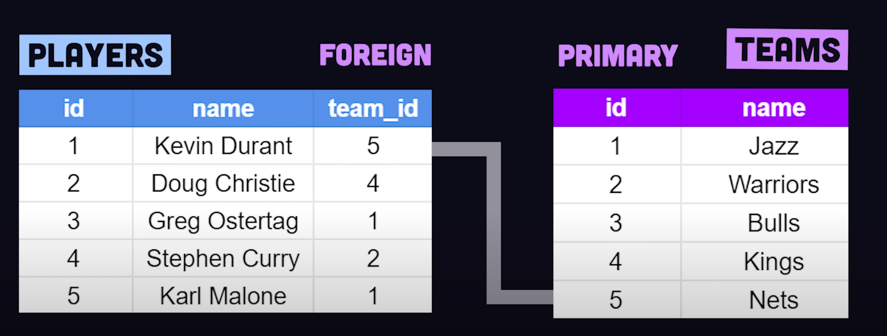
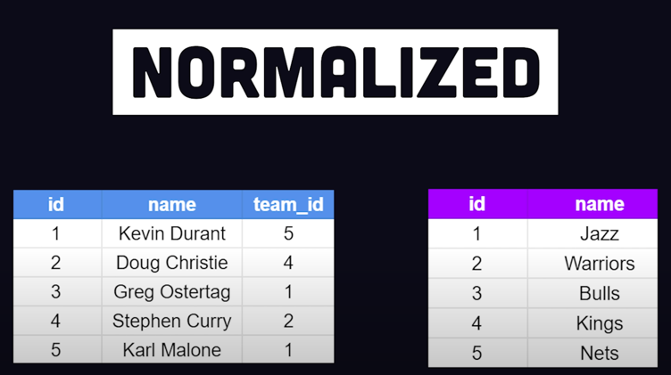
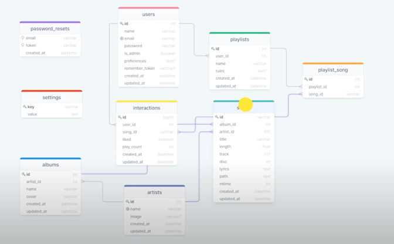
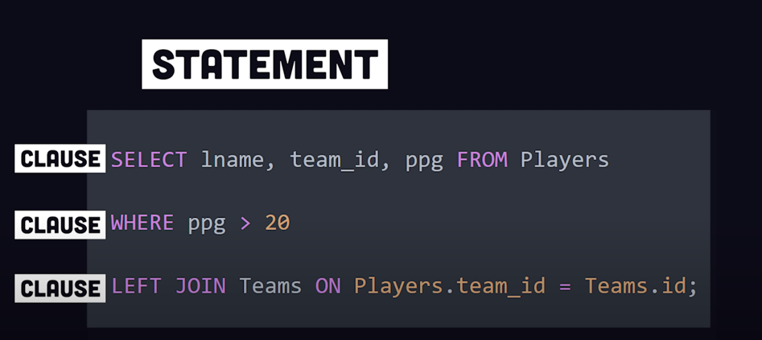

Which databases to use?
- You can choose between a traditional relational database and a non-relational database. Let
us examine their differences.
- Relational databases are also called a relational database management system (RDBMS) or
SQL database. The most popular ones are MySQL, Oracle database, PostgreSQL, etc.
Relational databases represent and store data in tables and rows. You can perform join
operations using SQL across different database tables.
- Non-Relational databases are also called NoSQL databases. Popular ones are CouchDB,
Neo4j, Cassandra, HBase, Amazon DynamoDB, etc. [2]. These databases are grouped into
four categories: key-value stores, graph stores, column stores, and document stores. Join
operations are generally not supported in non-relational databases.
- For most developers, relational databases are the best option because they have been around
for over 40 years and historically, they have worked well. However, if relational databases
are not suitable for your specific use cases, it is critical to explore beyond relational
databases. 

- Non-relational databases might be the right choice if:
  1. Your application requires super-low latency.
  2. Your data are unstructured, or you do not have any relational data.
  3. You only need to serialize and deserialize data (JSON, XML, YAML, etc.).
  4. You need to store a massive amount of data.

- Data can be structured (SQL table schema), semi-structured (JSON,
XML, etc.), and unstructured (Blob).
Common database categories include:
  - Relational
  - Columnar
  - Key-value
  - In-memory
  - Wide column
  - Time Series
  - Immutable ledger
  - Geospatial
  - Graph
  - Document
  - Text search
  - Blob

For quick explanation: https://www.youtube.com/watch?v=W2Z7fbCLSTw

 
SQL Database (Fireship)

Referred Video: https://www.youtube.com/watch?v=zsjvFFKOm3c

Go through this Fireship long video and make notes when have time: https://www.youtube.com/watch?v=Cz3WcZLRaWc

-----

