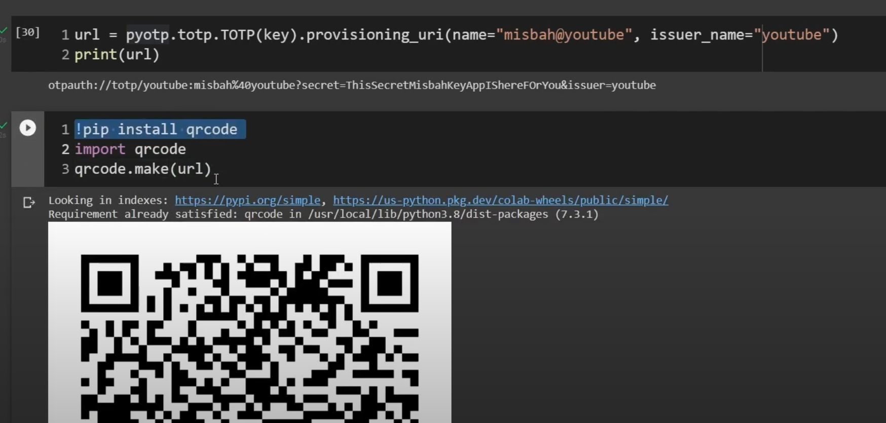

## TOTP(Time Based One Time Password)

### In Python
1. 

2. 
- You can also create URL for TOTP and then create QR code
- Which can be scanned by Google Authenticator app, to get the OTP

Referred Video: https://www.youtube.com/watch?v=KKu0n6OW0uk

### Resources

https://github.com/karanpratapsingh/system-design
