## Grafana

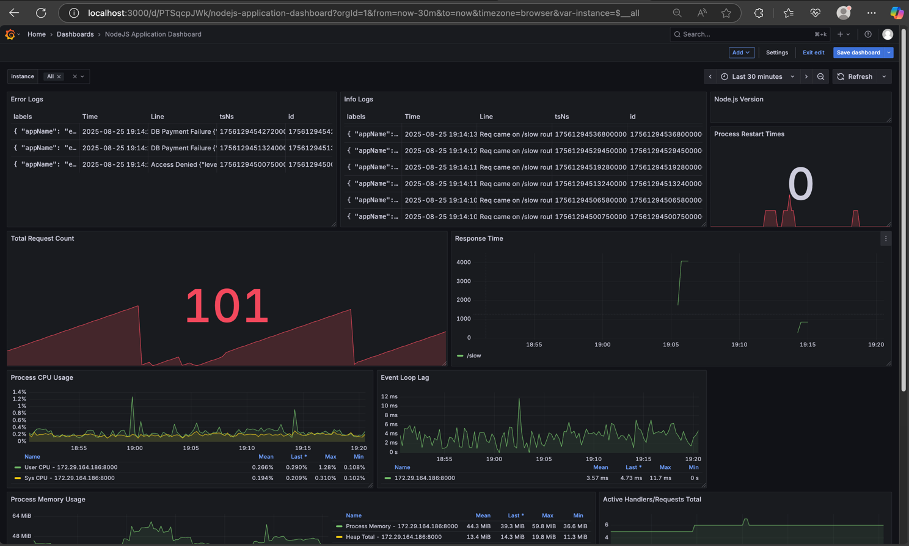

### Problem Statement
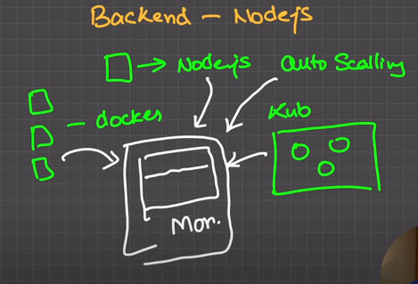
- You have set up your `Node.js` and next day morning you were reported that there were
some issue with your service. But now problem is that you don't have any clue what went wrong.
- To solve this we need a proper way to store and analyze logs and metrics of our service.
- `Grafana` gives a visual dashboard to monitor your services using different other tools like `Prometheus` and `Loki`.


### Concept
- Push metrics and logs from multiple `Node.js` services to `Grafana` using `Prometheus` and `Loki` respectively
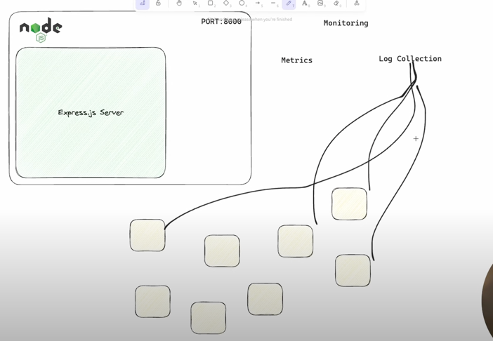

- By default `prometheus` store data for 15 days


<details open>
 <summary style="font-size: medium; font-weight: bold">Setting up Grafana with Prometheus</summary>


#### Step-1
Clone https://github.com/anjaysahoo/basic-ts-express-app.git contains basic basic express app using typescript


#### Step-2
- Setup a `/slow` route in the express app, which will return random success and failure response after a random delay time
```ts
app.get("/slow", async (req, res) => {
    try {
        const timeTaken = await doSomeHeavyTask();
        return res.json({
            status: "Success",
            message: `Heavy task completed in ${timeTaken}ms`,
        });
    } catch (error) {
        return res
            .status(500)
            .json({ status: "Error", error: "Internal Server Error" });
    }
});
```

#### Step-3
- Install 
```bash
npm i prom-client
```

- Add below code in `app.ts` file
```ts
import client from "prom-client";

app.get("/metrics", async (req, res) => {
    res.set("Content-Type", client.register.contentType);
    const metrics = await client.register.metrics();
    res.send(metrics);
});
```
At `/metrics` route we can see all raw data generated by this `Node.js` server


#### Step-4
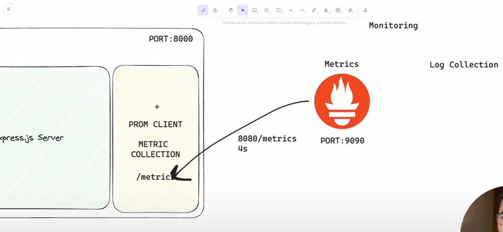
Now we need a `Prometheus` server to scrape the metrics from above `/metrics` route at a regular interval and store it in its database.

#### 1. Prometheus Server
- Create a `prometheus-config.yml` file and copy the following configration. Don't forget to replace `<NDOEJS_SERVER_ADDRESS>` with actual value.
```yml
global:
  scrape_interval: 4s

scrape_configs:
  - job_name: prometheus
    static_configs:
      - targets: ["<NDOEJS_SERVER_ADDRESS>"]
```
Note: 
1. To get the `<NDOEJS_SERVER_ADDRESS>` you can run `ifconfig` in mac and search for `inet  ______ netnask`. After getting IP append port number where our node.js server is running. e.g. `192.168.1.2:8000`
2. Here we can add more than one target, if we have multiple node.js server running
- Start the Prometheus Server using docker compose
```yml
version: "3"

services:
  prom-server:
    image: prom/prometheus
    ports:
      - 9090:9090
    volumes:
      - ./prometheus-config.yml:/etc/prometheus/prometheus.yml
```

Run
```bash
docker compose up
```

Great, The prometheus server is now up and running at PORT 9090


#### Step-5

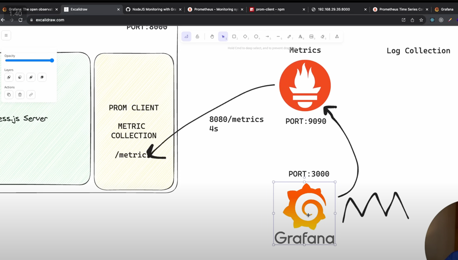
- Set up `Grafana` server using docker compose to visualize the data stored in `Prometheus` database
- Here we are connecting `Prometheus` but we can connect many other data source also
```bash
docker run -d -p 3000:3000 --name=grafana grafana/grafana-oss
```

- Now visit `http://localhost:3000` to access grafana server
- Login using default username and password `admin`
- Skip setting up new password

- Add `Prometheus` as a data source
- 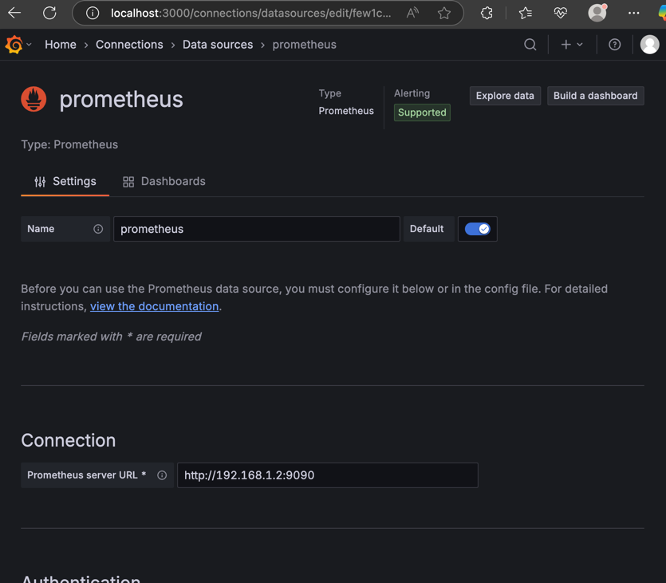
- 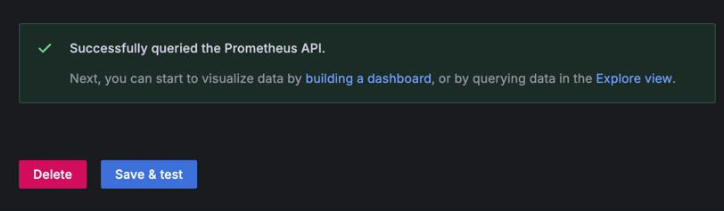


#### Step-6
- We can create own dashboard or import existing dashboard
- To import existing dashboard for Node.js metrics visit https://grafana.com/grafana/dashboards/11159-nodejs-application-dashboard/
- Copy the dashboard id `11159` and import it in grafana
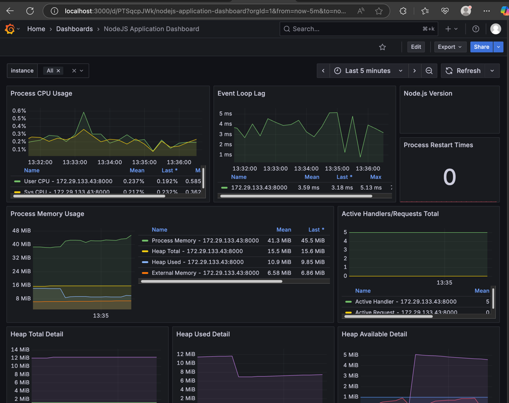


#### Step-7
- Creating custom dashboard

**Example-1**
To calculate `Response Time` for any route

1. Install `npm i response-time`
2. Add below code in `app.ts` file
```ts
import responseTime from "response-time";

const app = express();

const collectDefaultMetrics = client.collectDefaultMetrics;
collectDefaultMetrics({ register: client.register });

const reqResTime = new client.Histogram({
    name: "http_express_req_res_time",
    help: "This tells how much time is taken by req and res",
    labelNames: ["method", "route", "status_code"],
    buckets: [0.1, 5, 15, 50, 100, 200, 300, 400, 500, 1000, 2000, 5000, 10000, 2000],
})

app.use(responseTime((req, res, time) => {
    reqResTime.labels({
        method: req.method,
        route: req.url,
        status_code: req.statusCode,
    }).observe(time)
}))
```
3. In Grafana, click on `Edit` and then add new visualization then add below configuration 
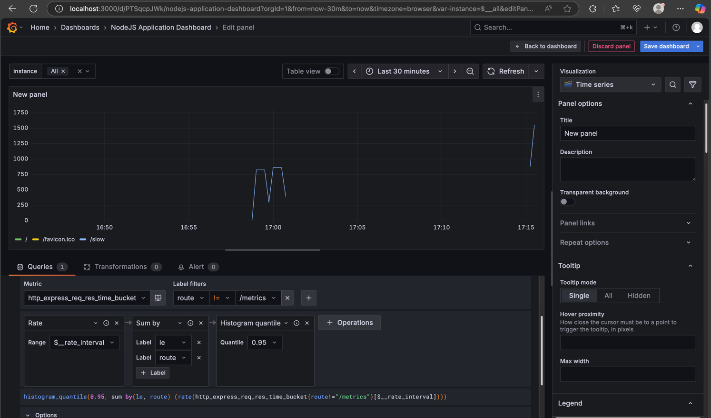


**Example-2**

To calculate `Request Count` for any route

1. Add below code in `app.ts` file
```ts
const totalReqCount = new client.Counter({
    name: "http_express_req_count",
    help: "This will tell how many req are there",
});

app.use(responseTime((req, res, time) => {
    totalReqCount.inc();
    reqResTime.labels({
        method: req.method,
        route: req.url,
        status_code: req.statusCode,
    }).observe(time)
}))

````

----
</details>


<details open>
 <summary style="font-size: medium; font-weight: bold">Setting up Grafana with Loki</summary>

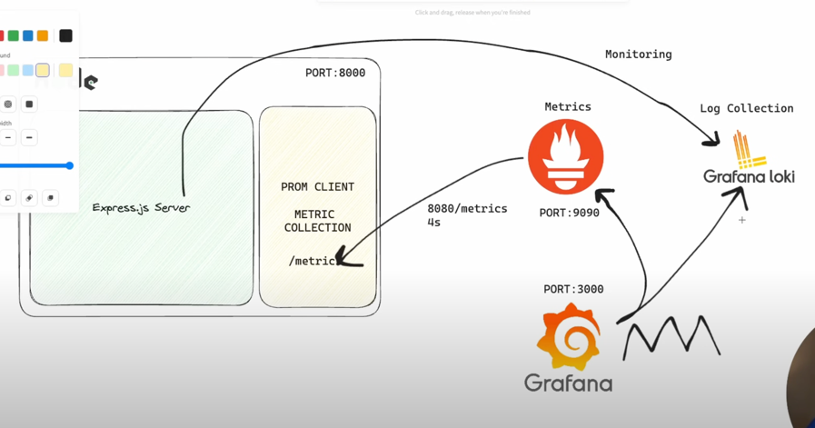

#### Step-1
Run 
```bash
docker run -d --name=loki -p 3100:3100 grafana/loki
```

#### Step-2
```bash
npm i winston winston-loki
```

#### Step-3
Add below code in `app.ts` file
```ts
import LokiTransport from "winston-loki";
import { createLogger, transports } from "winston";


const options = {
    transports: [
        new LokiTransport({
            host: "http://127.0.0.1:3100"
        })
    ]
};
export const logger = createLogger(options);


app.get("/slow", async (req, res) => {
    try {
        logger.info("Req came on /slow route");
        const timeTaken = await doSomeHeavyTask();
        return res.json({
            status: "Success",
            message: `Heavy task completed in ${timeTaken}ms`,
        });
    } catch (error) {
        logger.error(error.message);
        return res
            .status(500)
            .json({ status: "Error", error: "Internal Server Error" });
    }
});
```

#### Step-4
Add `Loki` server data source in `Grafana`
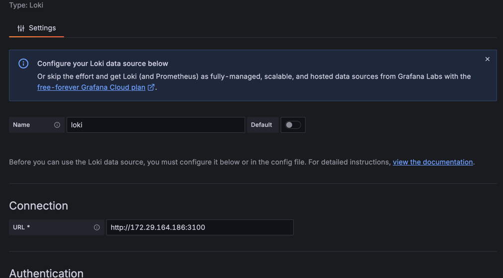


#### Step-5
Add new panel in grafana dashboard to visualize logs
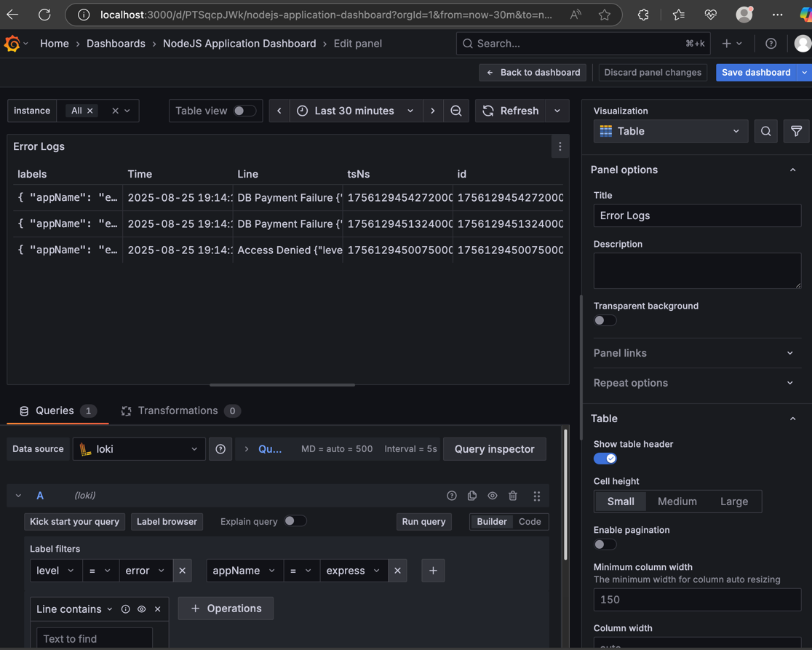


-----
</details>

Referred Video: https://www.youtube.com/watch?v=ddZjhv66o_o


<details >
 <summary style="font-size: x-large; font-weight: bold">LGTM (Loki, Grafana, Tempo & Prometheus)</summary>


### 1. Open Telemetry

- Industry standard open source tool to collect Metrics, Logs and Traces
- Vendor agnostic meaning uou can use it in any programming language
- 
- To view and store above data collected by Open-Telemetry we need a frontend & backend. That's where LGTM stack comes into the picture

### 2. Grafana

- It is frontend UI to visualize the data
- We can set alerts

### 3. Prometheus

- Time series database to store `METRICS`

### 4. Tempo

- Database for storing `TRACES`

### 5. Loki

- Database for storing `LOGS`

----

1. Metric
   
- It holds the multiple data points generated over the time like CPU usages

2. Trace
   
- Traces collects flow of requests done over the time between different services to pinpoint bottleneck

3. Logs
   


------
</details>


<details open>
 <summary style="font-size: x-large; font-weight: bold">Express Basic Setup</summary>

#### Below are the steps how to set up a basis `express` app, which exposes
#### REST API with `GET`, `POST`, `PUT` and `DELETE` routes using `Typescript`

<details open>
 <summary style="font-size: x-large; font-weight: bold">Basic Setup</summary>

### 1. Initialize the project
```
npm init
```

### 2. Create tsconfig.json file
Below cmd will create tsconfig.json file
```
tsc --init
```

### 3. Install `express` and `body-parser`
```
npm i --save express body-parser
```

### 4. Add basic express set up
Add `app.ts` to root folder
```typescript
const express = require('express');

const app = express();

app.listen(3000);
```
### 5. Resolve `require` issue
To resolve the error for `require` install below dependency,
which let us use node.js specific  syntax in our typescript files
```
npm i --save-dev @types/node
```

### 6. Do the above step for other packages also
For many popular library we get `@types` as a dependency to which let us 
write node.js code in typescript file. Also doing this gives us suggestion in 
our IDE when we write code in typescript

```
npm i --save-dev @types/express @types/body-parser
```

### 7. Update one more thing to get suggestion in IDE
So just installing `@types/express` will not give us suggestion in IDE for
3rd party library.
We also need to change how we import our library. Typescript is tune to work
for web application and we don't use `require` in out code there.

Do below step to resolve this issue
#### i. Update `tsconfig.json` file
```json
{
  "compilerOptions": {
    "target": "es6", //modern typescript version
    "moduleResolution": "node"
  }
}
```
#### ii. Update `app.ts` file
```typescript
import express from "express";
```

</details>


<details >
 <summary style="font-size: x-large; font-weight: bold">Setting up REST API</summary>

### 1. Create `routes/todos.ts` file
```typescript
/**
 * Import whole module from `express` then create router
 *
 * import express from "express";
 * const router = express.Router();
 */

/**
 * Or just import what is required...
 */
import { Router } from "express";

const todos = [];
const router = Router();

router.get("/", (req, res, next) => {
    res.status(200).json({todos: todos});
});

export default router;
```

### 2. Update `app.ts` file

```typescript
import todosRoutes from "./routes/todos";

const app = express();

app.use(todosRoutes);
```

### 3. Resolve type issue with `const todos = []`

#### i. Create `models/todo.ts` file
```typescript
export interface Todo {
    id: number;
    text: string;
}
```

#### ii. Update `routes/todos.ts` file
```typescript
import { Todo } from "../models/todo";

const todos: Todo[] = [];
```

### 4. Add `body-parser` to `app.ts`

```typescript
import bodyParser from "body-parser";

app.use(bodyParser.json());
```

### 5. Create post `/todo` route
```typescript
router.post("/todo", (req, res, next) => {
    const newTodo: Todo = {
        id: new Date().toISOString(),
        text: req.body.text
    };
    
    todos.push(newTodo);

    res.status(201).json({message: "Added Todo", todo: newTodo, todos: todos});
})
```

### 6. Create put `/todo/:todoId` route
```typescript
router.put("/todo/:todoId", (req, res, next) => {
    const tid = req.params.todoId;
    const todoIndex = todos.findIndex((todoItem) => todoItem.id === tid);
    if(todoIndex >= 0) {
        todos[todoIndex].text = req.body.text;
        return res.status(200).json({message: "Todo Updated", todos: todos});
    }

    res.status(404).json({message: "Could not find todo with id: " + tid});
})

```

### 7. Create delete `/todo/:todoId` route
```typescript
router.delete("/todo/:todoId", (req, res, next) => {
    todos = todos.filter((todoItem) => todoItem.id !== req.params.todoId);
    res.status(200).json({message: "Todo Deleted", todos: todos});
});
```
</details>

<details >
 <summary style="font-size: x-large; font-weight: bold">Test API</summary>

### 1. Run below command to compile typescript files to js
```bash
tsc
```

### 2. Run below command to start the server
```bash
node app.js
```

### 3. Visit http://localhost:3000 on Postman
#### i. GET
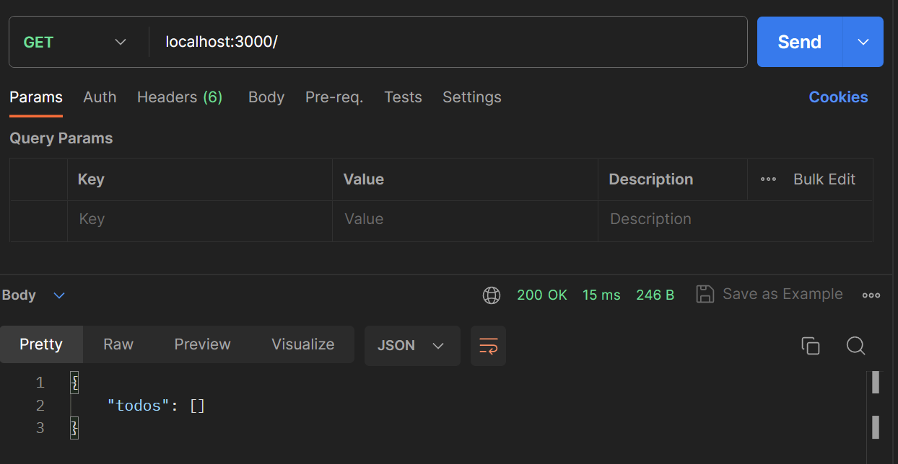

#### ii. POST
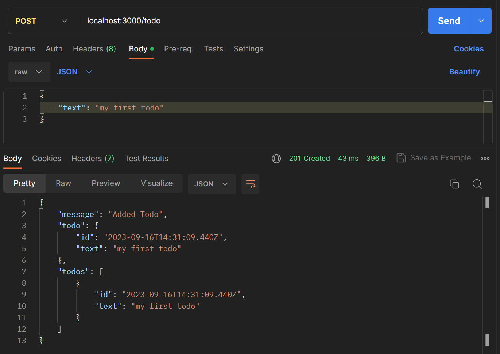

#### iii. PUT
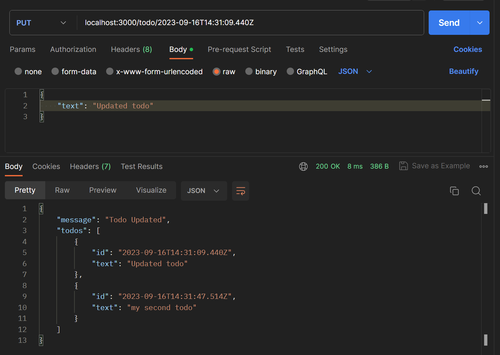

#### iv. DELETE
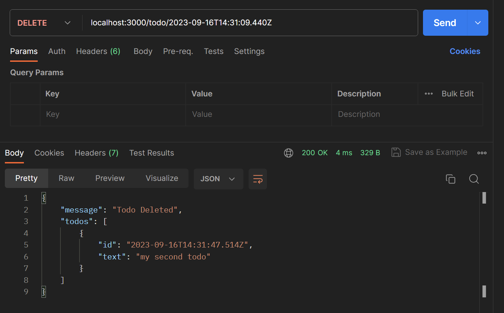

</details>

<details >
 <summary style="font-size: x-large; font-weight: bold">Making Code More Type Safe</summary>

### 1. Define below types in `routes/todos.ts` file
#### i. Create type for `req.body`
```typescript
type RequestBody = { text: string };
```

#### ii. Create type for `req.params`
```typescript
type RequestParams = { todoId: string };
```

### 2. Use above types in `routes/todos.ts` file
```typescript
router.post("/todo", (req, res, next) => {
    const body = req.body as RequestBody;
    
    const newTodo: Todo = {
        id: new Date().toISOString(),
        text: body.text
    };
})
```

Since we know what we're expecting from `req.body` and `req.params`
we can use them in our code to define type in order to make our code more type safe

</details>

<details >
 <summary style="font-size: x-large; font-weight: bold">Update Folder Structure</summary>

### 1. Create `src` folder in root
Add `models`and `routes` folders & `app.ts` file in `src` folder

### 2. Update `tsconfig.json` file
```json
{
  "compilerOptions": {
    "rootDir": "./src",
    "outDir": "./dist"
  }
}
```

Now on running `tsc` command, all compiled js file will be in `dist` folder

### 3. Update `package.json` file

```json
{
  "scripts": {
    "start": "node dist/app.js"
  }
}
```
</details>

<details >
 <summary style="font-size: x-large; font-weight: bold">Start Server</summary>

### 1. Run below command to first compile code
```bash
tsc
```

### 2. Run below command to start the server
```bash
npm run start
```
or just run
```bash
npm start
```
</details>

<details >
 <summary style="font-size: x-large; font-weight: bold">Add Nodemon for Auto-Start</summary>

Using `nodemon` we can start the server automatically, 
when there is any change in js file

### 1. Update `package.json` file
```json
{
  "scripts": {
    "build": "tsc -p . -w",
    "start": "nodemon dist/app.js"
  },
  "devDependencies": {
    "nodemon": "^3.0.1"
  }
}
```

### 2. Run below command to update `node_modules`
```bash
npm i
```

### 3. Run below command for compilation
This will compile the code in js whenever there 
is any change in ts file.
```bash
npm run build
```

### 4. Run below command to start the server
Changes in js file after auto compilation will trigger
nodemon to restart the server
```bash
npm start
```
</details>


----
</details>