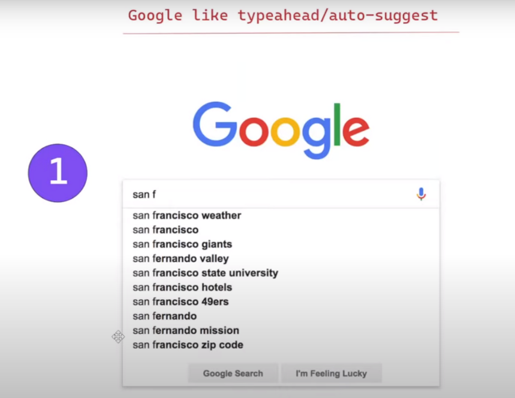

# Autocomplete or Typehead Suggestions

### Tech Stack:
Vanilla Javascript, HTML & CSS

### Must Have:

1. On typing inside the search box, it should show suggest options
2. Users should be able to select one of the options

### Good To Have:

1. Search should be performant enough
2. It should avoid unnecessary network calls
3. It should be re-usable and customizable
4. It should persist previously fetch data

### Referred Video
https://www.youtube.com/watch?v=IKRbWT6LqIY&t=15s
