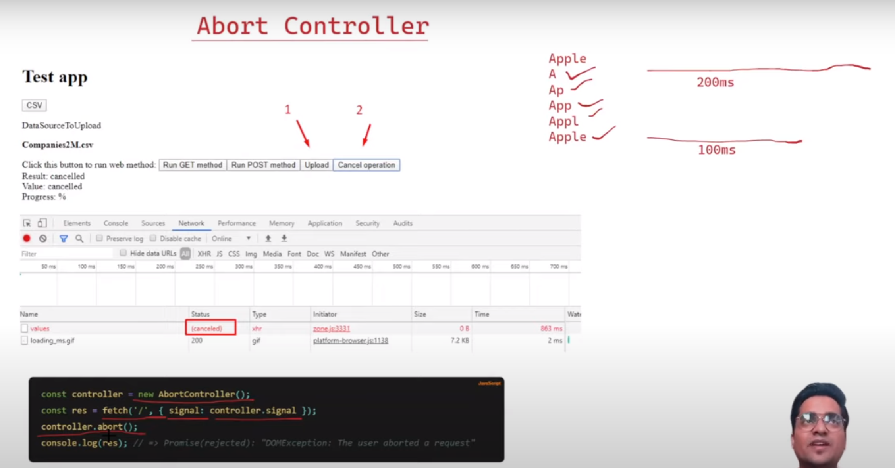

# Autocomplete or Typehead Suggestions

### Tech Stack:
Vanilla Javascript, HTML & CSS

### Must Have:

1. On typing inside the search box, it should show suggest options
2. Users should be able to select one of the options

### Good To Have:

1. Search should be performant enough
2. It should avoid unnecessary network calls
3. It should be re-usable and customizable
4. It should persist previously fetch data

## Concept covered in this question

#### 1. Debounce
1. Implemented in this question
2. Also complete details present in `important-concept` section

#### 2. Throttle
1. Complete details present in `important-concept` section

#### 3. Intersection-Observer(Infinite Scroll)
1. Complete details present in `important-concept` section

#### 4. Abort Controller
1. https://youtu.be/IKRbWT6LqIY?si=5g9o-jQpigblB_XE&t=3674
2. This is used when you want to maintain consistency across multiple requests during race conditions
3. You abort the same api call during the race condition
4. 

### Referred Video
https://www.youtube.com/watch?v=IKRbWT6LqIY&t=15s
