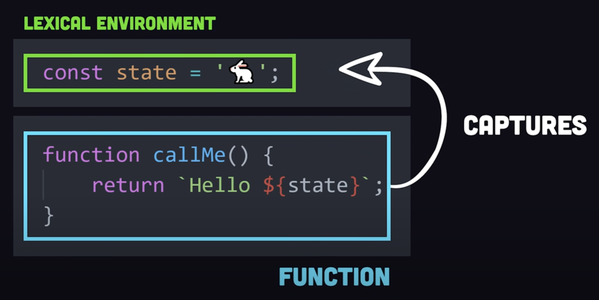
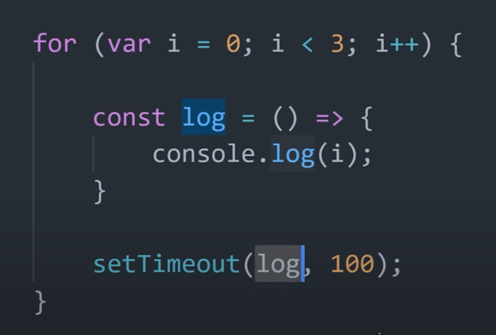
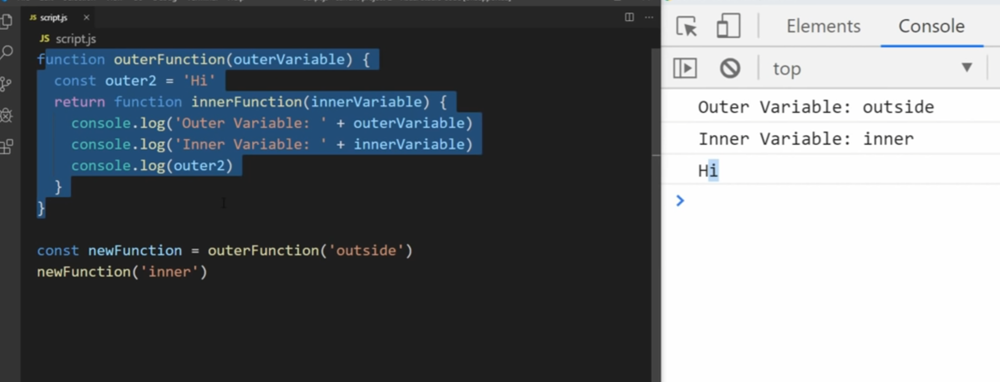

## Closure

### When ever, a function tries to access a variable which is not created in that function; then it is called as closure.

1. 
2. 
3. 
4. 
5. In closure values are stored inside heap. Stacks are shortly lived while heaps are long-lived.

6. It requires 

7. **Usecase**

a. To prevent data leakage

b. Many javascript functions are callback-based functions

### Famous Tricky Questions
1. 
Ans. 

In `let` i is not hoisted

In case `var` `i` lived in Heap while in `let` it was in Stack

2. 
Referred Video: https://www.youtube.com/watch?v=3a0I8ICR1Vg

### Referred Video: https://www.youtube.com/watch?v=vKJpN5FAeF4
