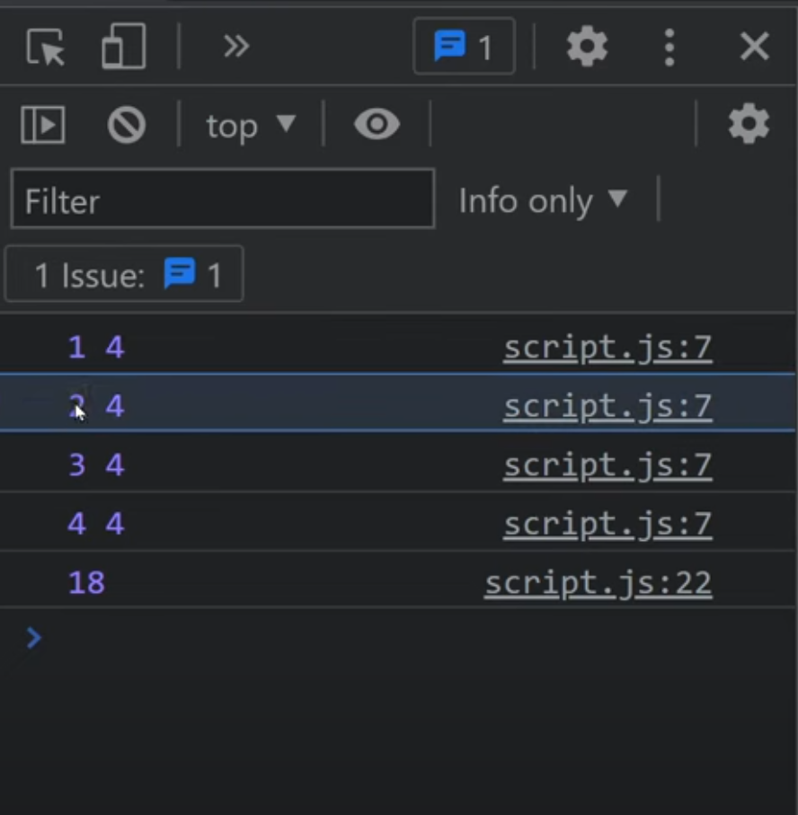

## Curry

Convert f(a, b) into f(a)(b).

```javascript
/*f(a,b) implementation */
function f(a,b) {
    return "Works"
}
```

```javascript
/*f(a)(b) implementation */
function f(a) {
    return (b) => {
         "Works"
    }
}
console.log(f(1)(2)) // works
console.log(f(1)); /* (b) => {return "Works" } */

```

Why should currying be used?
1. It makes a function pure which makes it expose to less errors and side effects.
2.  It helps in avoiding the same variable again and again.
3.  It is a checking method that checks if you have all the things before you proceed.
4. It divides one function into multiple functions so that one handles one set of responsibility.


```javascript
/*Simple function*/ 
const add = (a, b, c)=>{
    return a+ b + c
}
console.log(add(1,2 ,3)); // 6

/* Curried Function */
const addCurry = (a) => { // takes one argument
    return (b)=>{                 //takes second argument
        return (c)=>{             //takes third argument
            return a+b+c
        }
    }
}
console.log(addCurry(1)(2)(3)); //6
```

Evaluate(”sum”)(2)(4) ⇒ 2+4 = 6 on basis of input given to first param.


```javascript
function sum(operation) {
    return (a) => {
        return (b) => {
        if(operation === "sum")
                  return a + b;
                    else if(operation === "multiply")
                    return a * b;
                    else if(operation === "divide")
                    return a / b;
                    else if(operation === "subtract")
                    return a - b;
                    else return "No / Invalid Operation Selected"
        }
    }
}
```

Write a function curry() that converts f(a,b,c) into a curried function f(a)(b)(c) .
```javascript
/**
 * @param {Function} func
 * @return {Function}
 */
export default function curry(func) {
  return function curried(...args) {
    if (args.length >= func.length) {
      return func.apply(this, args);
    }

    return curried.bind(this, ...args);
  };
}
```


Refer this for more explaination: https://www.greatfrontend.com/questions/javascript/curry

Referred Article: https://roadsidecoder.hashnode.dev/javascript-interview-questions-currying-output-based-questions-partial-application-and-more
Referred Video: https://www.youtube.com/watch?v=k5TC9i5HonI
