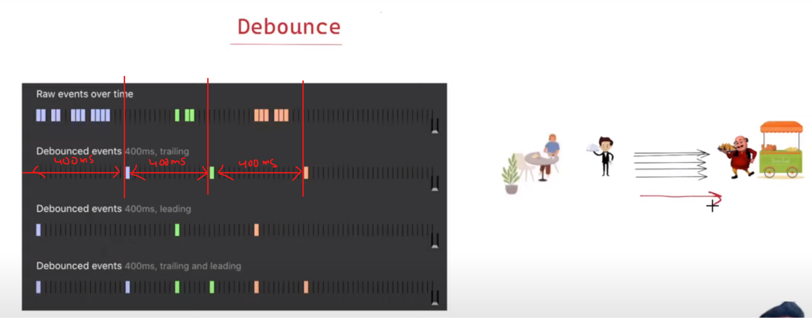
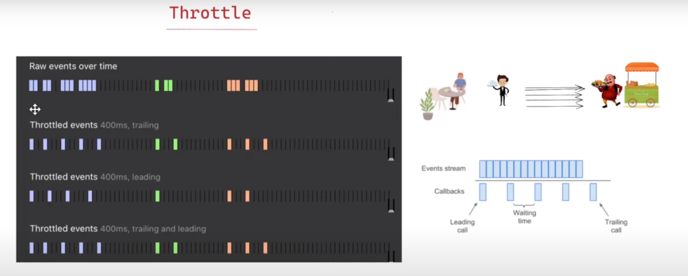

# Debounce



Below is code for trialing debounce
```javascript
function debounce(cb, delay = 1000) {
    let timeout

    return (...args) => {
        clearTimeout(timeout)
        timeout = setTimeout(() => {
            cb(...args)
        }, delay)
    }
}
```

### Use case
1. Autocomplete


# Throttle



Below is code for trialing throttle
```javascript
function throttle(cb, delay = 1000) {
    let shouldWait = false
    let waitingArgs
    const timeoutFunc = () => {
        if (waitingArgs == null) {
            shouldWait = false
        } else {
            cb(...waitingArgs)
            waitingArgs = null
            setTimeout(timeoutFunc, delay)
        }
    }

    return (...args) => {
        if (shouldWait) {
            waitingArgs = args
            return
        }

        cb(...args)
        shouldWait = true

        setTimeout(timeoutFunc, delay)
    }
}
```


### Use case
1. Mouse tracking
2. Window resizing


## Referred Videos
1. https://www.youtube.com/watch?v=cjIswDCKgu0
2. https://youtu.be/IKRbWT6LqIY?si=IoOgDRnxJB8yi6pW&t=2201
