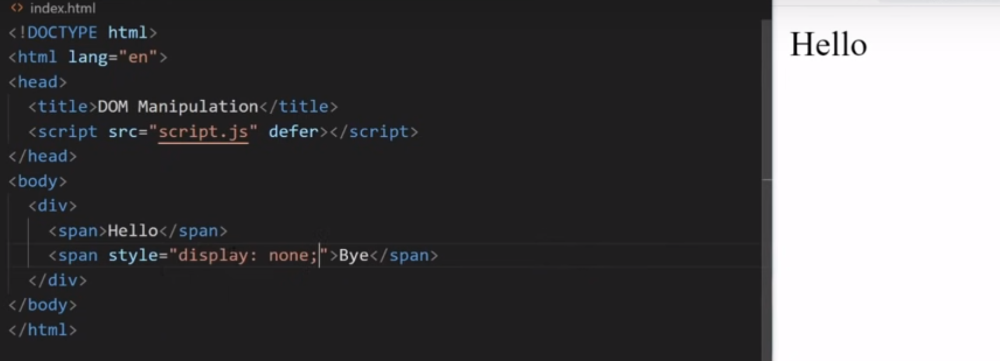

# DOM Manipulation

## Modifying Element

```javascript
const body = document.body;

const div = document.createElement('div');
div.innerText = 'Hello World';

body.append(div);
```

### `innerText` vs `textContent`



## Inserting HTML in DOM
```javascript
const body = document.body;

const div = document.createElement('div');

// 1st Method: Unsafe
// div.innerHTML = "<strong>Hello World</strong>";

// 2nd Method: Safe
const strong = document.createElement('strong');
strong.innerText = 'Hello World';
div.append(strong);

body.append(div);
```


## Removing HTML from DOM
```html
<body>
    <div>
        <span id="hello">Hello</span>
        <span id="bye">Bye</span>
    </div>

    <script src="index.js"></script>
</body>
```

```javascript
const body = document.body;
const div = document.querySelector('div');
const spanHello = document.querySelector('#hello');
const spanBye = document.querySelector('#bye');

spanBye.remove();
```


## Fetching, Adding & Removing Attributes
```javascript
console.log(spanHello.getAttribute('id'));
spanHello.setAttribute('id', "span-hello-id");
spanHello.removeAttribute('id')


// 2nd Method
spanHello.id = 'span-hello-id';
```

## Data Attributes

```html
<div
  id="test-div"
  data-first-name="Kyle"
  data-last-name="Cook"
  data-active
></div>
```

### Reading
```javascript
const div = document.getElementById("test-div")

console.log(div.dataset)
```

Our dataset looks like this.
```json
{
  "active": "",
  "firstName": "Kyle",
  "lastName": "Cook"
}
```

### Writing 
```javascript
const div = document.getElementById("test-div")

div.dataset.test = "Hi"
console.log(div.dataset.test)
// Hi
```

```html
<div
  id="test-div"
  data-test="Hi"
  data-first-name="Kyle"
  data-last-name="Cook"
  data-active
></div>
```

### Delete
```javascript
const div = document.getElementById("test-div")

delete div.dataset.active
console.log(div.dataset.active)
// undefined
```

```html
<div id="test-div" data-first-name="Sally" data-last-name="Cook"></div>
```

Referred article: https://blog.webdevsimplified.com/2020-10/javascript-data-attributes/


## `classList`

### Remove & Add
```javascript
element.classList.add("new-class", "another-class")
console.log(element.classList.value)
// new-class another-class

element.classList.remove("another-class")
console.log(element.classList.value)
// new-class
```

### Contains
```javascript
console.log(element.classList.contains("new-class"))
// false

element.classList.add("new-class")
console.log(element.classList.contains("new-class"))
// true
```

### Toggle
This method lets you toggle a class on/off depending on if the class is already on the element.

```javascript
element.classList.toggle("new-class")
```

The above is the same as the below.
```javascript
if (element.classList.contains("new-class")) {
  element.classList.remove("new-class")
} else {
  element.classList.add("new-class")
}
```

Referred article: https://blog.webdevsimplified.com/2020-11/class-list/


## Modifying Element Style

Convert property name to camel case
```javascript
spanHi.style.backgroundColor = "red";
```

Referred Video: https://www.youtube.com/watch?v=y17RuWkWdn8&t=1s
