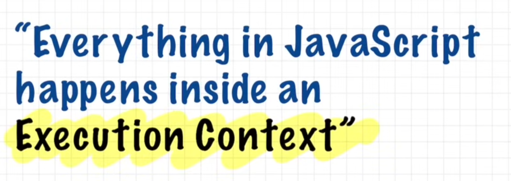
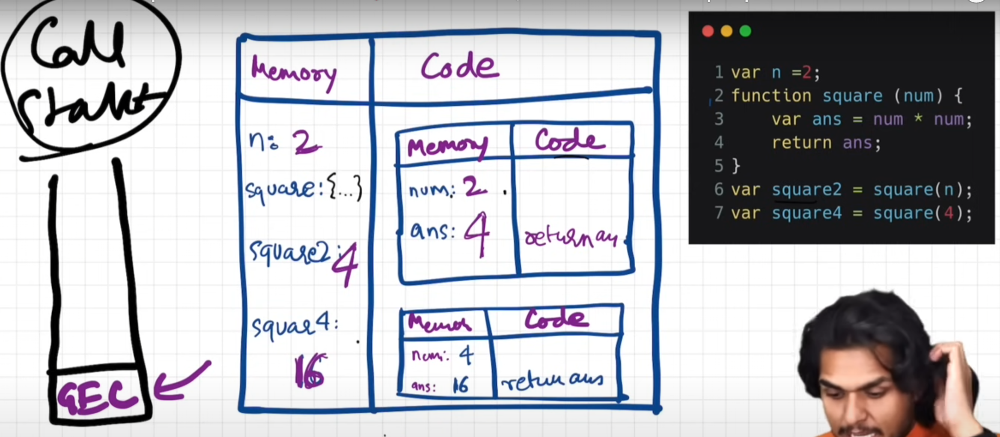
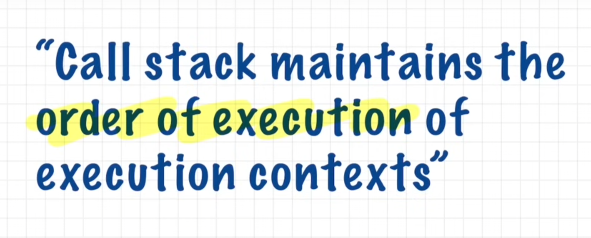
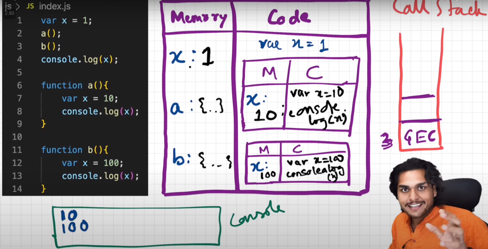
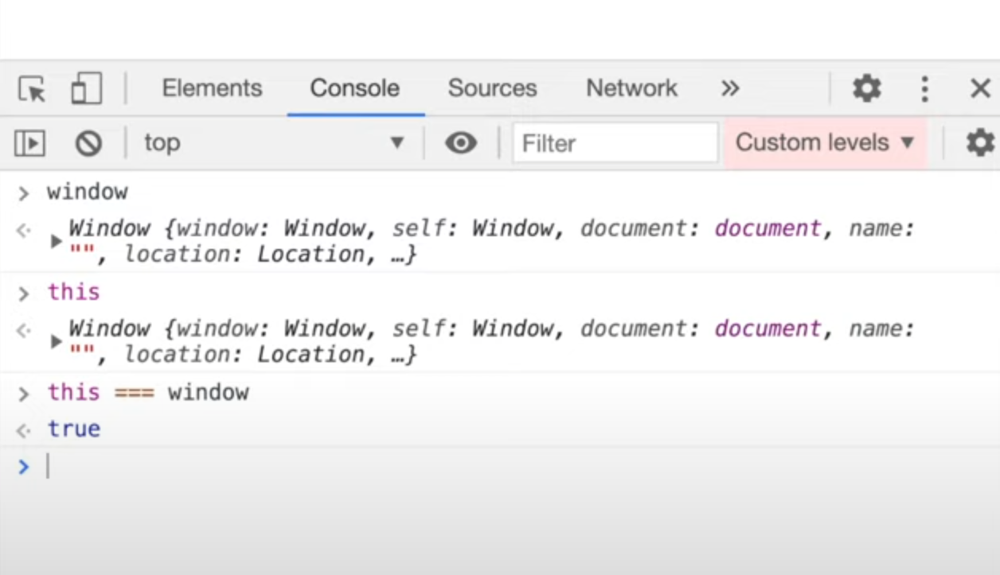

## Execution Context & Call Stack

Below is how every code run on javascript engine, we create
`Execution Context` which is maintained by `Call Stack`

Other names of `call stack`

Referred Video: https://youtu.be/iLWTnMzWtj4?si=p4HnXVWvBMZVNnf-

## Hoisting

Hoisting can be easily explained once we understand 
`Execution Context` and `Call Stack`

Hoisting is very good example to understand `Execution Context` and `Call Stack`

Referred Video: https://youtu.be/Fnlnw8uY6jo?si=OhllLmcreDPizLTg

## How `function` works & `Variable Environment`

Referred Video: https://youtu.be/gSDncyuGw0s?si=HEtpY-xlWwKfQBgJ

## `window` & `this`

Referred Video: https://youtu.be/QCRpVw2KXf8?si=TWgw76S-loHhUkoQ
