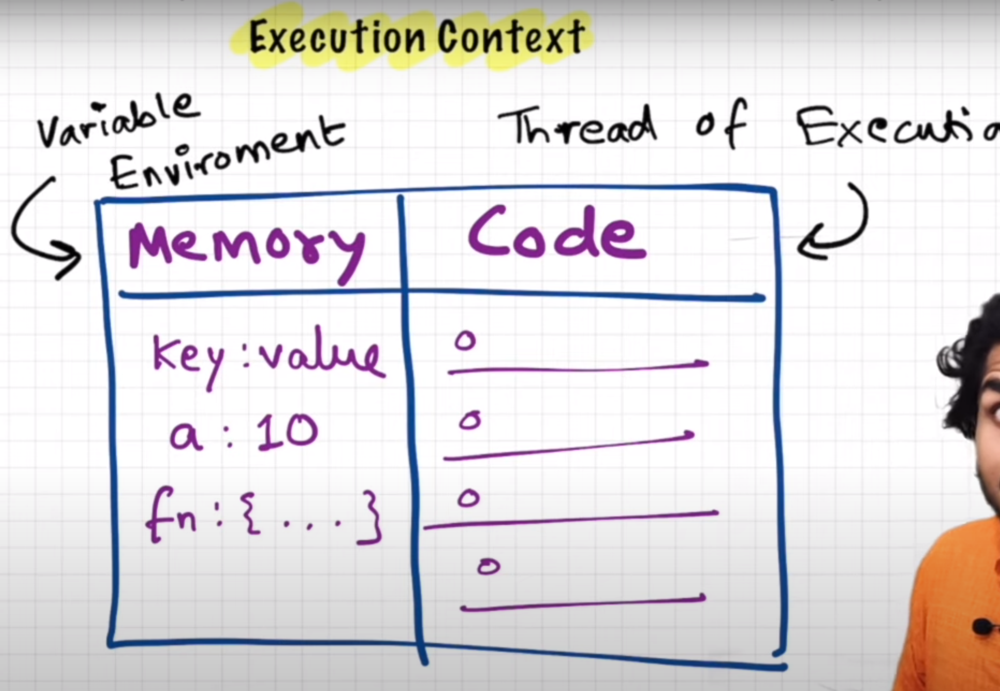
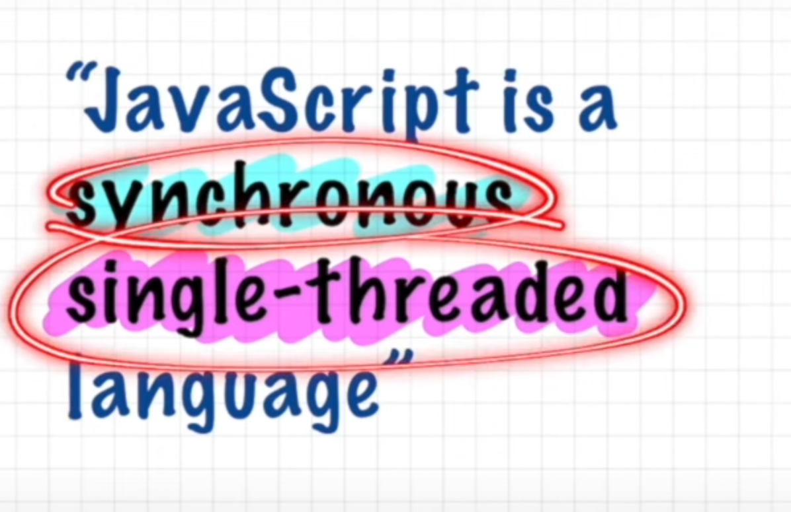
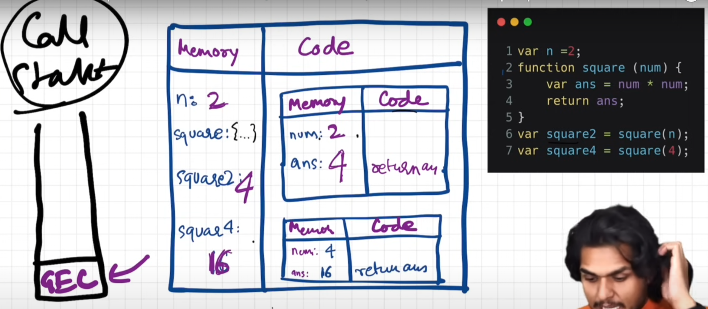
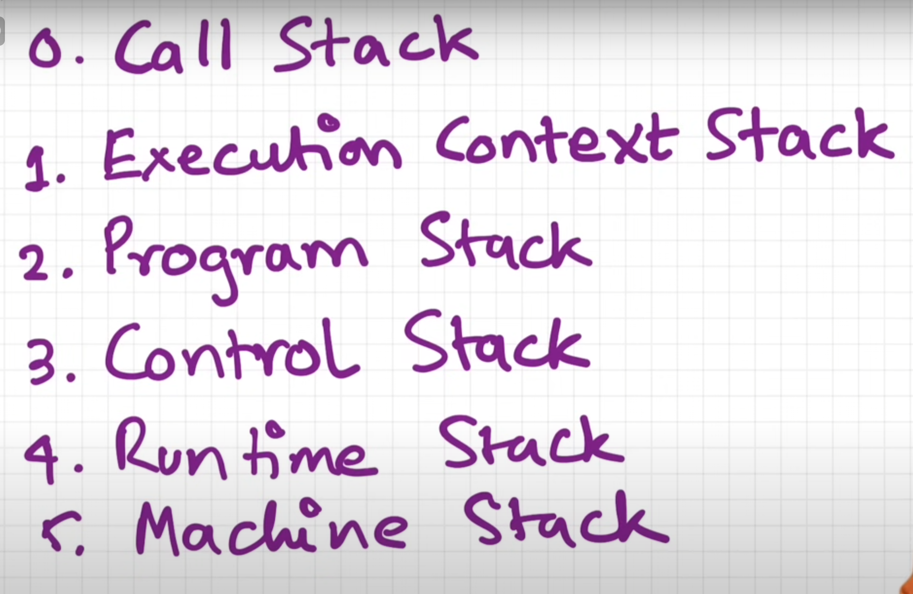

## Execution Context & Call Stack

Below is how every code run on javascript engine, we create
`Execution Context` which is maintained by `Call Stack`

Other names of `call stack`

Referred Video: https://youtu.be/iLWTnMzWtj4?si=p4HnXVWvBMZVNnf-
