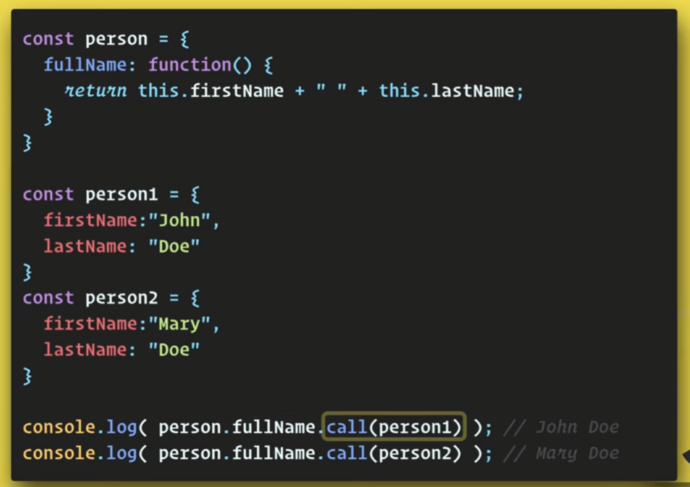
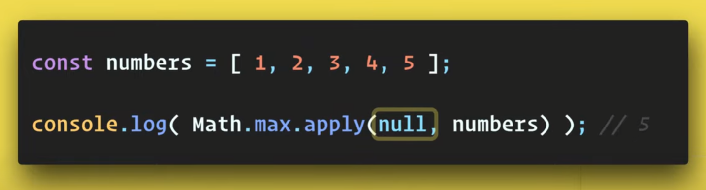

`call()`, `apply()` & `bind()` help us to get hold of a passed object

## `call()`

## `apply()`

#### Usecase

Keep `this` as null since it is not required and we are able to pass array for getting max value
which won't be possible without `apply()`

Useful mnemonic is "**A** for array and **C** for comma" to remember `apply()` and `call()`
## `bind()`

Referred Video: https://www.youtube.com/watch?v=rZc7_2YXbP8
