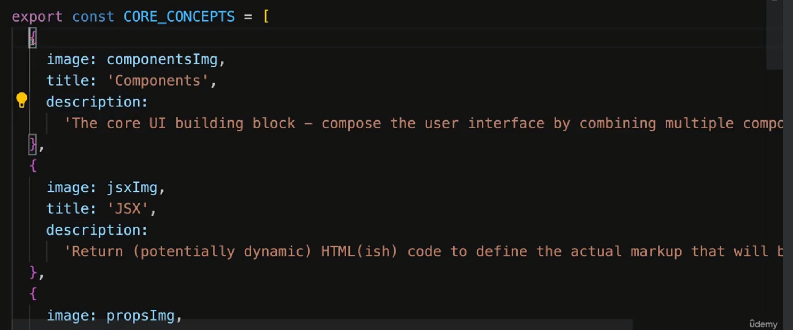

1. **Correct way to update array if we are using existing value ?**

When multiple states are parallely then we might get stale date we don't do
things like this.
Resource: https://www.udemy.com/course/nextjs-react-the-complete-guide/learn/lecture/41161580#questions

2. **Form**

3. Storing input box value

4. Post data to backend

5. Correct way to fetch data

* We should not use `fetchPosts()` directly without `useEffect` since end up in infinite loop
as `fetchPosts()` will update state and hence triggering `PostsList` component
to re-render which will happen in loop
* Also we can't turn `useEffect` function to `async` function, so we create `fetchPosts` function
instead

6. Delay function

7. Router

8. Better `props` syntax for many variable

9. Forwarding props

10. Multiple JSX slots

Resource: https://www.udemy.com/course/react-the-complete-guide-incl-redux/learn/lecture/39659754#overview

11. Right way to update 2-D array

