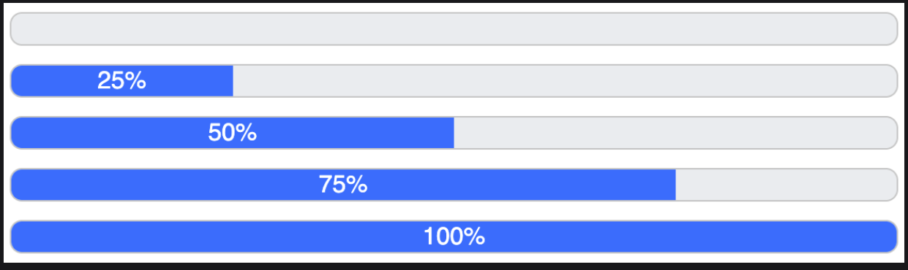

## Static Progress Bar

Implement a progress bar component which shows the completion progress 
by filling the bar proportionately to the progress (a number between 0-100, inclusive).

### Requirements
* The filled bar can be of any color. The example uses #c5c5c5 for the background color and #0d6efd for the progress color.
* The completion % is shown in the center of the filled bar.

### Important Points

* `overflow: hidden` has to be added to .progress-bar because of the rounded corners, 
so that the filled progress doesn't stick out of the rounded corners.

* `role="progressbar"` and aria values are added to the component for a11y reasons, 
 so that screen readers can accurately depict the component.
