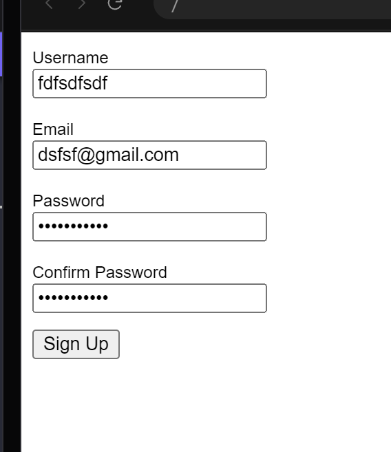

## Signup Form

The form should contain the following elements with the following criteria:

- Username field
  - Minimum of 4 characters.
  - Alphanumeric only.
- Email field
  - Valid email format. A reasonable validation will suffice, you don't have to strictly follow any specification.
- Password field
  - Minimum of 6 characters.
- Confirm password field
  - Must match the password field.
- Submit button
  - Contains the text "Sign Up".
  - Clicking on the submit button submits the form.
  
You are free to decide when (during typing/after blur/upon submission) and how (native HTML validation or custom validation) to validate the form. If the validation fails, show the relevant errors near (beside or below) the corresponding `<input>` fields.

Referred Article: https://www.greatfrontend.com/questions/user-interface/signup-form
