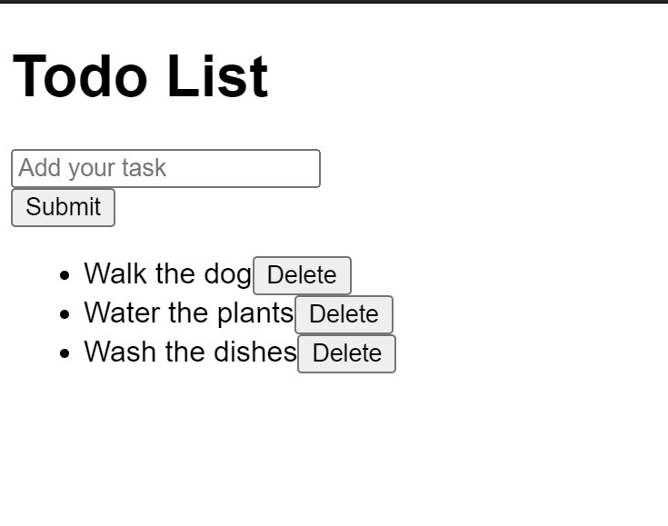

## Todo List

You're given some existing HTML for a Todo List app. Add the following functionality to the app:

1. Add new tasks on clicking the "Submit" button.
The `<input>` field should be cleared upon successful addition.
2. Remove tasks from the Todo List upon clicking the "Delete" button.

### Notes
- The focus of this question is on functionality, not the styling. There's no need to write any custom CSS.
- You may modify the markup (e.g. adding ids, data attributes, replacing some tags, etc), but the result should remain the same visually.
- You may want to think about ways to improve the user experience of the application and implement them (you get bonus credit for doing that during interviews).

Referred Article: https://www.greatfrontend.com/questions/user-interface/todo-list
